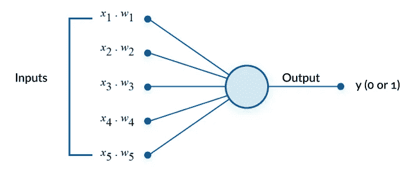
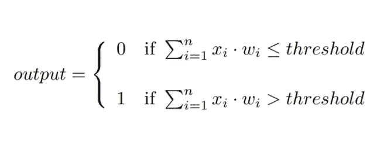
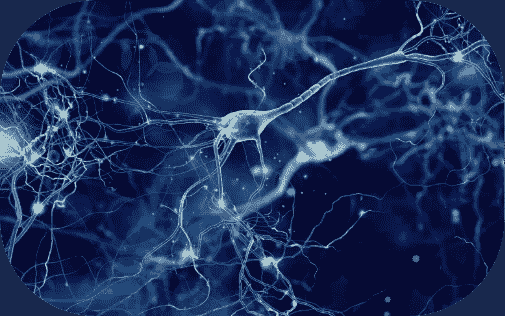
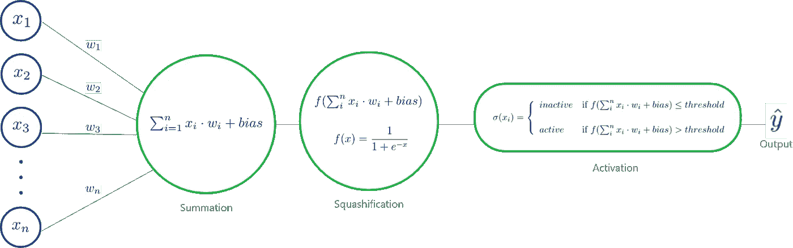
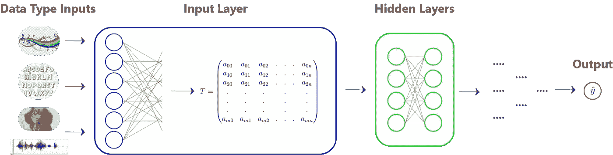
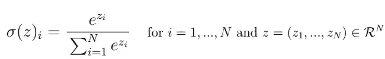
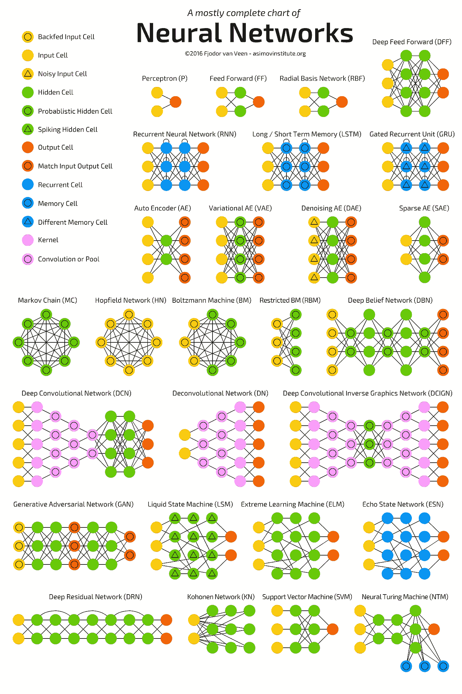
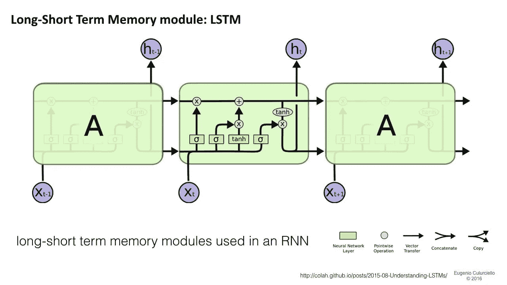

# 神经网络入门，第一部分——导论

> 原文：<https://towardsdatascience.com/what-constitutes-a-neural-network-af6439f0cdd7?source=collection_archive---------20----------------------->

## 给出神经网络主要组件的简化理解。

扎卡里·克拉雷-斯科特在 [Unsplash](https://unsplash.com?utm_source=medium&utm_medium=referral) 上的照片

我一直在从事许多机器学习项目，涉及为各种背景下的不同任务建立的神经网络模型。但是我总是发现自己在使用高级框架和工具，它们大多隐藏了所使用模型的真实结构。主要是由于现有的各种库和框架帮助世界各地的开发人员快速开始使用机器学习代码，鼓励他们构建使用智能模型来完成无数任务的端点应用程序，而不一定帮助他们了解幕后真正发生的事情。

不幸的是，以这种方式行事，人们无法理解他们所使用的模型的内部运作，因此他们甚至不会考虑花时间去挖掘背后的科学。

但是你猜怎么着，理解神经网络内部发生的事情并不困难，本文的目标是以一种非常简单易懂的方式解释其背后的机制，分解主要组件，解释一般架构，并希望让你全面了解网络如何从输入数据到预期的最终结果。

我将把这个主题分成两篇文章，这样我就可以适当地关注每一部分，而不会用太多的信息淹没你。

# 概观

1.  神经元的概念
2.  网络层
3.  不同的神经网络架构

# 神经元的概念

## 1.感知器:神经网络的基本构件

感知器可以被认为是一个基本上模仿生物神经元的二元模型。它于 1905 年首次推出，并于 1960 年由科学家弗兰克·罗森布拉特(Frank Rosenblatt)开发，灵感来自于早期的 T4 作品(T5)、沃伦·麦卡洛克(Warren Buffett)和沃尔特·皮茨(Walter Pitts)。感知器规划了一个决策模型，该模型可以基于一组给定的二进制输入输出不同的结果。这些输入可以具有不同的权重来说明它们的重要性水平，因此其思想是计算恰好大于或小于与实际感知器本身密切相关的特定阈值的二进制输入的加权和。

感知器图式

感知器也可以用一个简单的代数公式来表示:

定义感知器的代数表达式

## 2.乙状结肠神经元

乙状结肠神经元是比感知器稍微复杂一点的模型。与只能保存 0 或 1 值的感知不同，乙状结肠神经元可以在 0 和 1 之间的范围内变化，因此它可以保存无限个数字。它的优点是，我们极大地增加了输出规模，因此模型在数值上变得更加稳定，因为输入权重的微小变化会导致输出的微小变化。在之前的模型中，无论我们调整输入权重有多小，输出都会突然在 0 和 1 之间切换，而使用 sigmoid 神经元，我们可以在输出变化中达到一定程度的平滑度。

大脑神经元，数字图像。科技日报。

更清楚地说，这里的神经元扮演了一个 sigmoid 函数的角色，它接受所有输入的加权和，并输出一个介于 0 和 1 之间的数字。一旦加权和大于其阈值，神经元就被 ***激活*** 。内部阈值通常被称为 ***偏差*** 专门针对每个神经元进行缩放。

总而言之，sigmoid 神经元计算其输入的加权和，应用 sigmoid 函数将结果压缩在 0 到 1 之间的数字范围内，最后将获得的结果与其阈值进行比较，这样它就可以*点亮或熄灭。*

表示乙状结肠神经元行为的模式

# 网络层

## 1.什么是层

基本上，将多个神经元并联或串联堆叠在一起就构成了一个层。但是，正如你可能明显预期的那样，这不仅仅是简单地随意堆积神经元。每个网络都是为特定的任务而构建的，因此它具有以不同方式组合的不同类型的层。但一般来说，多种架构模式中常用的层有三种类型，**输入层**、**隐藏层、**和**输出层**。

*   **输入层**:输入层是第一层，直接与提供给网络的外部原始数据交互。这一层的主要目的是标准化外部数据格式，使其适合下一层和整个网络。无论给予网络的数据的性质如何，输入层对该数据应用变换以生成一组特定的数字， [***张量***](https://en.wikipedia.org/wiki/Tensor) ，它们代表每个特定的输入。网络只和数字打交道。

输入层结构

*   **隐层**:与 ***隐*** 字 ***没有什么神秘的。*** 既不是输入层也不是输出层的层称为隐藏层。这些层在网络架构中非常重要。它们负责检测与数据相关的特定模式，这将帮助网络学习如何识别输入数据或将其分类到特定类别。

> 从更科学的角度来说，这些层参与了生成抽象层次的过程。这意味着，网络能够检测和学习的逻辑模式越多，它的“抽象能力”就越多，从而使系统从简单的原始数据归纳为高级概念。

JR Korpa 在 [Unsplash](https://unsplash.com?utm_source=medium&utm_medium=referral) 上拍摄的照片

同样的概括过程本能地发生在我们的大脑中，甚至没有注意到。从一张狗的图片中，我们会立即想到一种动物，因为对于一个狗的形象，我们已经了解了与帮助区分狗和猫的生理特征相关的特定模式。从某种意义上来说，从一只狗的形象到对它所代表的思想的高层次理解的整个过程是通过组装多个抽象层建立起来的。

每个网络根据网络要解决的问题的性质来定义其隐藏层，因此有多种设计可供使用。一种体系结构可以很好地解决某个问题，但在另一种体系结构上可能表现不佳。

这些层非常有趣的是，一层中的激活模式会导致下一层中非常特殊的模式，如此类推。这意味着每一层负责检测数据中的奇异模式。在将图像分类为目标标签的**卷积神经网络**的情况下，它们在其隐藏层中实现了一种机制，可以想象得到，这种机制可以将像素组合成边缘，将边缘组合成图案，最终将图案组合成数字。

你可以查看由 [Omar M'Haimdat](https://medium.com/u/68b9dc62fda9?source=post_page-----af6439f0cdd7--------------------------------) 写的一篇有趣的文章，从开发者的角度获得 CNN 的第一手资料。

 [## 从 iOS 开发者的角度探索卷积神经网络(CNN)

### 计算机视觉领域中卷积神经网络概念的简要说明

heartbeat.fritz.ai](https://heartbeat.fritz.ai/exploring-convolutional-neural-networks-cnns-from-an-ios-developers-perspective-162664130d5b) 

> **边注**:在这个阶段，如果你正在寻找 CNN 的细节，我强烈推荐你阅读 Yann LeCun 的论文:[基于梯度的学习应用于文档识别](http://yann.lecun.com/exdb/publis/pdf/lecun-98.pdf)。

*   **输出层**:在处理复杂模式检测任务的前几层进行连接后，输出层上的激活意味着将输入数据标记为目标类别。因为在所有中间工作之后，神经网络的主要作用是正确地匹配给定的和期望的，因此就神经元而言，输出层的大小与数据中不同标签或类别的数量相同。例如，为对狗和猫进行分类而构建的网络在输出层必然有 2 个神经元，给出两种可能性中每一种的正确概率。

输出层中最常用的激活函数是 Softmax，它计算每个目标类在所有可能的目标类中的概率分布。

Softmax 数学定义

> 在[数学](https://en.wikipedia.org/wiki/Mathematics)中，softmax 函数，也称为 softargmax 或归一化指数函数，是一个将 *N* 个实数的向量作为输入，并将其归一化为由与输入数的指数成比例的 *N* 个概率组成的[概率分布](https://en.wikipedia.org/wiki/Probability_distribution)的函数。

## 神经网络架构

神经网络动物园由[阿济莫夫研究所](https://www.asimovinstitute.org/neural-network-zoo/)

有大量不同的网络架构可供使用。但是请记住，架构取决于问题的类型和预期的目的。事实上，有许多设计模式或架构已经被证明更适合一组特定的问题。网络体系结构是一个活跃的研究领域，每年都有许多这方面的论文发表。

一般来说，有 5 大类神经网络:

*   **前馈神经网络:**这些神经网络是 ANN ( *人工神经网络*)的最简单形式之一，其中数据被馈送到网络，并且仅在一个方向上传播。数据通过输入节点，在输出节点上输出。这种神经网络可以有也可以没有隐藏层，这就是为什么称为前馈网络。
*   **径向基函数神经网络:**径向基函数是一组用于距离计算的常用函数，它们考虑了一个点相对于中心的距离。RBF 神经网络使用径向基函数作为激活函数。网络的输出是输入和神经元参数的径向基函数的线性组合。
*   **递归神经网络:**递归神经网络(RNN)是一种常用于语音识别和自然语言处理(NLP)的人工神经网络。rnn 旨在识别数据的顺序特征，并使用模式来预测下一个可能的场景。

长短期记忆 RNN 的示意图，由 [colah 的博客](https://colah.github.io/posts/2015-08-Understanding-LSTMs/)提供。

*   **卷积神经网络:**卷积神经网络类似于前馈神经网络，其中神经元具有可学习的权重和偏差。细胞神经网络在许多领域有许多应用，如图像识别、物体检测、人脸识别、图像分析等。

来源:[神经网络仿真 GIF](https://gfycat.com/slushyslimgalapagosmockingbird)

*   **模块化神经网络:**模块化神经网络由不同的网络组成，这些网络独立工作并对输出做出贡献。与构建和执行子任务的其他网络相比，每个神经网络都有一组独特的输入。

## 结论

我希望这篇文章有助于揭开神经网络背后不难理解的数学概念的神秘面纱，并且我很肯定，经过一点实践，你可以很容易地熟悉这些概念😉。

我想提一下激发我写这篇文章的不同来源:

*   迈克尔尼尔森的惊人之作:[神经网络和深度学习](http://neuralnetworksanddeeplearning.com/index.html)。
*   格兰特·桑德森非常直观的 youtube 系列:[深度学习](https://www.youtube.com/watch?v=aircAruvnKk)。

在第二部分，我将介绍神经网络的学习方式，我们将探索许多令人兴奋的概念，如*反向传播*、*梯度下降、*和等等。所以请继续关注下一部分😉😉。