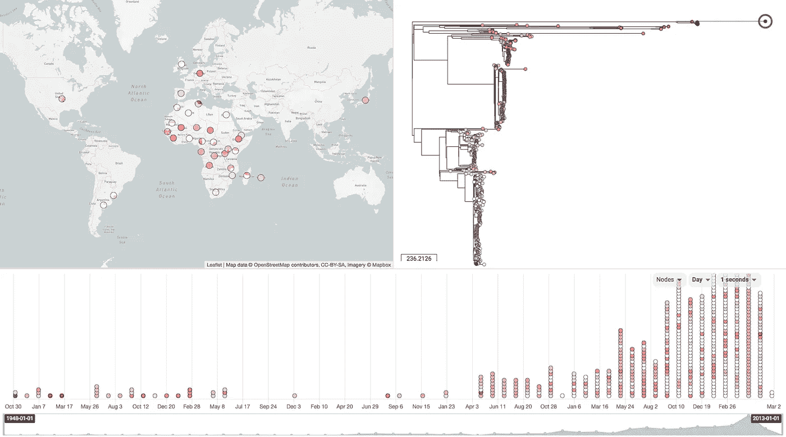
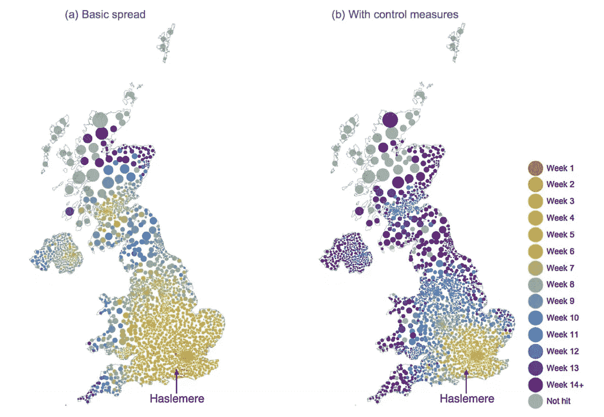
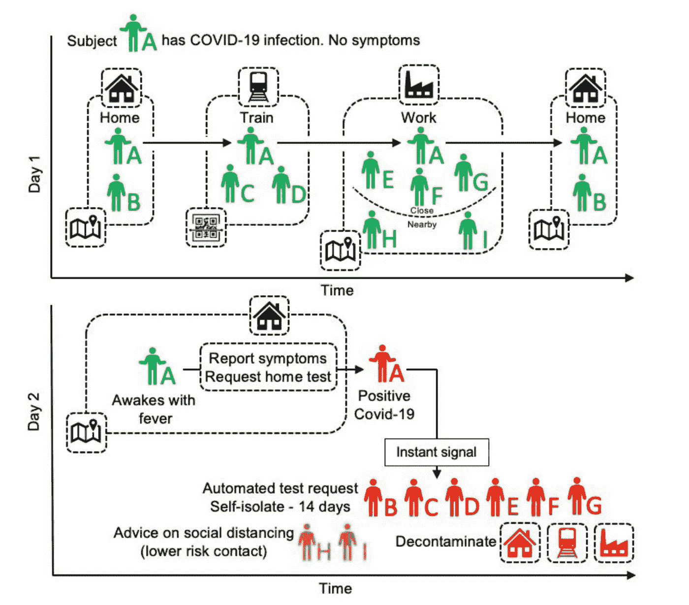

# 人工智能增强的传染病监测的未来会是什么样子？

> 原文：<https://towardsdatascience.com/what-could-a-future-of-ai-augmented-infectious-disease-surveillance-look-like-1950363ebb2c?source=collection_archive---------31----------------------->

## 今天我们离这有多远？

在新冠肺炎疫情之前，预计 2020 年全球将运营 4000 万次航班，运送近 50 亿名乘客。这一数字逐年增长，这意味着如果一种新的传染性疾病出现，它可以以前所未有的速度和规模在本地和国际上传播。

尽管过去几个世纪技术取得了巨大进步，传染病仍然威胁着全球健康。由于日益全球化，传染性病原体在世界范围内迅速、意外传播的可能性变得更高了。快速的城市化、国际旅行和贸易的增加以及农业和环境变化的改变增加了病媒人群的传播，使更多的人处于危险之中。

一次飞行中的飞机数量。来源:https://www.flightradar24.com/

当我们开始展望未来爆发预防的前景时，自动共享和汇集数据是更好地了解所关注事件的关键部分。拥有一个自动化的“事件通知器”，能够以人类无法达到的速度扫描大量数据，并标记相关模式，将使这一过程更加敏感和有效。

为了防止疫情的传播，我们需要知道哪些疾病在哪里，它们传播的速度是多少，以及它们是如何传播的。这包括汇集来自不同地点的医院、全科医生和社区卫生工作者的知识。拼凑一种疾病在一个地区的传播通常需要不同地点之间的沟通，这只有在人们特别关注的情况下才会发生。当电子笔记并不总是被记录并且通常不可互操作时，这可能是一项重要的任务。但是，由新冠肺炎引发的向数字医疗转移的紧迫性日益增加，这可能会使我们在未来更好地利用这些数据。

 [## 冠状病毒危机如何影响英国的数字医疗？

### 拥抱新数字技术的风险/收益等式已经被颠覆了

medium.com](https://medium.com/@nwheeler443/how-has-the-coronavirus-crisis-impacted-digital-healthcare-in-the-uk-16d8182984e4) 

# 大数据能告诉我们什么？

如果以正确的方式收集，关于患者、他们的活动、病原体的基因组序列、治疗耐药性和其他因素的大量数据可以回答一些重要的问题。下面的列表并不详尽，而是涵盖了我最近一直在思考的一些事情:

## 病原体可以感染哪些宿主？

大多数导致流行病或大流行的主要疾病都是病原体从另一种动物跳到我们身上的结果。感染人类的能力是一种编码在病原体 DNA 中的特性，所以如果我们有足够的信息，我们应该能够设计出根据病原体 DNA 预测其宿主范围的算法。

这一领域的一个例子是机器学习算法，它试图预测人类食物中毒可能来自哪种动物。通常情况下，如果很多人同时报告食物中毒，就怀疑爆发了。如果我们有 DNA 测序来确认感染每个人的细菌或病毒是相同的，并且所有的分离株都是密切相关的，这就更是如此。沙门氏菌是食物中毒的常见原因，它可以通过一系列动物来源进入食物链，也可以通过动物粪便污染其他食品(如沙拉蔬菜)进入食物链。几个小组正在建立机器学习模型，试图将沙门氏菌的 DNA 突变与特定的动物种群联系起来，这将使我们能够更有效地识别污染食品的来源。更多信息见下文:

 [## 爆发追踪:机器人之战

### 两种用于食物中毒溯源的机器学习算法分析

medium.com](https://medium.com/@nwheeler443/outbreak-tracing-a-battle-of-the-bots-864daa7e0b15) 

人们已经在做一些很酷的工作，研究冠状病毒，看看哪些其他病毒可以像 SARS、MERS 和 2019-nCoV 一样传染给人类。他们还在研究哪些动物可以作为新型冠状病毒的宿主或实验系统。这项工作最酷的部分是利用公民科学和我们对新型冠状病毒如何与我们的细胞相互作用的理解来设计新的病毒治疗方法。目前，这项工作涉及实验室工作和使用可视化和人类判断的计算工作的结合，但随着通过计算模拟蛋白质结构的能力的提高，这项工作在未来可能会实现数字化自动化。

 [## 是什么让新型冠状病毒能够感染人类？

### 我们如何识别下一个疫情威胁？

medium.com](https://medium.com/@nwheeler443/what-makes-the-new-coronavirus-able-to-infect-humans-98e6a79c82b4) 

## 给定的病原体有多危险？

在某些情况下，你可以观察一种病毒或细菌，看看它们是否比平常更具传染性或致命性。例如，我们可以寻找细菌携带的毒素，我们知道这些毒素会导致感染者出现严重症状，或者我们可以使用更复杂的[机器学习方法](https://journals.plos.org/plosgenetics/article?id=10.1371/journal.pgen.1007333)根据我们过去看到的危险菌株的例子，寻找特定菌株更危险的迹象。

现代监测工具可以根据细菌的基因组序列评估世界各地细菌带来的风险:[见本文](https://medium.com/@nwheeler443/a-dangerous-new-salmonella-strain-is-emerging-in-sub-saharan-africa-eb393d932909)

 [## 在非洲引起血流感染的细菌几乎对所有药物都有耐药性

### 机器学习正在帮助我们更快地发现高危疾病

medium.com](https://medium.com/@nwheeler443/a-dangerous-new-salmonella-strain-is-emerging-in-sub-saharan-africa-eb393d932909) 

## 哪种治疗方法能有效治愈感染？

抗生素耐药性对公共卫生的威胁越来越大。我们越来越多地看到适应医疗环境的疾病菌株，在医疗环境中抗生素无处不在，或者在社区环境中人们经常用抗生素自我治疗。开错抗生素会助长耐药性的传播，导致患者遭受不必要的痛苦，并有可能死于可治疗的感染。

像我一样的许多研究人员正在探索使用机器学习方法预测哪些抗生素对治疗特定感染有效，哪些无效的方法。但是，机器学习算法[可能倾向于偏向](https://medium.com/@nwheeler443/intuition-machine-learning-c64d62c780f4)或者在代表不足的群体中表现更差。要了解有关我们如何构建和测试这些算法的更多信息，请参见以下内容:

 [## 机器学习算法应该指导抗生素处方吗？

### 机器学习可以解决抗生素耐药性危机。他们在现实世界中会表现良好吗？

towardsdatascience.com](/should-machine-learning-algorithms-guide-antibiotic-prescribing-f74753e28472)  [## 构建预测抗生素耐药性的机器学习模型

### 我第一次向计算机科学学生介绍用 ML 预测抗生素耐药性的研讨会的回顾

towardsdatascience.com](/building-machine-learning-models-for-predicting-antibiotic-resistance-7640046a91b6) 

## 一种新的疾病如何在 T2 传播？

飞行数据和手机数据的使用可以告诉我们人们是如何移动的，因此疾病可以以多快的速度传播到其他地区。作为英国广播公司资助的公民科学项目的一部分，一项研究使用一个应用程序收集人们在 24 小时内的运动和接触数据，以模拟疫情流感可能如何在英国蔓延。这些数据使研究人员能够对比控制疾病爆发的策略，看看什么是有效的。

图片来自[这项研究](https://researchonline.lshtm.ac.uk/id/eprint/4647173/1/Contagion-The-BBC-Four-Pandemic.pdf)

> “在紧急情况下，拥有准确的信息非常重要，”Massaro 说。“这就是为什么手机定位数据比年度人口普查记录更好。问题是这些数据归私人公司所有。我们需要认真考虑改变获取这类信息的法律——不仅仅是为了科学研究，也是为了更广泛的预防和公共健康原因。”

脸书也参与了这项工作，利用卫星图像和人口普查数据制作高质量的人口密度地图，并与学术界分享汇总的用户数据，以帮助他们监测重大灾害和传染病的影响:

 [## 灾难地图-脸书永久数据

### 灾难地图使用统计技术来维护个人隐私。例如，我们只共享去识别的…

dataforgood.fb.com](https://dataforgood.fb.com/tools/disaster-maps/) 

## 一种已知的疾病是如何传播的？

通常，确定有感染该疾病风险的人需要接触追踪，即采访该疾病患者，并要求他们记住与他们接触过的每个人。据估计，46%的新冠肺炎病毒传播来自已经感染但尚未表现出任何症状的人。由于这一点，以及我们自身记忆的不可靠性，依靠患者回忆往往在正确追踪所有感染和防止进一步传播方面做得不好。在冠状病毒疫情期间，一些国家发布了手机应用程序，以更好地实时跟踪疾病的传播。这些应用的发布正在围绕数据的数量和质量、隐私、个人自主权和数据安全产生大量权衡，这些都是我们在疫情结束后可能要应对的问题。

中国发布了流行的微信应用程序的扩展，该应用程序收集用户移动和冠状病毒诊断数据。一种人工智能算法分析这些数据，并给每个人一个颜色编码的风险评估，红色表示两周的隔离，橙色表示可能要在家里呆 7 天，绿色表示允许个人自由活动。该应用程序使用手机之间的邻近感测、全球定位系统的协同定位以及手机无法进入的建筑物进出口的二维码扫描来评估人们对病毒的潜在暴露。分数的基础没有得到解释，这让那些被要求自我隔离却没有明确原因的人感到沮丧。

中国有利用重大事件的历史，如 2008 年北京奥运会和 2010 年上海世博会，引入新的监测工具，这些工具超出了其最初声明的目的。《纽约时报》对新冠肺炎软件代码的分析发现，该系统似乎与警方共享用户信息。当用户授权该应用程序访问他们的个人数据时，一段名为“reportInfoAndLocationToPolice”的代码将此人的位置、城市名称和识别码发送到服务器。这些隐私和社交控制方面的担忧可能会阻止人们使用这些应用，特别是在公民期望高度隐私的国家。

新加坡有另一种选择，它鼓励公民安装这款应用程序，志愿帮助追踪接触者。当局强调，使用该应用程序是自愿的，用户必须“明确同意”才能参与 TraceTogether。根据开发该应用程序的 GovTech 的说法，这种同意可以随时撤回。这款应用的工作原理是在手机之间交换短距离蓝牙信号，以检测附近的其他应用用户。该应用程序采取措施保护用户的隐私，定期生成新的匿名 id，在设备之间共享。这将防止恶意行为者窃听这些信息，并随着时间的推移跟踪某人的活动。该应用程序也不收集位置数据，只收集与其他应用程序用户的接近度。至关重要的是，这些接触者的记录存储在用户的本地手机中，不会发送给当局*然而*，如果卫生部在接触者追踪调查中要求用户分享他们的数据，而用户拒绝，他们可能会根据《传染病法》受到起诉。

英国研究人员正在开发的应用程序工作流程的一个例子。[链接](https://github.com/BDI-pathogens/covid-19_instant_tracing/blob/master/Policy%20forum%20-%20COVID-19%20containment%20by%20herd%20protection.pdf)

其他国家正在开发自己的应用程序，对用户隐私和数据治理给予不同程度的关注。虽然这些应用程序在几个月前可能会有用得多，而且可能还需要一段时间才能公开发布和广泛采用，但它们可能会对未来的疾病爆发产生重大影响。美国和英国等国家的一个担忧是，许多群体正在同时开发应用程序，如果它们都被发布，每个应用程序可能只会抓住一部分人口。地方政府可能需要一些协调，以确保在同一个地方收集足够的数据。

由于存在传播感染的风险，世界各地的许多实验室目前都被关闭了，但计算实验可以自由进行。在“大数据”和“人工智能”成为世界各地研究项目越来越多的组成部分的时间点上，这个疫情的出现可能会成为一种催化剂，将所有人的注意力集中在这一领域，并加速采用将在未来限制传染病传播的技术。