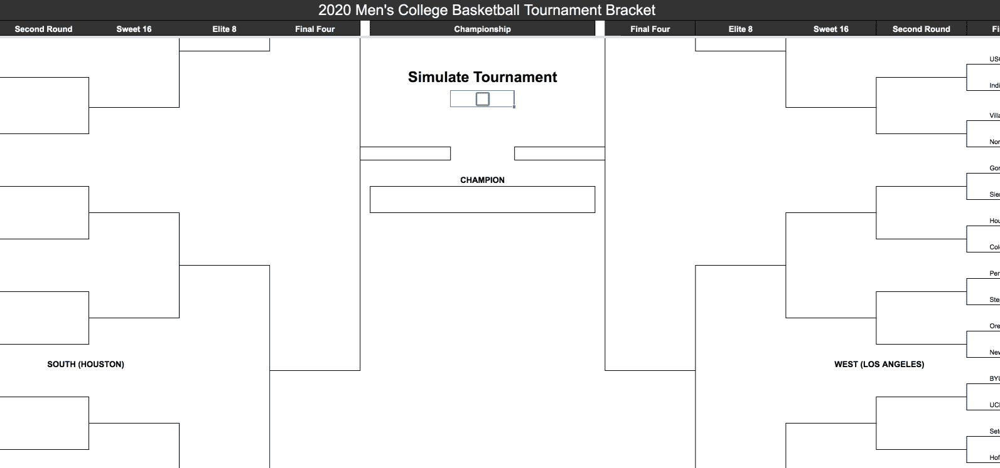
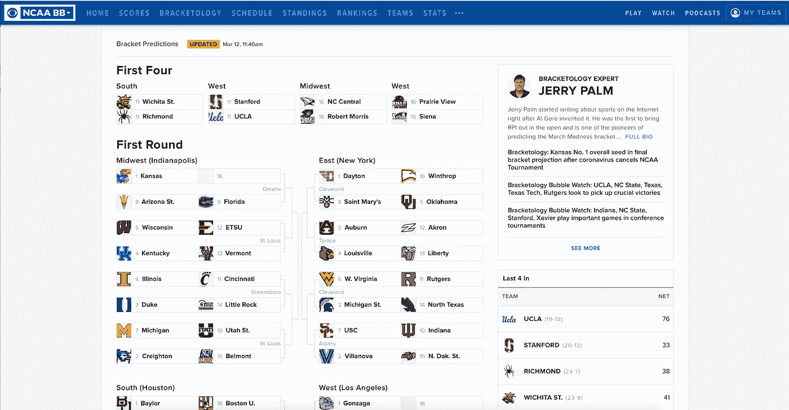
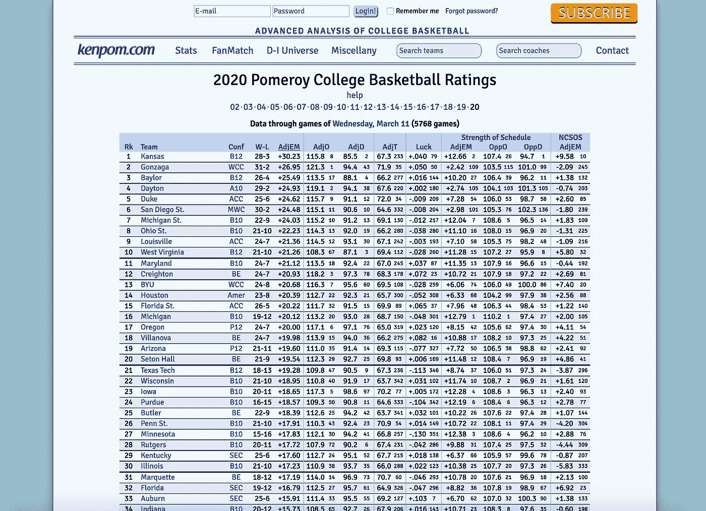
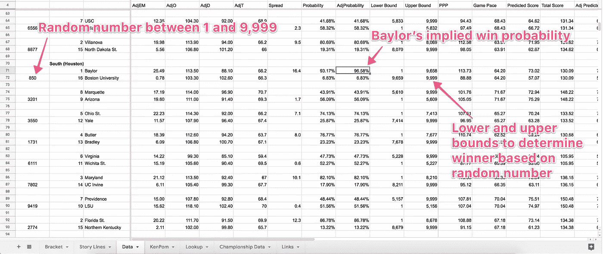
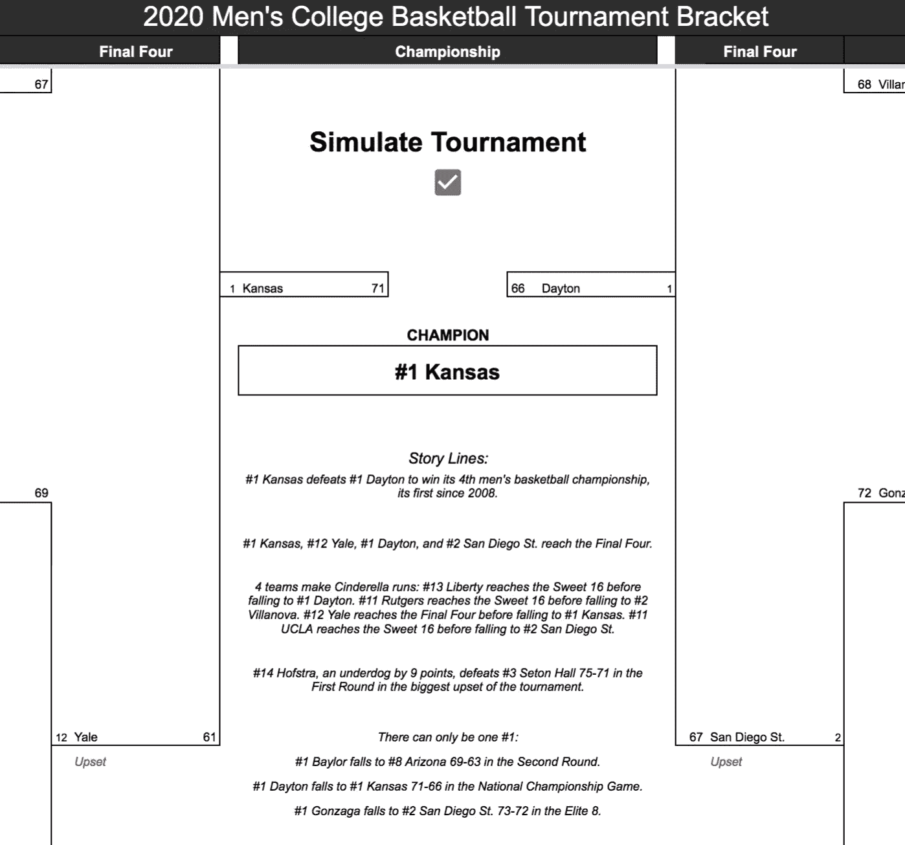
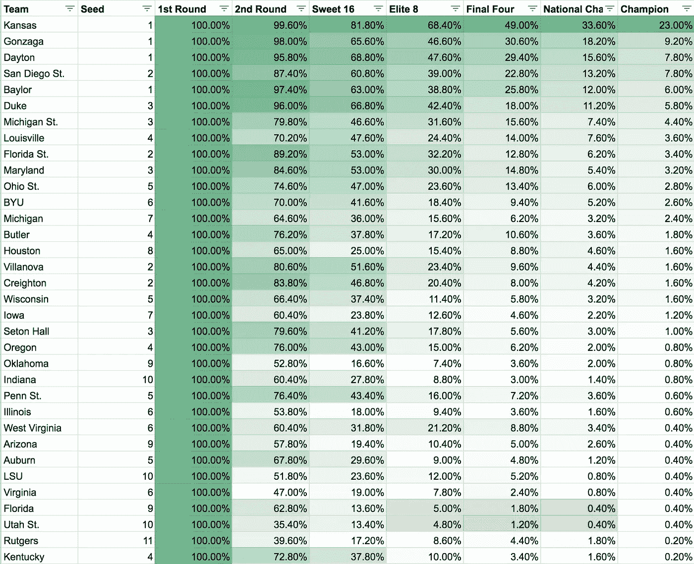
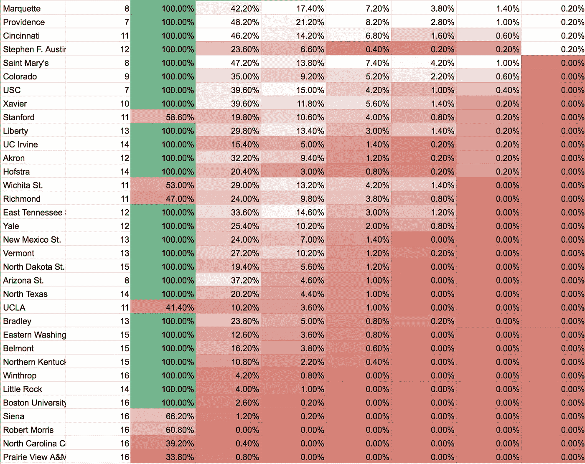

# 模拟 2020 年 NCAA 男篮锦标赛

> 原文：<https://towardsdatascience.com/what-could-have-been-the-2020-ncaa-mens-basketball-tournament-9dfecce66cd1?source=collection_archive---------24----------------------->

## *使用数据尽可能多次尝试模拟，以查看 2020 年疯狂三月的结果和故事情节*

哪个队会有最后的投篮机会？模拟工具可以帮助我们窥视另一个现实。由[马库斯·斯皮斯克](https://www.rawpixel.com/markusspiske/showcase?sort=curated&mode=shop&page=1)通过 [rawpixel](https://www.rawpixel.com/image/593156/basketball-the-net) (CC0 1.0)拍摄的照片。

*作者注:锦标赛又回到了 2021 年！查看我的 2021 赛季* [*这里*](https://dglid.medium.com/how-to-fill-out-your-2021-march-madness-bracket-afddb7d82576) *和* [*关注我并订阅*](https://medium.com/@dglid) *让我的支架每年一次准备好就直接送到你的收件箱。*

随着冠状病毒导致 2020 年 NCAA 男篮锦标赛史无前例的取消(更不用说 NCAA 的所有活动了)，其球员和球迷都在想，如此受欢迎的年度仪式会发生什么。

在[周四的 CBS Sports ' Eye on College Basketball 播客](https://podcasts.apple.com/us/podcast/03-12-march-12-2020-will-forever-be-remembered-as-day/id268800565?i=1000468282195)(从 1:06:30 开始)中，主持人[马特·诺兰德](https://twitter.com/MattNorlander)和[加里·帕里什](https://urldefense.proofpoint.com/v2/url?u=https-3A__twitter.com_GaryParrishCBS&d=DwMFaQ&c=jGUuvAdBXp_VqQ6t0yah2g&r=XlMdKPq9jd1pXkTOyxTdRm_ryXDFlZhFidQHc5lntWR4ll85P6a7uYFYCNb9boJl&m=exEJkQ75mn9aiW9MnFn8OwhmvUnwRhm09ifFBycEwno&s=UdV4VdzBNboJynvKDACyeh4IIR2NJVYI7mIsnMuRMcI&e=)根据[杰里·帕尔姆 3 月 12 日的预测数据](https://www.cbssports.com/college-basketball/bracketology/)对本赛季进行了一次假想的比赛。这让我想到:我真的可以模拟比赛，并确定 2020 年疯狂三月的另一个现实的故事线吗？

已经有一些人[模拟了锦标赛](https://www.cbssports.com/college-basketball/news/simulation-sunday-march-madness-would-have-had-more-than-one-shining-moment-sportsline-simulation-shows/)(被亲切地称为“模拟周日”)，但我想自己运行模拟(并能够运行多次)，以了解主要的故事线可能是什么。作为三月疯狂的超级粉丝(我广泛记录了[的模型](https://medium.com/s/story/the-ultimate-guide-to-filling-out-your-bracket-for-march-madness-9e7d76f16449)，我用它来[挑选过去两年的冠军](https://medium.com/@dglid/how-to-fill-out-your-2019-march-madness-bracket-9b854c567249))，我发现自己手头有点时间，渴望在失去的一年中有所作为。

因此，我使用 [CBS Sports 的 Jerry Palm 的 3 月 12 日预测括号](https://www.cbssports.com/college-basketball/bracketology/)，建立了一个电子表格，允许你模拟整个锦标赛，使用反映每个队的 [KenPom 排名](https://kenpom.com/)的真实概率:

模拟 2020 年男子大学生篮球赛。[复制一份谷歌表单](https://docs.google.com/spreadsheets/d/1hALIV1Zpi_q--pd1F1s9ycoYZ0gwWAlmcZk33PO1amU/copy)自己运行模拟。

要亲自尝试，[复制一份 Google 表单](https://docs.google.com/spreadsheets/d/1hALIV1Zpi_q--pd1F1s9ycoYZ0gwWAlmcZk33PO1amU/copy)(需要 Google 帐户)，然后如上所示选中“Bracket”选项卡上的“Simulate Tournament”复选框。括号将被填满，一个冠军将被加冕。滚动整个括号，看看疯狂是如何进行的，或者只是阅读每个模拟动态生成的顶级故事线。取消选中并重新选中复选框以再次运行模拟。

*注意:每个模拟都是使用一组唯一的随机数生成的，一旦删除就无法重新创建。似乎适合一个三月的疯狂，反正没有发生！如果您喜欢某个版本的历史，请务必制作一份副本，避免在原始副本中再次运行模拟。*

# 它是如何工作的

为了模拟锦标赛，我首先从 [CBS Sports 的 Jerry Palm 的 3 月 12 日投影括号](https://www.cbssports.com/college-basketball/bracketology/)开始，以确定 68 场比赛的定位，包括前四场比赛。

CBS Sports 的 Jerry Palm 的[预测的 2020 年括号](https://www.cbssports.com/college-basketball/bracketology/)用于模拟。

然后我导入了每个团队的[肯波排名](https://kenpom.com/)。在这里，我使用[这种方法](https://www.reddit.com/r/CollegeBasketball/comments/5xir8t/calculating_win_probability_and_margin_of_victory/)计算了每场比赛的获胜概率，得出了预计的积分差距和平均比赛分数，并根据两支球队的节奏进行了调整。

*注意:在看到从 KenPom 得出的概率相对于由 fivethirtyeeight**生成的* [*历史预期获胜概率普遍看好 16 号种子后，我对 1 号种子与 16 号种子游戏的概率进行了小幅调整。我把任何基于肯波姆的获胜概率为 90%的队伍平均还原为 100%，导致大多数一号种子队的获胜概率为 90%左右，而不是 90%以下。*](https://projects.fivethirtyeight.com/2019-march-madness-predictions/)

[肯彭排名](https://kenpom.com/)

为了构建仿真电子表格，我使用了 [RANDBETWEEN 函数](https://support.office.com/en-us/article/randbetween-function-4cc7f0d1-87dc-4eb7-987f-a469ab381685)来动态生成 1 到 9999 之间的随机数。这将决定谁赢得了即将到来的比赛。

例如，我的模型表明#1 贝勒大学将以 96.58%的隐含概率赢得与#16 波士顿大学的第一轮比赛。因此，如果 RANDBETWEEN 函数生成的 1 到 9999 之间的随机数是 9658 或更少(匹配 96.58%的隐含获胜概率)，我将获胜的一方交给 Baylor。如果随机数高于这个数，我就把胜利给波士顿大学。这确保了在模拟中获胜的可能性与团队的 KenPom 排名所暗示的获胜概率相匹配。

如何利用随机数和隐含概率确定获胜者(来自[数据表](https://docs.google.com/spreadsheets/d/1hALIV1Zpi_q--pd1F1s9ycoYZ0gwWAlmcZk33PO1amU/edit#gid=0)

从那里，我得到隐含的点差和总点数，并对其进行调整，以创造性地显示一个假设的游戏分数。使用上面的例子，贝勒大学将比波士顿大学多 16.4 个百分点。如果生成的随机数是 4，829(上面提到的贝勒 9，658 个获胜场景的一半)，我计算出一个贝勒赢~16.4 分的游戏结果。然而，随机数越接近波士顿大学的中奖幻数 9659 或以上，贝勒的胜率就越低。同样，随机数越接近 1，贝勒的胜率就越高，最高可达价差的两倍。

然后，锦标赛的每场比赛都有一个随机数，由概率加权结果确定的每场比赛的获胜者进入下一轮，直到只剩下一个冠军。

*注意:这种类型的模拟相当简单，不像您在其他地方可能发现的那样复杂，因为它不会在获胜后调整团队实力，也不会根据获胜相对于预期的积分差距的优势(或劣势)进行调整。该队的肯彭得分在整个锦标赛中保持不变。*

在[括号表](https://docs.google.com/spreadsheets/d/1hALIV1Zpi_q--pd1F1s9ycoYZ0gwWAlmcZk33PO1amU/edit#gid=1446983957)上，可以使用“模拟锦标赛”复选框打开和关闭模拟，然后以括号形式显示结果，基于种子的冷门以红色表示:

我还从模拟锦标赛中动态生成关键故事线:

1.  加冕冠军
2.  四强赛
3.  灰姑娘的故事(定义为任何队伍#11 或更高达到甜蜜的 16)
4.  锦标赛最大的冷门
5.  头号种子队是如何一路败北的

# 观察

总的来说，我认为模拟在真实模拟比赛方面做得很好。大多数时候选出的冠军是可信的，有适当频率的惊喜获奖者把“疯狂”放在三月疯狂。

以下是在运行和记录 500 次模拟后，每个团队进入某一轮的可能性的完整分析:

*注:* *没有 100%机会进入第一轮的球队意味着他们必须在前四轮比赛中才能进入第一轮 64 强。*

看到# 1-整体堪萨斯以 23%的夺冠概率这么强，我很惊讶；这证明了他们的实力，或许通往冠军的道路比预期的更容易。

也许是因为他们会遇到如此强大的堪萨斯队，排名第四的肯塔基队表现不佳，只有 38%的时间进入甜蜜的 16 强。

在任何给定的模拟中，通常似乎都有适当数量的扰乱，尽管做得足够多，您会看到 16 种子扰乱多于 1 种子，这表明这些扰乱应该比实际情况更加频繁。几年前，当 UMBC 击败弗吉尼亚成为第一支击败 1 号种子的 16 号种子队时，FiveThirtyEight 写道，16 号种子没有更早赢得比赛是不太可能的。

一个可能的改进是在每场胜利后，根据胜利相对于预期的差距来调整球队的实力。我想知道它是否会对事情有那么大的影响…我生成的模拟看起来都是合理校准的，尽管这只是我未经训练的眼睛。

就是这样！对于所有没有机会体验今年锦标赛的球员(尤其是老年人)和球迷，我希望这个工具能帮助你梦想本可以成为的锦标赛。

# 在你走之前…

如果你喜欢这篇帖子，你可能也会喜欢[我的其他关于体育和数据的帖子](https://medium.com/@dglid)——给我一个关注，当我发布更多帖子时会通知我:

*   [76 人队的客场困境背后是什么？](/whats-behind-the-76ers-road-woes-939a3d9a78c2)
*   [为疯狂三月填写表格的终极指南](https://medium.com/s/story/the-ultimate-guide-to-filling-out-your-bracket-for-march-madness-9e7d76f16449)
*   [我如何正确预测比利亚诺瓦赢得 2018 年 NCAA 男篮锦标赛](https://medium.com/@dglid/how-i-correctly-picked-villanova-to-win-the-2018-ncaa-mens-basketball-tournament-3764e9442ee2)
*   [我是如何智胜一个 538 预测算法的](https://medium.com/s/story/how-i-outsmarted-fivethirtyeights-nfl-forecasting-algorithm-592a301fa318)
*   [我如何使用 200 名专家和 Reddit 的评论排名算法赢得我的 Office NFL Pick'em Pool](https://medium.com/@dglid/how-i-used-200-experts-and-reddits-comment-ranking-algorithm-to-win-my-office-nfl-pick-em-pool-cbca64abe31d)
*   [2020 梦幻足球拍卖守门员策略综合指南](https://medium.com/swlh/the-comprehensive-guide-to-keeper-strategy-for-2020-fantasy-football-auctions-394c99d61be3)