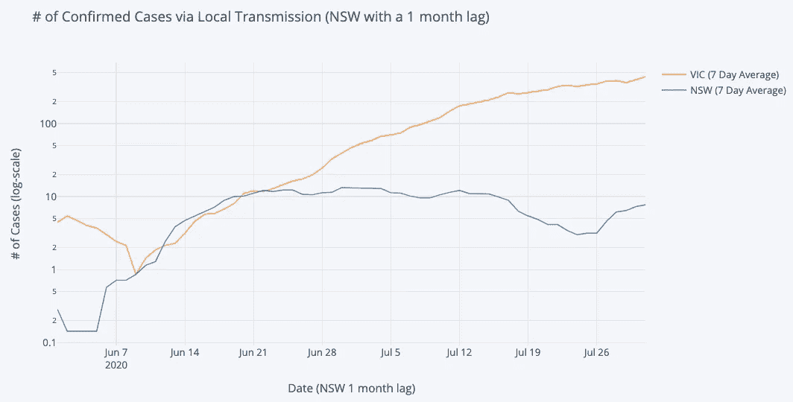

# 关于数据科学，新冠肺炎能教给我们什么

> 原文：<https://towardsdatascience.com/what-covid-19-can-teach-us-about-data-science-1e940f258f9e?source=collection_archive---------47----------------------->

## 疫情给所有工作数据科学家的 3 个教训

米卡·鲍梅斯特在 [Unsplash](https://unsplash.com?utm_source=medium&utm_medium=referral) 上的照片

新冠肺炎·疫情事件是一个悲剧，但也是一个启发性的案例，说明了数据(以及统计和预测模型)在危机中的价值。它也暴露了社会与数据关系中的许多缺陷。虽然作为一名数据科学家，看到“基于代理的模拟”和“指数增长率”等术语成为主流令人兴奋，但看到统计数据以如此不科学的方式应用也令人沮丧。在本文中，我将探讨我从疫情中学到的三个数据科学经验，以及我们如何更广泛地应用它们。

# 1.大多数人不理解概率

作为人类，我们识别模式的能力无疑对我们这个物种非常有用，但它也会把我们引入歧途。事实是，很多统计数据是不直观的，当谈到概率时，*常识*往往会误导人。为了说明这一点，让我们考虑洗牌的行为(大多数人已经做了很多次，并建立了一些直觉)。我最近让我的 10 个朋友估计一下将一副牌洗牌成一个全新的顺序(即人类历史上任何一副牌都从未出现过的顺序)的概率。大多数人猜测答案是 0，并推断现在肯定已经看到了所有可能的卡片组合。一些人怀疑这是一个骗局，估计概率可能更高，但没有人提出 0.2 以上的概率。正确的答案是，每次你洗一副牌(假设真的是随机洗的)，你几乎可以保证这是第一次有任何一副牌按照这个顺序洗。一副 52 张牌可能的唯一排列总数是 52！≈ 8x10⁶⁷或

> 80000000000000000000000000000000000000000000000000000000000000000000.

从上下文来看，如果自宇宙诞生以来，今天活着的每个人每秒都洗一副牌，那将只相当于相对较小的 3x10 ⁷洗牌或

> 3000000000000000000000000000.

我们无法解释概率的另一个著名例子是 2016 年美国总统大选。在大选前，政治民调机构认为唐纳德·特朗普有大约 25%的机会击败希拉里·克林顿，但当然他最终获胜了。这导致公众谴责民调公司和专家“搞错了”。现在要明确的是，这次选举确实提出了一些关于如何进行民意调查的合理方法问题，但这并不能改变这样一个事实，即当发生概率为 0.25 的事情发生时，我们永远不应该感到惊讶。抛两次硬币，两次都正面朝上(几率相同的事件)会引发类似的愤怒吗？

我们概率盲点的结果是，我们擅长识别模式，但不擅长从这些模式中得出结论。就疫情而言，这使我们特别容易受到关于新型冠状病毒病毒传播的政治诡辩和错误信息的影响。在过去的 6 个月里，我看到了无数的“分析”，其中许多都发表在主要的新闻媒体上，打破了统计学的基本规则。

# 2.理论很重要

随着数据科学在过去几年中的普及，进入门槛已经大大降低。现在，任何具有基本编程背景的人都可以访问庞大的公共数据集，并摆弄深度学习模型。虽然总的来说，我认为这种民主化是一种积极的趋势，但我确实担心人们会忽略数据科学中严格的、可能不那么令人兴奋的方面，如统计学、概率论和数学。我想起了一句古老的谚语*一知半解是一件危险的事情*,因为如果没有对这些主题的良好理解，一个业余数据科学家只是有更多的工具来寻找虚假的相关性。新冠肺炎疫情已经表明，滥用统计数据不仅是不科学的，而且可能是危险的。这篇文章没有足够的篇幅来探讨我在这个疫情中看到的所有谬误的推理，但是下面的两个例子相当典型。

由[杰斯温·托马斯](https://unsplash.com/@jeswinthomas?utm_source=medium&utm_medium=referral)在 [Unsplash](https://unsplash.com?utm_source=medium&utm_medium=referral) 上拍摄的照片

## 例 1:菲尔博士

菲尔博士最近通过比较新冠肺炎的死亡人数和每年 360，000 的游泳池溺水死亡人数，质疑了封锁措施的必要性。首先，我不知道这个数字从何而来。来自疾病控制和预防中心的数据表明，美国每年意外溺水的真实人数更接近 3500 人。

菲尔博士的推理不合逻辑的第二个原因是，与新冠肺炎不同，意外溺水的风险不是倍增的(即，它不会像病毒一样传播)。如果我们在一周内观察到 100 例溺水死亡，我们没有理由期望这个数字在下一周翻一番，再下一周再翻一番。如果没有遏制疾病传播的政策，这就是你在新冠肺炎会看到的那种增长。

菲尔博士在这里犯的第三个错误是暗示溺水死亡和新冠肺炎死亡来自相似的概率分布。这显然是不真实的。正如 Taleb、Bar-Yam 和 Cirillo (2020)所显示的，流行病是厚尾的，而游泳池死亡不是[2]。考虑这个病态的假设:如果有人告诉你 10%的美国人口在一年内死亡，你会认为他们更有可能死于新冠肺炎或意外溺水吗？溺水死亡(尽管是悲剧)不会造成生存威胁，但流行病会。

## 示例 2:任意叠加曲线

我观察到的另一个现象是人们任意叠加趋势图，胡乱外推。

这条推文中的情节比较了澳大利亚新南威尔士州和维多利亚州社区传播的确诊病例数量，并广为流传。这里明显的暗示是新型冠状病毒在新南威尔士州的传播速度比一个月前在维克的传播速度要快。下面是我对这张图表的两个担忧:

*   **1 个月的滞后是任意的，看起来是被选择的，因为曲线在视觉上是一致的**。我的第一直觉是使用一个滞后时间，它等于维克的第一例社区传播和新南威尔士州的第一例社区传播之间的天数。也许有比这更好的选择，但是你当然不应该操纵数据来适应你的假设，然后说“嘿，看数据多么支持我的假设！”。
*   每天的计数太少，无法得出关于社区传播的有意义的结论。该图表的创建者认为，新南威尔士州社区的真实传播率高于一个月前的维克，但新南威尔士州 7 天平均计数的一半不到每天 1 例！即使没有完全理解病毒如何在社区中传播的机制，我们也观察到每天的计数非常嘈杂，尤其是当这些计数很低时。从噪音中推断是不好的做法。

下面我重新制作了同样的图表，但是加入了最新的数据，我们可以看到趋势完全不同。请注意，为了保持一致性，我在 y 轴上使用了对数标度，但这实际上掩盖了这些曲线的不同之处。

作者图片

# 3.数据科学不是魔法

即使我们避免所有这些统计上的谬误，我们也必须诚实地说出我们对这种病毒的实际了解程度；不是很喜欢。说到底，不管你的模型有多复杂，你的技术有多先进，如果你没有关于你正在建模的系统的良好数据，你的结果就会打折扣。

我观察到的大多数病例数和死亡数预测都使用了统计和/或流行病学模型，但成功率很低。5 月份对 IHME 模型的一项调查(该模型为美国的政策决策提供了信息)发现，“该模型隐含的不确定性水平令人怀疑其在推动健康、社会和经济政策发展方面的有效性”[3]。本文的重点不是建模的技术细节，但是无论选择哪种方法，预测者在设计他们的模型时都不可避免地需要做出许多假设。模型设计的不确定性部分是由于以下领域的知识空白。

## 病毒的机制

我们每天都在更多地了解这种病毒的本质，但仍有许多我们不了解的地方。在撰写本文时，关于超级传播者的作用、无症状传播、气候等问题仍然存在。在病毒的传播中。直到最近，大多数文献表明，病毒主要在表面传播，气溶胶传播不是太大的问题。在最新的研究中，这种情况发生了逆转。

## 人类行为

由于病毒是由人传播的，模拟人类行为将是许多预测模型的核心，但这是众所周知的困难，特别是在像疫情这样的新情况下。建模者不仅需要假设人们将如何应对不断增长的病例数和公共卫生政策，病毒的传播对异常值也非常敏感。以韩国为例，在“31 号病人”感染之前，该国的病毒得到了很好的控制。据估计，这个人对超过 5000 人的感染负有责任(这是任何模型都无法预测的结果)[4]。

## 政策

如果病毒存在于一个静态系统中，从历史数据中建立传播模型会相对简单。不幸的是，事实远非如此。政府政策是动态变化的，人们对这些政策的反应也是如此，这就产生了一个类似于向移动目标射击的建模任务。当试图预测政策 X 的影响时，一个简单的方法是观察政策 X 在其他国家实施时的影响。虽然从过去的结果中吸取经验教训非常重要，但我们也需要记住，各个地区在许多方面可能存在巨大差异，包括人口、地理、气候、测试率、文化、政策实施和政策合规性。例如，与日本等亚洲国家相比，美国人对口罩的态度截然不同。

明确地说，我一点也不批评这些预测者正在做的重要工作。我只想解释为什么建模任务如此困难，为什么立法者和公众不应该期待奇迹。好消息是，我们收集的研究和数据越多，这些模型就会变得越好。

# 结论

本文概述的经验教训不仅适用于新冠肺炎疫情。最后，我将简要解释我认为这些见解如何能够更普遍地应用于数据科学工作。

1.  **大多数人不理解概率**:数据科学家经常与非技术利益相关者一起工作，并需要交流复杂的概念。这个疫情已经证明了数据是多么容易被误解，所以我们有责任在报告分析结果时保持清晰和诚实。
2.  **理论很重要**:虽然统计和概率可能不是数据科学中最令人兴奋的方面，但所有从业者都需要理解这些主题。如今，在没有真正理解它们如何工作的情况下，训练非常复杂的模型是可能的，但这并不意味着你应该这样做！没有统计测试、置信区间、随机变量和大数定律等概念的知识，你真的是在盲目飞行。
3.  数据科学并不神奇:在过去的十年里，媒体对计算机视觉、推荐引擎和语音识别等领域的进步进行了大量热情报道。不管是好是坏，这导致了一种看法，即数据科学家可以创造奇迹，但事实是，许多项目就像建模新冠肺炎疫情:复杂，缺乏数据，耗时。对利益相关者坦诚并设定现实的期望是很重要的。

## 参考

[1]美国疾病预防控制中心，[意外溺水:获取事实](https://www.cdc.gov/homeandrecreationalsafety/water-safety/waterinjuries-factsheet.html) (2016)，[https://www . CDC . gov/homeandrecreationalsecurity/water-safety/water injuries-fact sheet . html](https://www.cdc.gov/homeandrecreationalsafety/water-safety/waterinjuries-factsheet.html)

[2] N. Taleb，Y. Bar-Yam 和 P. Cirillo，[关于厚尾变量的单点预测](https://arxiv.org/pdf/2007.16096.pdf) (2020)，国际预测杂志

[3] R. Marchant，N. Samia，O. Rosen，M. Tanner 和 S. Cripps，[边走边学——检验新冠肺炎每日死亡人数预测的统计准确性](https://arxiv.org/pdf/2004.04734.pdf) (2020)，新冠肺炎电子版

[4] Y. Shin，B. Berkowitz 和 M. Kim，[韩国教会如何助长冠状病毒的传播](https://www.washingtonpost.com/graphics/2020/world/coronavirus-south-korea-church/) (2020 年)，《华盛顿邮报》