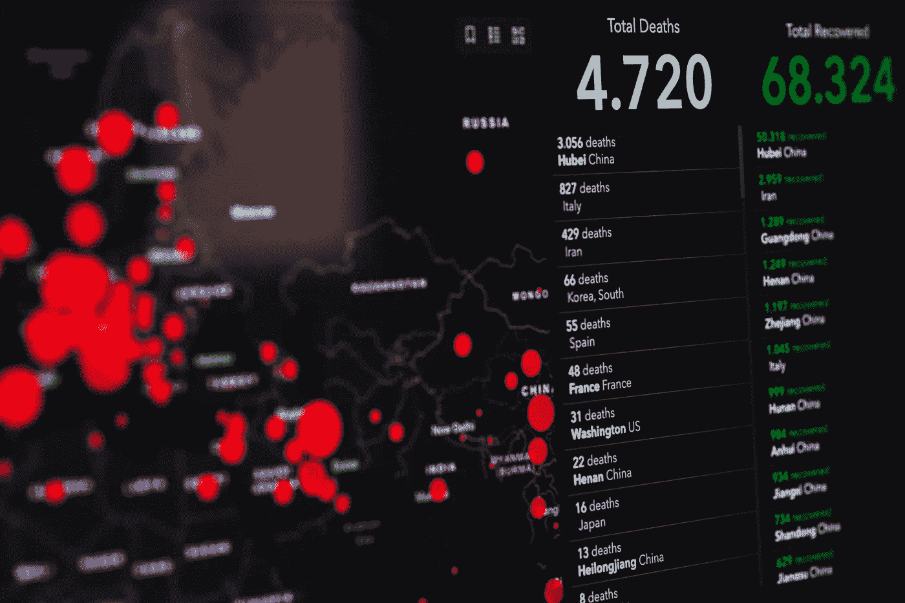

# 新冠肺炎教给我的分析方法

> 原文：<https://towardsdatascience.com/what-covid-19-has-taught-me-about-analytics-980bc0751540?source=collection_archive---------47----------------------->

## [内部 AI](https://towardsdatascience.com/tagged/inside-ai)

## 后 Covid 世界将需要一些关于分析的新思维

图片由:【Pexels.com】上的[马库斯·斯皮斯克](https://www.pexels.com/@markusspiske)

关于政府对新冠肺炎危机的反应，已经有很多报道，大部分都带有批评。有几个国家似乎做对了，其中一个是南非，南非的反应受到了世卫组织的赞扬。经过一个多月的艰难封锁后，南非总统西里尔·拉马福萨先生宣布了一些开放南非经济的声明。政府决定采取一种基于风险的方法，据 Ramaphosa 称，这种方法将以科学和数据为指导。

这让我想到数据和分析是如何在最厌恶信息的家庭中变得根深蒂固的。人们在谈论[感染率](https://www.iol.co.za/news/politics/infection-rates-among-essential-services-workers-a-concern-says-mkhize-47230871)、[每百万人口的死亡率](https://ourworldindata.org/grapher/total-covid-deaths-per-million)，甚至有人引用 [Worldometer](https://www.worldometers.info/coronavirus/about/) 等数据聚合网站的统计数据。虽然你不能否认数据和分析对抗击这种疾病所做的贡献，但我不禁反思了我们作为分析从业者仍然需要关注的一些领域，因为它与业务有关。

**数据整合**

很明显，[整合了来自几个来源](https://www.politico.eu/article/french-government-struggled-to-gather-chilling-covid-19-data-from-nursing-homes/)(医疗保健机构、医学实验室等)的数据。)是新冠肺炎决策者的绊脚石。政府和其他组织一直在争分夺秒地从这些来源获取足够的数据，而将这些数据集成到一个中央存储库中似乎是一个相当大的挑战。

与任何分析人员交谈，他们都会确认这是房间里的大象。我们还没有能力充分整理出跨系统的集成，因此获得一个大的图景仍然是一场斗争。尽管我们经常满足于现状，但需要定期信息流的情况会凸显我们在数据集成方面的不足。因此，从集成的角度来看，必须对业务关键型数据进行优先级排序。否则，关键时刻的快速决策将受到影响。

**人工智能仍被数据独裁所扼杀**

人工智能在金融和保险等特定行业已经相当成熟，然而，在其他行业的采用却非常缓慢。这个疫情突显了医疗行业人工智能的缺乏，这对我们其他人来说也应该是一个危险信号。

人工智能开发的核心原则之一是足够和相关的数据集，因此数据民主化至关重要。显然[数据隐私在当前危机](https://www.bruegel.org/2020/03/big-data-versus-covid-19-opportunities-and-privacy-challenges/)的数据民主化缺失中扮演了重要角色，然而，对于我们其余的人来说，仍然有一个筒仓式的数据处理方法的合理理由非常少。通过数据民主化可以释放的价值远远超过对职能部门内部的某些信息进行保密的需要。这从根本上改变了组织对数据及其用途的看法，并为数据成为所有人的共享资产奠定了基础。任何经理都不应该完全控制他们部门的数据，并阻止数据科学家探索和挖掘有价值的见解。

一旦清除了这个绊脚石，数据科学家和分析从业者就可以专注于使用数据来开发高级分析模型，从而为整个组织增加价值，从而消除局部优化。

**云迁移需要快速跟踪**

云给一些决策者带来了恐惧，主要是因为缺乏理解。这种担心的主要原因是数据隐私可能会受到损害，公平地说，这是正确的。也就是说，对身体活动的限制凸显了本地解决方案对现代劳动力的低效性。

过去几周，世界上很大一部分工作人口被迫进行远程工作，那些几乎没有基于云的基础设施的人感到难以置信的沮丧。随着远程工作的优势逐渐显现，决策者将不得不投资云迁移，以便从远程位置提供更加协作的工作环境。对于那些使用数据集将标准硬件推向极限的人来说尤其如此。

***诺亚规则*将是分析成功的关键**

我的老板最近向我介绍了沃伦·巴菲特提出的[诺亚规则](https://www.inc.com/scott-mautz/warren-buffetts-little-known-noah-rule-is-key-to-surviving-adversity.html)。该规则规定:

> “预测下雨不算，造方舟才算”

后 Covid 世界将会是一个没有多少现金可以挥霍的世界，因此[性感节目将会被关闭](https://www.accenture.com/za-en/about/company/coronavirus-systems-resilience)。幸运的是，多年来，我们在分析界一直在驾驭与我们的职业相关的浪潮。我们已经获得了大量的投资，也有很多关于分析就像是商业成功的圣杯的文章。很多宣传都站得住脚，但太多的分析项目从来没有增加切实的价值，或者只是无限期地停留在概念验证模式。

因此，我们需要超越预测，专注于让用例跨越界限。但更重要的是，我们必须与利益相关方合作，确保分析的价值在商业中得到释放。这通常意味着与企业内的执行职能部门建立更紧密的工作关系，以确保业务流程、规划、预算和运营与任何花哨的数据科学模型一起考虑。否则，分析将会慢慢变回一种功能性能力，慢慢消亡。

**数据素养是一个比我们想象的更大的问题**

许多著名的媒体来源都声称感染率，无论是增加还是减少。我也观察到相当多的人在 LinkedIn 等论坛上评论锁定的成功。对我来说，有一件事变得非常清楚，那就是仍然存在一个巨大的数据素养问题。我们每天面对的数据不是感染率的反映，而是确诊感染的反映。你必须考虑结合感染率进行的测试数量，才能做出任何结论。在比较一个国家和另一个国家时，同样的逻辑也适用。绝对数字并不总是说明问题，一个恰当的例子是[比利时](https://coronavirus.jhu.edu/map.html)，比利时记录了每百万人口中最多的艾滋病死亡人数。

作为数据从业者，我们不仅需要对我们收集用于分析的数据更加挑剔，而且我们还需要花费更多的精力来教育数据的消费者，让他们了解数据的局限性。我们还需要更多地了解数据偏差，尤其是在开发依赖数据偏差的模型时。真正希望成为洞察力驱动的组织将不得不投资于决策者的教育项目，更具体地说是简单数据和统计基础的教育项目。这不仅能让他们提出正确的问题，还能确保从分析结果中获得正确的见解。