# Spotify 播客中正在讨论哪些与 Covid 相关的话题？

> 原文：<https://towardsdatascience.com/what-covid-related-topics-are-being-discussed-in-spotify-podcasts-bbc7eb9a3f1?source=collection_archive---------65----------------------->

## 从 Spotify API 检索数据，使用 LDA 算法进行主题建模

由于最近的新冠肺炎疫情，我在过去的 3 个月里一直呆在家里，一直在寻找在家自娱自乐的方式。听 Spotify 播客已经成为我周末的例行公事，同时重拾我的老爱好钩针编织。然后我就在想，Spotify 播客宇宙是什么样的？

***免责声明****:Spotify API 数据检索的代码大部分是根据来自*[*Sam Brady*](https://github.com/sam-brady/spotify-podcasts)*的源代码完成的。LDA 建模大多是跟随* [*机器学习加*](https://www.machinelearningplus.com/nlp/topic-modeling-gensim-python/) *的教程完成的。两者都经过一些修改后使用。*(谢谢！)

# 从 Spotify API 获取数据

令我兴奋的是，Spotify 已经有了一个[开发者 API](https://developer.spotify.com/) ，我们可以用它从 Spotify 获取数据，或者为 Spotify 用户触发某些动作。我们需要做的只是注册到网站，创建一个应用程序，并获得 API 令牌。然后，我们可以使用 Python 中的`spotipy`包从 API 中检索数据。

在这里，我使用的是萨姆·布雷迪的源代码(谢谢！)，只需稍加修改即可获得与 Covid 相关的播客剧集列表。我使用了两种方法:

*   获取包含 Covid 相关术语的播客节目，然后获取这些节目的所有剧集
*   获取包含 Covid 相关术语的所有剧集

## 导入包和定义

在这里进口必需品。基本上我们将使用`spotipy`和`json requests`包。

```
import pandas as pd
import numpy as npimport json
import requests
import urllib.parseimport spotipy.util as util
```

接下来，我们定义与 Spotify API 的连接。

```
# Get your client id, secret key, and redirect URI from your application [https://developer.spotify.com/dashboard/applications](https://developer.spotify.com/dashboard/applications)client_id = 'xxxxx'  #<----------------- YOUR ID HERE

client_secret = 'xxxxx' #<----------------- YOUR SECRET HEREusername = 'xxxxx'      #<----------------- YOUR USERNAME HEREscope = 'user-library-read' #<------------- depends on your needs, you can select different scope [https://developer.spotify.com/documentation/general/guides/scopes/](https://developer.spotify.com/documentation/general/guides/scopes/)redirect_uri = '[https://developer.spotify.com/dashboard/applications/[application_id]'](https://developer.spotify.com/dashboard/applications/24c33183a3f54ba7893c740aac55d9ab')token = util.prompt_for_user_token(username=username, 
                                   scope=scope, 
                                   client_id=client_id,   
                                   client_secret=client_secret,     
                                   redirect_uri=redirect_uri)
```

## 获取播客节目

在这里，我们将获得预先选择的与 covid 相关的关键字(“科罗纳”、“Covid”、“锁定”、“隔离”、“疫情”)的播客节目。结果被添加到数据框中以供进一步研究。

```
# enter term to search here
search_list = ['corona', 'covid','lockdown','quarantine','pandemic']# search endpoint
endpoint_url = "[https://api.spotify.com/v1/search](https://api.spotify.com/v1/search)?"# PERFORM THE QUERYid_list = []
name_list = []                                         
desc_list = []
publisher_list = []
languages_list = []type = 'show'    
market  = 'US'for i in range(len(search_list)):
    search = search_list[i]
    print(search)
    offset = 0                                   
    more_runs = 1        
    counter = 0  
    limit = 50# max offset is 2000 including limit
while((offset <= 1950) & (counter <= more_runs)):query = f'{endpoint_url}'
    query += f'&q={search}'
    query += f'&type={type}'
    query += f'&offset={offset}'                      
    query += f'&market={market}'
    query += f'&limit={limit}'response = requests.get(query,                                           # get request
                   headers={"Content-Type":"application/json", 
                            "Authorization":f"Bearer {token}"})  
    json_response = response.json()                                           # as a json filefor i in range(len(json_response['shows']['items'])):                      # loop through json
        if json_response['shows']['items'][i] is not None:
            id_list.append(json_response['shows']['items'][i]['id'])               # pull out info from json
            name_list.append(json_response['shows']['items'][i]['name'])           # into empty lists
            desc_list.append(json_response['shows']['items'][i]['description'])
            publisher_list.append(json_response['shows']['items'][i]['publisher'])
            languages_list.append(json_response['shows']['items'][i]['languages'])

    more_runs = (json_response['shows']['total'] // 50 )            # how many more runs of 50 are needed?       

    counter += 1                                                    # increase conditional counter by 1

    offset = offset + 50# set up a dataframe from the listspodcasts_show = pd.DataFrame()podcasts_show['show_id'] = id_list
podcasts_show['show_name'] = name_list
podcasts_show['show_description'] = desc_list
podcasts_show['show_publisher'] = publisher_list
podcasts_show['show_language'] = languages_list
```

下面是上面代码的结果。

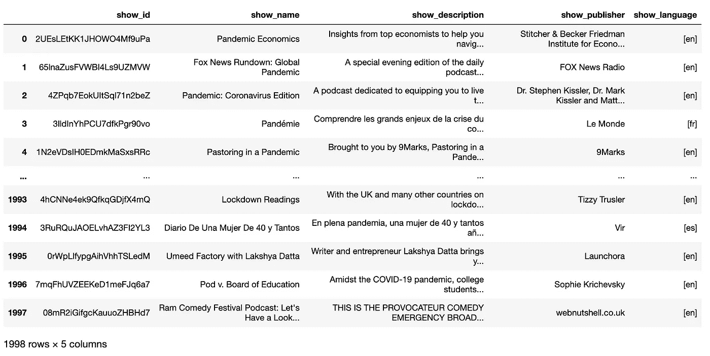

在这里我找到了 1998 年的节目，但是有些不是英文的，我无法分析。因此，在下一步中，我将只过滤英语节目。

## 过滤英语播客

有三种英语定义:通用英语(en)、美国英语(en-US)和英国英语(en-GB)

```
en_podcasts = pd.DataFrame()
en_podcasts = podcasts_show[podcasts_show.apply(lambda x: 'en' in x['show_language'], axis=1)]en_podcasts_us = pd.DataFrame()
en_podcasts_us = podcasts_show[podcasts_show.apply(lambda x: 'en-US' in x['show_language'], axis=1)]en_podcasts_gb = pd.DataFrame()
en_podcasts_gb = podcasts_show[podcasts_show.apply(lambda x: 'en-GB' in x['show_language'], axis=1)]en_podcasts = en_podcasts.append(en_podcasts_us)
en_podcasts = en_podcasts.append(en_podcasts_gb)en_podcasts
```

结果被缩短为 995 个仅用英语显示的节目。

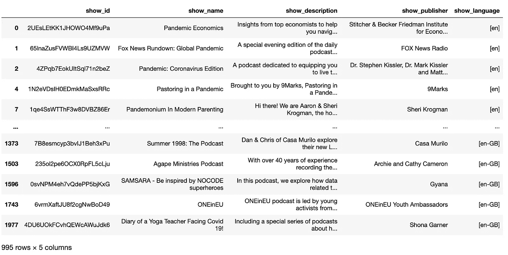

要从上面的节目中获得剧集列表，并获得所有带有 Covid 相关术语的播客剧集，只需对上面的代码进行轻微修改(在`type`语法上)。使用的完整代码可以在找到[。](https://github.com/oliviatan29/spotify-podcast-expl/blob/master/Spotify%20Test%20-%20Data%20Retrieval.ipynb)

# 初始数据探索

从上面的数据检索方法中，我们得到了 Spotify 中与 Covid 相关的播客的一些元数据。这些元数据包括发布日期、节目名称和描述，甚至是剧集的 30 秒音频预览。

## 它什么时候开始流行？

虽然 Covid 案例在 2019 年 12 月下旬就已确定，但 Spotify universe 实际上直到 2020 年 3 月 6 日左右才谈论它，我们看到发布的剧集数量从之前的每天不到 20 集激增到超过 40 集。这与 2020 年 3 月 5 日开始的美国**发现新冠肺炎病例**相一致。

剧集数持续增加，2020 年 5 月中旬达到 **~270 集/天**。尽管这一趋势在最近几周略有下降，但仍高于 180 集/天。

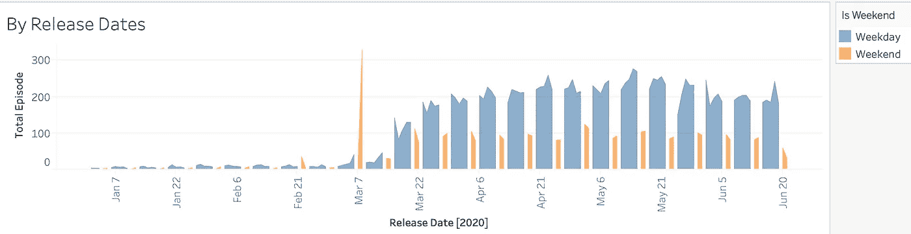

按发布日期排列的总集数(忽略 3 月 7 日的高峰，一个频道在那一天回填了他们的内容)

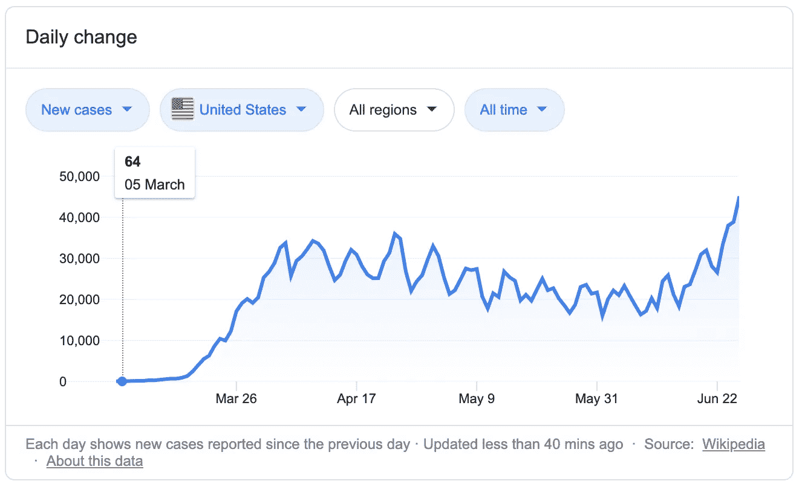

美国新冠肺炎每日新病例(来源:谷歌/维基百科)

从播客剧集图表中看到另一个有趣的模式？不知何故，这些播客在工作日发布内容(比周末高出 2-3 倍)。也许周末也是播客的节日？:D

## 哪个频道的内容最多？

调查节目出版商和他们的节目，发现有一些出版商有不止一个节目讨论 Covid 相关的问题。例如，iHeartRadio 有三个与 Covid 相关的讨论节目:重开美洲(每日新闻)、妇女(与疫情战斗的女性前线)、与凯蒂和博兹一起回到商业(商业会谈)。

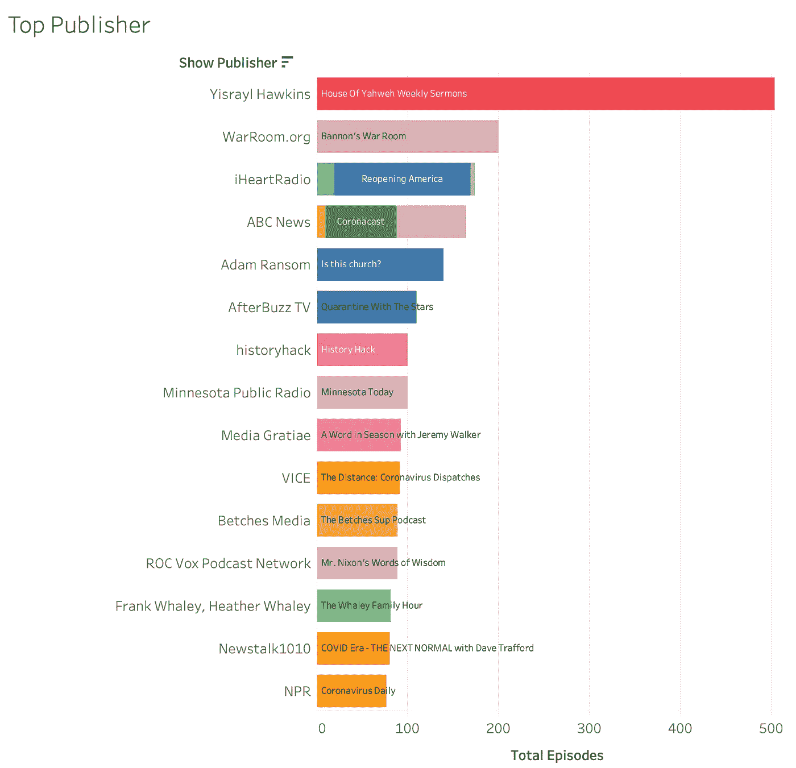

顶级播客出版商及其与 Covid 相关的节目

查看播客内容类别，我们发现有几个关键内容类别的集数最高:

*   **宗教内容**:布道、宗教鼓励
*   **新闻与研究**:每日更新关于疫情的最新案例、影响和研究
*   **娱乐**:有影响力的脱口秀，隔离黑客
*   **鼓励**:来自因封锁/危机而抑郁的人的心理健康支持

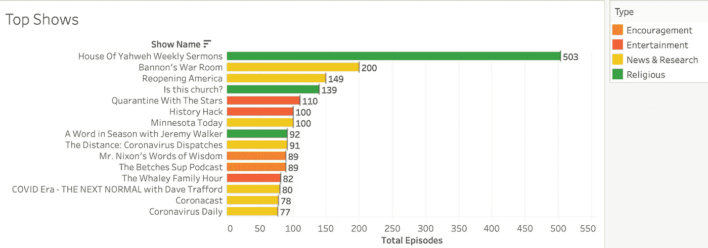

集数最高的播客节目

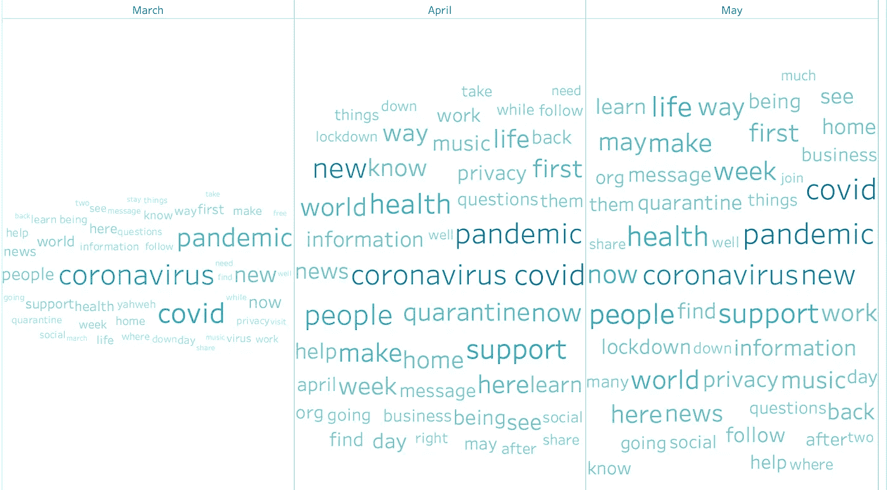

月月字云

我们将在分析的第 2 部分更深入地挖掘这个主题:)

## 每集多长？

在大多数情况下，这些播客从**15-49 分钟长**。还有一些剧集的运行时间更长。观察这一持续时间与听众点击率或衰减的关系可能会很有趣(正如我们所知，一些人可能会对长时间的节目感到厌倦)。但是，Spotify API 中没有这些数据，因此无法对其进行进一步分析。

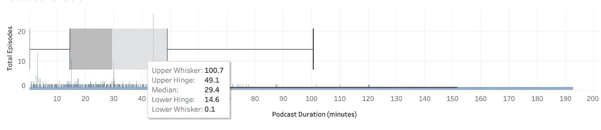

播客时长

# 什么是 LDA？

引用 [algorithmia](https://algorithmia.com/algorithms/nlp/LDA/docs) ，LDA 是一种算法，它获取一组文档(任何由 up 文本组成的东西)并返回与这些文档最相关的几个**主题**(由几个单词组成)**。**

主题被表示为单词的加权列表。基于模型的这 3 个主要参数来计算这些单词的权重:

*   主题的数量
*   每个主题的字数
*   每个文档的主题数

该模型的输出是一个主题列表，其中包含与文档中的**相关的单词**及其**出现次数**。

# 使用 LDA 进行 Spotify 播客主题探索

## 数据清理

任何类型的数据分析和建模的第一步都是进行数据清理。在这种情况下，使用的数据清理技术是**从文档中删除脱离上下文的字符**(标点、数字、字母、空格)。这里我使用的是 Python 中`gensim`包的`gsp`模块。

```
from gensim import utils
import gensim.parsing.preprocessing as gsp# remove punctuation, short words, whitespaces, numeric
filters = [
           gsp.strip_punctuation,
           gsp.strip_multiple_whitespaces,
           gsp.strip_numeric,
           gsp.strip_short
          ]def clean_text(s):
    s = s.lower()
    s = utils.to_unicode(s)
    for f in filters:
        s = f(s)
    return sdf2_clean = pd.DataFrame()
df2_clean['notes'] = df2['ep_description'].astype(str).map(lambda x: clean_text(x))
```

下面是清洗的结果

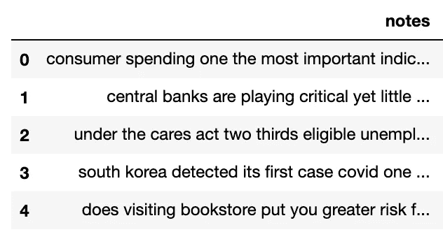

播客剧集描述清理后

## 数据转换

LDA 算法计算文档中定义的每个标记的权重。因此，我们需要做的第一件事是创建要加权的令牌，可以按如下方式完成:

*   **分词**单词
*   从记号中创建 **n-grams** (包含短语作为主题的一部分)，推荐使用二元模型和三元模型
*   删除**停用词**(以及通用词，在这种情况下我会删除播客和剧集之类的词，这很常见)
*   **引理**令牌，让话题进入核心形式

上述步骤的代码可在[这里](https://github.com/oliviatan29/spotify-podcast-expl/blob/master/Spotify%20Test%20-%20Topic%20Ingestion.ipynb)找到

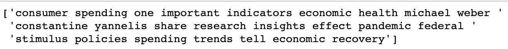

之前的**:播客剧集描述的实际文本**

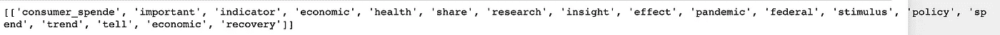

之后的**:转换后的分词**

## 建立模型

接下来，在预处理完成后，我们创建一个数据字典和语料库来输入到 LDA 模型中。在这个过程中，我们使用单词包来计算文档中每个语料库的频率。

```
# Create Dictionary
id2word = corpora.Dictionary(data_lemmatized)# Create Corpus
texts = data_lemmatized# Term Document Frequency
corpus = [id2word.doc2bow(text) for text in texts]# View
print(corpus[:1])# Human readable format of corpus (term-frequency)
[[(id2word[id], freq) for id, freq in cp] for cp in corpus[:1]]
```

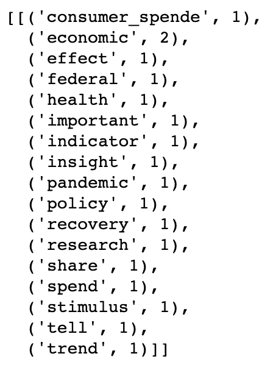

队

接下来，直接进入模型定义。这里我们在`gensim`包中使用 LDA 算法，初始主题数为 20。请注意，这可以进一步调整。

```
# Build LDA model
lda_model = gensim.models.ldamodel.LdaModel(corpus=corpus,
                                           id2word=id2word,
                                           num_topics=20, 
                                           random_state=100,
                                           update_every=1,
                                           chunksize=100,
                                           passes=10,
                                           alpha='auto',
                                           per_word_topics=True)# Print the Keyword in the 10 topics
pprint(lda_model.print_topics())
doc_lda = lda_model[corpus]# Compute Perplexity
print('\nPerplexity: ', lda_model.log_perplexity(corpus))  # a measure of how good the model is. lower the better.# Compute Coherence Score
coherence_model_lda = CoherenceModel(model=lda_model, texts=data_lemmatized, dictionary=id2word, coherence='c_v')
coherence_lda = coherence_model_lda.get_coherence()
print('\nCoherence Score: ', coherence_lda)
```

有一个较低的**困惑度**分数和一个较高的**连贯性**分数是好的。这里我们发现模型的一致性分数很低，只有 0.28。为了改善这一结果，可以对模型进行超参数调整。

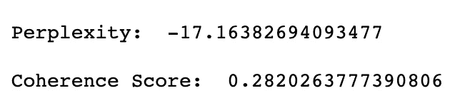

初始 LDA 的一致性分数

## 超参数调谐

为了进一步改进模型，我们正在进行模拟，以获得给**最佳一致性值**的一些主题。从模拟中，我们看到**的最佳主题数是 8** ，这给出了大约 0.41 的相干值。

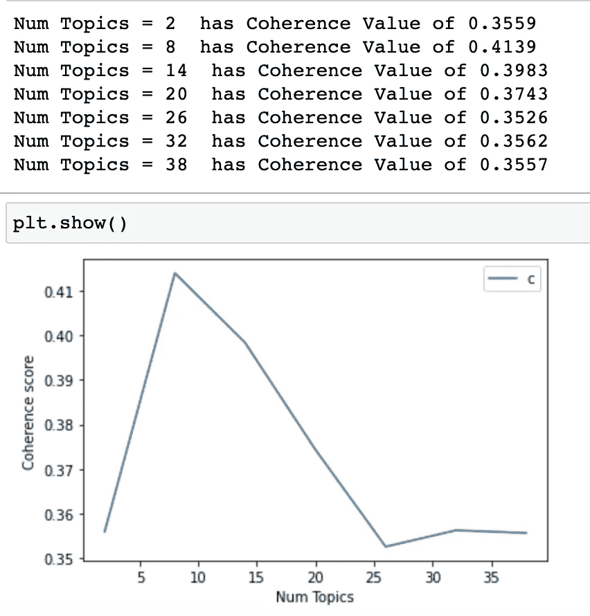

主题的最佳数量

根据这一发现，我们进行了模型再训练(主题的更新数量为 8)，并发现了以下结果。

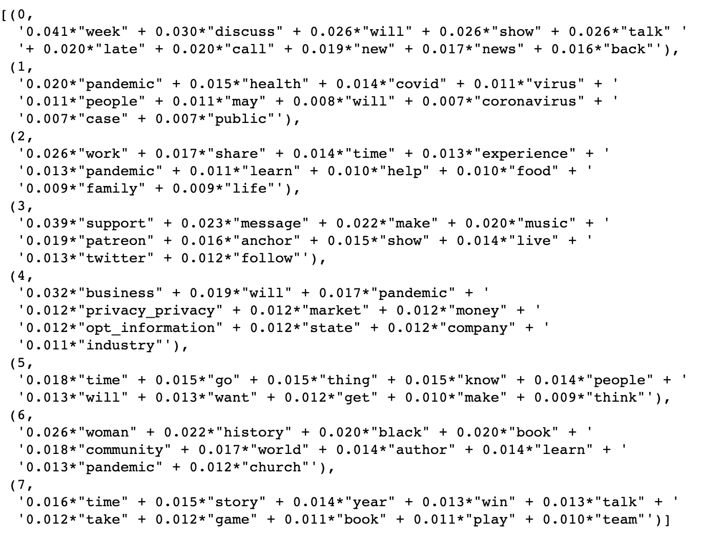

每个主题群的热门主题

对于某些群集，更容易推断出正在讨论的主题。比如在**题目 4** 中，看关键词(商业、金钱、公司、产业)，我们可以推断这里讨论的题目与疫情时代的**经济学**有关。

为了进一步探索，我们可以使用“pyLDAvis”来可视化相关的主题和术语。

```
# Plotting tools
import pyLDAvis
import pyLDAvis.gensim  # don't skip this
import matplotlib.pyplot as plt
%matplotlib inline# Visualize the topics
pyLDAvis.enable_notebook()
vis = pyLDAvis.gensim.prepare(lda_model_2, corpus, id2word)
vis
```

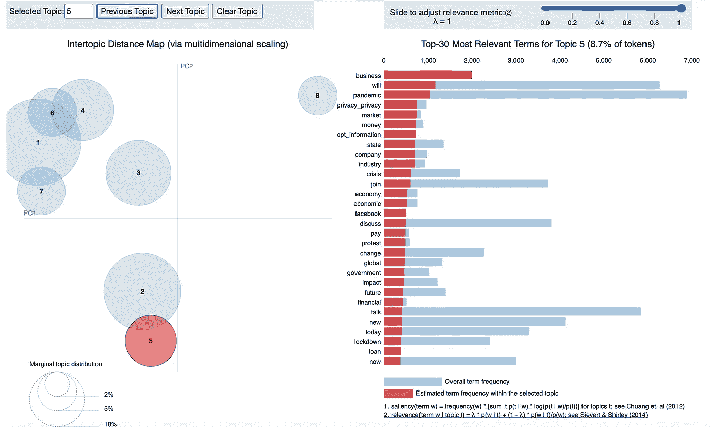

主题 5 的 PyLDAvis 可视化

## 估价

我们可以利用 LDA 可视化，进一步探索每个文档的关键主题，以及主题在文本中的分布。

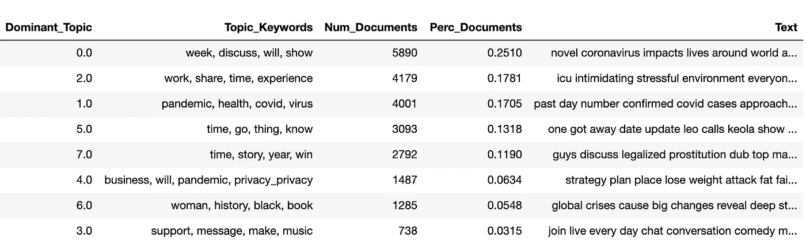

主题在文档中的分布，按出现次数排序

综上所述，我们可以将 Spotify 播客中讨论的主题进一步分类如下。

```
Topic 0 : All/Generic news introduction
Topic 1 : Pandemic case updates
Topic 2 : Personal impact (work, family life)
Topic 3 : Encouragement and support
Topic 4 : Financial impact (business and industry)
Topic 5 : Personal stories (let go, life, love)
Topic 6 : Social implications (crises, strike, history)
Topic 7 : Entertainment (sport, game)
```

有趣的东西，是吧？

# 结论

相当长的探索，在这篇文章中，我们探索了使用 Spotify API 检索具有 Covid 相关主题的播客剧集。我们发现了一些有趣的见解:

*   播客在三月的第一周开始上升，在五月中旬达到高峰，这与美国的 Covid 病例趋势一致
*   大部分都是在**工作日**发布！
*   总集数最高的播客频道:**(布道)****娱乐**(名人脱口秀)**鼓励******
*   ****热门播客剧集话题:**新闻介绍** (25%)，**对个人生活的影响** (18%)，**疫情案件更新** (17%)，**个人故事** (13%)，**娱乐** (11%)，**财务影响** (6%)****

****有兴趣探究并重现这一分析吗？你可以去 [my GitHub](https://github.com/oliviatan29/spotify-podcast-expl) 仓库查看完整的源代码。****