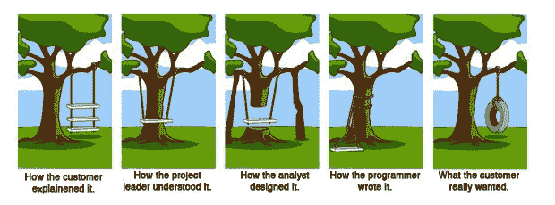

# 有哪些数据工程师大学不学的东西？

> 原文：<https://towardsdatascience.com/what-data-engineers-dont-learn-at-school-e8c10b25e804?source=collection_archive---------38----------------------->

来源:[Matthis(Pexels)的一所学校校园的红色建筑](https://www.pexels.com/photo/red-building-on-a-school-campus-2305098/)

## 我已经做了六年多的数据工程师，我陪过几个初级工程师，每一次都让我想起我的早年。我们都会犯同样的错误，因为有些**核心知识是我们在大学里学不到的。**

# 生产用途管道

在大学，我们通常会有一些持续时间有限的“项目”，因此，我们没有时间去学习如何[将我们的大学项目投入生产](https://devops.com/using-spark-and-jenkins-to-deploy-code-into-hadoop-clusters/)以及如何[监控它们](https://www.anodot.com/blog/etl-monitoring/)或者什么是[热修复](https://medium.com/hard-work/gitflow-release-hotfix-bddee96fc5c3)以及如何做。

我们在现场、实习或我们的第一份工作中学到了所有这些。为了加快学习过程，一个有经验的开发人员可以向初级开发人员传授有助于生产目的的最佳实践。

# 测试

我们在大学学习测试，不同种类的测试和代码设计原则。然而，不知何故，在开始时，很难找到小的可测试代码单元，我们倾向于在比需要的更大的数据集或比需要的更大的代码部分上进行测试。

[找到可以测试的正确代码单元，并以一种易于测试的方式分割代码](https://medium.com/feedzaitech/writing-testable-code-b3201d4538eb)这是可以通过实践和阅读他人的代码来学习的。

# “数据工程”是一个很大的领域

> 数据工程可能意味着**不同的技术**取决于你工作的公司/团队。

在大学，我们正在学习一些数据处理的核心概念。然而，技术的快速发展正迫使大学专注于该领域的某些部分，而将其他部分放在一边。

根据公司和大学的不同，初级数据工程师可能听说过/使用过某些概念。然而，众多的技术使得在选择初级数据工程师时需要妥协，并且需要加深初级数据工程师在多种技术方面的知识。

聚焦一项技术[图片来源](https://www.pexels.com/photo/person-holding-round-framed-mirror-near-tree-at-daytime-979927/) : [詹娜·哈姆拉](https://www.pexels.com/@jenna-hamra-248942?utm_content=attributionCopyText&utm_medium=referral&utm_source=pexels)

# “数据工程”是一个后端角色

数据工程师没有创造任何立即可见的东西，从这个意义上说，他有点像数据角色世界中的后端开发人员**。**如果没有其他数据角色(数据科学家、数据可视化专家、..).

呈现包含数据服务的仪表板或移动应用程序比呈现数据管道更容易。呈现推荐引擎的功能部分比呈现为使其能够处理所有数据而进行的数据优化更容易。

在大学里，由于每个人都在展示他们为一个项目所做的工作，我们不一定能看出区别，但在公司里，这种区别可能是惊人的。在一家公司，这意味着拥有[Maxime Beauchemin](https://medium.com/u/9f4d525c99e2?source=post_page-----e8c10b25e804--------------------------------)在他的[文章](https://medium.com/@maximebeauchemin/the-downfall-of-the-data-engineer-5bfb701e5d6b)中所说的。

[Gif 来源](https://gfycat.com/shrillhelplessavians)

# 沟通很重要

当你开始成为一名开发人员或数据工程师时，你可能会认为沟通不是你工作的核心部分。

然而，这可能比您想象的更重要，因为不沟通意味着做出假设，而做出假设意味着项目没有回答客户的真正问题。

交付客户想要的东西— [图片来源](https://medium.com/@tkamens/can-you-deliver-what-your-customer-wants-7883b96ec495)

此外，我们通过提问学到的东西比我们自己去寻找更多。

# 包装

我选择了这五个核心知识，因为我认为这些领域是我自大学以来学到了很多，初级数据工程师也在努力学习的领域。

如果你想完成我的列表，请不要犹豫在下面评论，希望老师们会阅读这篇文章并相应地调整课程。