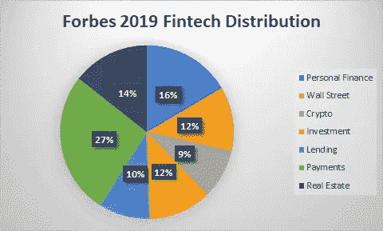

# fintech 公司使用哪些数据资源来帮助他们高效运营？

> 原文：<https://towardsdatascience.com/what-data-resources-are-used-by-fintech-companies-to-help-them-operate-efficiently-baba33cba564?source=collection_archive---------47----------------------->

## 了解金融机构使用的数据管理

卡洛斯·穆扎在 Unsplash 上的照片

要提高任何组织的绩效，数据的作用是不可或缺的。金融科技公司处理正确数据的能力为他们提供了巨大的竞争优势。这是因为人工智能(AI)算法可以处理这些数据，并为(I)更好地分配资源(ii)识别目标客户的人口统计数据(ii)实现客户需求和允许高质量的客户决策提供机会。因此，组织将一部分投资用于数据管理。

然而，有不同类型的[金融科技](/can-ai-facilitate-fintech-algorithm-to-manage-your-finances-2c11a1afec74)公司，包括:*个人金融、华尔街、加密、投资、借贷、支付和房地产*。这些类别中的每一个都需要不同的数据集，这些数据集需要以不同的频率更新。根据 statista.com 的数据，到 2020 年 2 月，金融科技初创公司的数量将增加约 52%。因此，拥有关于*“有用”*数据的知识会让你在同领域的其他创业公司中获得竞争优势。

根据资本启动情况划分的不同金融科技行业[数据来源:2019 年福布斯]

严重依赖数据的大公司或组织的例子有亚马逊、谷歌和 facebook。当用户/客户浏览他们的平台时，他们收集他们的数据。这种普查使他们有优势获得关于他们的目标受众人口统计和他们的兴趣的信息。企业可以很容易地利用这些数据，通过应用人工智能和机器学习(ML)，他们可以创造更好的产品，或许可以改善他们对客户的服务。回归分析和编程也可以预测未来事件。这些最终可以帮助公司提前计划并相应地分配资源。

**数据科学中使用的基本术语**

1.  ***数据量*** :是组织收集和存储的数据量，可用于其开发的 AI 算法的未来处理。

***2。数据速率:*** 数据被处理的速率。有五种不同的数据速度类别。*实时、近实时、批量、定制和分析*。为了获得竞争优势，金融科技公司需要实时或接近实时的数据速度。不过也要看 [fintech](/can-ai-facilitate-fintech-algorithm-to-manage-your-finances-2c11a1afec74) 公司的类别。例如，与华尔街、加密和投资相关的数据需要实时或接近实时地执行，因为该过程涉及到易变因素。然而，支付和贷款公司可以允许 1-2 个工作日来结算任何资金交易。这为避免任何欺诈交易提供了额外的优势。

美国宇航局在 Unsplash 上拍摄的照片

***3。数据多样性:*** 是数据采集和处理过程中所涉及的数据的多样性。例如*复杂系统*很难精确建模和预测。股票价格是这个模型的完美反映。华尔街市场的自发行为会造成价格的突然大幅波动。一个“好消息或一项研究突破”可能导致股价指数级上涨，否则申请破产肯定会对股价不利。

4. ***数据即服务:*** 它涉及通过与数据提供商合作，聚合和提供对更广泛的公共和私有数据的访问。

5. ***分析即服务:*** 它利用高级分析生成预测模型。

# Fintech 公司获取了哪些数据？

照片由[粘土堤](https://unsplash.com/@claybanks?utm_source=unsplash&utm_medium=referral&utm_content=creditCopyText)在[防溅板](/s/photos/fintech-data?utm_source=unsplash&utm_medium=referral&utm_content=creditCopyText)上拍摄

根据 a Schmidt et al. (2018)，数据主要依赖于核心业务模式、关键活动和价值主张。金融科技公司使用消费者提供的数据组合，同时也依赖外部*获取的数据*进行补充。

*支付*金融科技公司通常专注于安全的在线支付解决方案。他们的大多数商业模式通常不要求存储个人客户支付数据，而是使用网上商店的交易数据。他们专注于优化与银行的交易和服务。安全和扫码支付选项是他们的首选，因为他们的收入取决于使用情况。某些支付公司只收取 3%的交易费。因此，对于支付平台来说，关注点从个人客户数据转移到优化和保护交易。

*房地产*金融科技公司专注于处理重要数据，并以可读的格式呈现给用户。他们执行内部描述性分析，以确定任何项目组合的风险回报分析。他们专注于从各种来源获取数据，并将其转换为客户端可读的格式。对于房地产金融科技公司来说，收入既取决于销售额，也取决于客户的使用量。同样，对于房地产，他们的数据的重点是分析和风险管理，以便他们的客户可以做出明智的投资。

*数据量*和*数据速度*在处理*华尔街*金融科技应用时至关重要。仅纽约证券交易所(NYSE)每天就要处理超过万亿字节的数据。同样，外汇市场每天有近 5.1 万亿美元的交易，也需要实时或接近实时的数据。

帕特里克·韦森伯格在 [Unsplash](/@ricktap?utm_source=unsplash&utm_medium=referral&utm_content=creditCopyText) 上拍摄的照片

# 结论

金融科技公司目前面临的最大挑战之一是，他们的数据算法更适合解决技术问题，而不是针对他们的商业解决方案。一些人认为，部分原因是因为大多数数据科学家没有积极参与金融领域，并分享更多的技术观点。这最终导致难以有效地利用这些数据来实现业务增长和改进。尽管如此，该行业仍在大规模增长，自 2019 年以来，截至 2020 年，金融科技初创公司的增长率接近 **52%** ，因此，未来的机会和增长潜力很大。像任何其他组织一样，金融科技公司将通过利用机器学习从高效的数据管理中受益匪浅。

**参考文献**

[1]Ghasemaghaei，M. (2019)。理解大数据对企业绩效的影响:从概念上区分大数据特征的必要性。国际信息管理杂志，102055。

[2]约翰，史派西。(2017 年 11 月 28 日)。5 种数据速度。简单易行。
检索自:[https://simplicable.com/new/data-velocity](https://simplicable.com/new/data-velocity)

[3]约翰·史派西。“数据多样性的 6 个例子。”Simplicable，2017 年 11 月 28 日。网络。接入方式:[https://simplicable.com/new/data-variety](https://simplicable.com/new/data-variety)

[4]J. Q. Trelewicz，“大数据和大资金:数据在金融领域的作用”，载于《IT 专业》第 19 卷第 3 期，2017 年第 8–10 页，doi: 10.1109/MITP.2017.45。