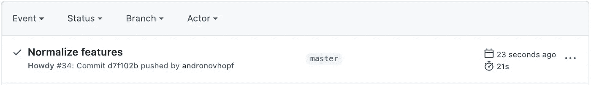

# 科学家需要了解 DevOps 的哪些数据

> 原文：<https://towardsdatascience.com/what-data-scientists-need-to-know-about-devops-2f8bc6660284?source=collection_archive---------17----------------------->

## 使用持续集成(通过 GitHub Actions)构建自动模型训练系统的哲学和实践指南。


独角兽！一个神话般的数据科学家，他可以编码，编写单元测试，并在逻辑回归可以做到的时候抵制深度神经网络的诱惑。由[李中清](https://unsplash.com/@picsbyjameslee)通过 [Unsplash](https://unsplash.com/photos/qSf_4bNsoWc) 拍摄。

随着机器学习(ML)在过去几年的快速发展，开始 ML 实验变得[非常容易。多亏了像](/deep-learning-isnt-hard-anymore-26db0d4749d7) [scikit-learn](https://scikit-learn.org/stable/) 和 [Keras](https://github.com/keras-team/keras) 这样的库，你可以用几行代码制作模型。

但是，将数据科学项目转化为有意义的应用比以往任何时候都更难，比如告知团队决策或成为产品一部分的模型。典型的 ML 项目[涉及如此多不同的技能组合](https://ieeexplore.ieee.org/abstract/document/8804457),对于任何一个人来说，掌握它们都是具有挑战性的，如果不是完全不可能的话——如此困难，罕见的数据科学家也可以开发高质量的软件并扮演工程师，被称为*独角兽*！

随着该领域的成熟，许多工作将需要软件、工程和数学技能的结合。有人说[他们已经](https://www.anaconda.com/state-of-data-science-2020?utm_medium=press&utm_source=anaconda&utm_campaign=sods-2020&utm_content=report)[做](https://tech.trivago.com/2018/12/03/teardown-rebuild-migrating-from-hive-to-pyspark/)。

引用无与伦比的数据科学家/工程师/关键观察家 Vicki Boykis 在她的博客 [*中的话，数据科学现在不同了*](http://veekaybee.github.io/2019/02/13/data-science-is-different/) :

> 越来越清楚的是，在炒作周期的后期，数据科学正逐渐向工程靠拢，数据科学家前进所需的[技能](https://www.youtube.com/watch?v=frQeK8xo9Ls)不再那么可视化和基于统计，而[更符合传统的计算机科学课程](https://tech.trivago.com/2018/12/03/teardown-rebuild-migrating-from-hive-to-pyspark/)。

# **为什么数据科学家需要了解 DevOps**

那么，数据科学家应该学习众多工程和软件技能中的哪一项呢？我赌 DevOps 赢。

DevOps，一个由**开发**和**运营**组成的综合体，于 2009 年[在一次比利时会议](https://en.wikipedia.org/wiki/DevOps#History)上正式诞生。召开这次会议是为了应对科技组织两个方面之间的紧张关系，这两个方面在历史上经历了深刻的分歧。软件开发人员需要快速行动并经常试验，而运营团队优先考虑服务的稳定性和可用性(这些人让服务器日复一日地运行)。他们的目标不仅是对立的，而且是竞争的。

这听起来很像今天的数据科学。数据科学家通过实验创造价值:建模、组合和转换数据的新方法。与此同时，雇用数据科学家的组织因稳定性而受到激励。

这种分歧的后果是深远的:在最新的 Anaconda“数据科学状况”报告中，“不到一半(48%)的受访者认为他们能够展示数据科学对他们组织的影响”。据估计，数据科学家创造的绝大多数模型最终都被束之高阁。对于在创建模型的团队和部署模型的团队之间传递模型，我们还没有很好的实践。数据科学家和实现他们工作的开发人员和工程师拥有完全不同的工具、约束和技能。

DevOps 的出现是为了对抗软件中的这种僵局，回到开发者对操作的时代。这是非常成功的:许多 [团队](https://insights.sei.cmu.edu/devops/2015/02/devops-case-study-amazon-aws.html)已经从每几个月部署一次新代码发展到一天几次*。*既然我们已经有了*机器学习* vs .操作，是时候考虑 MLOps 了——来自 DevOps 的适用于数据科学的原则。

# 引入持续集成

DevOps 既是一种理念，也是一套实践，包括:

1.  尽你所能实现自动化
2.  快速获得关于新想法的反馈
3.  减少工作流程中的手动交接

在一个典型的数据科学项目中，我们可以看到一些应用:

1.  尽你所能实现自动化。 *将重复且可预测的数据处理、模型训练和模型测试部分自动化。*
2.  **快速获得新想法的反馈。** *当您的数据、代码或软件环境发生变化时，请立即在类似生产的环境中对其进行测试(也就是说，在生产环境中，一台具有您预期的依赖性和约束的机器)。*
3.  **减少工作流程中的手动交接。** *尽可能给数据科学家找机会测试自己的模型。不要等到有开发人员时才看到模型在类似生产环境中的表现。*

完成这些目标的标准 DevOps 方法是一种叫做**持续集成** (CI) **的方法。**

要点是，当您更改项目的源代码时(通常，更改是通过 git commits 注册的)，您的软件是自动构建和测试的。每个动作都会引发反馈。CI 经常与 [Git-flow](https://nvie.com/posts/a-successful-git-branching-model/) 一起使用，Git-flow 是一种在 Git 分支上构建新特性的开发架构(需要 Git 复习吗？试试这个。当一个特性分支通过了自动化测试，它就成为了被合并到主分支的候选者。


这是软件开发中持续集成的样子。

有了这个设置，我们就有了自动化——代码变更触发自动构建，然后进行测试。我们有快速反馈，因为我们很快得到测试结果，所以开发人员可以不断迭代他们的代码。因为所有这些都是自动发生的，所以您不需要等待其他人来获得反馈，这样就少了一次交接！

那么我们为什么不在 ML 中使用持续集成呢？一些原因是文化上的，比如数据科学和软件工程社区之间的交叉较少。其他的是技术性的——例如，为了理解模型的性能，您需要查看准确性、特异性和敏感性等指标。你可能会得到数据可视化的帮助，比如混乱矩阵或损失图。所以通过/失败测试不会减少反馈。理解一个模型是否被改进需要一些关于手边问题的领域知识，所以测试结果需要以一种有效的和人类可理解的方式被报告。


这是机器学习项目中持续集成的样子。由数据科学 Doggy 检查。

# 竞争情报系统是如何工作的？

现在我们将变得更加实际。让我们来看看一个典型的 CI 系统是如何工作的。对学习者来说幸运的是，由于 GitHub Actions 和 GitLab CI 等工具，障碍从未如此之低——它们有清晰的图形界面和适合首次用户的优秀文档。由于 GitHub Actions 对于公共项目是完全免费的，我们将在这个例子中使用它。

它是这样工作的:

1.  您创建了一个 GitHub 存储库。您创建了一个名为。github/workflows，在里面，你放置一个特殊的。yaml 文件，其中包含您想要运行的脚本，

```
$ python train.py
```

2.您以某种方式更改项目存储库中的文件，然后 Git 提交更改。然后，推送至您的 GitHub 存储库。

```
**# Create a new git branch for experimenting**
$ git checkout -b "experiment"
$ edit train.py**# git add, commit, and push your changes**
$ git add . && commit -m "Normalized features"
$ git push origin experiment
```

3.只要 GitHub 检测到推送，GitHub 就会部署他们的一台计算机来运行你的. yaml 中的功能。

4.无论函数运行成功与否，GitHub 都会返回一个通知。



在 GitHub 存储库的 Actions 选项卡中找到它。

就是这样！这里真正巧妙的是，你使用 GitHub 的计算机来运行你的代码。您所要做的就是更新您的代码并将更改推送到您的存储库中，工作流就会自动发生。

回到特别节目。我在步骤 1 中提到的 yaml 文件——让我们快速看一下其中一个。它可以有你喜欢的任何名字，只要文件扩展名是。它存储在目录中。github/工作流。这里有一个:

```
# .github/workflows/ci.yamlname: train-my-model
on: [push]jobs:
   run:
      runs-on: [ubuntu-latest]
   steps:
      - uses: actions/checkout@v2
      - name: training
      run: |
       **  pip install -r requirements.txt
         python train.py**
```

有很多正在进行的操作，但大部分操作都是相同的——你可以复制和粘贴这个标准的 GitHub 操作模板，但在“运行”字段中填写你的工作流程。

如果这个文件在您的项目 repo 中，每当 GitHub 检测到您的代码(通过 push 注册)发生变化时，GitHub Actions 将部署一个 Ubuntu runner，并尝试执行您的命令来安装需求并运行 Python 脚本。请注意，您的项目报告中必须有工作流所需的文件——这里是 requirements.txt 和 train.py！

# **获得更好的反馈**

正如我们前面提到的，自动训练很酷，但是以一种容易理解的方式得到结果是很重要的。目前，GitHub Actions 允许你访问跑步者的日志，这是纯文本。


GitHub 操作日志的打印输出示例。

但是理解你的模型的性能是棘手的。模型和数据是高维的，通常表现为非线性——这两样东西没有图片是很难理解的！

我可以向您展示一种将数据放入 CI 循环的方法。在过去的几个月里，我在 Iterative.ai(我们制作[数据版本控制](https://dvc.org))的团队一直在开发一个工具包，以帮助将 GitHub Actions 和 GitLab CI 用于机器学习项目。它叫做[连续机器学习](http://cml.dev)(简称 CML)，而且是开源免费的。

从“让我们使用 GitHub 动作来训练 ML 模型”的基本思想出发，我们构建了一些函数来给出比通过/失败通知更详细的报告。CML 帮助您将图像和表格放入报告中，就像 SciKit-learn 生成的这个混淆矩阵:


当您在 GitHub 中发出拉取请求时，会出现此报告！

为了制作这个报告，我们的 GitHub 操作执行了一个 Python 模型训练脚本，然后使用 CML 函数将我们的模型准确性和混淆矩阵写入一个 markdown 文档。然后 CML 把 markdown 文档传给了 GitHub。

我们的修订版。yaml 文件包含以下工作流(新添加的行以粗体显示以示强调):

```
name: train-my-model 
on: [push] 
jobs:  
   run:    
      runs-on: [ubuntu-latest]    
      **container: docker://dvcorg/cml-py3:latest**     
      steps:      
      - uses: actions/checkout@v2       
      - name: training        
        **env:  **        
           **repo_token: ${{ secrets.GITHUB_TOKEN }} **  
        run: |      

           # train.py outputs metrics.txt and confusion_matrix.png  
           pip3 install -r requirements.txt          
           python train.py                    

           # copy the contents of metrics.txt to our markdown report
           **cat metrics.txt >> report.md** # add our confusion matrix to report.md **cml-publish confusion_matrix.png --md >> report.md**            # send the report to GitHub for display  
           **cml-send-comment report.md**
```

你可以在这里看到整个[项目库](https://github.com/iterative/cml_base_case)。注意我们的。yaml 现在包含了更多的配置细节，比如一个特殊的 Docker 容器和一个环境变量，以及一些需要运行的新代码。容器和环境变量细节在每个 CML 项目中都是标准的，不是用户需要操作的东西，所以把注意力放在代码上！

通过将这些 CML 功能添加到工作流程中，我们在 CI 系统中创建了一个更完整的反馈回路:

1.  创建一个 Git 分支，并在该分支上更改您的代码。
2.  自动训练模型并生成度量(准确性)和可视化(混淆矩阵)。
3.  将这些结果嵌入到您的拉取请求的可视报告中。

现在，当您和您的团队决定您的变更是否对您的建模目标有积极的影响时，您有一个各种各样的仪表板要回顾。此外，Git 将该报告链接到您的确切项目版本(数据和代码)以及用于培训的运行人员和该运行的日志。非常彻底！不再有图形在你的工作空间中浮动，这些图形很久以前就与你的代码失去了联系！

这就是 CI 在数据科学项目中的基本理念。明确地说，这个例子是使用 CI 最简单的方法之一。在现实生活中，您可能会遇到更复杂的场景。CML 还有一些功能，可以帮助你使用存储在 GitHub 存储库之外的大型数据集(使用 [DVC](https://dvc.org) )并在云实例上训练，而不是默认的 GitHub Actions 运行器。这意味着你可以使用 GPU 和其他专门的设置。

例如，我用 GitHub Actions 做了一个项目[部署一个 EC2 GPU，然后训练一个神经风格传输模型](https://github.com/iterative/cml_cloud_case)。这是我的慢性粒细胞白血病报告:


查看我在 https://github.com/iterative/cml_cloud_case 的 GitHub 项目资源库

您也可以使用您自己的 Docker 容器，这样您就可以在生产中模拟模型的环境。将来我会写更多关于这些高级用例的博客。

# 关于 ML CI 的最后思考

总结一下我们到目前为止所说的:

DevOps 不是一种特定的技术，而是一种哲学，一套从根本上重构软件开发的*过程*的原则和实践。它是有效的，因为它解决了团队如何工作和试验新代码的系统瓶颈。

随着数据科学在未来几年的成熟，理解如何将 DevOps 原则应用到他们的机器学习项目中的人将是一个有价值的商品——无论是从工资还是他们的组织影响来看。持续集成是 DevOps 的主要内容，也是为团队建立可靠的自动化、快速测试和自治文化的最有效的方法之一。

CI 可以用 GitHub Actions 或者 GitLab CI 这样的系统来实现，你可以用这些服务来构建自动化的模型训练系统。好处很多:

1.  您的代码、数据、模型和培训基础设施(硬件和软件环境)都是 Git 版本。
2.  您正在自动化工作，频繁地测试并获得快速的反馈(如果您使用 CML，还有可视化的报告)。从长远来看，这几乎肯定会加速你的项目的开发。
3.  CI 系统让团队中的每个人都能看到你的工作。没有人需要非常努力地寻找代码、数据和模型。

我保证，一旦您进入最佳状态，让您的模型训练、记录和报告由一个 git commit 自动启动将会非常有趣。

你会觉得*好酷*。

做独角兽！

# 进一步阅读

*   [持续集成](https://www.martinfowler.com/articles/continuousIntegration.html)，马丁·福勒关于这个主题的开创性博客
*   机器学习的持续交付(Continuous Delivery for Machine Learning)，Martin Fowler 网站上的另一个优秀博客，关于为 ML 构建持续集成&持续交付系统
*   [devo PS 手册](https://www.amazon.com/DevOps-Handbook-World-Class-Reliability-Organizations-ebook/dp/B01M9ASFQ3)，一本深受喜爱的指南，被推荐给几乎任何组织(ML、软件或其他)