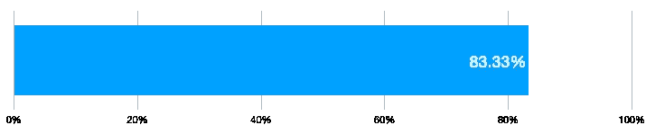
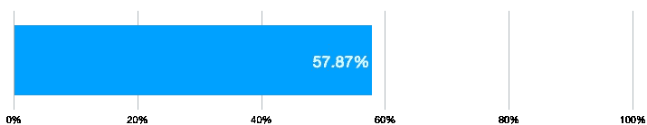
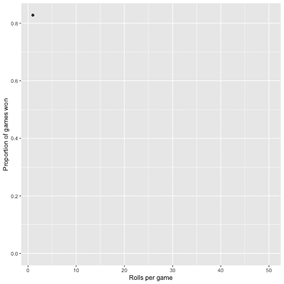
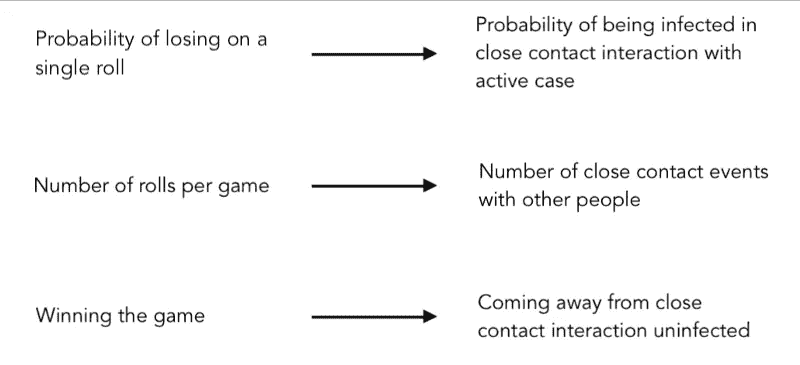

# 模拟 50，000 个游戏为社交距离提供了一个案例

> 原文：<https://towardsdatascience.com/what-dice-can-tell-us-about-the-spread-of-disease-f44ba9cf3fb?source=collection_archive---------72----------------------->

## 骰子能告诉我们关于疾病传播的什么

艺术由 [Giphy](https://giphy.com) 上的 [CmdrKitten](https://giphy.com/cmdrkitten) 创作

统计和概率构成了大多数预测模型的基础。在这里，我们在骰子游戏的概率和传染病的传播之间画出了平行线。对 50，000 个游戏的模拟证明了社交距离的存在。

# 骰子

让我们玩一个简单的骰子游戏。规则是:

*   滚动单个骰子
*   如果骰子落在 1 上，你输 100
*   如果它落在任何其他数字上，你就赢 100

照片由[乔纳森·彼得森](https://unsplash.com/@grizzlybear?utm_source=medium&utm_medium=referral)在 [Unsplash](https://unsplash.com?utm_source=medium&utm_medium=referral) 上拍摄

有了这个设置，你有 5/6 的机会赢得每场比赛。这是很好的机会。如果你玩这个游戏 100 次，你会得到大约 6667 英镑的利润。

**每局获胜的概率**

现在，让我们对规则做一个小小的修改。

## 第二场

*   滚动单个模具**三次**
*   如果它落在任何一局的 1 **上，你将失去 100**
*   如果它落在每局中的任何其他数字**上，你赢得 100**

现在每场比赛有三个卷。每一次掷骰的概率保持不变。但是，每场比赛获胜的概率已经从 83%下降到 57%。玩这个游戏 100 次，你可以预期只赚 1574 左右。

**三掷获胜的概率**

## **游戏 N**

随着我们增加赢得每场游戏所需的掷骰数，即使每次掷骰的赔率仍然对你有利，赢的机会也会迅速减少。让我们称每场比赛的掷数为 **N** 。

在这里，我们运行一个[蒙特卡罗实验](https://en.wikipedia.org/wiki/Monte_Carlo_method)，针对 **N** 的每个值模拟 1000 个随机游戏。前一千场游戏需要掷一次才能赢，接下来的一千场游戏需要掷两次，依此类推，每场游戏最多掷 50 次。在每一组游戏之后，我们绘制出每一个 **N.** 值的游戏获胜比例

蒙特卡洛模拟结果——赢的游戏占每场游戏掷骰数的比例。这里的代码[是](https://github.com/AymanBari/dice_monte_carlo_sim)。

> 虽然每次掷骰的赔率对你有利，但随着每场游戏掷骰数的增加，赢得游戏的赔率会下降。

# 疾病

在之前的一篇文章中，我们介绍了传染病模型中的*传播率的概念。*

* [## 新冠肺炎什么时候会达到顶峰？

### 房室模型日常指南

towardsdatascience.com](/when-will-covid-19-peak-96a41939ac33) 

我们用传染率来模拟疾病的传播。这包括两个部分:

1.  *传染性*——与活跃病例密切接触后被感染的概率
2.  *接触率* —一个人与群体中其他人互动的频率

我们可以在传染病的传播和我们掷骰子游戏的组成部分之间找到相似之处。

我们的骰子游戏模拟显示了我们掷骰子越多，赢得游戏的几率是如何下降的。在这种情况下，获胜意味着在没有感染疾病的情况下离开互动。*保持其他变量不变*，我们离家越频繁，与他人接触越频繁，返回时未受感染的几率就越低。* 

****编者按:*** [*走向数据科学*](http://towardsdatascience.com/) *是一份以数据科学和机器学习研究为主的中型刊物。我们不是健康专家或流行病学家，本文的观点不应被解释为专业建议。想了解更多关于疫情冠状病毒的信息，可以点击* [*这里*](https://www.who.int/emergencies/diseases/novel-coronavirus-2019/situation-reports) *。**