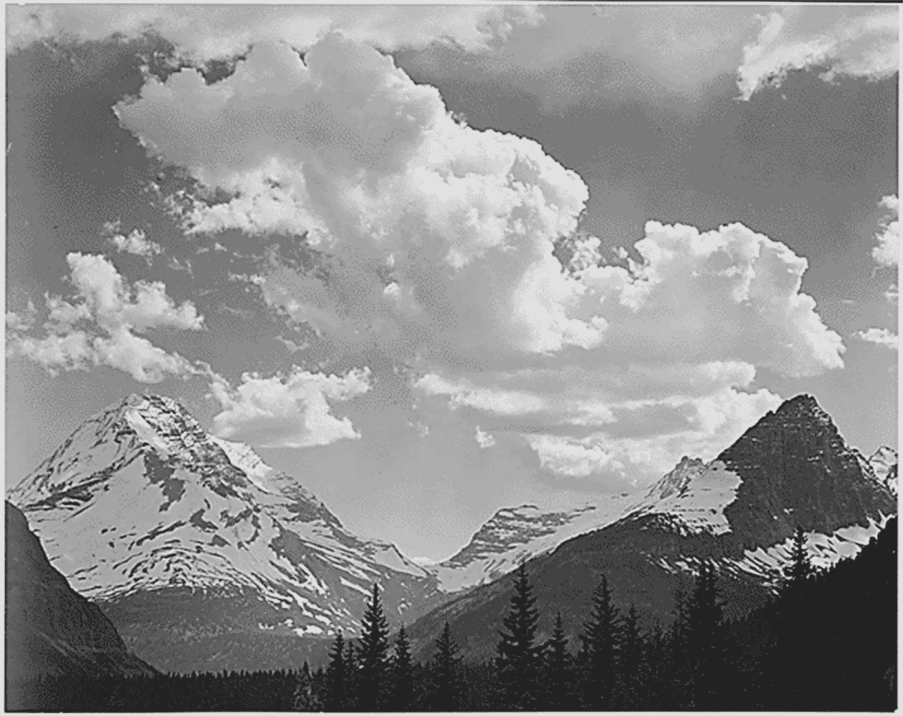
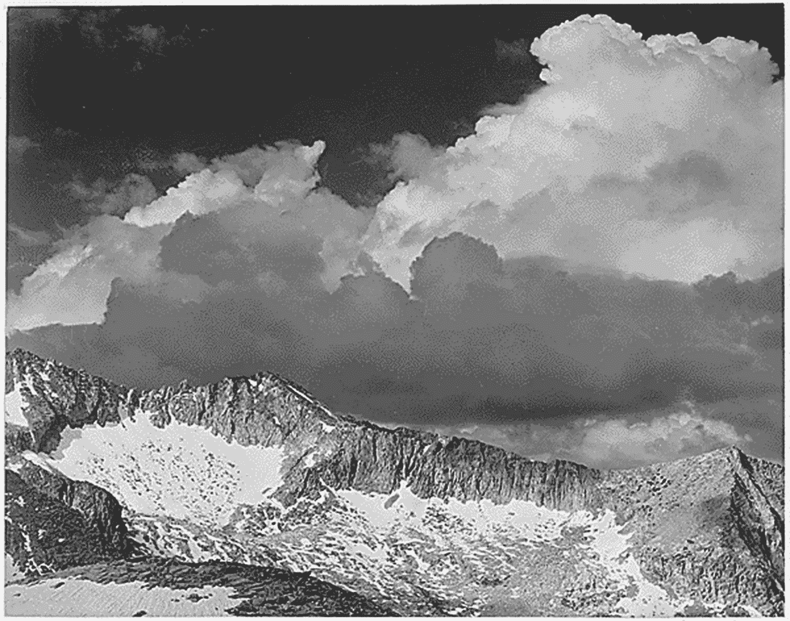
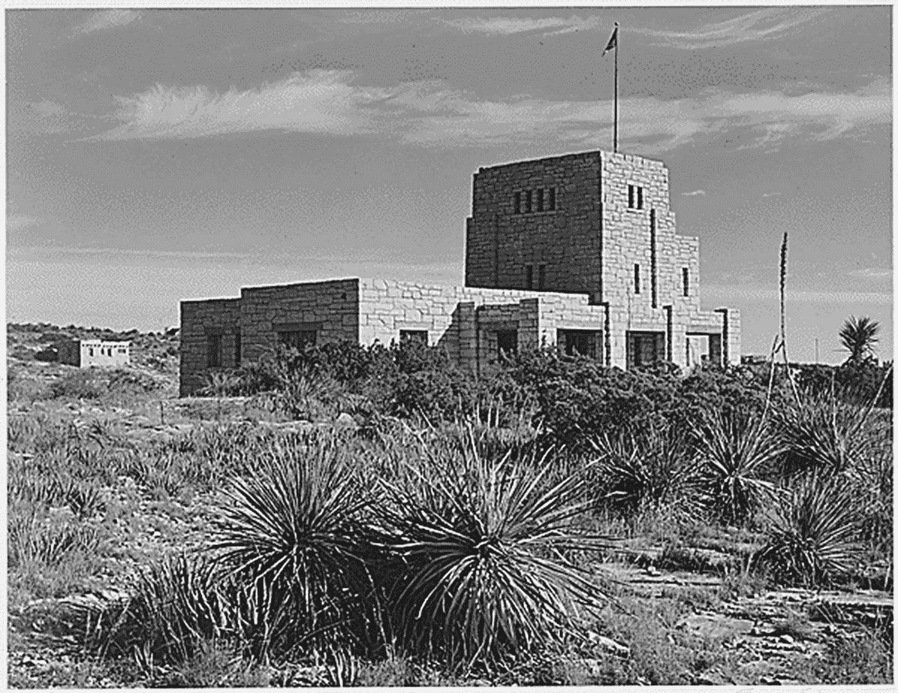
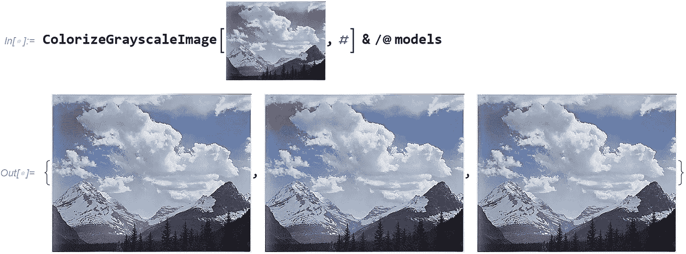
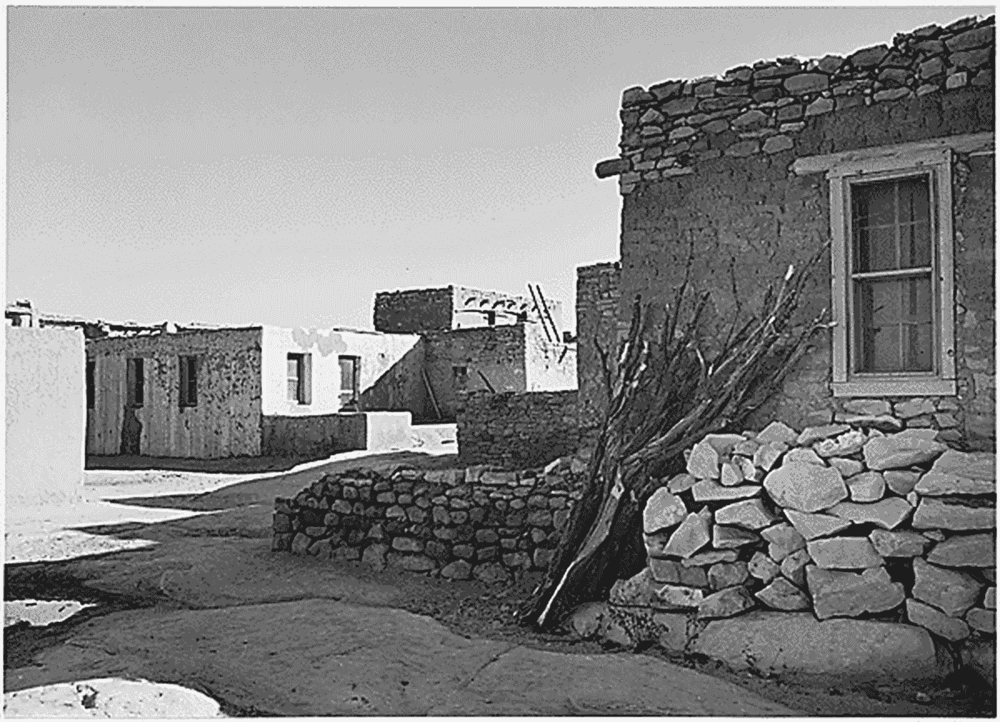
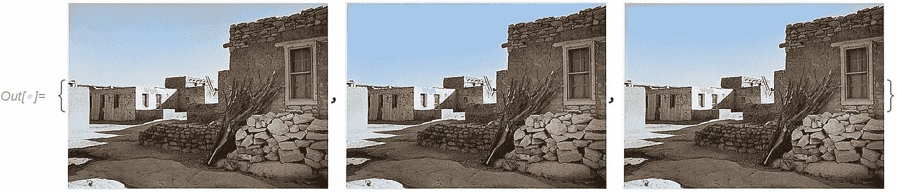
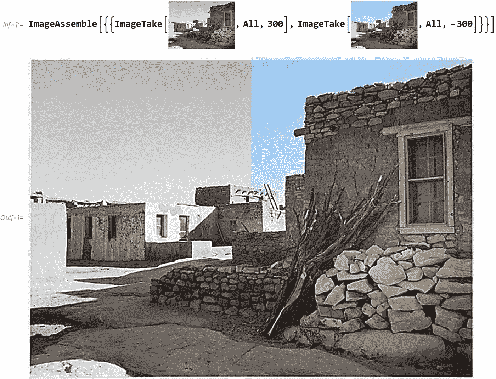
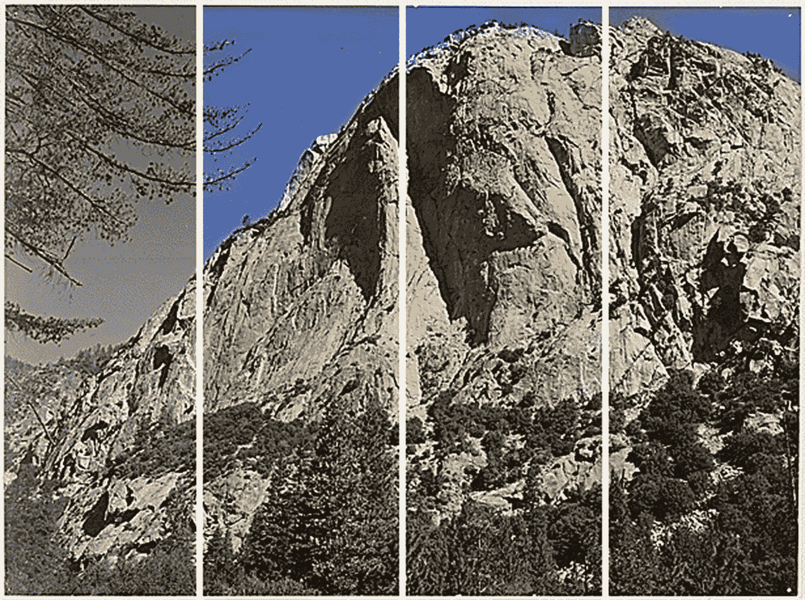
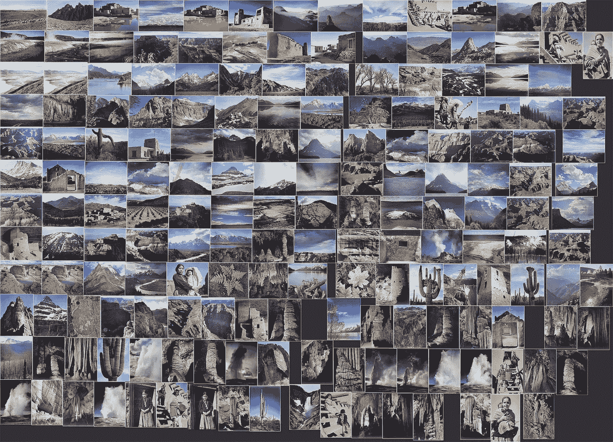
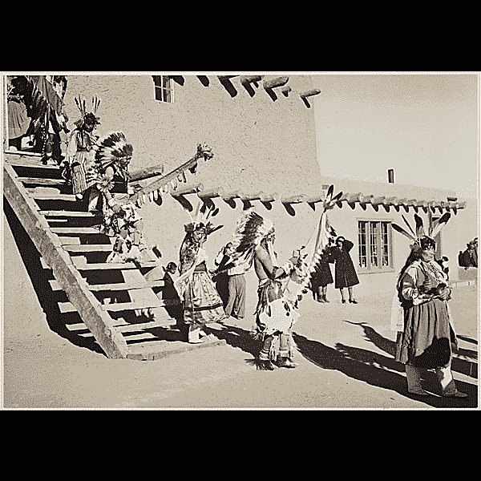

# 安塞尔·亚当斯的标志性图像在全彩色下是什么样的？

> 原文：<https://towardsdatascience.com/what-do-ansel-adams-iconic-images-look-like-in-full-color-b70914ec6faf?source=collection_archive---------57----------------------->

## 一个带有少量 Wolfram 语言的计算思维故事



安塞尔·亚当斯为国家公园管理局拍摄的图片(公共领域)

我一直最喜欢的摄影师之一是安塞尔·亚当斯。也许是因为我出生在黑白摄影时代接近尾声的时候？我最早的婴儿照片都是黑白的。

亚当斯对西部的全面描绘简直令人叹为观止。虽然他最出名的是他的黑白摄影，但他也大量使用彩色图像。

1941 年，国家公园管理局委托亚当斯为 DC 华盛顿州内政部大楼的一幅壁画创作照片。为这个项目拍摄的 226 张照片仍然可以从国家档案馆获得，并被放在公共领域。



安塞尔·亚当斯为国家公园管理局拍摄的图片(公共领域)

尽管亚当斯偏爱黑白摄影，但他拍摄的照片来自一个非常丰富多彩的世界。我看到过一些旧的黑白照片，它们被彩色化后的效果非常有趣。通常，一张似乎来自遥远过去的照片会变得更有关联。我想知道如果我从国家档案馆拿走照片并给它们上色，是否会发生同样的事情。



安塞尔·亚当斯为国家公园管理局拍摄的图片(公共领域)

从给图像着色开始，我们需要一个算法或函数来猜测每个灰度像素的最佳颜色。这可以通过观察大量彩色图像的例子并推断周围颜色值如何决定单个像素的颜色来确定。

对于神经网络来说，这是一项伟大的任务，事实上，许多这样的预训练神经网络已经存在。Wolfram 语言有一个非常好的神经网络库，包括可以进行 T2 图像着色的神经网络库。


(图片由作者提供)

有三种型号可供选择。两个基于“ColorNet 图像着色”神经网络，一个主要在地点图像上训练，另一个在标准 ImageNet 竞争数据集上训练。第三个神经网络“彩色图像着色”也是在标准 ImageNet 数据上训练的。

为了更容易地比较三个神经网络的性能，我编写了一个函数，它接受一个图像和三个神经网络模型中的一个:

```
ColorizeGrayscaleImage[image, model]
```

这三种模式是:

```
models = {
"ColorNet Image Colorization Trained on ImageNet Competition Data",
"Colorful Image Colorization Trained on ImageNet Competition Data",
"ColorNet Image Colorization Trained on Places Data"
}
```

首先，让我们使用顶部的图像来比较这三种模型。请注意，在 Wolfram notebook 界面中，您可以非常容易地将图像作为代码的一部分。那太方便了！



(图片由作者提供)

从输出中可以清楚地看到，输出中的第二个图像在左上角有一些红色的伪像，因此很明显，该模型在这里的表现不好。

让我们来看另一张图片:



安塞尔·亚当斯为国家公园管理局拍摄的图片(公共领域)

这一次，第二个模型实际上表现得相当好:



图片由作者提供，基于安塞尔·亚当斯为国家公园管理局(公共领域)所做的工作

这里并排显示了两种不同的版本:



图片由作者提供，基于安塞尔·亚当斯为国家公园管理局(公共领域)所做的工作

这是另一个图像，原始图像和三个彩色版本并排显示:



图片由作者提供，基于安塞尔·亚当斯为国家公园管理局(公共领域)所做的工作

还有更多的图像供你玩。你可以用这个 Wolfram Cloud 笔记本或者使用本文末尾的代码来完成。

最后，这里是一个使用整个档案的图像拼贴。尽情享受吧！🌄



图片由作者提供，基于安塞尔·亚当斯为国家公园管理局(公共领域)所做的工作



作者的图像动画，基于安塞尔·亚当斯为国家公园管理局(公共领域)所做的工作