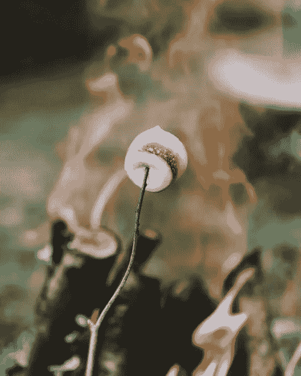

# 棉花糖和机器学习有什么共同点？

> 原文：<https://towardsdatascience.com/what-do-marshmallows-and-machine-learning-have-in-common-34e8ee9447e?source=collection_archive---------30----------------------->

## 直观地看待强化学习

在 2010 年的 TED 舞台上，汤姆·伍杰克介绍了[“棉花糖实验”。这个实验包括二十根意大利面条、一码胶带、一码细绳和一个棉花糖。根据这些材料，参与者被告知他们有 18 分钟的时间来建造他们能建造的最大的独立结构。只有当它成功地将棉花糖放在上面时，这个结构才被认为是完整的。他已经在不同的人群中完成了数百次这个实验。从 MBA 毕业生到幼儿园应届毕业生；每个小组处理问题的方式都有所不同。](https://www.ted.com/talks/tom_wujec_build_a_tower/transcript?language=en)

MBA 们将花一些时间组织自己，并为权力进行谈判。他们将花时间思考，草拟计划，并最终开始建造这座塔。他们把它堆起来，直到时间快到了，最后把棉花糖放在上面。他们退后一步，欣赏自己的作品，最终的结果往往是塔在棉花糖的重压下摇摇欲坠。

幼儿园的学生完成任务完全不同。他们不花任何时间计划，并立即开始工作和建设。不过，两种策略的关键区别在于，在整个实验过程中，棉花糖会不断地放在塔上。5 岁的孩子一点点建造塔，放置棉花糖，获得反馈(塔是否倒了)，并从那里继续迭代和建造。这导致幼儿园的学生比 MBA 毕业生平均多建了两倍的高楼。

现在我知道你在想什么，这和机器学习有什么关系？过去的博客描述了[监督机器学习](https://medium.com/@mitchell.johnstone123/why-ai-and-machine-learning-arent-the-same-thing-6f98ff7e38dd?source=friends_link&sk=7c6aeef96e0fca2c36b9e80ae9ce2665)和[非监督机器学习](https://medium.com/@mitchell.johnstone123/how-an-understanding-of-machine-learning-helps-craft-better-strategy-80907cfe4e0f?source=friends_link&sk=47658315aaf9b1bbe320357c48c10cb1)，而这个故事旨在说明**强化机器学习**的概念以及计算机如何使用反馈来学习。

在强化学习中，工程师将把游戏的“规则”编入计算机。在这种情况下，他们会对物品的类型、重力规则、意大利面的承重能力、棉花糖的重量等进行编程。一旦规则被编程，工程师们就可以编程反馈，让计算机“奖励”更高的塔。然后，计算机执行游戏的几次迭代，并学习所有项目的最佳路径和配置，以获得最高奖励。把计算机想象成模仿幼儿园的学生，他们尝试一次迭代，放置棉花糖，得到反馈，然后重新配置他们的结构。

最近一个成功实现强化学习的例子发生在 2017 年，当时一台计算机[被编程为学习‘GO’](https://en.wikipedia.org/wiki/AlphaGo)。围棋比国际象棋更复杂，有数百万种可能的走法组合。该程序能够击败世界冠军柯洁，标志着强化学习向前迈出了一大步。

强化学习是人工智能最令人兴奋和革命性的例子之一。当您试图在一个具有清晰规则和可定义为“成功”或“失败”的最终状态的环境中确定一组最佳行动时，这是最有用的。商业案例包括:

*   无人驾驶汽车
*   优化投资组合交易策略
*   使用机器人在仓库里重新进货和挑选存货

当公司能够概念化和理解强化学习时，他们就从像其他类型的机器学习那样简单地预测转向优化能力。当竞争对手的 MBA 们在争权夺利、制定计划、看着他们的塔在棉花糖的重压下倒塌时，那些实施强化学习的人已经打印出了最高最坚固的塔的蓝图。