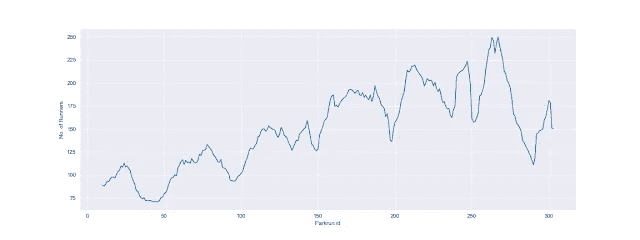
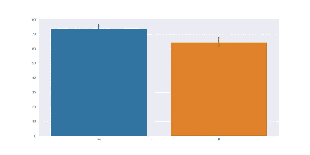
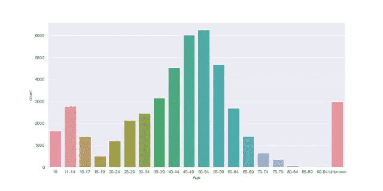
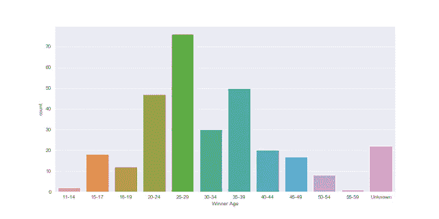
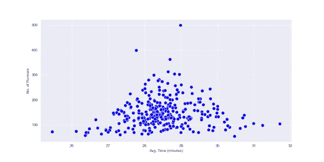

# 关于我的本地 Parkrun，这些数字说明了什么？

> 原文：<https://towardsdatascience.com/what-do-the-numbers-say-about-my-local-parkrun-4ca52002e19c?source=collection_archive---------53----------------------->

## 浅析凯西克公园及其参与者

在我的第一篇博客中，我决定看看我们都热爱和珍惜的东西——我在当地的公园跑步。

本周六早间机构产生了大量的数据。我试图检索(主观上)最有趣的数字，以下是我的发现。所以，让我给你展示一下你每周跑 5 公里的来龙去脉。

在我们继续之前，有一件事需要澄清。Parkrun 需要你有自己唯一的条形码来记录你的时间。如果您无法出示条形码，您完成的职位将被填写为“未知”，并且不会为此职位分配时间。

为了分析的目的，如果获胜者是这样的 John Doe，我使用已知最快的时间作为获胜时间(而获胜者的首字母仍然是“未知”)。

到目前为止，在凯西克已经举行了 303 场跑步比赛，在 2019 年的新年跑步比赛中，跑步者的人数少至 54 人，多至 500 人。

由于凯西克是一个旅游和季节性很强的城市，我预计每 52 场比赛就会周期性地出现明显的高峰和低谷，虽然季节性不像我认为的那样明显，但从滚动平均值来看，模式很明显:夏季高，冬季低，圣诞和新年公园跑步越来越受欢迎。

平均每周有 149 名选手冲过终点线，其中有 65 名女士和 74 名男士。如果你搞不清楚 65 + 74 = 149 是怎么回事，那是因为它没有。剩下的 10 个解释了那些神秘的没有条形码的跑步者。

然而，女性在数量上击败男性并不罕见，因为在 303 次跑步中，这种情况发生了 51 次。当 79 名女性只有 51 名男性陪伴时，最有影响力的表演出现了。

平均每周有 22 名跑步者打破他们的个人最好成绩，7 名 speedos 跑完 20 分钟。

男性和女性的年龄分布相当相似，Parkrun 似乎很受 40 岁以上人群的欢迎。

大多数参赛的男性年龄在 50-54 岁之间(其次是 45-49 岁和 55-59 岁)。对于女士来说，这是 45-49(其次是 50-54 和 40-44)。请注意，这些不是唯一的条目，所以如果有人输入了所有的跑步记录，它们将被计数 303 次。

约翰·m 已经完成了 44 次 90-94 级别的比赛。

如果你的目标是在比赛的前半段完成，你应该把时间定在 27:37 以上，这样你就能在一次普通的跑步中到达终点。

然而，如果你想赢，你应该让你的腿加速，目标是 17:44。当然，这可能还不够，因为记录是 15:29(萨姆·斯)。

迄今为止，该赛事已有 5 次由女性获得冠军(罗茜·s、莎拉·t、海莉·c、丽贝卡·r 和艾米丽·r)。

虽然样本很小，但女士的获胜时间平均比男士慢半分钟:18:11 比 17:38。

11-14 岁年龄组的选手(Nathan S .和 Robin R .)和 55-59 岁年龄组的选手(Greg P .)分别两次赢得这项赛事的冠军。

31 名运动员不止一次赢得凯西克公园赛跑冠军，三大冠军是萨姆·s(42 次获胜)、马克·l(31 次)和卡尔·b(13 次)。

凯西克公园路最近改变了场地，从一个风景优美的沿河来回砾石路，双向都有多汁的爬坡，变成了当地公园里平坦的柏油路。

通过查阅档案，我估计这种变化发生在事件#274 之后。

奇怪的是，整体平均时间在改变后慢了 21 秒，然而获胜时间却提高了 22 秒。

我问自己的一个问题是，参加的人数是否对平均完成时间有影响。

我在这里的想法是，跑步者越多的公园跑步平均速度会越慢，因为参加人数较少的项目主要由准备好迎接恶劣天气的铁杆运动员组成。然而，当我看一张跑步者人数与平均时间的对比图时，发现跑步者多的项目往往更一般！

你可以清楚地看到，虽然安静的活动往往是双向的(更快和更慢)，但更多参与的活动往往倾向于平均结束时间(28:30)。

注意最上面，有 500 名跑步者参加的大型新年派对平均时间为 28:59——睡了 3 个小时还不错，不是吗？

最后但同样重要的是，没有冲刺跑的比赛是什么样的友好比赛。为了周六早上的聚会，我查看了前两个已知时间的差异。

如果差距是 2 秒或更少，我把它归类为“冲刺结束”。
在 303 个项目中，这种情况发生了 35 次，其中 19 次是差距小于 1 秒的“超级冲刺”。

如果凯西克的跑步爱好者想要引起国际媒体的关注，他们可能需要在这方面努力。

用于此分析的代码可在 https://github.com/KrystofMeier/parkrun 的[找到](https://github.com/KrystofMeier/parkrun)

*原载于***。**