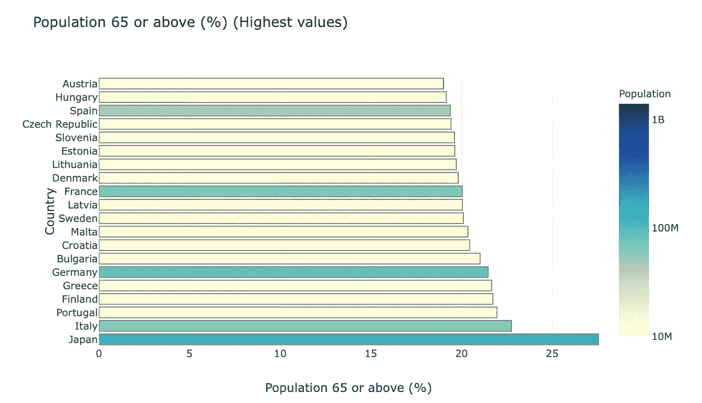
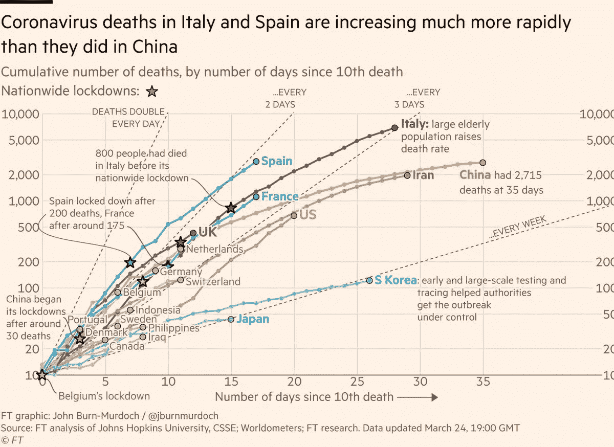

# 各个国家的医疗保健能力是什么样的？

> 原文：<https://towardsdatascience.com/what-do-various-countries-healthcare-capacities-look-like-1581896a0601?source=collection_archive---------2----------------------->

## [变更数据](https://towardsdatascience.com/tagged/data-for-change)

## 鉴于冠状病毒(新冠肺炎)，按国家可视化和比较医疗保健数据和指标。

增长率与产能的对比(仪表板[链接](https://hosp-cap-data.herokuapp.com)

对于我们许多人来说，在世界应对新冠肺炎疫情期间，我们的生活暂时停滞不前。

对许多国家来说，3 月是一个转折点，新冠肺炎镇压措施的实施大幅增加。其原因是看到了一些国家发生的事情，以及来自建模的可怕警告。

《T4 时报》写道，如果不采取控制措施，到五月底，美国每天将有 50 万新病例。

*新增病例 50 万例。一天之内。就在美国。*

即使采取“一些”控制措施，到 6 月底，每天仍可能出现 30 万个新病例。一线希望是，这种未来并不是一成不变的。[例如，本文](https://www.imperial.ac.uk/media/imperial-college/medicine/sph/ide/gida-fellowships/Imperial-College-COVID19-NPI-modelling-16-03-2020.pdf)概述了社交距离和其他“抑制”措施可以产生巨大的影响。所以我一直这样做——呆在室内。很多。比如经常被软禁。

[在](https://unsplash.com/@perloov?utm_source=unsplash&utm_medium=referral&utm_content=creditCopyText) [Unsplash](https://unsplash.com/s/photos/home-alone?utm_source=unsplash&utm_medium=referral&utm_content=creditCopyText) 上按键拍照

在家里度过的这段时间也给了我一点思考和阅读的时间，鉴于时代的现状，最近的许多阅读材料都与疫情有关。(谁知道病毒这么有趣！)

我也开始想知道不同国家处理这个问题的能力会是什么样的。

你看，像现在的许多人一样，我有一个全球性的家庭和朋友网络。我特别的一个横跨韩国、澳大利亚、美国、英国和新西兰。

所以我决定研究世界各地的医疗保健统计数据，一件事导致了另一件事。你知道是怎么回事。在我意识到之前，我正在汇编数据，并把它们放到一个在线仪表板上。

结果证明这是一个有趣的练习。我学到了很多关于医疗保健能力、老年和弱势人口规模以及经济能力的差异和关系。此外，我还做了一个粗略的模拟，模拟了系统被需求淹没需要多长时间，尤其是在需求呈几何级增长的情况下。

非常明确地说，我不是健康或政策专家，对这两方面也知之甚少。这篇文章只是我出于好奇，在观看*网飞*和*迪士尼+* 之间，把数据放在一起，想知道当我们到达那里时，常态可能会变成什么样。

# 数据源和分析

我已经从[世界银行开放数据](https://data.worldbank.org)项目获得了数据，他们声明他们的使命是提供免费和开放的全球发展数据。

并非所有年份的所有数据都是可用的——但我在这里收集了最新的可用数据，而且只是最近 10 年的数据。在剔除了我找不到太多数据的国家之后，我最终收集了 155 个国家的信息——大到中国，小到安提瓜和巴布达。

# 数据

## 医疗保健支出

每个系统的人均医疗支出是多少？我认为这些数字表明了购买药物和设备的能力(尽管没有考虑每个国家不同的费用)。

155 个国家可能太多了，无法显示在一张图表上，所以我将数据集中值最高的 20 个国家的数据绘制出来。

人均医疗保健支出(最高值)—数据来源:[worldbank.org](https://data.worldbank.org/indicator/SH.XPD.CHEX.PC.CD)

相比之下，这是人口最多的 20 个国家。

人均医疗保健支出(最大人群)——数据来源:[worldbank.org](https://data.worldbank.org/indicator/SH.XPD.CHEX.PC.CD)

资源的不平等非常明显。

鉴于资源的这种差异，以及新冠肺炎是一种呼吸系统疾病这一事实令人担忧。例如，媒体广泛报道许多患者需要机械呼吸机支持——不太富裕的国家如何负担得起？

让我们来看看其他一些措施。

## 65 岁或以上人口的百分比

像许多其他疾病一样，年龄似乎是你易患这种疾病的一个因素。这是 65 岁或以上人口的百分比，作为年龄分布的一个指标。

65 岁以上人口的百分比(最大人口数)——数据来源:[worldbank.org](https://data.worldbank.org/indicator/SP.POP.65UP.TO.ZS)

有趣的是，日本的老年人口比例非常高，法国和德国也是如此。我们可以根据这一指标绘制出排名前 20 位的国家。

65 岁以上人口的百分比(最大人口数)——数据来源:[worldbank.org](https://data.worldbank.org/indicator/SP.POP.65UP.TO.ZS)

有趣的是，在日本之后，这份名单似乎被欧洲国家占据了。如果这是最脆弱人口规模的指标，医疗保健系统的能力是否与这一指标相关？

## 每人医院床位

平坦曲线的一个关键论点是防止医疗保健系统负担过重。卫生保健系统能力的一个代表是 T2 人均医院床位数。让我们再来看看那些人口最多的国家的数据。

每千人医院床位数—数据来源:【worldbank.org 

有趣的是，日本也是这一类别的领导者，因为他们有 65 岁以上的人口规模。排名靠前的国家与我们在上面的图表中看到的相似。

这是否意味着这两个指标有很好的相关性？

## 与医院病床数量的相关性

是，也不是。看看下面的图表。

相关性——65 岁或以上人口规模与医院床位数量

对于大国来说，似乎有很好的相关性，但看看右下角 65 岁以上人口较少的点群。在该集群中存在相当大的医院床位数分布，表明相关性较低。

一般来说，可以在下面找到更好的相关性——与人均医疗保健支出的相关性。

相关性——医疗保健支出与医院床位数

一般来说，人均医疗保健支出似乎是人均医院床位数的一个更好的预测指标。也就是除了那些 65+人口占 10%左右(或者更高)的情况。

## 医生人数

这是医院的基础设施能力。但是那些可能需要照顾病人的人员呢？以下是每 1000 人中医生比例最高的国家:

每 1000 人医师数(最高值)[世界银行](https://data.worldbank.org/indicator/SH.MED.PHYS.ZS)

古巴遥遥领先于此。那真的很有趣。正如我所说的，我对这个地区了解不多，但我想知道这个统计数据的一些原因可能是什么。例如，我想知道某些医疗保健系统和政策是否会选择更多地关注资源(设备、药物、R&D)而不是培训医生。

尽管如此，看到古巴名列榜首还是很惊讶。你每天都学到新的东西。

相关性——每 1000 人中老年人口与医生的比例

将数据绘制为相关性，通常在 65 岁及以上人口规模和每 1000 名医生之间也有很大的相关性。

然而，很明显，世界各地的医疗保健能力存在巨大差异。然而，就我们所见，没有一个是足够的。这里有一些简单的数学方法来解释为什么:

# 为什么我们都应该呆在家里

基本上，我们看到的关于这种病毒的所有数据都表明，它比流感危险得多——根据美国的福奇博士的说法，危险程度是流感的 10 到 20 倍。

它的增长速度有多快？非常快。

新冠肺炎造成的死亡增长率(来自[约翰·伯恩-默多克](https://medium.com/u/751b6306bd5d?source=post_page-----1581896a0601--------------------------------)在[推特](http://twitter.com/jburnmurdoch)

这是一条指数曲线——这只是显示死亡人数。假设住院人数以类似的方式增加(即指数增长)，这就是从第一次住院人数开始的增长速度。

增长率与可用医院床位

即使所有医院床位的 10%可用，根据三天住院率的两倍计算，美国的能力将在不到两个月内得到满足。顺便提一下，截至 3 月 24 日，三天多一点的翻倍率大约是美国数据目前的水平。像纽约这样的一些地区显示出两天翻倍的速度。

从图中可以看出，容量增加 10 倍只需要几天时间(请注意，该图以对数比例显示了指数增长)。

与此同时，翻倍率的变化对结果和产能数字有着更大的影响。这就是为什么目前的重点是在*拉平曲线*。

所以，你走吧——注意安全，呆在家里。拯救的不仅仅是一条生命，而是更多的生命。在有效和广泛的检测与追踪一起可用之前，每个人都需要保持警惕——因为目前，不可能足够快地识别疾病，并追踪他们去过的地方，让那些接触过的人知道他们可能对自己和他人有风险。

我已经在这里在线上传了这个分析的互动版本[。请随意看一看，如果您有任何意见，请告诉我。](https://hosp-cap-data.herokuapp.com)

如果你喜欢这个，比如说👋/关注 [twitter](https://twitter.com/_jphwang) ，或点击此处获取更新。ICYMI:我还写了这篇关于用 Plotly Dash 构建 web 数据仪表板的文章——我就是用它来构建当前的仪表板的。

 [## 使用 Python 在几分钟内构建一个 web 数据仪表板

### 通过将您的数据可视化转换为基于 web 的仪表板，以指数方式提高功能和可访问性…

towardsdatascience.com](/build-a-web-data-dashboard-in-just-minutes-with-python-d722076aee2b) 

***编者注:*** [*走向数据科学*](http://towardsdatascience.com/) *是一份以研究数据科学和机器学习为主的中型刊物。我们不是健康专家或流行病学家，本文的观点不应被解释为专业建议。想了解更多关于疫情冠状病毒的信息，可以点击* [*这里*](https://www.who.int/emergencies/diseases/novel-coronavirus-2019/situation-reports) *。*