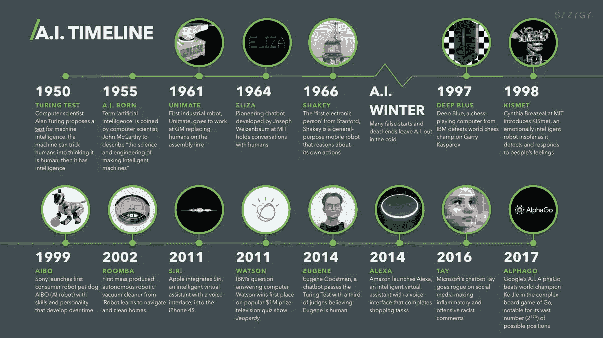
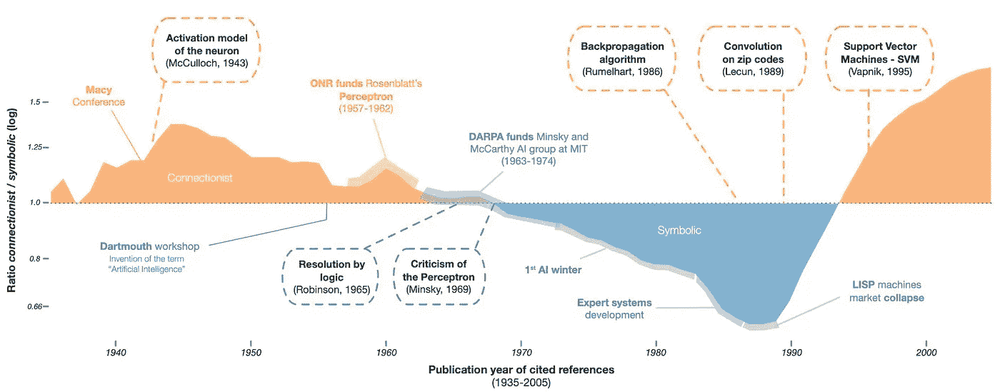

# 我们所说的智力是指什么？

> 原文：<https://towardsdatascience.com/what-do-we-mean-by-intelligence-f69673f1559e?source=collection_archive---------44----------------------->

## 质疑我们对智能的理解，以及如何使用人工智能创建“智能”系统。

让-路易·波林在 [Unsplash](https://unsplash.com?utm_source=medium&utm_medium=referral) 上拍摄的照片

# 介绍

给智力下一个正式的定义可能是一项相当艰巨的任务。事实上，到目前为止，还没有就这一主题达成共识。自从人类历史开始以来，人们对智力提出了不同的定义，这些定义因历史时间和文化而异。例如，在一个语言和交流技能起着重要作用的社会里，一个拥有这些技能的人可能会被认为比其他人“更聪明”。与此同时，在一个重视数字技能的社会里，大多数其他人可能被认为“更聪明”。

作为这一趋势的实际证明，我们可以认为，在最近的过去(直到 1960 年左右)，为了被一些大学(甚至是技术课程)录取，懂拉丁语是必要的，而现在它不再被认为是一个先决条件。由于最近的技术革新，社会将他的兴趣从人文学科转移到更技术性的学科，这种变化可能已经发生了。

> “每个人都是天才。但是如果你根据一条鱼爬树的能力来判断它，它会一辈子都相信自己是愚蠢的。”[1]
> 
> —未知

由于测量人类智力的这些差异，诸如智商(IQ)测试这样的标准化测试被创造出来。例如，这些类型的测试如今普遍用于评估求职者和检测智力残疾。

# 人工智能的诞生

艾伦·图灵模仿游戏现在被认为是定义智能系统的最初尝试之一。根据模仿游戏(图灵测试)事实上，如果一个系统能够与一个询问者交换信息而不让他/她理解它不是人类的本性，那么这个系统可以被认为是智能的。尽管智能系统的定义有一些限制，例如，它假设系统应该能够表达类似人类的智能形式，尽管理论上人类智能不是智能系统的唯一可能形式。

从这一点开始，两种不同的方法发展起来，试图重建智能系统:*(强调形式逻辑的使用)和**连接主义**(旨在使用大脑功能的简化模型来复制智力)。*

*由于符号方法，机器人 Shakey 等项目已经实现，而由于连接主义方法，人工神经网络和当今的深度学习模型已经构建(图 1)。能够表达智能行为的系统的第一个成功例子是阿瑟·塞缪尔·跳棋游戏程序。这个程序实际上成功地学会了使用启发式搜索(最小最大算法)玩高水平的跳棋游戏。为了训练他的程序，Samuel 另外加入了不同的特性，这在某种程度上类似于早期的强化学习方法。事实上，该程序能够成功地与自己对抗，并从过去的错误中吸取教训，以便进行改进。*

**

*图 1:人工智能时间轴[2]*

# *生物学视角*

*直到 20 世纪 80 年代初，科学家们试图通过自上而下的方法创造智能机器(例如，试图直接模仿复杂系统的行为，如人类的行为)。虽然，这种方法导致了各种限制，例如:*

*   *在不断变化的环境中反应缓慢。*
*   *充分扩展的能力有限，增加了挑战的难度。*
*   *当试图通过搜索或从相当大查找表中检索信息来解决问题时，需要较高的存储器要求。*

*另一种方法(如 Brooks 所提倡的)是尝试模仿简单生物的关键特征(自下而上的方法)。这样，我们的系统就不需要任何层次系统，并且能够保证在不断变化的环境中有更快的反应时间(就像现实世界中的大多数环境一样)。最后，另一种创造受生物学启发的智能系统的可能方法是进化算法。*

# *结论*

*在过去的一个世纪中，许多人工智能(AI)系统的连接主义和符号化实现已经被实现，希望创造智能系统(图 2)。尽管如此，现在我们仍然不能确定使用这两种方法中的一种(或两种)是否有可能创造一个强大的人工智能系统。*

**

*图 2:随着时间的推移，符号主义与关联主义的研究出版物[3]*

*强化和在线学习方法可能是解决这一任务的最佳途径。事实上，这可以被认为是能够模拟生物系统如何学习的最接近的方法:*

*   *通过他们过去的经历(使用奖励/惩罚机制)。*
*   *持续地，每次考虑一个刺激(或一个小样本)(不像深度学习系统，它一次训练完所有的东西，并有大量的数据)。*

**我希望你喜欢这篇文章，谢谢你的阅读！**

# *联系人*

*如果你想了解我最新的文章和项目[，请通过媒体](https://medium.com/@pierpaoloippolito28?source=post_page---------------------------)关注我，并订阅我的[邮件列表](http://eepurl.com/gwO-Dr?source=post_page---------------------------)。以下是我的一些联系人详细信息:*

*   *[领英](https://uk.linkedin.com/in/pier-paolo-ippolito-202917146?source=post_page---------------------------)*
*   *[个人博客](https://pierpaolo28.github.io/blog/?source=post_page---------------------------)*
*   *[个人网站](https://pierpaolo28.github.io/?source=post_page---------------------------)*
*   *[中等轮廓](https://towardsdatascience.com/@pierpaoloippolito28?source=post_page---------------------------)*
*   *[GitHub](https://github.com/pierpaolo28?source=post_page---------------------------)*
*   *[卡格尔](https://www.kaggle.com/pierpaolo28?source=post_page---------------------------)*

# *文献学*

*[1]每个人都是天才。但是如果你根据一条鱼爬树的能力来判断它，它会一辈子相信自己是愚蠢的报价调查员，追踪报价。访问地点:[https://quoteinvestigator.com/2013/04/06/fish-climb/](https://quoteinvestigator.com/2013/04/06/fish-climb/)*

*[2]人工智能时间轴信息图——从伊莱扎到泰和超越，Digitalwellbeing.org——保罗·马斯登博士。访问:[https://digital well being . org/artificial-intelligence-timeline-infograph-from-Eliza-to-tay-and-beyond/](https://digitalwellbeing.org/artificial-intelligence-timeline-infographic-from-eliza-to-tay-and-beyond/)*

*[3]神经元尖峰脉冲，归纳机器的发明和人工智能的争议，多米尼克·卡顿，让-菲利普·科因泰特，安托万·马齐埃，https://neurovenge.antonomase.fr/NeuronsSpikeBack.pdf*