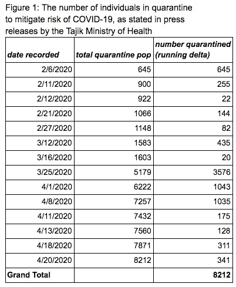
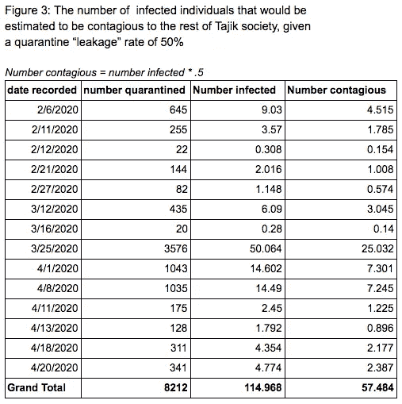
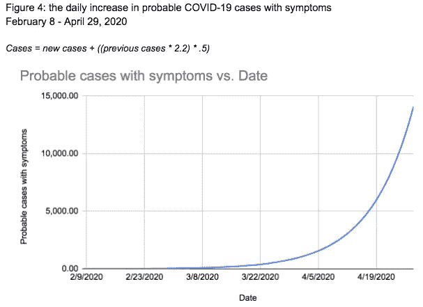

# 当一个国家否认冠状病毒时，你会怎么做？

> 原文：<https://towardsdatascience.com/what-do-you-do-when-a-country-denies-the-coronavirus-c99942701335?source=collection_archive---------39----------------------->

## 使用数据估计塔吉克斯坦的新冠肺炎病例数

> *修订:2020 年 4 月 30 日(晚上 8:55)—本文原始出版物中列出的数据包括在不同新闻稿中重复计算的检疫编号。编辑版本纠正了这一点。*

塔吉克斯坦是一个有 900 万居民的国家，然而只有[十五](https://www.rferl.org/a/covid-19-kyrgyzstan-easing-business-restrictions/30585076.html)个新冠肺炎病例。与中国接壤的塔吉克斯坦并不幸运。相反，[的诊断](https://thediplomat.com/2020/04/are-there-really-no-covid-19-cases-in-tajikistan/)一直被该国政府掩盖，直到今天，他们都否认该国受到病毒的影响。甚至当内务机构监督部部长贾洛丁·皮罗夫死于症状与新冠肺炎相似的病毒时，卫生和社会保障部声称死因是肺炎和猪流感。

尽管国内呼吁正式承认全球疫情，甚至世卫组织也没有干涉塔吉克政府对新冠肺炎的否认。当一个政府否认疫情或以可疑条款处理感染和死亡时，很难掌握病毒传播的规模。不过，在这种情况下，政府并没有完全否认新冠肺炎的存在。卫生部一直在检测有冠状病毒样症状的人(均为阴性)，并隔离患病公民和来自其他国家的旅行者。卫生部在定期新闻发布会上公布了被隔离人员的数量。

正如每一次现代疫情一样，统计模型被用来预测新冠肺炎的传播。利用其他研究的所有结果以及卫生部发布的数据，有可能创建一个模型，追溯性地构建新冠肺炎在塔吉克斯坦的潜在传播。

**方法论**

这项研究收集的数据由 Franziska Buhre 汇编，她是一名驻柏林的自由记者，2019 年在塔吉克斯坦生活了三个月，得到了 Institut für auslandsbezehungen 的资助。数据摘自塔吉克斯坦共和国[卫生和人口社会保障部](http://moh.tj/)发布的新闻简报。简报中提供的数据提供了被隔离的总人数，如从中国、韩国、日本、意大利、伊朗和阿富汗返回的公民，或来自“外国”的人。

为了了解新冠肺炎的潜在传播，需要估计这些被隔离的人群中有多少可能是病毒携带者。在日本进行的二月[研究](https://www.mdpi.com/2077-0383/9/2/419)中，研究人员对乘坐三架包机从中国武汉撤离的 565 名日本公民进行了检查，以了解新冠肺炎在乘客中的流行情况。在接受检测的乘客中，1.4%的人对新冠肺炎病毒呈阳性。将这一指标应用于数据集，我们可以得出样本人群中可能的感染率。在下表中，人们可以看到，即使在最少的情况下，仅从被隔离的人数来看，塔吉克斯坦可能有大约 114 例新冠肺炎病例。

将疑似病毒携带者隔离的目的是限制他们与社会其他人的接触，从而阻止病毒的传播。然而，在她的报道中，Buhre 发现人们不是在家里被隔离，而是“被送到营地，医院，疗养院，其中许多是苏联时代的，条件恶劣。”因此，花在隔离上的时间是可变的，有报道称一些病人行贿以获得自由。

因此，上表中的受感染人数并不代表会有效传染给其他塔吉克人的人数。在最好的情况下，所有人都将被隔离，直到不再具有传染性。然而，模型必须考虑一定量的“泄漏”。在 2011 年对 H1N1(猪流感)患者进行的一项研究中，澳大利亚的研究人员发现，只有 35%到 55%的人完全遵守了他们的指示。以此为基础，我们可以乐观地假设塔吉克斯坦的泄漏率约为 50%。这意味着每两个被隔离的病人中，就有一个会传染给塔吉克社会的其他人。

病毒的威胁，使它如此可怕和致命的原因是它会传播。57 名具有潜在传染性的个人穿越塔吉克斯坦会有什么影响？考虑到目前为止在新冠肺炎收集的数据，这也是可以模拟的。病毒的传播是通过一种叫做 R0(读作 R-零)的统计数据来衡量的。这是通过接触有传染性的人而被感染的新人数。根据帝国理工学院新冠肺炎反应小组的一项研究，新冠肺炎的 R0 估计在 2.0 到 2.6 之间，换句话说，每个新冠肺炎患者都有可能把它传给 2.5 个人。

再乐观一点，R0 为 2.2，我们可以模拟这 57 名具有传染性的人如何通过塔吉克社会感染新冠肺炎病毒。在数据中的第一天，2020 年 2 月 8 日，将有 4.5 个传染人。第二天，这个数字会增加到 4.5*2.2 = 9.9。第二天，9.9 人现在被认为具有传染性，所以在第二天，等式是 *9.9*2.2 = 21.78* 。这就是指数增长的方式，数字继续以 2.2 的因子复合。一个警告:在这个模型中，我还假设 50%的新感染者实际上是传染性的。这个假设建立在三个可能的因素上:1)这个人表现出症状和隔离；2)此人病重不能外出；和/或 3)这个人是无症状的，试验性的[研究](https://www.imperial.ac.uk/media/imperial-college/medicine/sph/ide/gida-fellowships/Imperial-College-COVID19-NPI-modelling-16-03-2020.pdf)建议让他们比有症状的人少 50%的传染性。

塔吉克斯坦卫生部的新闻稿不一致，因此我们没有每日新增病例的数字。在这个模型中，我将前一天的数字进行复合，除非添加了新的数字。这是观察随时间推移而增长的一种基本方法，但这是利用所提供的数据可以做到的。

鉴于上述模型，可以合理地预计，自 2020 年 2 月初以来，塔吉克斯坦约有 12，803 例新冠肺炎病例。这大大高于卫生部报告的 15 例。

**讨论**

新冠肺炎在每个社会都有不同的表现。该模型基于有限的统计数据和假设，这些数据和假设来自文化和社会因素不同、对病毒的实际传播有重大影响的其他国家。然而，鉴于政府在 2020 年 4 月底之前否认有任何病例，塔吉克斯坦的实际病例数可能更接近估计数，而不是政府声称的数字。虽然不是 100%准确，但该模型是基于新型冠状病毒如何在其他国家传播的同行评审数据。鉴于塔吉克斯坦的经济、移民模式和边境状况，没有理由认为它会与全球趋势如此大相径庭。

Franziska Buhre 通过 IFA-auslandsbezehungen 研究所的赠款住在塔吉克斯坦。她目前的研究由 WPK 科学基金会资助。这项研究的数据由 Franziska Buhre 收集，可以在这里下载。

你可以在这个[谷歌表单](https://docs.google.com/spreadsheets/d/1AGEM1XrU12u9rYKYd83oqJ7DrPsymX8MFcViDbFrH2g/edit?usp=sharing)中找到新冠肺炎在塔吉克斯坦传播的不同场景的模型。

你在其他国家有类似的案例可以从这项研究中获益吗？请在推特上联系我 [@saracooper_](https://twitter.com/saracooper_) 。