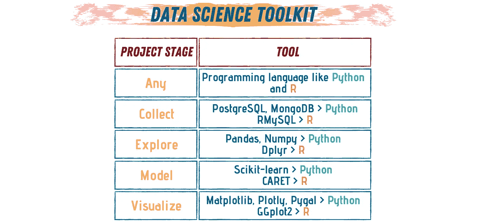

# 要成为一名数据科学家，你需要知道什么

> 原文：<https://towardsdatascience.com/what-do-you-need-to-know-to-become-a-data-scientist-1ed52e0e1ad?source=collection_archive---------20----------------------->

## 数据科学家职业起步指南

图片由作者提供(使用 [Canva](https://www.canva.com/) 制作)

数据科学是一个新兴领域，能够从结构化和非结构化数据中提取有用的趋势和见解。它是一个跨学科的领域，使用科学研究、算法和图表来揭示混沌中的模式，并使用这些模式来创造惊人的东西。

作为一名数据科学家，你需要了解一些基本的数学和编程知识，并对模式和趋势有敏锐的洞察力。由于该领域的跨学科性质，数据科学家将会发现自己在从事不同的广泛的技术工作。

在我们开始讨论成为一名数据科学家需要什么之前，我们先来谈谈数据科学领域的工作需要什么。

# 数据科学家是做什么的？

在数据科学领域工作就像坐过山车一样。这项工作的某些方面缓慢而稳定，而另一些方面则快速而疯狂。它的其他部分就像在一个循环中，你一遍又一遍地重复事情。

每当数据科学家开始一个新项目时，他们都会经历一系列已知的步骤，以得出最终结论。

> 任何数据科学项目都以数据开始，以数据结束，在这两者之间，奇迹发生了。

如果您浏览互联网，您会发现许多文章涉及数据科学项目中不同数量的步骤。但是，不管步骤多少，核心方面都是一样的。对我来说，任何数据科学项目都要经历 6 个主要步骤。

图片由作者提供(使用 [Canva](https://www.canva.com/) 制作)

## 步骤№1:了解数据背景。

每当我们开始一个数据科学项目时，我们通常旨在解决一个问题、提高性能或预测未来趋势。要做到这一点，我们首先需要掌握数据来源的历史以及它是如何产生的。

## 步骤№2:收集数据。

一旦我们了解了这些数据的背景，我们就需要收集数据并开始处理。根据项目的性质，有不同的方法来收集数据。我们可以从数据库、API 或者——如果你是初学者或者刚刚开始学习技能——从开放的数据源获得。收集数据的另一个选择是避开公开可用信息的 wen。

 [## Python 中 Web 抓取的分步指南

### 抓取任何有请求和美丽声音的网页

towardsdatascience.com](/a-step-by-step-guide-to-web-scraping-in-python-5c4d9cef76e8) 

## 步骤№3:清理并转换数据。

大部分时间，如果不是全部时间，我们从数据源收集的数据是纯净和原始的。这种数据不适合在算法和未来步骤中使用。因此，当我们获得新数据时，我们要做的第一件事就是清理它，对它进行分类和标记，并理解它。

## 步骤№4:分析探索数据。

一旦我们的数据是干净的和结构化的，我们就可以开始分析它，并试图找到其中的模式。这可以通过可视化数据并寻找重复或尖峰来完成。

 [## 每个数据科学家都应该知道的 5 种数据挖掘技术

### 如何在混乱中找到模式？

towardsdatascience.com](/5-data-mining-techniques-every-data-scientist-should-know-be06426a4ed9) 

## 步骤№5:数据建模。

我们终于到达了*神奇的一步*！在我们探索和分析我们的数据之后，是时候输入机器学习算法，并使用它来预测未来的结果。这确实是数据科学的力量。

## 第 6 步:可视化和交流结果。

最后，也是这个过程中最关键的一步是有效地可视化和呈现项目的结果。

一旦这些步骤都完成了，一个新的项目就来了，是时候重新开始了。

 [## 用 Pygal 实现 Python 中的交互式数据可视化

### 一步一步的教程，创造惊人的可视化

towardsdatascience.com](/interactive-data-visualization-in-python-with-pygal-4696fccc8c96) 

# 数据科学需要哪些技能？

数据项目生命周期的每一步都需要特定的知识和技能。为了更好地连接所需的技能，我会将项目的每个阶段与完成该步骤所需的技能配对。

*   **进行*数据调查，*你只需要一颗好奇的心，一支笔，一张纸。您坐下来，或者询问数据源一些问题以更好地理解数据，或者如果是开源数据，阅读数据附带的文档。**
*   **要执行*数据收集，*** 您需要知道如何与数据库和 API 通信。理解这些技术的基本结构和机制将使您的数据收集变得轻而易举。如果你正在使用开源数据集，那么学习如何寻找数据集和一些好的来源会有很大的不同。
*   **要执行*数据清理*** *，*您需要一些基本数据挖掘和清理技术的良好知识。您需要标记您的数据，并对其进行适当的分类。此外，您可以使用正则表达式来查找拼写错误，或者使用专门的工具来简化这个过程。
*   **要执行*数据探索，*** 你将需要一些基本的统计学和概率论。一些数据可视化和实验设计的知识，在这个阶段可以帮到你很多。

 [## 数据科学是关于概率的

### 数据科学中最常用的 4 种概率分布

towardsdatascience.com](/probability-theory-in-data-science-bacb073edf1f) 

*   **要执行*数据建模，*** 你需要知道一些机器学习算法，以及它们是如何工作的。你不需要什么都 100%懂；如果你能正确地使用它们，并把它们应用到正确的数据形式中，你就没问题了。
*   最后，**执行*数据通信，*** 你可能会用到一些基本的科学通信 101。也就是了解你的听众，他们的背景知识，选择晦涩的词语来解释复杂的概念。此外，在这个阶段，有效的数据可视化可以决定项目的成败。

图片由作者提供(使用 [Canva](https://www.canva.com/) 制作)

## 技术工具

我们刚刚谈到的一些技能需要一种编程语言、一种算法或特殊的包。

*   编程语言:Python，r
*   用于处理和创建数据库的: [MySQL](https://www.mysql.com/) ， [PostgreSQL](https://www.postgresql.org/) ， [MongoDB](https://www.mongodb.com/) ，或者 Python 中的 [SQLite](https://www.sqlite.org/index.html) 。如果你用的是 R，那么你可以用 RMySQL。
*   用于数据探索和转换的包:在 Python [Pandas](https://pandas.pydata.org/) 、 [Numpy](https://numpy.org/) 或 [Scipy](https://www.scipy.org/) 中。或者在 R [GGplot2](https://ggplot2.tidyverse.org/) 和 [Dplyr 中。](https://dplyr.tidyverse.org/)
*   可视化的 Python 库: [Matplotlib](https://matplotlib.org/) ， [Plotly](https://plotly.com/) ， [Pygal](http://www.pygal.org/en/stable/) 。
*   Python 的基本机器学习包[Scikit-learn r 中的](https://scikit-learn.org/stable/)和 [CARET](https://topepo.github.io/caret/) 。

# 结论

你不需要了解统计学、数学、机器学习的所有知识，也不需要成为一名专业的程序员来开始学习数据科学。你只需要这些知识的基础。随着您从事不同的项目并建立自己的档案，您的知识库将会扩大，您的“数据科学意识”将会自动提高。

所以，不要被领域吓倒，也不要被成为一名优秀的数据科学家需要“掌握”多少东西吓倒。从基础开始，逐步深入到高级主题。耐心点，全力以赴，你会成功的。