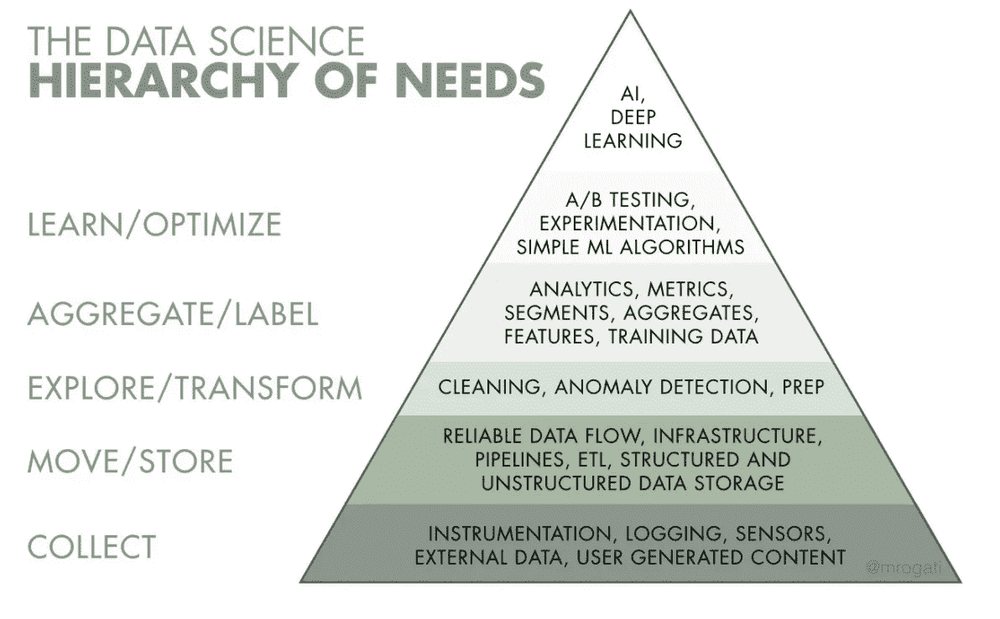
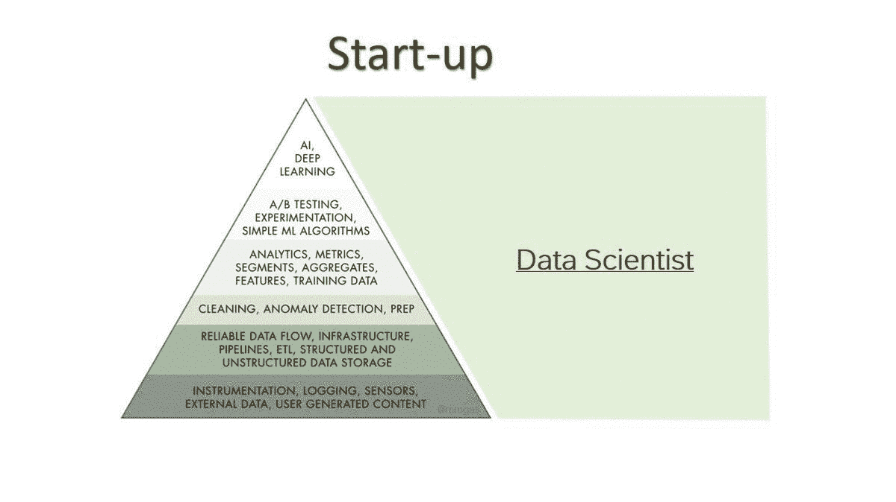

# 数据科学家实际上是做什么的？

> 原文：<https://towardsdatascience.com/what-does-a-data-scientist-actually-do-7318b994b138?source=collection_archive---------41----------------------->

## 尺寸很重要…

查尔斯·德鲁维奥在 [Unsplash](https://unsplash.com?utm_source=medium&utm_medium=referral) 上拍摄的照片

S 自从我开始从事数据工作以来，我一直听说数据科学，所以我一直想了解更多。问题是，当你开始探索数据科学家实际上在工作中做什么时，它会变得相当混乱。

# 简而言之，数据科学家的角色

我们都知道，数据科学就是利用数据为公司创造尽可能多的影响。为了创造这种影响，数据科学家需要工具，如构建复杂的模型、设计简洁的图表或编写代码。

> *基本上，数据科学家解决真实的公司问题，使用过去的数据预测未来。*

# 误解的两个来源

人们对数据科学有很多误解，这可能有两个原因:

## 1.媒体

热门话题和行业需求之间存在巨大的错位。机器学习和人工智能主导着媒体，掩盖了数据科学的所有其他方面。所以现在普通公众认为数据科学家是专注于机器学习和人工智能的研究人员，而实际上在某些情况下，该行业正在雇用永远不会实际执行任何人工智能或机器学习相关任务的数据科学家(可能是因为公司还没有做好准备)。

## 2.人力资源（部）

困惑的另一个原因来自人力资源经理，可以理解，他们可能会被飞来飞去的新术语和流行语淹没。这导致他们对工作职位的标注不准确。一名人力资源代表可能会称某个职位为*数据分析专家*，而实际上他们需要的是*数据分析师。*当他们需要一个*商业智能分析师*时，另一个可能雇用一个*初级数据科学家*。当然，有许多公司声称他们的工作机会很棒，但这并不是整个行业的标准。

> *为了让事情更清楚一点，我们首先必须了解数据世界中需要什么，我们将使用 Monica Rogati 的* ***需求数据金字塔*** *(全文* [*此处*](https://hackernoon.com/the-ai-hierarchy-of-needs-18f111fcc007) *)，这是受著名的马斯洛需求层次理论的启发。澄清了这个框架之后，我们就可以理解数据科学家在这个光谱中的位置了。*

# 需求的数据金字塔

图片由 [Monica Rogati](https://hackernoon.com/the-ai-hierarchy-of-needs-18f111fcc007) 在[黑客报上](https://hackernoon.com/the-ai-hierarchy-of-needs-18f111fcc007)提供

数据**生成&收集**处于金字塔的最底层，基本需要。显然，我们必须收集某种数据，才能使用这些数据。这里的关键是了解需要哪些数据，以及哪些数据是可用的。

然后**将&存储**数据移动到系统中是非常重要的，而且由于大数据和与之相关的所有挑战，它实际上在媒体中被很好地捕获。

当数据可以访问时，检测和纠正(或删除)损坏或不准确的记录变得至关重要。**探索&转换**数据，通常称为*数据清洗，*是数据科学中被低估的一面。

只有当数据得到清理并且可靠时 **BI & Analytics** 才能发挥作用，简而言之，这意味着从数据中形成见解，并建立衡量成功的指标。

然后数据产品需要**学习&优化**，通过 A/B 测试和实验来评估哪个产品版本是最好的。

媒体主要报道的是金字塔的最后一部分，即 **AI &深度学习**。我们已经不断地听说了这件事。但是它实际上并不是最高优先级的，或者至少不是用最少的努力获得最多结果的事情。这就是为什么人工智能和深度学习位于需求层次的顶部。

# 尺寸很重要…

图片来自 [Pexels](https://www.pexels.com/photo/3811807) 安德里亚·皮亚卡迪奥

> *既然我们已经了解了数据世界需要什么，那么数据科学家实际上在做什么呢？* ***公司的*** *规模是这里的一个关键因素。*

让我用下面三个例子来解释一下为什么:

## 启动

初创企业通常缺乏资源。他们可能只有一名数据科学家。所以一个数据科学家必须做所有的事情。也许他不会做人工智能或深度学习，因为那不是公司的优先事项。

在初创公司工作的数据科学家可能需要建立整个数据基础设施，编写一些软件代码来添加日志记录，然后进行分析和构建指标，并通过 A/B 测试来检查不同的解决方案。

## 中型公司

但是让我们看看中型公司。最后，他们有更多的资源。他们至少可以将数据工程师和数据科学家分开，将金字塔的任务一分为二。

因此，他们通常会让数据工程师收集数据，并负责所有的 ETL 过程。然后，如果中型公司做了大量需要人工智能的推荐模型或东西，那么数据科学家将负责金字塔的其余部分。

## 大型公司

大公司可能会有更多的钱，因此他们可以花更多的钱在员工身上。因此，他们可以让许多不同的员工从事不同的工作。这样，员工可以专注于他们最擅长的事情。

因此，举例来说，通过仪器传感器收集数据都是由软件工程师处理的。清理和建立数据管道是数据工程师的工作。因此，数据科学家将只关注分析。那么人工智能和深度学习将成为研究科学家的职权范围，这可能得到机器学习工程师的支持。

作者图片

# 结论

总之，如您所见，数据科学家没有单一的工作描述，但根据公司的规模，定义会有所不同。

我希望这篇文章能让你对数据科学家的实际角色有更多的了解，如果你考虑将它作为你职业生涯的下一步，你可能想看看你想为之工作的公司的规模，因为这将彻底改变你的职责和整体任务。

请务必联系我，告诉我你所有的建议和意见。

感谢您的阅读！

我正在创建一个与数据科学和分析相关的所有我最喜欢的课程、书籍和用例的列表。点击 [**链接**](https://landing.mailerlite.com/webforms/landing/v3w3s2) 即可在**免费**访问该内容。

 [## 用我的推荐链接加入 Medium-Lore 那又怎样

### 阅读 Lore 的每一个故事那又怎样(以及媒体上成千上万的其他作家)。您的会员费直接支持…

medium.com](https://medium.com/@loresowhat/membership)