# 计算机视觉在 2020 年美国大选新闻提要中看到了什么？(第二部分)

> 原文：<https://towardsdatascience.com/what-does-computer-vision-see-in-the-2020-us-election-news-feed-part-2-2-908e836fb066?source=collection_archive---------54----------------------->

## 第二部分——使用 Python 可视化人工智能注释图像的分步指南；2020 年美国大选图像分析

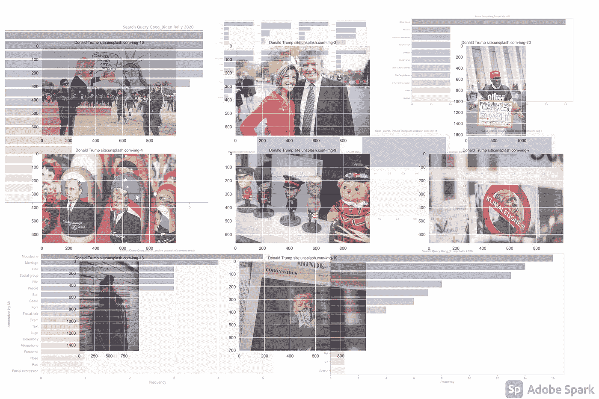

来源:Unsplash.com 搜索词:唐纳德·特朗普；Srinivas Vadrevu 的分析

```
person= You; #yes its you,dear reader!
print("Thanks for viewing this article")If Person.read_article([Part1](/what-does-computer-vision-see-in-the-us-election-2020-news-feed-part-1-2-a558ec7ccaa0))= False:

     print("Please check out the Part 1 of this series..") urlopen([Part1](/what-does-computer-vision-see-in-the-us-election-2020-news-feed-part-1-2-a558ec7ccaa0)) #please click on the Part1 hyperlinkunlock(Part2) # else unlock part2
print("Please scroll down. Happy reading!") | 
```

在我写这篇文章的时候，美国大选正一步步接近边缘。拜登-特朗普的票数为 264-213，拜登还需要 6 票才能赢得选举。我想知道前一段时间的差距有多小(224-213)，我认为这些数字源于他们竞选的活力和一年多来的媒体报道。在阅读了第 1 部分之后，您现在已经有了一个关于美国选举的大量图像分析数据集，并且您已经准备好通过可视化引擎来搅动它以获得洞察力。这篇文章更像是可视化图像分析的指南，而不是见解本身。因此，我首先从可视化的代码、解释和结构开始，然后从新闻提要中获得一些见解

# 2A)图像分析数据的可视化方法、代码和图示


由[国会图书馆](https://unsplash.com/@libraryofcongress?utm_source=medium&utm_medium=referral)在 [Unsplash](https://unsplash.com?utm_source=medium&utm_medium=referral) 上拍摄的照片

为了便于说明，我从 [Unsplash](http://unsplash.com) 收集了一些图像，展示如何处理和可视化图像网格中的数据。是的，我们将在坐标轴上绘制图像，就像您绘制数据点一样！

因此，我在[unsplash.com](http://unsplash.com)上搜索了“唐纳德·川普”和“乔·拜登”，为每个查询词找到了大约 15-20 张图片。

对于“Donald Trump”和“Joe Biden”的这几批 URL，我调用了 runvisionai 函数(如果您绕过了开放代码，请参见 [Part1](/what-does-computer-vision-see-in-the-us-election-2020-news-feed-part-1-2-a558ec7ccaa0) 了解更多信息)来构建广泛的特征类别级别数据集。

你还记得 label_df 数据帧吗？我将它或它的子集分配给 test_label。

```
test_label=label_df['source_term'=="Donald Trump_site:Unsplash.com"
test_label['Query/alt'].fillna("NA", inplace = True) 
test_label=test_label.sort_values(["img_num"],ascending=(True))
display_images(test_label)
```

从这里开始，有许多可能的方法来可视化图像数据集。TI 希望构建一个视图，为我提供一个网格中所有图像的一站式概览，以及与第一个图像网格结构类似的另一个网格中每个图像的相应特征图表。

比方说，我想显示唐纳德·特朗普图像子集中所有图像的网格，其中云视觉 API 已经注释了至少一个标签。我想设计一个函数，允许我传递子集' test_label '数据帧并检索图像网格。创建我的代码模式的需求如下所示:

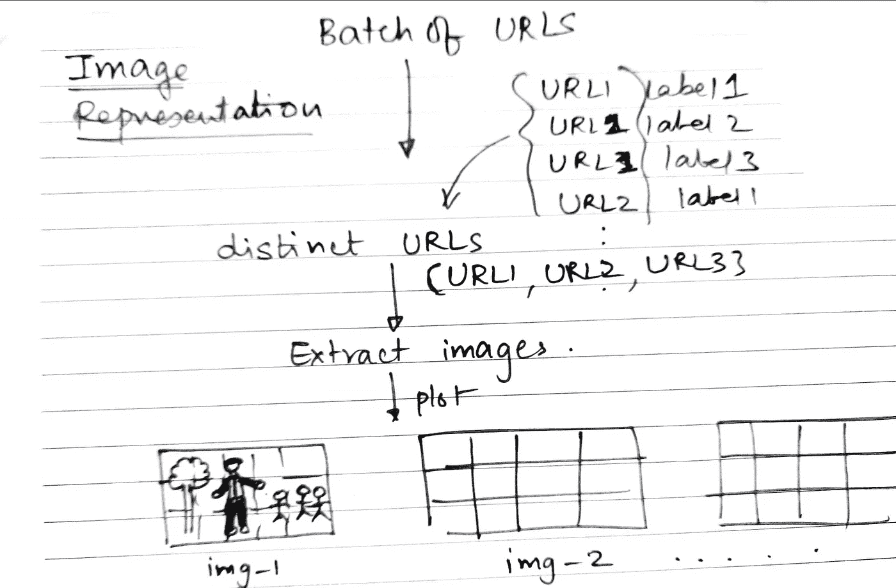

图 1:以类似网格的方式表示图像的草图

*   我需要整个网格的主要情节和图像网格的每个 URL 图像的子情节。(Gist2) →
*   我传递一批图像 URL 并提取不同的 URL(gist 2)
*   根据图像的数量，我设置了我的子情节尺寸(行、列、宽和高)。为了更容易阅读，我将网格的列数限制为 4。

对于每个 URL，我将使用 Python 图像库(PIL)打开、读取并转换 URL 为 PIL 图像(Gist1 中的函数在 Gist2 中调用)→

对每个 URL 的循环运行显示每个子情节中的图像，并重复它，直到所有图像都被绘制出来。

要点 1:从 URL 返回 PIL 图像的函数

要点 2:在网格中绘制图像

## **2a.1 标签识别和可视化:**

上述函数的输出是所有图像的一站式概览网格，Cloud Vision API 为这些图像识别了至少一个标签。您可以在下面找到它:

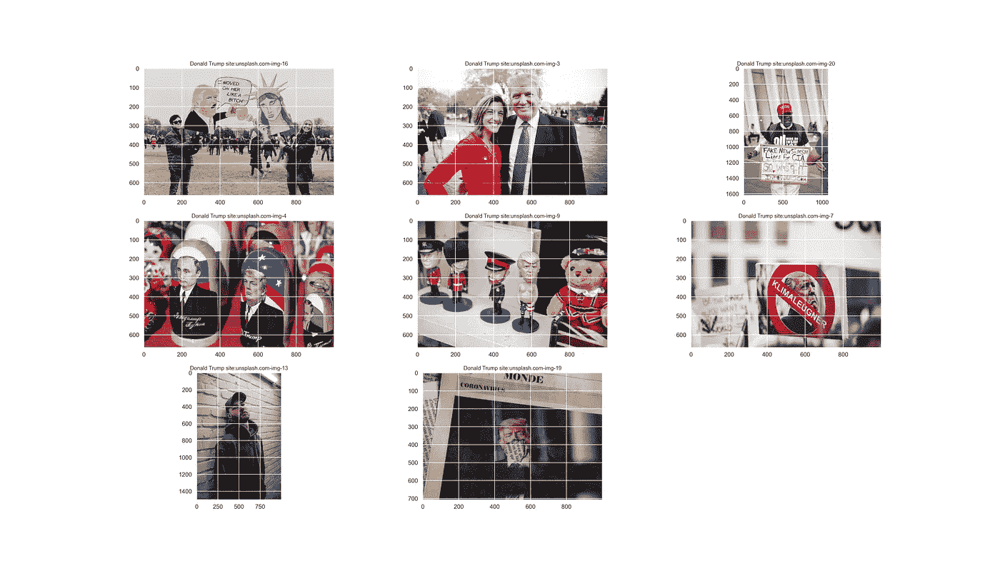

图 2:所有已经被 GCP AI 的 label_detection 标注的图片的图像网格。来源 Unsplash.com；搜索词:唐纳德·特朗普；Srinivas Vadrevu 的分析

对于上面的网格，我想以同样的顺序绘制标签图表，以便快速浏览标签网格中的关键趋势。如果一张图片弹出了任何有趣的标签，我需要在标签网格中找到与标签条形图坐标相同的对应图片。标签网格的逻辑与图像网格非常相似。您可以在下面找到代码:

要点 3:在标签网格内绘制标签图表，其尺寸与图像网格相同

我使用条形图来表示标签，按照置信度得分的降序排列。上面图像的标签网格输出如下图所示。让我们仔细看看下面的图像 9(第 2 行:第 3 列),并在图像网格的(第 2 行，第 3 列)中找到它的对应图像。

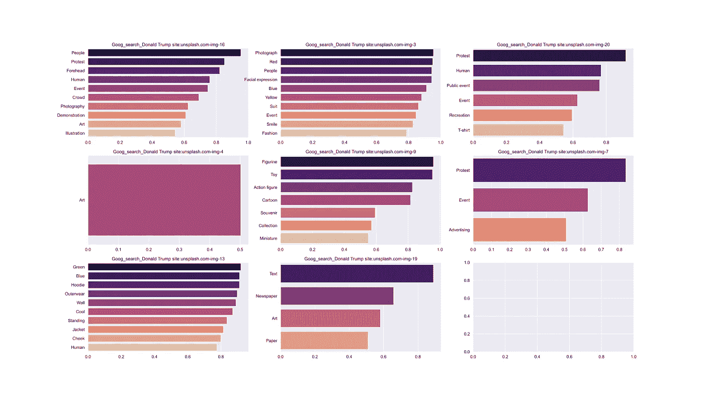

图 3:在与图像网格具有相同尺寸的标签网格内绘制的标签条形图子图，其中 y 轴为标签，x 轴为置信度得分；Srinivas Vadrevu 的分析

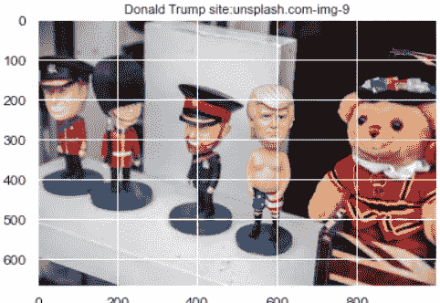

图 4:支线剧情中的 Img9 来源:https://unsplash.com/photos/s8RnzkNHrcM；

例如，IMG-9(下面网格中的 2x 3)的标签不同于其他标签条形图。主要的标签是**雕像、玩具、缩微模型、卡通、纪念品和活动人偶。**您可以通过查看图 4 中的图 9 来确认这一点

我可以即时想到一些应用程序。其中一个是在家庭安全领域，当 CCTV 图像馈送同时检测到抗议和人群标签时，就会触发移动通知来通知住户。

## **2a.2 目标检测和可视化**

逻辑和代码与标签检测和可视化部分非常相似。逻辑相同，但结果略有不同。除了服装和配饰，照片中没有任何引人注目的东西。图像加载后，您可以放大查看下面的图像和对象网格。

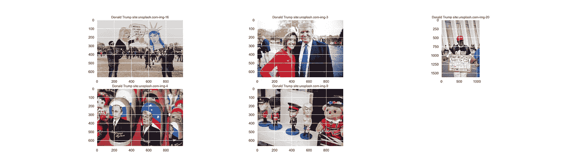

图 5:所有图片的图像网格，已经由 GCP AI 的 object_detection 注释。来源 Unsplash.com；搜索词:唐纳德·特朗普；Srinivas Vadrevu 的分析

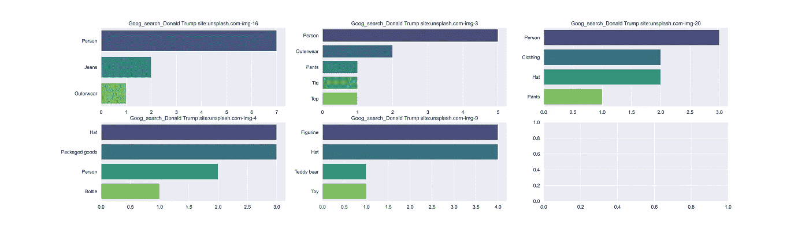

图 6:y 轴为对象，x 轴为置信度得分的对象子图，绘制在与图像网格(左)具有相同尺寸的标签网格内；Srinivas Vadrevu 的分析

## **2a.3 .人脸检测和可视化:**

要点 4:在一个与图像网格尺寸相同的网格内绘制面部情感线

对于人脸检测和可视化，我不得不稍微修改一下代码。对于每张脸，我们有五种不同的面部情绪/特征:快乐、悲伤、愤怒、惊讶和模糊。除了这些，还有曝光和头套功能。对于这个项目，我需要情感分数和一个非情感特征来观察和比较。

每种情绪都按照 0-5 的可能性评分，其中

*0:未知，1:非常不可能，2:不太可能，3:可能，4:可能，5:非常可能。*

我想在 x 轴有分类值的点状图中表现情感。因此，我将数据集的跨选项卡结构扁平化，将不同列中的情绪放在一列中。情感网格和图像网格按照这个顺序绘制在下面。

从下面的情绪网格中，你可以观察每张脸在每种情绪下的得分。图 6 是脸部和他们的情绪的鸟瞰图。

如果你想描绘每张图片的情感，我更喜欢为图片中的每张脸创建一个边界框，并在框的旁边显示情感。从下面的表格中可以清楚地看到，前三张图片包含了一个快乐的人。你能在图像网格中找到它们吗？

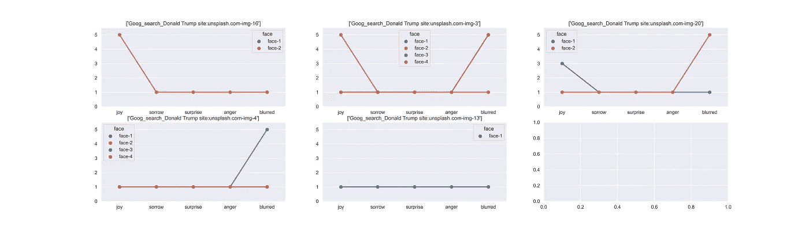

图 7:在与图像网格(左)具有相同维度的网格内绘制的 y 轴为似然性度量，x 轴为情感类别的面部绘图线；Srinivas Vadrevu 的分析

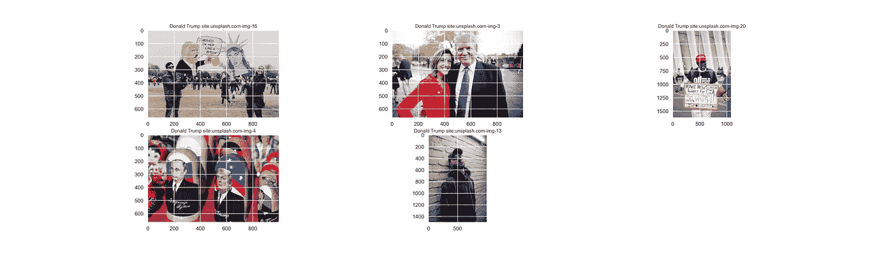

图 8:GCP AI 人脸检测标注过的所有图片的图像网格。来源 Unsplash.com；搜索词:唐纳德·特朗普；Srinivas Vadrevu 的分析

## **2a.4 颜色识别和检测:**

Gist5:将 colors_df 中的 RGB 值转换为十六进制格式

这类似于面部情绪，因为每种颜色都有红色、绿色、蓝色、alpha 和像素分数值。我将 RGB 值转换成十六进制值来标记颜色。我使用树形图来绘制颜色和像素分数值，以显示颜色组成。

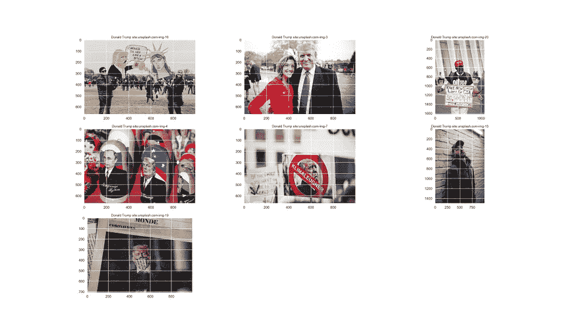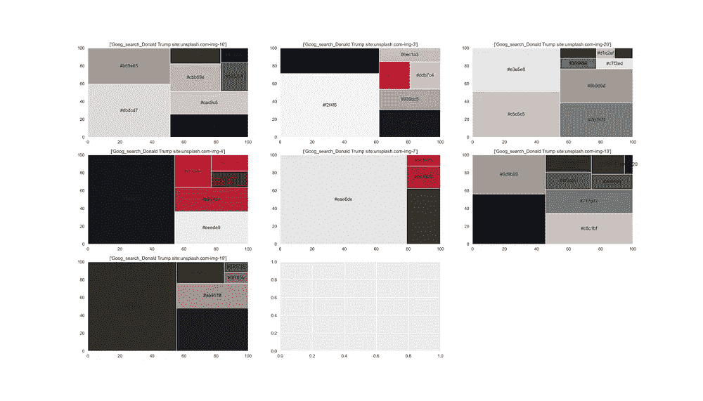

图 9:在与图像网格尺寸相同的网格内绘制的彩色树形图(左)；Srinivas Vadrevu 的分析；资料来源:unsplash.com

您可以看到红色、黑色、灰色和棕色是唐纳德·特朗普相关图片的常见颜色。

## **2a.5 安全搜索检测和可视化**

除此之外，您还可以检查安全搜索的显式参数。您可以对成人、医疗、欺骗、暴力和色情图片使用可能性度量。我已经采取了 4 张插图的照片。在下面的例子中，第一个和第四个图像是欺骗，图表证实了这一点。

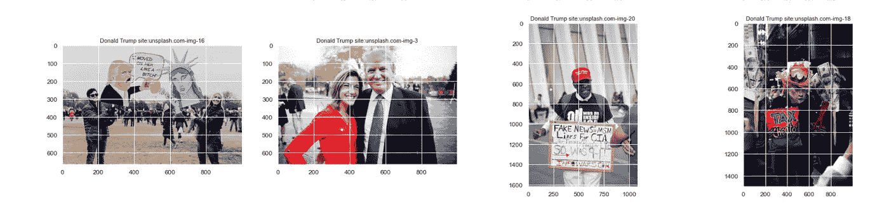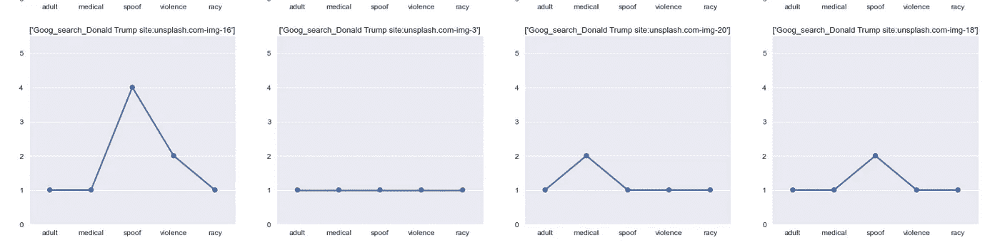

图 10:在与图像网格(顶部)具有相同尺寸的网格内绘制的安全搜索绘图线，其中在 y 轴上是可能性度量，在 x 轴上是安全搜索类别；Srinivas Vadrevu 的分析；资料来源:unsplash.com

准备好 AI 图像注释和可视化的代码后，我们现在可以将该算法部署到

*   分析网站、google images 或使用 NewsAPI 中的图片
*   构建强大的影像分析数据集，以及
*   创建要素的鸟瞰图可视化，以获得洞察力。

# 2b。计算机视觉在美国选举新闻提要中看到了什么？

## **一、新闻文章**

来源:我拿了两个主流媒体网站，了解他们报道 2020 美国大选新闻时对图像的选择取舍。他们的网站链接如下。我所使用的方法非常类似于上面概述的用于 Unsplash 图像的方法。

[](https://edition.cnn.com/politics/live-news/us-election-news-11-01-2020/index.html) [## 2020 年美国大选:拜登、特朗普和投票的最新消息

### 竞选过程中你需要知道的:特朗普总统将访问密歇根州、爱荷华州、北卡罗来纳州、乔治和…

edition.cnn.com。](https://edition.cnn.com/politics/live-news/us-election-news-11-01-2020/index.html) [](https://www.nytimes.com/live/2020/11/02/us/trump-biden-election) [## 随着竞选接近尾声，早期投票接近 1 亿张

### 特朗普总统正在前往他在民调中落后的四个关键州，并已经准备好挑战…

www.nytimes.com。](https://www.nytimes.com/live/2020/11/02/us/trump-biden-election) 

我将过去 12 天，即 10 月 20 日至 10 月 31 日，作为本文的样本。我建立了图像分析数据集，并为这段时间内发布的所有图像创建了可视化效果。我发现将时间范围划分为 3 天的窗口更容易，以确保每个窗口中有足够的图像进行有意义的分析。在这一部分中，我将集中讨论关于标签、物体、地标和标志的出版物之间的区别。在下面的所有图表中，x 轴代表计数，y 轴代表特征。我通过在 5x2 的网格中改变 3 天的窗口和网站来绘制带注释的标签、徽标和对象。

就标签而言，您可以查看链接中的图片，并与下面的图表进行比较，以区分突出的标签。

**10 月 29 日至 31 日**:与 CNN 相比，NYT 在这一时期似乎有许多主题和注释标签。有趣的是，你可以观察到右边有不少汽车相关的主题——{机动车、汽车设计、汽车外观、汽车、陆地车辆、车门}。在左侧，您可以找到与航空旅行/飞机相关的标签。一些照片可能是在不同州的竞选集会上登机或下飞机时拍摄的。颜色标签，红色和蓝色，是两个网站通用的。

**10 月 26 日至 28 日**:右边的标签又多了很多种类。有趣的是，你可以在 NYT 图像中观察到建筑、建筑和罗马神庙的主题。如果我没有看图像就看到了这些图表，我推断左边的照片是带有美国国旗的演讲照片和飞机着陆后/登机前的照片。右边的照片似乎包含了更多充满活力的主题，如大都市、建筑、城镇、高能见度服装、城市和地标以及演讲。我推测，由于主题的多样性和活力，后一组标签可能比前一组标签在网站上有更多的参与度。

您可以将单个标签链接到网站参与度指标，如跳出率、会话持续时间、页面/会话，以查看是否有任何标签持续推动更好的网站参与度表现。

**10 月 20 日至 25 日**:类似上述观察。如果你发现其他有趣的模式，请在文章中评论。

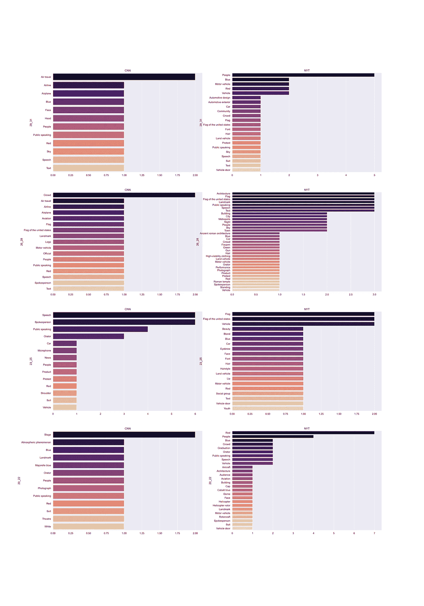

图 11:标注在三天窗口和新闻网站上的标签；Srinivas Vadevu 的分析

如上所述，我也绘制了人工智能识别的物体和标识。你可以在下面放大查看。同样，与左侧相比，图表右侧的徽标种类更多。

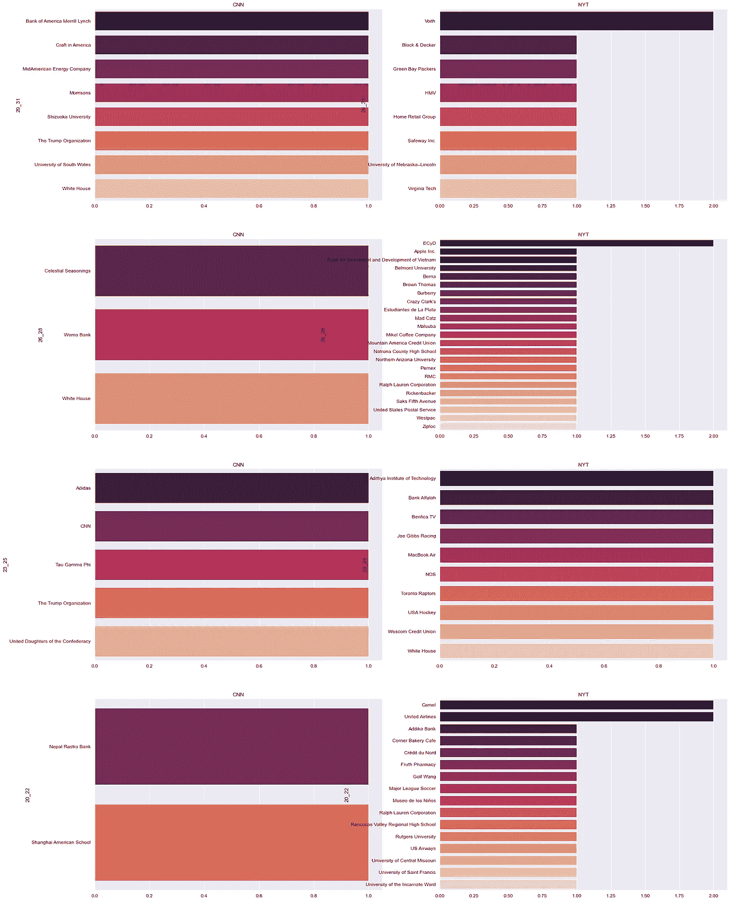

图 12:标注在三天窗口和新闻网站上的徽标(网格行:时间窗口，网格列:网站；Srinivas Vadevu 的分析

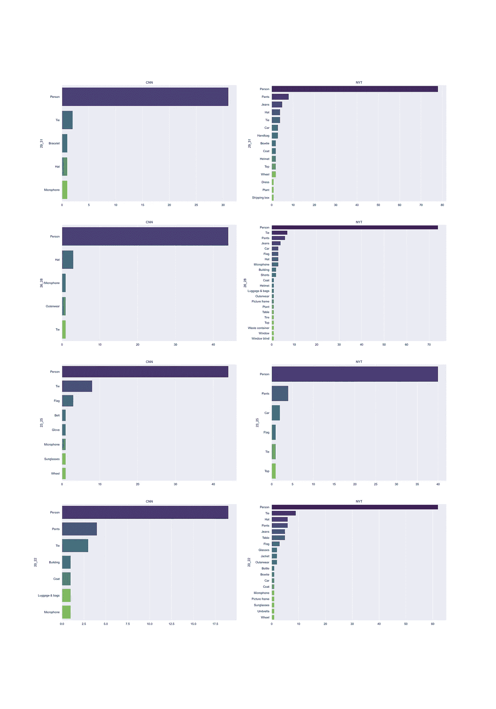

图 13:跨三天窗口和新闻网站标注的对象(网格行:时间窗口，网格列:网站)；Srinivas Vadevu 的分析

## **从图片中识别的地标以及经度:**

从地标数据中，你也可以在图片中看到人工智能识别的地标的经度。你可以在下面查看它们的开普勒图像。

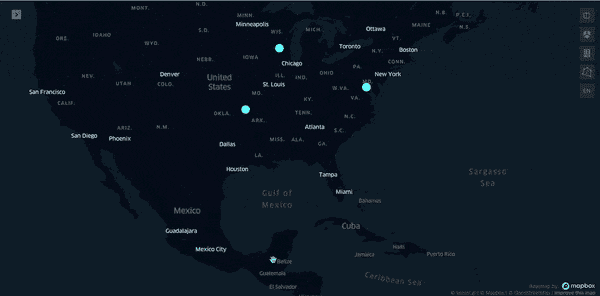

图 14:从新闻网站识别并在开普勒上绘制的地标的可视化；Srinivas Vadrevu 的分析

其他特征:颜色和面部表情会产生有趣的视觉效果。我发现许多图片经常投射出快乐，偶尔会依次出现模糊、愤怒和悲伤。

我没有探索过面部的物理特征，比如滚动、倾斜、平移角度、面部界标以及边界多边形之间的距离。但是一些想法可能会很有趣。例如，人脸的边界框可以用于自动进行社交距离检查。您可以映射识别的人脸数量、一个人是否戴着面具(标签/物体)，以及人脸边界框之间的距离，以检查是否遵循社交距离。

## 二、议案谷歌搜索对比了反弹:

为了查看多个新闻网站的图片，我使用谷歌图片提取了所有与总统候选人集会相关的图片。在本例中，我将搜索查询“拜登集会 2020”得到的图像与查询“特朗普集会 2020”得到的图像进行了比较。对于这些查询，我提取了 100 个图像，每个图像都用于注释和分析。在所有可视化效果中，拜登拉力赛的图像在左侧，特朗普拉力赛的图像在右侧。

**标签**

*   这些标签对两种查询都很常见:**人群、粉丝、观众、人物和粉丝——这些都是你在集会照片中所期望的。**
*   “特朗普拉力赛 2020”场景中的图像也有标签，如**体育场、竞技场、运动场馆、大会和运动场**。我们可以推断，这些地方是唐纳德·特朗普(Donald Trump)集会演讲的热门拍照地点。
*   就乔·拜登的集会图像而言，诸如**新闻发布会、新闻、机动车和欢呼**之类的标签与通用标签一起出现。

**物体:**

*   特朗普集会图像中的物体也出现在拜登的集会图像中。这两个查询的共同对象是**西装、外套、衣服、领带、旗帜和外套**。这些通常是从他们的服装中识别出来的物品。
*   与特朗普的集会图像相比，乔·拜登的集会图像似乎有更多种类的物体。乔·拜登(Joe Biden)集会照片中的独特物品是汽车、麦克风、手机、太阳眼镜、行李包、衬衫和服装。
*   *有趣的是，汽车和机动车似乎在乔·拜登的标签和物品中很常见。即使在第一组网站图像分析中，机动车也经常出现在乔·拜登的图像中。*

**标志:**

您可以查看下面的徽标图表。为了得到至少 5 个标识，我将标识识别置信度分数放宽到 0.5，而不是我用于标签和物体的 0.9。下面的图表中有人工智能为每个查询识别的公司标志列表。在某些情况下，它运行良好。例如:本[图](https://dynaimage.cdn.cnn.com/cnn/digital-images/org/dc08bf79-dc7f-4010-9b32-7cb6e79f0438.jpg)中阿迪达斯标志置信度为 0.8 分。

对于大多数其他情况，置信度得分在 0.5-0.6 之间，所以要有所保留。例如，在这张[图片](https://s.abcnews.com/images/US/trump-arena-rt-as-200620_hpMain_16x9_1600.jpg)中识别出了 WeWork 徽标。我不确定从[图片](https://s.abcnews.com/images/US/trump-arena-rt-as-200620_hpMain_16x9_1600.jpg)上看是否明显。你可以试着发现它——一个寻找瓦尔多的练习。

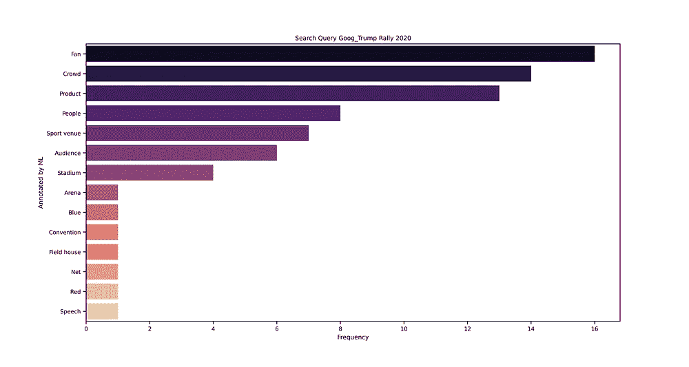

图 15:为源自拜登拉力赛 2020 的谷歌搜索的图像标注的标签(左)和源自特朗普拉力赛 2020 的谷歌搜索的图像的标签(右)；Srinivas Vadrevu 的分析

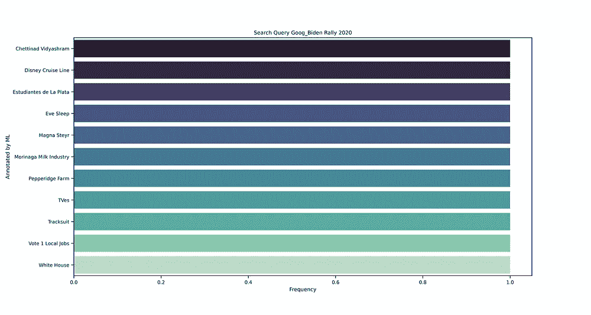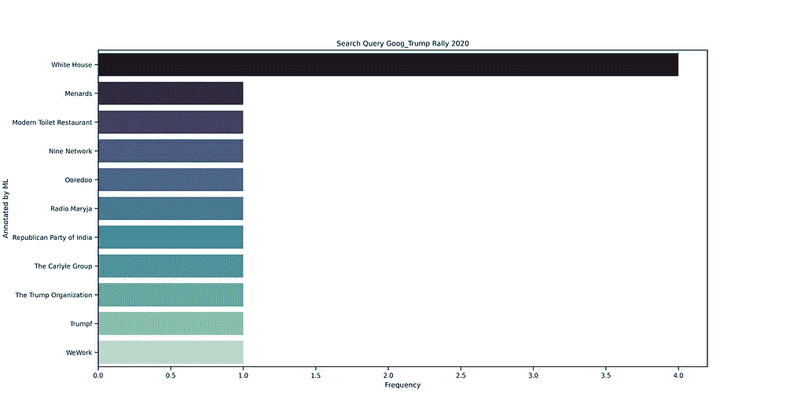

图 16:为来自拜登拉力赛 2020 的谷歌搜索的图像标注的标识(左)和来自特朗普拉力赛 2020 的谷歌搜索的图像的标识(右)；Srinivas Vadrevu 的分析

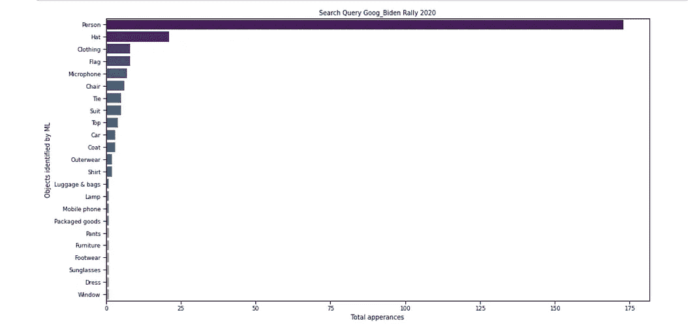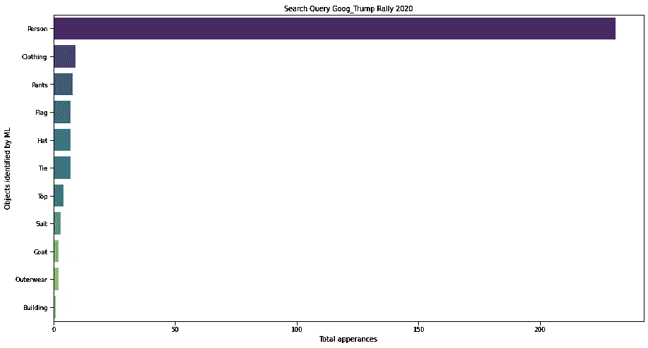

图 17:为源自拜登拉力赛 2020 的谷歌搜索的图像注释的对象(左)和源自特朗普拉力赛 2020 的谷歌搜索的图像的对象(右)；Srinivas Vadrevu 的分析

**面孔:**

快乐是最常见的面部情绪，其次是模糊的特征。两个查询的每个情感得分的中值是 1(不太可能检测到情感)

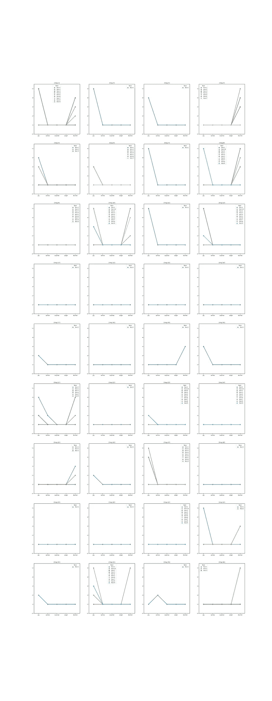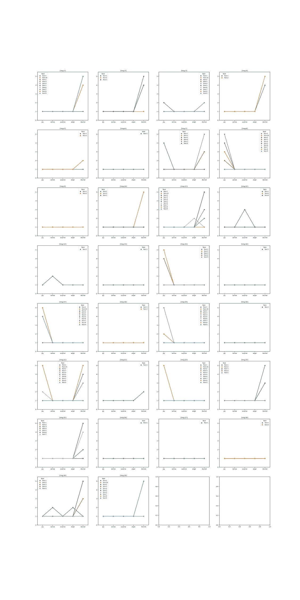

图 18:源自拜登拉力赛 2020 的谷歌搜索的图像的面部情绪网格(左)和源自特朗普拉力赛 2020 的谷歌搜索的图像的网格(右)；Srinivas Vadevu 的分析

**颜色:**

这两组的颜色 RGB 和像素分数绘制如下。

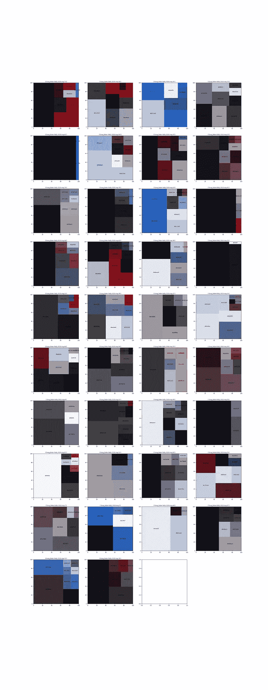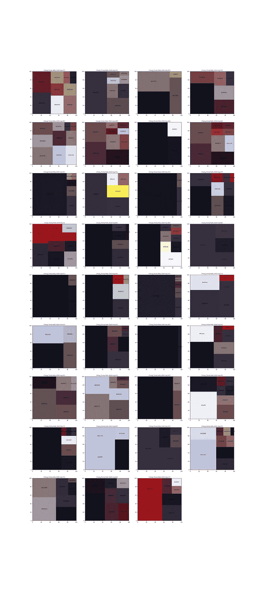

图 19:来自拜登拉力赛 2020 的谷歌搜索的图像的彩色网格(左)；来自特朗普拉力赛 2020 谷歌搜索的图像的颜色网格(左)

# 结论

如果一张图片对消费者来说值一千个字，那么随着人工智能和计算机视觉算法的兴起，它对组织的价值会放大数倍。我们已经看到，计算机视觉可以解开仅来自图像的巨大数据仓库。在美国选举新闻源图像分析的情况下，我们可以提取大量的图像数据集，并搅动它们以产生洞察力。您可以在现有项目中使用这些文章中概述的代码，或者将其扩展到新的应用程序中。

如果我们可以使用这些图像数据点作为前因或独立变量来解释对结果 KPI 的变化/影响，许多应用和操作化将会实现。一些例子包括:

*   在这种新闻提要的情况下，我们可以观察到结果度量增加的趋势，例如，当选择了具有特定特征集的图像时，知道该新闻文章的印象数、阅读数和花费的时间。
*   OTT 平台的缩略图可以通过颜色、情感、姿势、标签和她通常使用的缩略图的对象属性来识别客户偏好，从而实现个性化。对于未来的发布，该平台可以通过将焦点客户偏好映射到存储库的图像属性，从新的电影图像存储库中识别缩略图选择。
*   对于产品公司，您还可以通过对用户社交媒体帖子的图像情感分析来了解用户如何参与产品，并使用标签和对象功能对消费者进行细分。
*   这也可以应用于监控和安全领域——当某些特征出现在来自 CCTV 馈送的图像中时进行识别和触发通知。
*   或者，尝试通过这种算法将你的照片标记到你的照片上，让数据揭示你的摄影风格(从角度数据点)

我认为，在使用人工智能和图像分析的洞察力和可视化方面，我们只是触及了表面。快乐探索数据的海洋！

**文章中使用的图片来源:**

下面是我用来绘制图像网格的 Unsplash 的图像。感谢所有的摄影师。

[](https://unsplash.com/photos/wUbxCL-WXow) [## 戴夫·戴维森在 Unsplash 上拍摄的照片

### 2014 年 10 月 18 日在宣布竞选总统之前，唐纳德·特朗普参加了国会议员史蒂夫·金的筹款活动…

unsplash.com](https://unsplash.com/photos/wUbxCL-WXow) [](https://unsplash.com/photos/D86EPYMO6iE) [## Sebastian Pociecha 在 Unsplash 上拍摄的照片

### 下载 Sebastian Pociecha 拍摄的德国科隆服装、服饰、风帽和毛衣的免费高清照片…

unsplash.com](https://unsplash.com/photos/D86EPYMO6iE) [](https://unsplash.com/photos/xsdFiNPV0nc) [## roya ann miller 在 Unsplash 上拍摄的照片

### 下载这张由罗亚·安·米勒拍摄的美国华盛顿的人、人、人和华盛顿的免费高清照片…

unsplash.com](https://unsplash.com/photos/xsdFiNPV0nc) [](https://unsplash.com/photos/5dGzPxy-qlk) [## 克里斯·博斯在 Unsplash 上的照片

### 下载克里斯·博斯在美国纽约拍摄的人、人、配件和附件的免费高清照片…

unsplash.com](https://unsplash.com/photos/5dGzPxy-qlk) [](https://unsplash.com/photos/EwFgxZxgDAM) [## 米歇尔·邦克斯基在 Unsplash 上的照片

### 下载米歇尔·邦克斯基在美国北卡罗来纳州阿什维尔拍摄的特朗普、政治、阿什维尔和北卡罗来纳州的免费高清照片…

unsplash.com](https://unsplash.com/photos/EwFgxZxgDAM) [](https://unsplash.com/photos/YI5DzUUFvqQ) [## 照片通过捕捉人心。在 Unsplash 上

### 下载此免费高清照片的人，人，人和特朗普捕捉人心。(@死 _ _ _ _ 艺人)

unsplash.com](https://unsplash.com/photos/YI5DzUUFvqQ) [](https://unsplash.com/photos/9BXL-Vn22Do) [## 查尔斯·德鲁维奥在 Unsplash 上的照片

### 下载这张由 Charles Deluvio (@charlesdeluvio)拍摄的文字、报纸、人和人的免费高清照片

unsplash.com](https://unsplash.com/photos/9BXL-Vn22Do) [](https://unsplash.com/photos/9Kc7mQKq-zA) [## 照片通过捕捉人心。在 Unsplash 上

### 下载此免费高清照片的人，人，人和横幅捕捉人心。(@死 _ _ _ _ 艺人)

unsplash.com](https://unsplash.com/photos/9Kc7mQKq-zA) [](https://unsplash.com/photos/QVeRgFErOPs) [## 尤尔根·哈兰在 Unsplash 上的照片

### 我偶然发现了这些为特朗普访问俄罗斯制作的俗气头巾..下载约根·哈兰的这张照片…

unsplash.com](https://unsplash.com/photos/QVeRgFErOPs) [](https://unsplash.com/photos/s8RnzkNHrcM) [## 照片由 Unsplash 上的 mana5280 拍摄

### 下载这张由 mana5280 (@mana5280)拍摄的玩具、小雕像、人和人的免费高清照片

unsplash.com](https://unsplash.com/photos/s8RnzkNHrcM)