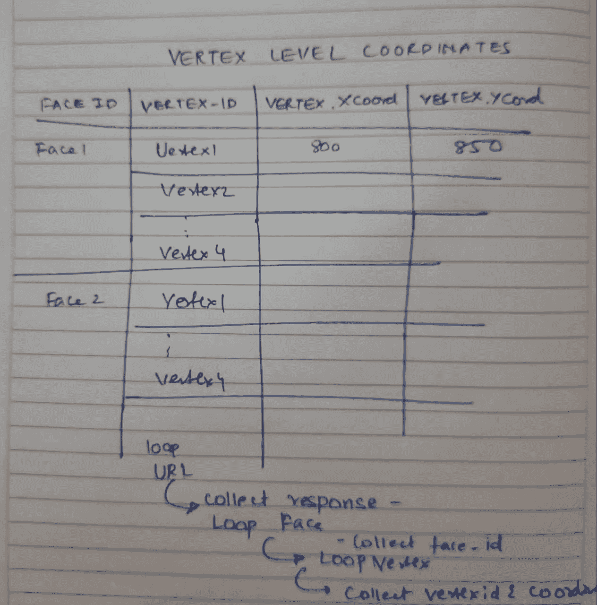

# 计算机视觉在 2020 年美国大选新闻提要中看到了什么？(第 1/2 部分)

> 原文：<https://towardsdatascience.com/what-does-computer-vision-see-in-the-us-election-2020-news-feed-part-1-2-a558ec7ccaa0?source=collection_archive---------52----------------------->

## 第 1 部分-生成批量人工智能注释图像和预处理数据，以构建特征级图像数据集。


从美国选举 2020 图像的样本批次上标注的数据生成的数据可视化网格；[丹丹尼斯](https://unsplash.com/@cameramandan83?utm_source=unsplash&utm_medium=referral&utm_content=creditCopyText)在 [Unsplash](https://unsplash.com/s/photos/elections-usa?utm_source=unsplash&utm_medium=referral&utm_content=creditCopyText) 上的背景照片；Srinivas Vadrevu 的分析

## 编辑:

这是两部分系列的第一篇文章。你可以在这里找到第二部分[的链接](/what-does-computer-vision-see-in-the-2020-us-election-news-feed-part-2-2-908e836fb066)

由于图像在顾客购买过程中的普遍性和重要性，视觉内容策略现在已经成为市场营销不可或缺的一部分。然而，视觉内容创作主要植根于隐性知识和创造性领域。然而，随着计算机视觉的出现，公司应该将人工智能用于建立对图像特征的明确知识，以探索什么驱动印象并影响购买决策吗？换句话说，人工智能生成的数据补充创作过程的时机成熟了吗？随着美国大选的临近，我选择它作为当前的营销背景来使用 Cloud Vision AI，并在本文的第一部分解释如何建立广泛的特征级数据集。

我相信你一定听说过这句谚语...

> “一幅画胜过千言万语”


图 1:早期广告的模糊版本，强调形象的重要性，由弗兰克·巴纳德于 1921 年创作；来源:[http://www2.cs.uregina.ca/~hepting/projects/pictures-worth/](http://www2.cs.uregina.ca/~hepting/projects/pictures-worth/)

你知道这句英语谚语起源于广告吗？虽然它最初是一句亚洲谚语，但一些早期的广告商用它来强调图片在产生印象中的重要性。

弗兰克·巴纳德在 1921 年的广告是这样说的:

> “奶油甜很好吃”是一个很短的短语，但如果在一年中每天早上、中午和晚上向许多人展示该产品的诱人图片，它会比在相同数量的人面前放置一千字的广告销售更多的商品，一年中只有有限的几次…
> 
> 仅仅是对有价值产品的良好印象的优势提醒消费者一次又一次地购买它”——弗兰克·巴纳德

[](http://www2.cs.uregina.ca/~hepting/projects/pictures-worth/) [## 一张照片值| D. H .赫普廷博士

### “一图抵一万字”这句话对你来说意味着什么？如果…它变得更有意义还是更无意义

www2.cs.uregina.ca](http://www2.cs.uregina.ca/~hepting/projects/pictures-worth/) 

虽然有点讽刺的是，你在上面的广告中看不到任何图片，但它强调了通过其媒体(在汽车上)的图像在给观众留下良好印象方面发挥着重要作用。这些印象可能会影响他们购买产品的决定。是的，当时“印象”这个词不仅仅是一个营销 KPI 指标。

当你从 1921 年快进到今天，你发现自己在照片、广告牌、电视广告、互联网广告、模因、展示广告、Instagram feed 和其他社交媒体等方面加速前进。在令人眼花缭乱的旅程之后，你看到你正在浏览 Twitter 上的一些帖子，这是你日常工作的一部分。弗兰克·巴纳德(Frank Barnard)的汽车作为获取用户的渠道，他们的印象现在被社交媒体 feed 取代。你在 feed 中看到一个帖子(见下文),在向下滚动之前花了五秒钟考虑新产品。你会对耳塞留下一个“印象”，这可能会影响你未来使用该产品的决定。弗兰克·巴纳德一点也不知道他对广告图像的拍摄在 100 年后仍有意义。

最近的[调查](https://www.brightlocal.com/research/local-consumer-review-survey/)通过其发现强调了视觉图像在广告中的重要性和普遍性:

*   60%的消费者表示，他们更有可能考虑或联系在本地搜索结果中有图片显示的企业
*   67%的消费者表示，在选择和购买产品时，产品形象的质量至关重要。

## **动机和背景:**

每 3 个顾客中就有 2 个依靠视觉创意做出购买决定，视觉创意在营销中的重要性怎么强调都不过分。然而，根据我最近和一些创业公司的经验以及阅读的大量材料，我认为视觉内容策略主要涉及(1)受众及其目标，(2)品牌形象及其目标，以及(3)分销媒体。然而，实际的图像内容和组成主要是一种创造性的努力，是建立在营销人员的隐性知识上的结果。所以这篇文章背后的动机是探索使用机器学习/计算机视觉来分析图像的可能性，并检查 AI 是否可以生成关于内容策略的明确知识，以补充创建视觉内容的创造性努力。在我看来，人工智能图像分析可以为视觉内容营销打开更多的可能性，正如 sabermetrics 在 21 世纪初对棒球世界所做的那样。

总统候选人发布的推文

**设定背景:**随着总统竞选活动如火如荼地进行，选举即将来临，我想不出比这更切合当前和相关的营销背景了，总统候选人正在积极主动地向美国民众推销自己，以争取投票(阅读。

购买)用于即将到来的 2020 年 11 月 3 日的选举。浏览下面列出的两篇文章，可以发现图像/图片(阅读视觉媒体)在影响选举(阅读购买决策)中的作用。此外，由于新冠肺炎，图像的作用只是被放大了。我知道这有点牵强，但我们似乎确实在政治活动和公司营销努力之间有相似之处，尤其是在形象的作用上。

[](https://time.com/4439540/winning-the-white-house-lightbox/) [## 摄影如何在总统选举中扮演重要角色

### 这张照片展示了巴拉克·奥巴马总统和他的妻子，第一夫人米歇尔·奥巴马，在一次…

time.com](https://time.com/4439540/winning-the-white-house-lightbox/) [](https://journalism.uoregon.edu/news/six-ways-media-influences-elections) [## 媒体影响选举的六种方式

### 安德拉·布里恰切克的故事。瑞安隆德和亚伦纳尔逊视频。照片由谢弗邦纳和 Karly DeWees。问唐纳德…

journalism.uoregon.edu。](https://journalism.uoregon.edu/news/six-ways-media-influences-elections) 

在设置了背景之后，我决定分析当前主题美国 2020 年选举活动的视觉内容，这些内容来自不同的来源，如谷歌图像、报纸网站和新闻 API，以将计算机视觉用于图像分析。我把主要文章分成三个部分-

*   围绕给定主题聚合一组图像(本文中的美国 2020 年大选)- **第 1a 部分**
*   通过视觉人工智能批量处理图像，为每幅图像添加注释特征- **第 1b 部分**
*   可视化特性以获得洞察力- **第二部分**

在本文中，我将详细介绍前两个部分，以及从互联网上的一批图像中生成人工智能注释特征数据集的代码。在第 2 部分中，我将讨论更多关于绘制这些数据集的图表，并探索从中获得的见解。

## 第 1a 部分:数据收集-围绕一个主题聚合一组图像-2020 年美国大选

我想建立一个个人图像数据集，用于收集过去几周内关于 2020 年美国大选的照片。为此，我确定了创建图像数据库的不同来源，每张图片都将由 ML 进行注释。我列出了三个来源，代码，以及从这些来源收集 URL 的方法-

a) **新闻 API** —


照片由 [Siora 摄影](https://unsplash.com/@siora18?utm_source=medium&utm_medium=referral)在 [Unsplash](https://unsplash.com?utm_source=medium&utm_medium=referral) 上拍摄

这是一个易于使用的 HTTPS REST API，您可以在其中请求关于为查询生成的文章的“一切”。您文章的“一切”端点为您提供:

状态、总结果、文章、来源、作者、标题、描述、URL、URL 到图像< the link to the image in the article>、发布和内容

您可以找到下面的代码(Gist 1)来调用 NewsAPI 并将数据推入 pandas 数据框中，以便于阅读。

要点 1:将新闻文章从 NewsAPI 拉入 pandas 数据框的代码

在要点中，我键入 URL 参数，并以 JSON 格式从 NewsAPI 收集响应。从 JSON 文件中，我选择文章并循环添加文章的属性，包括图片 URL。


[Edho Pratama](https://unsplash.com/@edhoradic?utm_source=medium&utm_medium=referral) 在 [Unsplash](https://unsplash.com?utm_source=medium&utm_medium=referral) 上的照片

**b)谷歌图片搜索-** 围绕一个主题的另一个图片来源是谷歌图片。这是任何人寻找与某个主题相关的图片的单一接触点。在寻找将谷歌图片放入数据集的方法时，我看到了这篇由@fabianbosler 撰写的[文章](/image-scraping-with-python-a96feda8af2d)。对于任何希望在互联网上负责任地抓取图片的人来说，这绝对是一本好书。

我在那篇文章中使用了 gist 代码来提取美国选举新闻的图片和 URL。

新闻网站——除了新闻网站本身，还有什么更好的美国 2020 年选举新闻图片来源呢？许多受欢迎的新闻网站正在为开发者创建他们自己的 API 来访问他们的数据。你可以在他们的网站上找到 API 文档和端点。其中有几个是[https://developer.nytimes.com/](https://developer.nytimes.com/)和[http://developer.cnn.com/](http://developer.cnn.com/)(即将推出)。如果网站没有 API，您可以尝试经典、漂亮的 soup 包来抓取网站的图像 URL。

假设你想搜集 abcdef.com 网站上 10 月 18 日到 10 月 31 日之间的所有文章。首先，您可能希望检查网站 URL 的结构，以识别可以循环生成文章 URL 的任何日期字符串。对于每个 URL，您可以找到网站上的所有图像，获取它的“src”，将它们附加到一个数据框中，并重复迭代您需要的所有文章 URL(基于日期)。

要点 2:调用 beautiful soup 提取主文章 URL 中的图片 URL

在你从网上刮下任何东西用于个人或商业用途之前，通读使用/服务条款以检查你是否违反了任何条款通常被认为是一种好的做法。

使用这些方法的组合，我从几个覆盖美国 2020 年选举新闻的热门网站收集了图像，以建立一个广泛的图像数据集来分析趋势。图像 URL 的列表存储在 links_df 中。可以将唯一的 URL 提取为注释列表。可能会有这样的情况，同一个 URL 可以从不同的来源提取，就像来自一个新闻网站的同一个图片出现在 Google 搜索图片中一样。

```
url_list= links_df['urls'].unique().tolist()
```

**步骤 1b:使用 Cloud Vision API 对收集的图像进行批量注释，并将 JSON 响应转换为数据帧**

准备好图像 URL 数据集后，我使用 Cloud Vision API 通过它们的 REST API 来注释各种功能。为此，我创建了一个 GCP 项目，启用了 Cloud Vision API，创建了一个服务帐户，并以 JSON 格式生成了用于身份验证的私有凭证。然后，我使用终端创建了一个虚拟环境来安装谷歌云视觉库。

```
virtualenv <your-env>
source <your-env>/bin/activate
<your-env>/bin/pip install google-cloud-vision
```

如果您还想为项目创建一个新的内核，您可以使用 ipykernel 包:

```
pip install ipykernel
ipython kernel install --user-- --name=yourkernelname
jupyter notebook
```

对于批处理，我想构建一个函数“**runvisionai”**，它为输入到函数中的一批 URL 生成一个特性类别数据集。在此之前，我必须决定每个要素类别级别数据集的结构。作为一个例子，我将带你从 Unsplash 为一张图片创建面部特征数据集。(见下图 4)

```
client = vision.ImageAnnotatorClient()
image = vision.Image()url= "https://images.unsplash.com/photo-1540502040615-df7f25a5b557?ixlib=rb-1.2.1&ixid=eyJhcHBfaWQiOjEyMDd9&auto=format&fit=crop&w=2550&q=80"image.source.image_uri = url response_face_example = client.face_detection(image=image) 
```


图 4:[贾尔夫](https://unsplash.com/@jairph?utm_source=medium&utm_medium=referral)在 [Unsplash](https://unsplash.com?utm_source=medium&utm_medium=referral) 上的照片

一旦知道了响应 JSON 文件的“face_annotations”中的数据点，就需要选择追加要素类别数据框的粒度级别。

在将图像发送到 vision AI 进行处理后，您可以在此处找到图像的 JSON 响应[。如果将该响应可视化，它将看起来像下面处理过的图像。根据 JSON 响应，可能有不同的粒度级别:](https://gist.github.com/nufiniti/86aa92ae779a90d29bfc3c3047207fe8)


图 5:视觉 AI 的面部检测响应的视觉表示

1.  在 JSON [文件](https://gist.github.com/nufiniti/86aa92ae779a90d29bfc3c3047207fe8)中，你可以通过为每个面添加下面的数据点(我在这个项目中就是这么做的)来压缩这些数据点。

```
Face 1: 
roll_angle: -9.5155668258667
  pan_angle: -5.019717216491699
  tilt_angle: 1.8756755590438843
  detection_confidence: 0.9624646902084351
  landmarking_confidence: 0.6258678436279297
  joy_likelihood: LIKELY
  sorrow_likelihood: VERY_UNLIKELY
  anger_likelihood: VERY_UNLIKELY
  surprise_likelihood: VERY_UNLIKELY
  under_exposed_likelihood: VERY_UNLIKELY
  blurred_likelihood: VERY_UNLIKELY
  headwear_likelihood: VERY_UNLIKELY 
```



图 6:我为每个面收集边界多边形顶点的数据框草图

2.或者…您可以在每个面的顶点级别收集数据，即，对于每个面，您可以收集包围该面的多边形的每个顶点的 x 和 y 坐标。

在这种情况下，您可能希望在“runvisionai”函数的 face 循环中创建一个嵌套循环(该循环又嵌套在 URL 中)。我发现对于最近开始编码的人来说，画出数据集的轮廓并对代码进行逆向工程以得到它是很有用的。

要点 3:提取 API 响应中标注的面的边界顶点的代码


图 6:要点 3 中代码的结果；它是一个数据框，单位是边界多边形的顶点；Srinivas Vadrevu 的分析

3.或者…您可以创建一个面部特征数据集，其中粒度级别固定在面部特征/面部标志级别。单位项目是身体面部特征。那么，在这种情况下，我的代码模式应该是


图 7:我收集面部标志及其坐标的数据框草图

(1)循环 URL →调用 RunVisionAI →采集人脸。每个 URL 的注释 JSON

(2)然后在脸部打圈脸。函数内部的注释→收集数据集中的人脸 id→

(3)为每个面部创建嵌套的环形标志→在数据集中收集面部标志→

(4)在面部标志层附加 x、y 和 z 坐标。重复直到所有循环完成。

要点 4:提取图像中标注的面部标志的顶点的代码

在确定了表面级别的数据粒度和数据框的结构后，我为每个要素类别创建了一个空数据框，以存储和追加每次 URL 迭代的数据框结果。我为面部数据集创建了一个 face_df 数据框来收集每个面部的特征——置信度得分、喜悦、悲伤、惊讶、愤怒和模糊。

```
face_df=pd.DataFrame(columns['Source','Query/alt','URL','img_num',
                    'face','confidence','joy','sorrow','surprise',
                    'anger','blurred'])
```

我将所有特征数据帧中每张图片的标识符设置为: **Source** (来自 NewsAPI/ News 网站的谷歌图片搜索/新闻网站名称)、 **Query/alt** (包含谷歌图片搜索的搜索查询或图片的 alt 描述)，以及 **URL** (该图片的 URL 链接)

逻辑与其他功能类别非常相似。您可以在 Gist 5 中找到下面所有特性类别的完整代码。此函数“runvisionai”成功地注释了一批 URL，并将数据存储在不同要素类别的相应数据框中。

要点 RunvisionAI 函数的代码，为输入其中的 URL 构建功能级别的数据集

继续运行该函数，以获得您在步骤 1 中收集的一批 URL 的要素类别级别数据集。

```
urls= list_df['URLs'].unique().tolist()
runvisionai(urls)print(label_df)
print(objects_df) # check if feature category dataset is prepared
```

如果在步骤 1b 结束时一切顺利，您将拥有所有填充的数据框，它们具有不同的单元(URL、面孔、位置、标签、徽标等)。)和每个功能类别的相应指标。


图 8:特征类别的输出数据帧；Srinivas Vadrevu 的分析

第二步:可视化


由 [Jakayla Toney](https://unsplash.com/@jakaylatoney?utm_source=medium&utm_medium=referral) 在 [Unsplash](https://unsplash.com?utm_source=medium&utm_medium=referral) 上拍摄的照片

在下一篇文章中，我将根据视觉人工智能提取的特征绘制和分析图像。我将很快更新这篇文章，提供第二部分的链接。作为下一篇文章的预览，我为 CNN 和 NYT 在过去三天(10 月 29 日-10 月 31 日)的美国大选报道中发布的图片标注了标签。y 轴以图像中出现频率的降序排列标签。x 轴代表计数/频率。我只考虑了置信度超过 90%的图像中的标签。

使用下面的图片，你可以比较 CNN 和纽约时报网站在 2020 年 10 月 29 日至 10 月 31 日期间发布的图片中标注的标签


图 9:根据出现次数排列的顶部标签(在 NYT 图像中以超过 90%的置信度识别);Srinivas Vadrevu 的分析


图 10:按出现次数排列的顶部标签(在 CNN 图像中以超过 90%的置信度识别);Srinivas Vadrevu 的分析

**本文第 1 部分的结论**:本文的主要目的是概述从一批图像生成大量特征数据集所涉及的代码和步骤。我用美国 2020 年大选作为营销背景，从互联网图像中提取特征。在我看来，图像特征成分有可能被用作解释视觉内容广告表现的因变量。换句话说，将这些图像数据集与活动营销分析数据(印象、喜欢、点击、点击率等)联系起来会非常有趣。).在这样做的时候，我推测我们可以找到姿势、标签、面部表情、物体、颜色组合和标志的某种组合有更好的表现，比如说点击率相对于其他组合。这种明确的知识可以反馈给参与视觉内容生成的创意团队。