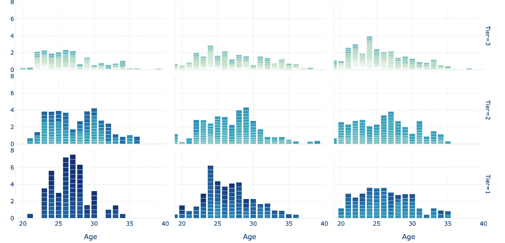
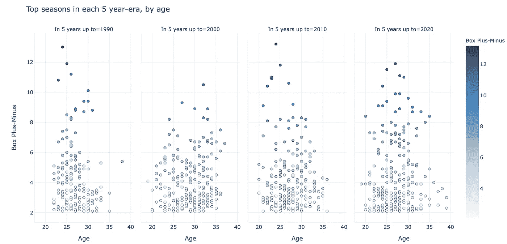
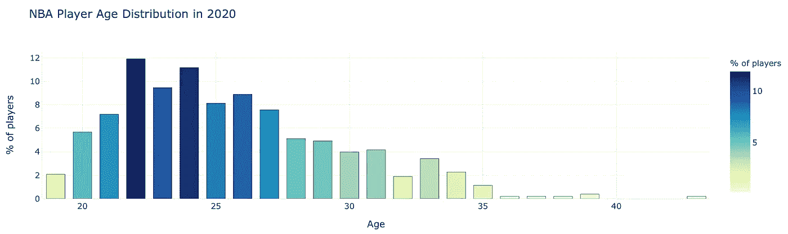
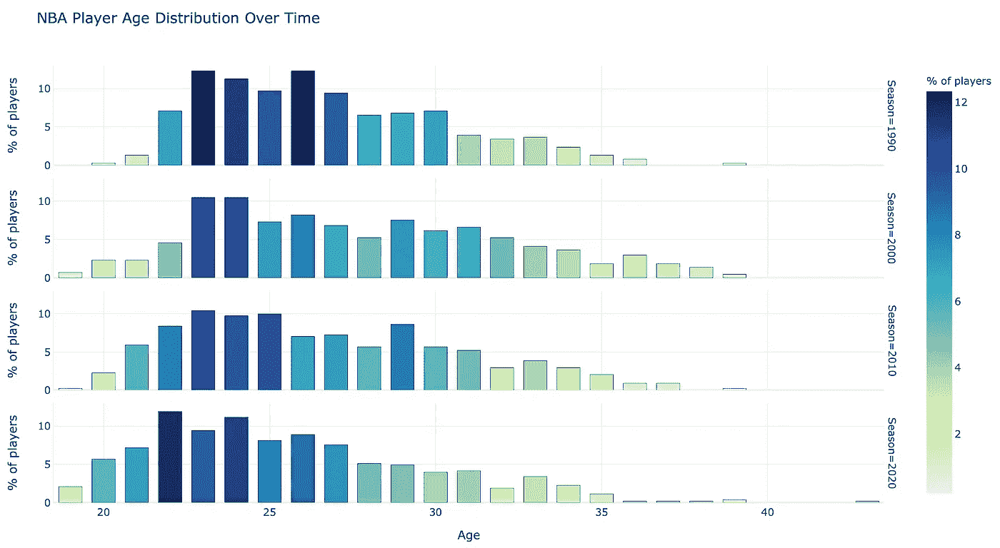
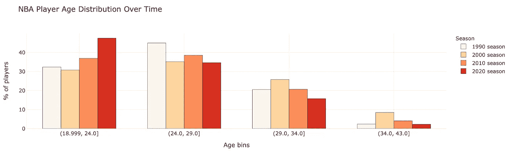
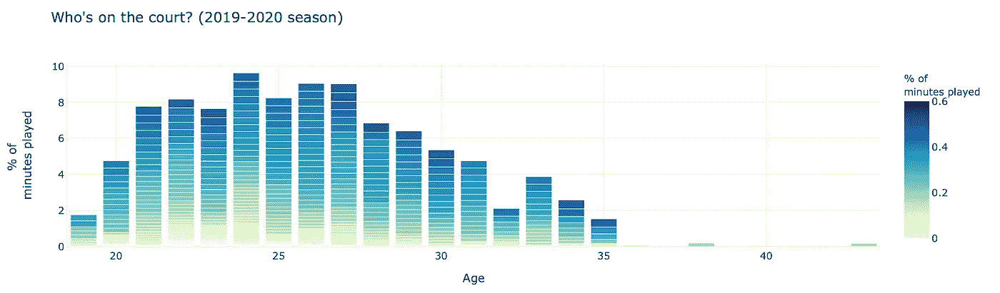
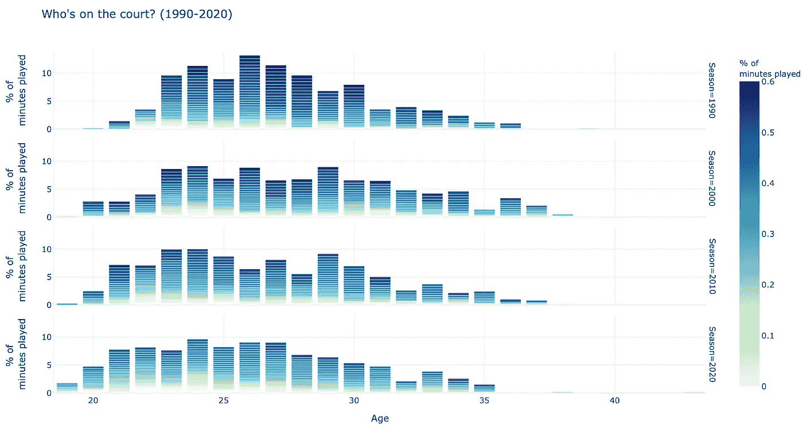
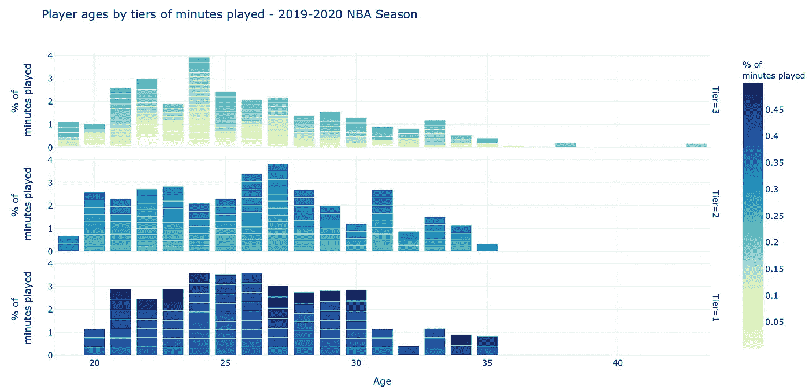
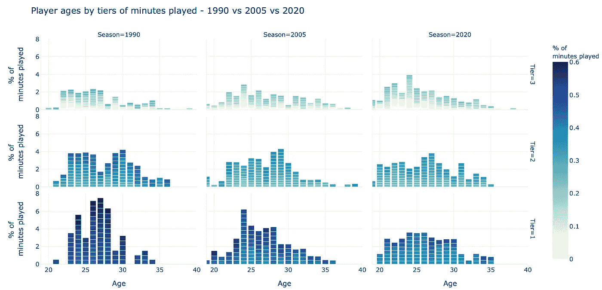

# 关于现代 NBA 的老龄化，数据告诉了我们什么？

> 原文：<https://towardsdatascience.com/what-does-data-tell-us-about-ageing-in-the-modern-nba-31bcc396f177?source=collection_archive---------26----------------------->

## 以数据驱动的视角看老龄化如何影响现代 NBA。联盟中最好的球员都多大了？现代玩家是不是越来越年轻了？谁得到上场时间了？

图片:作者

在过去的几十年里，随着许多顶级体育运动从早期的乘坐公共汽车和微薄的薪水成长和成熟为数十亿美元的大企业，体育科学也是如此。这一点在 NBA 表现得最为明显，在这个联盟中，每支球队的成功都更多地依赖于少数明星球员，而不是世界上任何其他团队运动。

为了让他的身体保持在最佳状态，据说勒布朗·詹姆斯雇佣了一个令皇室羡慕的团队。据说他的团队包括一名[生物机械师、康复教练、按摩师和私人厨师](https://www.sportscasting.com/lebron-james-personal-trainer-is-1-of-many-health-investments/)，而他的每间房子都包括一个高压氧舱以帮助康复。詹姆斯在 35 岁时仍然表现出 T4 MVP 的水平，当拉里·伯德这样的传奇人物在这个年龄退役时，很难对结果提出异议。

但是，这是真的吗？让我们看看这些数据，看看我们可以从现代 NBA 的最佳球员、联盟的总体构成以及球员的寿命和表现中了解到什么关于老龄化的信息。

# 联盟中最好的球员都多大了？

该图表显示了从 5 年期间(例如，1986-1990，或 2016-2020)收集的统计数据，绘制了每个球员的 [BPM (box-plus-minus)](https://www.basketball-reference.com/about/bpm2.html) 统计数据与他们年龄的关系。没有一个统计数据可以完美地描述一个球员的表现，但是 BPM 是一个很好的衡量一个人相对于联盟中其他人表现如何的标准。

为了关注那些有积极影响的球员，图表只显示了 BPM 值超过 2 的球员，也就是说每个赛季大约有 50 名球员。

越来越多的顶级 NBA 球员打得更好，时间更长。(图片:作者)

有两个趋势很明显。早些年的散点图在顶部更“尖”，4+BPM 的球员(*全明星球员*)集中在 23-28 岁。最近(页面右侧)，年龄不再是个人表现水平的决定性因素，数据更加分散。

从 2016 年到 2020 年的几年中，有多名球员(保罗/邓肯/吉诺比利/德克)在 35 岁以上的年龄已经创下了 2+ BPM 的赛季记录(见各图右下角)。一个 2+ BPM 的赛季旨在成为一个“好的开局”，这些赛季对于 35 岁以上的球员来说在 1986-1990 年或多或少是闻所未闻的，除了 1986 年卡里姆的最后一个伟大赛季。

# 现代 NBA 是年轻人的游戏吗？

在看别的之前，我们先来看看上一个(2019–2020)NBA 赛季球员的年龄概况。下面的图表显示了 NBA 球员的年龄分布。

2019-2020 年的大多数 NBA 球员年龄在 22 至 26 岁之间(图片:作者)

尽管图表一直延伸到 43 岁(祝贺文斯·卡特惊人的职业生涯)，但 NBA 球员最常见的年龄实际上是 22 岁。事实上，联盟中超过一半(55%)的球员年龄在 25 岁或以下。这的确是年轻人的游戏。

现在，让我们通过从 1990 年开始的时间快照来看看这是否总是正确的。我们在这张图表中向下移动的每一个子图都比前一个子图在时间上多了十年。

随着时间的推移，NBA 球员的平均年龄越来越年轻(图片:作者)

随着时间的推移(在图表中向下)，显示每个年龄段玩家百分比的列基本上向左移动。这告诉我们，年轻选手突破的比例已经越来越大。下一张图表把数据简化成了柱状图。

NBA 中 24 岁及以下的球员比以往任何时候都多。

每组按年龄显示球员的百分比，每个颜色条显示数据来自的每个赛季。

很明显，如果你是一名 30 岁或以上的现代 NBA 球员，你的工作越来越受到 24 岁以下球员的威胁。

当然，这与招聘规则的变化以及谁有资格有很大关系。T2 并不一定意味着年轻球员变得更好。所以接下来，让我们来看看更微妙的统计数据，而不仅仅是关于谁在联盟中的统计数据。

# 年轻与经验——谁在球场上？

2019-2020 年的大多数 NBA 球员年龄在 22 至 26 岁之间(图片:作者)

上面的分析只是简单地看了看谁在名单上。但是整场比赛都坐在板凳上，一场比赛只得到 5 分钟的上场时间，和一场比赛得到 30-35 分钟的首发上场时间是完全不同的。所以在这一部分，我们考虑了每个球员在球场上花费的时间。

绘制球员的上场时间，并按年龄分组，下面的图表出现了。

年长的球员通常比年轻球员得到更多的上场时间(图片:作者)

每一栏都是由每个球员的上场时间占联盟上场时间的比例组成的。所以上场时间越长的球员会被标上更蓝/更深的颜色，同时在每一栏占据更多的高度。另一方面，几乎不玩游戏的玩家可能不会对专栏有所贡献，他们会被标记为浅色。

与我们看到的第一张图表(下面再次显示以供参考)相比，我们可以看到年龄较大的球员一般比年轻球员获得更多的上场时间。

NBA 球员年龄(2019–2020 赛季)(图片:作者)

在这一点上，让我们扩展我们对上场时间的分析，来绘制一段时间内的数据。

NBA 球员越来越年轻，但每个球员上场的时间也越来越少。(图片:作者)

这个图表最好用两个词来描述——“负载管理”。这一趋势始于 20 世纪 90 年代末和 21 世纪初的圣安东尼奥马刺队，现在在整个联盟广泛采用，以最大限度地减少每个球队关键球员的磨损。

更具体地说，1990 年的上场时间图表覆盖着深黑色的条，表明单个球员的上场时间高度集中。随着时间的推移，这些酒吧的频率降低到 2020 年几乎没有任何球员承担他们在 90 年代曾经承担的负担。

结果，上场时间在不同年龄段之间，以及不同球员之间看起来更加公平。

尽管如此，这仍是大量需要消化和研究的数据。让我们从更细的角度来看一下数据。

# 明星时代 vs 角色球员时代(和板凳球员时代)

不可否认的是，一个 NBA 球队从球星到板凳球员都有不同的球员群体。因此，让我们将数据分组进行分析。

在这里，我根据球员的上场时间将数据分为三个“等级”——粗略的理论是更好的球员得到更多的上场时间。顶层代表每队平均前 2 名玩家，第二层玩家从 3 到 7，其余玩家是第三层玩家。

这个数据是为 2019-2020 赛季绘制的。

年龄较大的球员在上场时间较长的球员中占多数(图片:作者)

尽管 NBA 的组成主要是 26 岁及以下的球员，但大部分上场时间很长的球员实际上是 27 岁及以上。

我们一会儿将回到为什么。但在此之前，我们先来看看历史数据，通过比较 2020 年与 1990 年和 2005 年的相同数据，看看情况是否一直如此。

与 1990 年相比，2020 年“一线”玩家在各年龄组中的分布更加平坦。(图片:作者)

这张图表真实地讲述了一个故事，在 2020 年，每支球队的一线(最佳)球员很可能在 21 至 30 岁之间的任何年龄，而在 1990 年，他们最有可能在 23 至 28 岁之间，实际上在 26 至 28 岁之间。

2020 年的三级玩家群体中，年龄在 28 岁及以上的玩家数量更多，而在 1990 年，这一数字还很少，尤其是当他们达到神奇的 30 岁时。

所以，这张图表显示，尽管球员平均年龄更小，但是越来越多的有足够天赋和足够优秀的球员能够延长他们的职业生涯。

我们对拥有 20 多年职业生涯的文斯、德克和科比感到惊叹。我想知道 20 年后，甚至 10 年后，我们会不会认为这些职业生涯长度是多么罕见。

但是在你离开之前——如果你喜欢这个，在推特上打个招呼/关注一下！

如果你喜欢这篇文章，你可能会喜欢这些:

 [## 用 Plotly 实现交互式篮球数据可视化

### 用 hexbin shot 图表分析体育数据，用 Plotly 和 Plotly Express 分析气泡图(源代码&我自己的数据…

towardsdatascience.com](/interactive-basketball-data-visualizations-with-plotly-8c6916aaa59e)  [## Plotly Dash 与 Streamlit——哪个是构建数据仪表板 web 应用程序的最佳库？

### 用于共享数据科学/可视化项目的两个顶级 Python 数据仪表板库的比较——

towardsdatascience.com](/plotly-dash-vs-streamlit-which-is-the-best-library-for-building-data-dashboard-web-apps-97d7c98b938c) 

*原载于 2020 年 10 月 29 日*[*【https://www.jphwang.com】*](https://www.jphwang.com/data-on-aging-in-the-modern-nba/)*。*