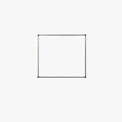
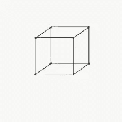

# 降维到底是做什么的？

> 原文：<https://towardsdatascience.com/what-does-dimensionality-reduction-do-really-15fb2980ea5?source=collection_archive---------65----------------------->

## 使用 Matplotlib 和 Scikit-learn 可视化 SNE 霸王龙

卢卡斯·本杰明在 [Unsplash](https://unsplash.com?utm_source=medium&utm_medium=referral) 上的照片

想象一下:一个学生正在上美术课，他们的老师让他们在一张纸上画一个立方体。现在，作为现实中一个精明的参与者，学生们意识到他们不能在二维平面上画三维物体。因此，凭借他们卓越的批判性思维能力，他们试图通过连接 4 个点在你的纸上画出立方体的一个面。

立方体在二维平面上的投影不正确||作者图像

这是一个很好的尝试，但是学生意识到他们没有保留立方体的**特征**，因为他们只在纸上画了一面。他们只在纸上画了 4 个点，而立方体上有 8 个顶点。他们继续画另一个形状:

将立方体精确投影到二维平面||作者图片

他们把这个结果给他们的美术老师看，老师对这个结果很满意。该学生减少了立方体的维度，同时仍然保留了使形状可识别的特征。你可能会问，这和 SNE 霸王龙有什么关系？嗯，这个例子就是这个算法的驱动原理。

复杂的数据集很难处理。在一家试图扩大数据集的大数据初创公司工作时，人们对收集的数据提出了许多问题。当数据集很小，仅包含几个要素时，开发人员可以创建简单的图来了解要素和所需输出之间的关系。然而，当数据集变得复杂时，会出现所有数据都失去意义的情况，开发机器学习模型来预测结果变得非常具有挑战性。这就是降维的亮点:试图降低特征集的复杂性，并产生更多可消化的数据，这些数据可以被处理并输入到机器学习模型中。在这篇文章中，我们将试图建立一个直观的关于这些降维技术是如何工作的。因此，我们已经讨论了*降维做什么，但没有讨论如何降维。让我们再来看看我们的艺术学生，看看 t-SNE 是如何工作的。*

当这个学生将三维物体投影到二维空间时，他在做什么？这位学生试图在高维度中查看点之间的关系，并在降维的同时保留特征。t-SNE 以非常相似的方式发挥作用，通过在更高的空间中创建点的概率分布来定义关系，然后在更低的维度中创建类似的分布。为了实现这一点，引入了一个称为**困惑度**的数字来描述我们的原始数据集的特征。低**复杂度**意味着该算法将尝试从更局部的角度减少数据，加重局部分组的权重。高**复杂度**意味着算法倾向于数据的全局结构。

t-SNE 找到了点与点之间的引力和斥力，最终的结果是当点在低维空间中沉淀下来。作为一个例子，我们将使用 MNIST 数字数据库，这是一个由手写数字组成的机器学习数据库，用于算法分类。这个数据集中有大量的**要素，仅从数据集来看并没有内在的分组。这个数据集中有 784 个维度，每个维度对应一个手写数字图像中的一个像素。我们看不到 784 维中的点，因此我们将尝试将该数据集的聚类降低到三维，以便更好地理解分组。**

MNIST 数据集上 SNE 霸王龙的可视化||作者 gif

让我们重温一下这部动画中发生了什么。t-SNE 在这个高维空间中寻找一个概率分布，然后在一个更低的维度中寻找一个与高维分布尽可能相似的概率分布。正如我们所看到的，t-SNE 正在寻找低维分布之间的相似性，然后最终确定了一个表达数据中良好分组的特征集。

# 从这里去哪里？

一旦这些数据点被投影到低维空间，现在就由开发人员来制定将在这个新数据集上工作的分类算法。t-SNE 不是一个分类器，而是一个工具，用来查看数据集的分类效果如何。这个系统可以被认为是一个太阳系，数据点小行星场围绕数据集的分类组旋转，t-SNE 作为引力将这些点拉近分类组。

下面是三维动画的代码。您需要做的就是将 scikit-learn 的 TSNE 实例传递给 tsneAnimate 函数，并调用 tsneAnimate.animate

作者代码