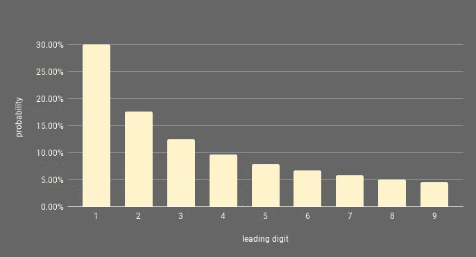
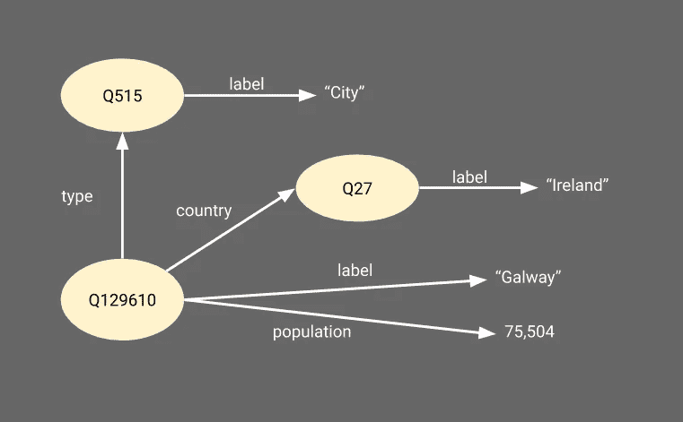

# 什么遵循/不遵循本福特定律

> 原文：<https://towardsdatascience.com/what-does-doesnt-follow-benford-s-law-7d0b3c14afa5?source=collection_archive---------9----------------------->

## 对维基百科数百组数据的分析。


循迹而行(图片由作者提供)。

像许多其他人一样，我第一次听说[本福特定律](https://en.wikipedia.org/wiki/Benford%27s_law)时，我想:“什么？太奇怪了！有什么诀窍？”然后，就没有诀窍了。它就在那里。这是一条没有明显理由就适用的法律。

如果你从来没有听说过，让我们来看看它是什么:想象一组来自一些现实生活现象的数字。比方说，地球上所有有人居住的地方的人口。会有成千上万的数字，有些很大，有些很小。这些数字的存在不是因为一些系统的过程，而是以某种方式出现在数十亿人数千年的生活中。因此，你会认为它们几乎完全是随机的。想想这些数字，如果我问你:“与 2、3、4 等相比，有多少是以数字 1 开头的？”，直觉上你可能会说:“差不多一样多”。你就错了。答案是:明显更多。

根据本福德定律(实际上应该称为纽康-本福德定律，见下文)，在跨越多个数量级的大量自然发生的数字中，任何数字的前导数字都更有可能是小而不是大。可能性有多大？形式上，一个数字以数字 *d* 开始的概率 *P(d)* 由下式给出:

> P(d) = log10(1+1/d)

这意味着，在这些自然出现的数字集中，一个数字以 1 开头的概率略高于 30%，而以 9 开头的概率略低于 5%。很奇怪吧？



根据本福特定律，一个数字开始一个数的概率。

这种奇怪的自然/数学现象最早是由[西蒙·纽康](https://en.wikipedia.org/wiki/Simon_Newcomb)(因此全名)发现的，他注意到包含[对数表](https://en.wikipedia.org/wiki/Mathematical_table)的书的开头页面比结尾页面(从 9 开始)磨损得多。基于这一观察，表明人们往往更需要对数表来表示从 1 开始的数字，他首先提出了现在所知的纽科姆-本福特定律，尽管第一个数字的概率公式略有不同。超过 65 年后，弗兰克·本福德再次发现了这一现象，并对几种不同的东西进行了测试，包括美国的人群。从那时起，它已经在许多事情上得到[测试和应用](https://medium.com/@marinatalamanou_1976/deception-meets-benfords-law-d8a825799885)，从金融欺诈检测到[代码](https://medium.com/@biberogluyusuf/testing-benfords-law-in-symfony-5-php-framework-9a59ce24292c)、[停车位](https://blog.smarking.net/does-the-number-of-parking-spaces-in-a-parking-garage-follow-benfords-law-2346c91e41cc)甚至 [COVID](https://medium.com/@prathyuakundi/fraud-detection-in-covid-cases-using-benfords-law-6380cbe151d2) 。这个想法是，如果一组数字自然出现，没有被篡改或人为限制，它们很有可能遵循本福特定律。如果他们不依法办事，那就有猫腻了。

但是这真的普遍适用吗？适用到什么程度呢？我们可以假设代表不同现象的数字在不同程度上遵循本福特定律，有时更多，有时更少，有时没有。所以问题是:

> 什么遵循本福特定律，也许更重要的是，什么不遵循？

为了回答这个问题，我们需要大量自然产生的数字。

# 维基数据拯救世界

纽科姆和本福特没有我们这么幸运。为了找到一组数字来检验他们的定律，他们不得不从任何可用的来源手动收集这些数字。如今，我们不仅有一个普遍可访问的百科全书，我们还有它的数据版本。

维基数据是数据的维基百科。这是一个众包数据库，即使不是全部，也是相当大的一部分。例如，使用维基数据，通过一个相对简单的查询，就可以快速获得美国每个城市的人口规模以及许多许多其他信息。因此，也应该有可能获得它包含的所有数字集合。

为此，我们使用基于 RDF 的维基数据表示。RDF(资源描述框架)是一种基于图形的网络数据表示。基本上，RDF 中的事物由 URIs 表示，并通过带标签的边与其他事物或值相连。例如，下图显示了位于爱尔兰、人口为 79，504 人的高威市在 Wikidata 的 RDF 中的简化表示。



维基数据中关于戈尔韦的一些信息的图示。

RDF 的好处在于，一个非常非常大的图可以用一组三元组来表示，其形式为 *<主语、谓语、宾语>* 。这些三元组中的每一个都对应于图中的一条边，代表一条原子信息。

```
<[http://www.wikidata.org/entity/Q129610](http://www.wikidata.org/entity/Q129610)> <[http://www.w3.org/2000/01/rdf-schema#label](http://www.w3.org/2000/01/rdf-schema#label)> “Galway” .<[http://www.wikidata.org/entity/Q129610](http://www.wikidata.org/entity/Q129610)> <[http://www.w3.org/1999/02/22-rdf-syntax-ns#type](http://www.w3.org/1999/02/22-rdf-syntax-ns#type)> <[http://www.wikidata.org/entity/Q515](http://www.wikidata.org/entity/Q515)> .<[http://www.wikidata.org/entity/Q515](http://www.wikidata.org/entity/Q515)> <[http://www.w3.org/2000/01/rdf-schema#label](http://www.w3.org/2000/01/rdf-schema#label)> “City” .<[http://www.wikidata.org/entity/Q129610](http://www.wikidata.org/entity/Q129610)> <[http://www.wikidata.org/entity/P17](http://www.wikidata.org/entity/P17)> <[http://www.wikidata.org/entity/Q27](http://www.wikidata.org/entity/Q27)> .<[http://www.wikidata.org/entity/Q27](http://www.wikidata.org/entity/Q27)> <[http://www.w3.org/2000/01/rdf-schema#label](http://www.w3.org/2000/01/rdf-schema#label)> “Ireland” .<[http://www.wikidata.org/entity/Q129610](http://www.wikidata.org/entity/Q129610)> <[http://www.wikidata.org/entity/P1082](http://www.wikidata.org/entity/P1082)> “75,504”^^<[http://www.w3.org/2001/XMLSchema#Integer](http://www.w3.org/2001/XMLSchema#Integer)> .
```

所以从维基数据中收集数字集合的第一步是提取所有的三元组，其中*对象*部分是一个数字。

我们首先下载整个 Wikidata 数据库的完整转储文件，作为一个压缩的 NTriples (NT)文件。NT 是 RDF 的一种非常低效的表示，其中每个三元组用一行表示。要下载的 gzip 文件([latest-all.nt.gz](https://dumps.wikimedia.org/wikidatawiki/entities/))相当大(143GB)，我不建议尝试解压缩。但是，因为每个三元组都在一行上完全独立于其他三元组表示，所以这种格式使得使用基本的 linux 命令行工具过滤数据变得非常容易，而不必将整个数据加载到内存中。因此，为了提取对象是数字的三元组，我们使用[*zgrep*](https://linux.die.net/man/1/zgrep)([*grep*](https://man7.org/linux/man-pages/man1/grep.1.html)处理 GZipped 文件)来查找引用了 *decimal* 、 *integer* 或 *double* 类型的三元组，如下所示:

```
zgrep “XMLSchema#decimal” latest-all.nt.gz > numbers.decimal.nt
zgrep “XMLSchema#double” latest-all.nt.gz > numbers.double.nt
zgrep “XMLSchema#integer” latest-all.nt.gz > numbers.integer.nt
```

然后我们可以使用 [cat](https://man7.org/linux/man-pages/man1/cat.1.html) 命令将所有这些放在一起:

```
cat numbers.decimal.nt numbers.double.nt numbers.integer.nt > numbers.nt
```

通过计算文件中的行数，检查这个 110GB 的文件最终包含了多少个三元组:

```
wc -l numbers.nt 
730238932 numbers.nt
```

每一行都是一个三元组。每个三元组作为一个数字作为值(对象)。这是一个很大的数字。

下一步是将这些数字组织成有意义的集合，并计算每个集合中有多少个数字从 1、2、3 等开始。这里，我们使用三元组的“谓词”部分。例如，该文件中有 621，574 个三元组以*<*[*【http://www.wikidata.org/entity/P1082】*](http://www.wikidata.org/entity/P1082)*>*为谓词。[*http://www.wikidata.org/entity/P1082*](http://www.wikidata.org/entity/P1082)是*属性*维基数据用来表示有人居住的地方的人口。所以我们可以将所有这些人分组，并将其纳入维基数据已知的所有人群的集合中。这将是我们要测试的一组自然出现的数字。

下面的简单 python 脚本创建了一个 JSON 文件，其中包含属性列表、作为谓词的三元组的数量、这些三元组的最小和最大值、它们覆盖的数量级以及以 1、2、3 等开头的数字的数量。

```
import time
import json
import redata = {}st = time.time()
with open("numbers.nt") as f:
    line = f.readline()
    count = 0
    while line:
        p = line.split()[1]
        val = int(re.findall("\d+", line.split()[2])[0])
        val1 = str(val)[0]
        if p not in data:
            data[p] = {"i": val, "a": val, "c": 0, "ns": {}}
        if val < data[p]["i"]: data[p]["i"] = val
        if val > data[p]["a"]: data[p]["a"] = val         
        if val1 not in data[p]["ns"]: data[p]["ns"][val1] = 0
        data[p]["ns"][val1] += 1
        data[p]["c"] += 1
        count += 1
        line = f.readline()
        if count % 1000000 == 0:
            print(str(count/1000000)+" "+str(len(data.keys()))+" "+str(time.time()-st))
            st = time.time()
        if count % 10000000 == 0:
            with open("numbers.json", "w") as f2:
                json.dump(data, f2)
    with open("numbers.json", "w") as f2:
        json.dump(data, f2)
```

我们总共获得了 1582 个属性，代表了要根据本福特定律测试的多组数字。我们将其减少到 505 个属性，因为在 Wikidata 中，相同的关系有几个冗余的属性表示。我们还在另一个脚本中提取每个属性的标签(名称)和描述，这样我们就不必在以后查找它们。

# Benfordness 测试

现在我们有了许多组数字，以及它们根据前导数字的分布，我们可以检查它们在多大程度上遵循本福特定律。几个统计测试可以用来做这件事。这里我们用一个相对简单的叫做[卡方](https://en.wikipedia.org/wiki/Chi-squared_test)的。该测试对一组数字的值由以下公式给出

> χ=σᵢ(oᵢ-eᵢ)/eᵢ

其中 *i* 是考虑中的前导数(1 到 9)， *oᵢ* 是 *i* 的观测值(集合中以 *i* 开头的数的百分比)， *eᵢ* 是期望值(根据本福特定律，应该以 *i* 开头的数的百分比)。结果越小，这组数字就越多。下面的脚本计算了前一个脚本创建的每组数字的卡方检验，以检查它们是否符合本福特定律。

```
import math
import sys
import jsonif len(sys.argv) !=2:
    print("provide filename")
    sys.exit(-1)es = {
    "1": math.log10(1.+1.),
    "2": math.log10(1.+(1./2.)),
    "3": math.log10(1.+(1./3.)),
    "4": math.log10(1.+(1./4.)),
    "5": math.log10(1.+(1./5.)),
    "6": math.log10(1.+(1./6.)),
    "7": math.log10(1.+(1./7.)),
    "8": math.log10(1.+(1./8.)),
    "9": math.log10(1.+(1./9.))    
    }print("expected values: "+str(es))data = {}
with open(sys.argv[1]) as f:
    data=json.load(f)for p in data:
    sum = 0
    for n in es:
        if n in data[p]["ns"]:
            sum += data[p]["ns"][n]
    cs = 0\.    
    for n in es:
        e = es[n]
        a = 0.
        if n in data[p]["ns"]:
            a = float(data[p]["ns"][n])/float(sum)
        cs += (((a-e)**2)/e) # chi-square test
    data[p]["f"] = cswith open(sys.argv[1]+".fit.json", "w") as f:
    json.dump(data, f)
```

# 那么，这是真的吗？

为了方便起见，获得的结果可以在谷歌的电子表格中找到。脚本和结果也可以在 [Github](https://github.com/mdaquin/benford_wikidata) 上获得。

查看结果时首先要注意的是，我们最喜欢的例子*人口*，表现非常非常好。事实上，它是本福德定律的第二最佳拟合，卡方值为 0.000445。这里面有超过 60 万个数字，只是碰巧存在而已，它们几乎完全符合本福特定律的预测。由于卡方检验值如此之低，样本又如此之大，这种巧合的可能性是如此之小，真的无法想象。它*是*真实的。

不出所料，其他几个与人口密切相关的属性也进入了最符合本福德定律的前十名，包括*识字* / *文盲*、*男性/女性人口*或*家庭数量*。

我敢肯定，每个人都渴望得到答案的问题是“那么，哪处房产是第一位的？”，由于*人口*仅次于。卡方值为 0.000344 时，第一名实际上属于名为*游客数量*的酒店，游客数量被描述为“每年参观某个地点或某个活动的人数”(总共 48，908 人)。

在非常高的本福德中，我们还发现了*面积*(被一个物体占据的面积)，或者*总有效票数*(用于选举。空白票数在 Benfordness 上也做的不错)。

维基数据的高度本福德属性中似乎也有不少与疾病相关的属性，包括*病例数*、*痊愈数*、*临床试验数、*和*死亡数*。

与公司相关的数字在顶级本福德酒店中也非常明显。财产*雇员*(一个公司的雇员人数)是其中最强的，但我们也看到*光顾*、*净收入*、*营业收入、*和*总收入*。

体育统计也有不错的表现，职业生涯中的*总投篮次数*、*职业生涯正负评分*和*职业生涯总得分*，还有几个生物学和其他自然相关的话题，如*翼展*(飞机或动物)、*自行*(星星)、*地形突起*(即一座山或小山的高度)或*距地球的距离*(天文物体)。

当然，还有更多非常符合本福德定律的特性:上面的特性只涵盖了最适合的几组数字(卡方小于 0.01)。它们也并不特别令人惊讶，因为它们非常符合通常应该遵循本福特定律的数字集的特征:它们很大(最小的*空白票数*，仍然包含 886 个数字)，覆盖几个数量级(从 3 到 80)，更重要的是，它们是自然发生的:它们不是通过任何系统的过程产生的。他们刚刚出现。

然而，有一个非常重要的例外。卡方值为 0.00407，覆盖 7 个数量级的 3259 个数字，我们找到属性 *Alexa rank。*这对应于来自 [Alexa 互联网服务](https://www.alexa.com/)的网站排名，该服务基于流量和受众提供网站信息。很难解释它怎么会如此吻合，因为作为一个排名，它通常应该从 1 到其最大值呈线性分布。然而，对于为什么会发生这种情况，有两种可能的解释:1-对于一个给定的网站，几个排名可能会持续几年，2-不是所有由 Alexa 排名的网站都在维基数据中。换句话说，遵循本福特定律的不是排名本身，而是维基数据中自然发生的排名选择。令人担忧的是，同样的事情也可能影响其他结果，这是一个很好的例子，表明任何数据集都可能以严重影响统计分析结果的方式产生偏差。

# 不好的呢？

因此，我们已经证实了本福特定律确实适用于许多自然产生的数，甚至有时适用于自然产生的非自然产生的数的选择。当它不起作用时怎么办？

首先，我们可以排除所有太小(少于 100 个数字)和数量级太少(少于 3)的集合。在大多数情况下，这些根本不符合，如果符合，我们不能排除这只是一个巧合的可能性。

我们研究的整套属性中最不合适的属性是*最低大气压力*，被描述为“风暴测量或估计的最小压力(热带气旋强度的度量)”，卡方为 12.6。该集合包含 1，783 个数字，从 4 到 1，016 不等。虽然这是一组符合所需特征的自然出现的数字，但很容易看出为什么它不适合。大气压力通常不会变化太大，可以预计大多数数值实际上接近于[平均海平面压力](https://en.wikipedia.org/wiki/Atmospheric_pressure#Mean_sea-level_pressure) (1013 毫巴)。甚至有可能 4 的值只是数据中的一个错误。

许多其他非拟合属性可以类似地解释:它们的值通常不会变化到足以遵循本福特定律，但例外和异常值使它们仍然跨越几个数量级。包括*轴距*(车辆前后轮之间的距离)*寿命**(物种)*视野*(例如设备)*电源电压*(在一个国家或地区)。*

*有趣的是(可能因为我对天文学一无所知)，虽然与自然现象有关，但许多不太拟合的属性对应于与行星或空间有关的度量:*轨道的半长轴*、*(恒星或行星的)有效温度*、*远日点* s(天体离其轨道运行的物体最远的距离)、*近日点*(天体离其轨道运行的物体最近的距离)、 *金属性*(一个天体中比氢或氦重的元素的丰度)和*轨道周期*(一个给定的天体绕另一个天体运行一周的时间)。 也许本福德定律是地球自然规律，甚至是人类自然规律，而不是宇宙规律。*

*然而，如果是这样的话，这里有一个有趣的例外:在真正不适合的属性中，我们发现*观众/听众数量*(电视或广播节目的观众数量；网站上的网络流量)。这组包括 248 个数字，从 5318 到 60 亿不等。考虑到 *Alexa 排名*(这与网站的受众规模有关)也是我们非常合适的属性的例外，这感觉非常矛盾。然而，也许同样的解释也适用:如果我们对每件事都有一套完整的订户/观众数量，它可能会很好地遵循本福特定律，但我们没有，这 248 个可能集中在最引人注目的网站和程序的选择所引入的偏见是一个足够不自然的约束，它使它失去了本福特特性。*

# *那又怎样？*

*本福特定律很奇怪。这是意想不到的，也没有很好的解释，但不知何故，实际上是可行的。很明显，有一类数字应该遵循本福特定律，事实上也确实如此。也有其他人显然不知道，在大多数情况下，知道原因相对容易。然而有趣的是，在一些情况下，数字并没有按照本福特定律的方式运行。正如本文开始时提到的，这种现象被广泛用于检测数字何时被篡改，通过检查应该遵循本福特定律而实际上没有遵循本福特定律的数字。似乎还有另一类应用程序在寻找不应该遵循本福特定律的数字选择。如果他们这样做了，这可能是一个迹象，表明看起来很像随机抽样不知何故出现了偏差的自然趋势，即不受控制的人类和自然过程必须产生高度本福特数。了解这一点，以及数据集应该属于哪个类别，对于测试数据是否存在偏差以及数据样本的代表性非常有用。*

*当然，还有天文学的例子。我怀疑答案只会强调我自己在这件事上的无知，但我真的很想知道为什么所有那些与天体有关的测量都如此顽固地拒绝遵守本福特定律。*