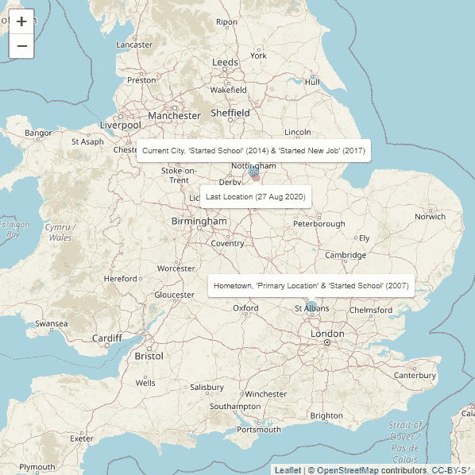
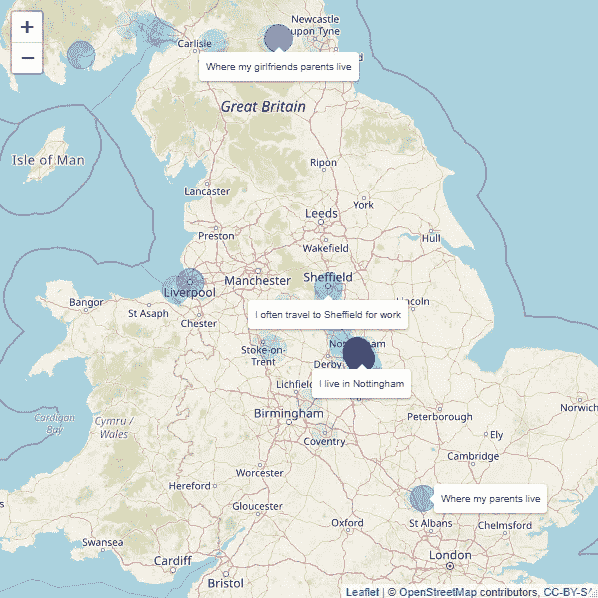
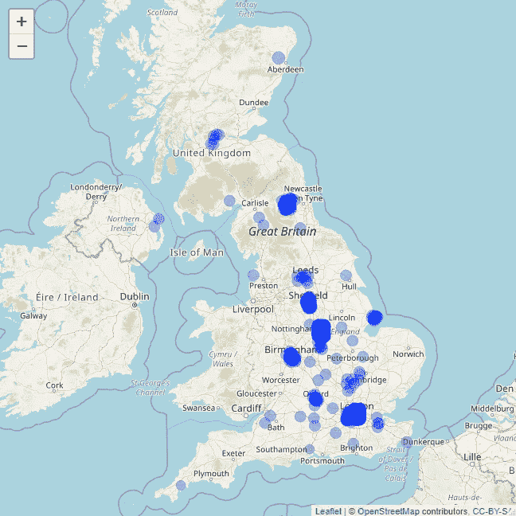

# 脸书知道我的位置吗？

> 原文：<https://towardsdatascience.com/what-does-facebook-know-about-my-location-4a6c372e1254?source=collection_archive---------46----------------------->

## 分析和可视化脸书在个人层面收集的地理位置和跟踪数据

> 这是我的“脸书到底了解我什么？”系列的第二部分在那里，我用数据科学分析了脸书收集的 7500 份关于我的资料。参见[第 1 部分分析我自己的脸书活动](https://medium.com/swlh/what-does-facebook-actually-know-about-me-5b0cb8cf609)、[第 3 部分了解脸书认为我喜欢什么](https://medium.com/swlh/what-does-facebook-know-about-my-likes-and-dislikes-eb88abeba265)、[第 4 部分了解脸书在其他网站上了解我的活动](https://medium.com/data-slice/what-does-facebook-know-about-my-off-facebook-activity-47c02006c2f)和[第 5 部分了解我 4.5 年的感情在脸书数据中是什么样子。](https://medium.com/@chris.brownlie/4-5-years-of-a-relationship-in-facebook-activity-13a8ddfc6a85)

如果你有一部智能手机，你使用的任何应用程序都可以追踪你的位置。令人欣慰的是，近年来限制这一点并识别哪些应用程序正在使用你的位置数据变得越来越容易，尽管许多人要么忘记检查这一点，要么根本没有意识到设置已经打开。

在这篇文章中，我将解决脸书收集了多少位置数据的问题，我将把它形象化，以展示如何用它来推断你的生活。

## 这就是我

第一种，也是最明显的一种，脸书获取我们位置信息的方式是我们自愿以个人资料的形式提供给他们。大多数人会输入他们的家乡、当前城市和/或工作地点，并让他们的朋友看到。

我也用脸书做过这个，下面你可以看到(大概)这些地方在英国的什么地方。希望这能提供一些背景信息，让下面的地图更容易理解。**请注意，在所有这些地图中，我使用的是脸书的精确坐标，但为了更好地形象化，我在这里将它们显示为圆圈**。

你可以在这里看到，脸书知道我在哪里长大、上学，然后我搬到诺丁汉上大学(2014 年)，毕业后留在那里，开始了新的工作(2017 年)。尽管这些都是公开信息，但值得指出的是，人们通常不会考虑这些“生活事件”是如何让你的身体位置随着时间的推移而建立起来的。

它还显示了我的“最后位置”，也就是我现在住的地方。友情提醒，脸书知道你住在哪里！

明确的个人资料位置并不是脸书存储您的位置数据的唯一方式，但是…

## 逻辑概念

脸书跟踪您位置的另一种方法是在您登录帐户时识别您的位置。我承认，我并不完全理解纳入这个数据集的标准，因为它不包括我每次打开应用程序的时间，但似乎主要是过去 18 个月的地点，还有一个是 2017 年的。它由 192 个地点组成。区域越暗，我从该位置登录的次数就越多。

我的脸书位置历史的地图，使用 r .标签的传单包装为进一步的上下文增加。

你可以立即看到这里的一些模式，可以用来作出推论——我在诺丁汉的生活是最明显的。我父母的房子和我女朋友的父母的房子都是热点，谢菲尔德也是，我经常去那里工作和上大学(反正是 Covid 之前)。

这些数据中包含的一些新信息是 trips 的证据。在过去的一年半时间里，我去过利物浦两次，还有苏格兰的邓弗里斯&加洛韦(地图左上角)。在这两种情况下，您可以看到我在终点登录，还可以看到我到达终点的路线:在往返苏格兰的途中经过卡莱尔，在往返利物浦的途中经过特伦特河畔斯托克。

你可以看到这些信息如何被用来跟踪我的位置，甚至预测它。如果你知道我要从家里去利物浦，你可能会认为我会经过或靠近特伦特河畔斯托克。

## 旅途中的生活

脸书发现我位置的第三种方法是利用我的账户活动。这是我在下载的数据中能找到的最大的一组位置信息。

追溯到 2017 年 10 月，我在**进行了超过 1500 次**操作，例如:登录、结束会话、更改密码或向我的账户添加信息(即支付信息)。这些的位置如下图所示。

首先要注意的一点是，这里没有显示账户活动的两个实例。一个来自华盛顿、西雅图(美国),一个来自德国的未知地点。这两个动作都是“登录检查失败”——大概是黑客试图访问我的账户。

我还应该提到，这似乎不是 100%准确。这可能是因为位置被调整到最近的城市中心/手机信号塔，或者因为位置是从 IP 地址计算的，而不是我的实际位置。话虽如此，绝大多数似乎有大致正确的位置，你可以在这里看到与以前相同的模式。

热点显示了我大部分时间呆在哪里——我的房子和家人的房子。我只能假设孤立的圆圈是我旅行的时候，要么作为乘客登录脸书，要么在去目的地的路上停下来。通过比较热点和单个位置，您可以看到实时跟踪我的位置并对我的最终目的地做出有根据的猜测是多么容易。

## Et fin

“脸书到底了解我什么？”系列的第二部分到此结束。我希望它已经有所启发，你也喜欢深入了解我生命中激动人心的故事。接下来，我将通过观察脸书认为我喜欢什么和不喜欢什么来深入我自己的内心——并给出我自己对它们的准确性的看法。我也会解释为什么有时候感觉脸书在听你的谈话…以及为什么他们没有。

如果你喜欢这篇文章和这个系列，那么请给我和[我的出版物数据片](https://medium.com/data-slice)一个关注以保持最新。第三部分明天开始！