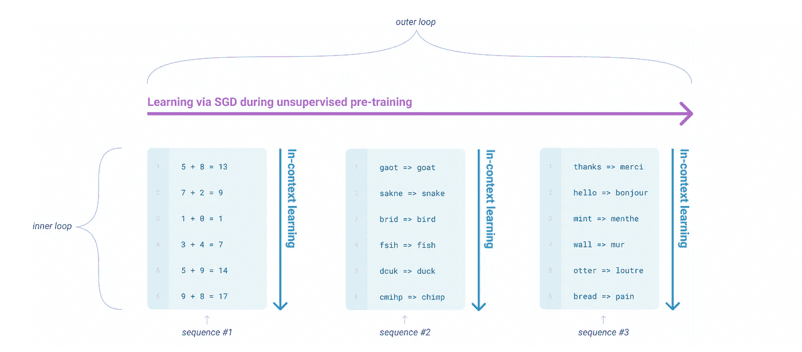

# GPT-3 对人工智能意味着什么？

> 原文：<https://towardsdatascience.com/what-does-gpt-3-mean-for-ai-58cd66616051?source=collection_archive---------25----------------------->

## GPT-3 改变用人工智能构建软件的公司规则的三种方式


GPT-3 是一个在大块互联网上训练的非常大的机器学习模型。苏珊·尹在 [Unsplash](https://unsplash.com/s/photos/books?utm_source=unsplash&utm_medium=referral&utm_content=creditCopyText) 上的照片

到目前为止，2020 年最大的人工智能新闻是 [OpenAI 巨大的新语言模型 GPT-3 的成功。在这篇文章中，我将快速总结为什么 GPT-3 会引起如此大的轰动，然后强调个人和公司用人工智能建造东西的 3 个后果。](https://arxiv.org/abs/2005.14165)

# GPT-3:非常简短的入门

为什么人们对 GPT-3 感到兴奋？原因如下，在三条推文中:

## *这是怎么回事？*

已经有很多关于 GPT-3 的总结文章，所以我不会在这里重复。

为了更好地介绍这个模型是如何工作的，请查看来自 Jay Alammar(非常优秀)的视觉指南[。关于这个模型的能力和局限性的严肃讨论，请看凯文·拉克尔的](http://jalammar.github.io/how-gpt3-works-visualizations-animations/)[给 GPT-3 做图灵测试](https://lacker.io/ai/2020/07/06/giving-gpt-3-a-turing-test.html)。

简而言之，GPT-3 是一个被训练成自动完成句子的模型。它已经在大量的网络上被训练过了。一路走来，它学到了很多有趣的东西。

## 为什么会发生这种情况？

事实证明，如果你试图从网上自动完成句子，记忆大量的东西是有用的。例如，如果你想完成关于巴拉克·奥巴马的短语，记忆一大堆关于他的东西会很有帮助。你还能怎样完成“巴拉克·奥巴马出生于 ____”这个句子？

所以这个模型已经了解了很多关于奥巴马的事情。还有川普。以及互联网上经常出现的任何人和任何事。

事实上，这不仅仅是学习事实，而是学习创造东西。你不能通过自动完成句子来创造东西，但是你可以通过自动完成代码来创造东西。原来互联网上有很多代码，所以模型已经学会写半连贯的代码。例如，它学会完成不是用普通散文写的句子。它可以完成用编码语言写的行，像 HTML & CSS。

最有趣的是，当短语的开头是代码中的*而不是*时，模型已经学会自动完成代码。让我们再来看看那条有趣的布局生成推文:

引擎盖下到底发生了什么？GPT-3 被输入了自然语言描述(输入到“生成”框中的提示)，它会自动完成大致满足这些描述的代码。大概这个模型已经学会了这样做，因为在训练期间它看到了很多教程，在这些教程中，人们用文字描述了代码正在做什么(“接下来，我们将制作一个看起来像西瓜的按钮……`)。`

这类演示让开发者争相获取 API，也让风投争相获取他们的支票簿。提示 Y Combinator 的[保罗·格拉厄姆](https://twitter.com/paulg)，硅谷的元老之一:

那么这对于用人工智能建造东西的人来说意味着什么呢？

# 1.从开放的 AI 到封闭的 AI


照片由[蒂姆·莫斯霍尔德](https://unsplash.com/@timmossholder?utm_source=unsplash&utm_medium=referral&utm_content=creditCopyText)在 [Unsplash](https://unsplash.com/?utm_source=unsplash&utm_medium=referral&utm_content=creditCopyText) 上拍摄

当前人工智能激增的一个特点是，代码，通常还有数据，可供任何人免费使用。机器学习的学术模型已经围绕像 [Arxiv](https://arxiv.org/list/cs.LG/recent) 这样的开放网站上的免费预印本合并在一起。传统的同行评审已经被发布你的模型并允许其他人修改它们所取代:基本上现在你可以发布任何你喜欢的东西，如果代码有效，你会因此而得到好评。

例如，NLP 向前迈出的最后一大步是 Google 的 [BERT 模型。这篇论文很快就有了代码，现在你可以通过优秀的包免费训练或使用 BERT 模型，比如](https://arxiv.org/abs/1810.04805)[变形金刚库](https://huggingface.co/transformers/)和[谷歌 Colab](https://colab.research.google.com/github/tensorflow/tpu/blob/master/tools/colab/bert_finetuning_with_cloud_tpus.ipynb) 笔记本上的免费计算。

GPT-3 与众不同，它太大了，业余爱好者(或大多数公司)无法自我训练，甚至无法运行。通常在深度学习中，训练模型很昂贵，但使用它们相对便宜，你可以在自己的笔记本电脑上完成。

但这里的情况并非如此:该型号需要大约 350GB 的内存来运行，这是我 2019 年 MacBook Pro 的 15 倍。而且你完全可以忘记训练它: [Lambda Labs 估计，使用云 GPU 进行训练需要花费 460 万美元。](https://lambdalabs.com/blog/demystifying-gpt-3/)

那么你如何进入 GPT 3 号？通过一个 API，这意味着你在互联网上发送文本，然后 [OpenAI](http://v) ，创造了 GPT-3 的公司，通过模型运行文本，并向你发送响应。

## 要使用 GPT 3，你必须为每次使用付费

这是*彻底*背离在你自己的基础设施上运行模型。这意味着:

*   OpenAI 每次用模型都赚钱
*   OpenAI 观察人们使用模型的不同方式
*   打开查看您发送给模型的数据

此外，对 API 的访问目前受到限制。这就形成了一种权力动态，一小部分人可以接触到 GPT 3 号，并对它说些好话，以保持这种竞争激烈的特权。想象一个流行的音乐节，门票有限，宣传力度很大。有点像 [Fyre festival](https://www.youtube.com/watch?v=uZ0KNVU2fV0) ，也许。

# 2.很少有人能活到老学到老

宣布 GPT-3 的论文标题是**“语言模型是一次性学习者”。**这到底是什么意思？

机器学习通过记忆模式来工作。从历史上看，每个模型都能够学习一组模式。例如，我们可以学习一个模型来告诉我们一条推文是正面的还是负面的。我们通过展示正面和负面推文的模型例子来做到这一点，并教它“看起来像这样的推文是正面的，看起来像这样的推文是负面的”。

如果我们想学习一个模型来告诉我们一条推文是否是关于培根的，那是一个不同的模型。你不能要求你的“正/负”模型形成对培根的看法。你训练一个新的。

这有点像一个不能真正弹钢琴的人去记忆特定歌曲的手部动作。也许他们可以完美地弹奏筷子，而且有一点灵活性:他们可以弹奏得更大声、更快或更断续。但是他们不能看乐谱给你弹首新歌。

真的，把这个和会弹钢琴的人相比。他们已经学会了如何快速学习一首新曲子。他们拿着音乐，练习几次，然后就可以演奏了。

这不是一个完美的类比，但它是一只可爱的小狗。信用:[吉菲](https://giphy.com/gifs/outkast-andre-3000-stankonia-ms-jackson-wkLC089tCSKs4oSXDF/media)

这就是 GPT 3 号能做的。它还没有学会演奏一首曲子。它学会了如何 ***快速学会演奏新曲子*** 。

这就是“少拍学”的意思。GPT-3 可以从几个例子中学会做一项新任务。例如，它可以学习做加法、拼写纠正或翻译，如论文中所述:



出自[原文](https://arxiv.org/pdf/2005.14165.pdf)。

请记住，这个模型最初只是被训练来进行自动完成(这就是顶部的紫色箭头所代表的)。

## 少数镜头学习允许没有数据的 AI

这很有趣，因为它破解了在现实世界中应用人工智能的一个巨大挑战:冷启动问题。除非你有一堆训练数据，否则你无法创建一个令人信服的模型。但是在你造出人们会使用的东西之前，你不可能真正得到数据。这是一个第二十二条军规。

GPT 3 号也许能够解决这个问题，因为它能够做很多开箱即用的事情。我认为将会有一个完整的剧本，从你的产品的 GPT-3 基线开始，然后弄清楚如何在其上分层专有数据和模型以进一步改进它。Jack Clark 在 [Import AI 217](https://jack-clark.net) 中强调了这一点，描述了来自 Salesforce 的 [GeDi 模型:](https://arxiv.org/abs/2009.06367)

> *[它]是研究人员如何开始构建插件工具、技术和增强功能的一个例子，这些工具、技术和增强功能可以附加到现有的预训练模型(例如，GPT3)上，以提供对它们更精确的控制*
> 
> **杰克，** [**进口艾刊 217**](https://jack-clark.net/2020/10/05/import-ai-217-deepfaked-congressmen-and-deepfaked-kids-steering-gpt3-with-gedi-amazons-robots-versus-its-humans/)

# 3.作为数据库的语言模型

近几十年来，最有价值的企业技术公司一直专注于存储和检索信息。大多数消费者都熟悉帮助你从网上检索答案的服务——比如谷歌——但你可能不太熟悉维持大部分经济运转的数据库技术，这种技术由甲骨文公司和 T2 SAP 公司出售。

如果你以前使用过数据库，你会知道你必须使用特殊的语言与它们交流。例如，要确定加拿大人口最多的城市，您可以这样写:

```
SELECT * FROM CITIES WHERE COUNTRY='CANADA' SORT BY POPULATION LIMIT 1
```

对大多数人来说，这是天书。

但是正如你从介绍中所记得的，这是 GPT-3 顺便从*学到的东西。所以你可能会问 GPT-3 这样的问题:*

```
"The most populous city in Canada is ____ "
```

它会自动完成

```
Toronto
```

## GPT-3 解决了数据库的输入和访问

这很重要，因为它解决了如何从数据库中获取数据的问题。

但它也解决了如何将数据存入数据库的问题。同样，这目前还不是很简单，需要专业知识。

在人工智能中，将事实输入数据库通常被称为“知识图构建”，这非常耗时，并且难以自动化。自 2012 年以来，谷歌一直在研究他们的知识图表——这是为出现在谷歌结果上方的有用信息框提供动力的东西——但 GPT-3 似乎在短短几个月的训练中复制了许多相同的内容，没有明显的努力。


该面板由谷歌的知识图谱提供。GPT-3 将允许其他公司以很低的成本制造类似的产品。来自[维基百科。](https://en.wikipedia.org/wiki/Knowledge_Graph#/media/File:Google_Knowledge_Panel.png)

GPT-3 只是绕过了“我应该如何构建我的数据库，以及如何将我的所有数据放入其中”的问题。它不会取代数据库的所有用途——例如，你必须有点疯狂才能让 GPT-3 存储你的航空公司的预订——但对于以一种易于检索的方式存储松散结构的数据来说，它将非常有用。

## 更新 GPT-3 将是一个关键的研究领域

为了让 GPT-3 成为一个有用的知识库，你需要能够轻松地更新信息。例如，如果加拿大人口最多的城市发生变化，我们需要一种方法让 GPT-3 知道。这将是一个非常热门的研究领域。显然你不想重新培训整个模型了([记得价格标签吗？](https://lambdalabs.com/blog/demystifying-gpt-3/))，但当世界发生变化时，调整一下也不错。

如果我们能够令人信服地解决知识更新的问题，那么我认为 GPT-3 驱动的知识图会非常有用。这里有几个例子:

*   由 GPT-3 驱动的客户服务机器人可以回答关于你的产品的问题，而无需任何人明确输入或更新这些信息。
*   科学知识的自然语言讯问(“明尼苏达州目前的 COVID 病例数是多少？”)
*   基于世界当前状态的自动完成系统，例如，在一封销售电子邮件中，你可以写“我们目前有 X 家商店，昨天我们服务了 Y 位顾客”，然后让 GPT-3 填写任何相关的统计数据。

# 结论

迄今为止，人工智能一直在努力实现其商业承诺。GPT-3 提供了一种令人耳目一新的新方法，绕过了击败许多早期人工智能项目的数据悖论。

然而，单个供应商控制对模型的访问是一个戏剧性的范式转变，还不清楚它会如何发展。OpenAI 尚未参与谷歌、亚马逊和微软发起的[云人工智能战争](https://www.gartner.com/en/documents/3981253/magic-quadrant-for-cloud-ai-developer-services)，但如果这些公司不以某种形式复制 OpenAI GPT-3 服务，那将令人惊讶。

最后，我认为将模型放在 API 后面会在技术的创造性应用方面带来意想不到的好处。可以说，这个领域已经受到了 ML 专业人员过高薪水的损害，这抑制了专注于创造创新事物的早期创业公司的增长。如果你的早期雇佣非常昂贵，以至于你需要花费所有的时间来筹集资金，那么你就很难专注于开发为用户提供价值的软件。通过 API 访问模型强调了一个事实:这不是魔术，这是一个工具。你可以用它做一些有趣的事情。

# 进一步阅读

*   深度学习怀疑论者加里·马库斯对 GPT-3 的批评
*   来自格温的 GPT-3 创意写作实验
*   我见过的 GPT-3 最有创意的用法:[死人的教训](https://twitter.com/mckaywrigley/status/1284110063498522624?s=20)

*原载于 2020 年 10 月 13 日*[](http://deberker.com/archy/what-does-gpt-3-mean-for-ai/)**。**