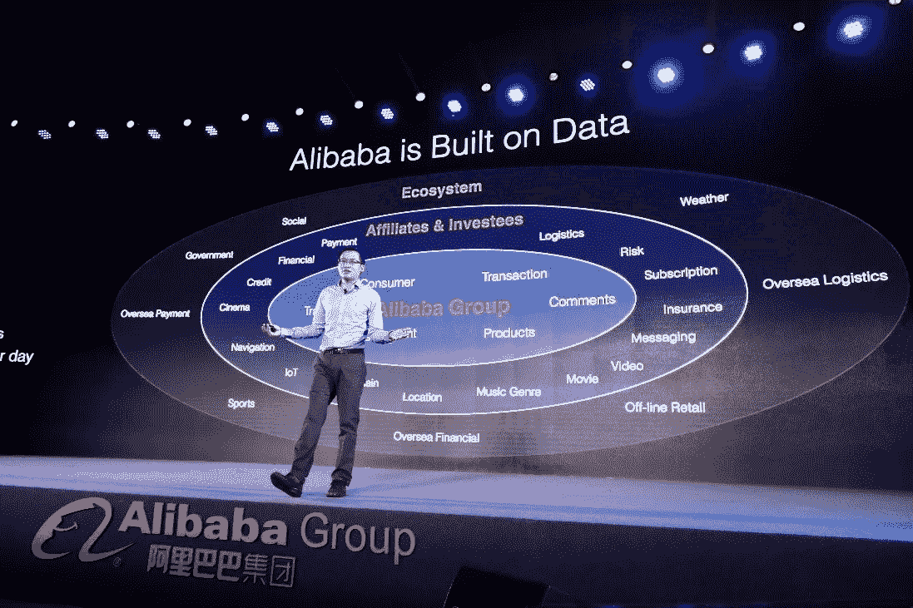

# 以人为中心的 AI 对管理意味着什么？

> 原文：<https://towardsdatascience.com/what-does-human-centric-ai-mean-to-management-a56a50da1d6?source=collection_archive---------31----------------------->

## *以人为中心的人工智能依赖于企业教育的能力，即清楚地理解管理者能带来什么*

图片来源:SecureWeek

人工智能背后的管理动机仅仅是通过用机器取代员工来减少人员编制吗？如果是这样，“以人类为中心的人工智能”充其量是弄巧成拙的废话。如果麻省理工学院将以人为中心的人工智能定义为“以深入、有意义的方式向人类学习并与之合作的(信息)系统的设计、开发和部署”，那么对于管理层来说，了解机器智能在哪里以及如何增强人类潜力也同样重要。以人为中心的人工智能依赖于企业教育的能力，以培养对管理者在日益数字化的组织中能够带来什么的清晰理解。

商科和工科学生需要了解 AI 在管理方面的哪些知识？在本系列之前的文章中，我们探讨了从“人工智能就绪”和人工智能项目管理到协作智能和数字化转型的主题。在这最后一部分中，我们将关注三个领域，我们认为这三个领域是任何关于“以人为中心”的人工智能的管理课程的核心:数字伦理的重要性，人工智能和创新之间的虚假联系，以及引入对人工智能价值的讨论。

# 数字伦理

数据伦理包括研究和采用尊重基本个人权利和社会价值观的数据实践、算法和应用。[【ii】](http://file///C:/Users/Lee/Dropbox/Articles/Human-centric.docx#_edn2)如果道德不是数据或算法的属性，那么当管理者依赖数据做出商业决策时，道德挑战就会自然产生。当数据和算法都反映了人类决策的愿景、偏见和逻辑时，人工智能不能与它旨在解决的更大的经济和社会挑战隔离开来，这些愿景、偏见和逻辑是否忠实地反映了商业的现实，如果不是，这些反映如何影响客户、组织和市场的管理观点？数据驱动的决策制定并不意味着在客观分析数据和主观影响行为之间做出选择，而是强调理解数据如何塑造人类感知和主动性的必要性。

从这个角度来看，讨论数据伦理的目的不是帮助管理者区分对错，而是促进关于什么是可接受的数字实践的讨论。在管理教育中，可以解决和探讨五个不同的挑战。由于个人数据成为数字经济的燃料，围绕个人身份信息、明确同意以及访问权、纠正权和被遗忘权的问题值得关注。算法已经成为决策自动化的关键，但管理者应该在多大程度上对由此产生的决策负责仍有争议。隐性偏见的问题同样重要，因为个人和集体的态度和偏见影响着我们对数据、认知、逻辑和伦理的使用。技术对我们如何以及为什么交流的影响也应该得到讨论——因为我们对数据的依赖已经微妙地改变了我们对“信任”、“隐私”、“真相”和“价值”的定义。最后，我们对数据驱动决策的承诺应该将“科学主义”提升到其他形式的人类智能之上吗？[【iii】](http://file///C:/Users/Lee/Dropbox/Articles/Human-centric.docx#_edn3)

图片来源:斯坦福大学

> *海有 121 名教职员工——超过 80%是白人，几乎同样多的是男性*

斯坦福大学以人为中心的人工智能研究所(HAI)是一个很好的例子，说明了研究伦理偏见变得多么困难和多么重要。基于“人工智能的设计者必须广泛代表人类”的立场，该大学在去年推出了 HAI，以“推进人工智能研究、教育、政策和实践，以改善人类条件”。[【iv】](http://file///C:/Users/Lee/Dropbox/Articles/Human-centric.docx#_edn4)“然而，当该机构公布领导该计划的 120 名教师和技术领导者时，他们都曾在世界顶尖的商学院和工程学院接受教育，其中超过 80%是白人，男性几乎与白人一样多。这个群体代表了整个人口，还是代表了过去五十年来主导这个行业的不同种族、文化和思想潮流？鉴于他们背景和教育的相似性，他们能够在多大程度上理解当地道德挑战的复杂性？如果数字化转型的目标是将数据转化为行动，教师们会采取行动来巩固现状，还是促进更具代表性或最终更令人满意的未来信仰多样性？

# 人工智能与创新

人工智能是创新的证明，还是至少是未来创新的必要条件？开发能够模仿人类行为的算法是一回事，制造能够创新的机器是另一回事。几个世纪以来，创新在很大程度上依赖于环境:不同时代的创新(技术推动、市场拉动、战略整合和网络)是由技术工具和市场动态在特定时间点的相互作用定义的。Tidd 和 Bessant 认为，今天的创新意味着通过解决经济或社会问题，应用产品、流程、立场或范式来创造价值。探索管理层如何利用机器智能来促进创新，为组织提供了一个重大机会，让他们可以将人工智能的讨论扩展到数据和算法之外，并讨论如何将这些技术应用到他们的业务中，并从中获利。

如果人工智能可以复制人类思维，企业利益相关者应该思考一下，为什么他们的管理者需要企业教育。课程讨论可以分析机器智能的现状，机器智能充其量只能掌握重复性任务(狭义人工智能)，以及“超级人工智能”的承诺，即能够重新制定组织试图解决的经济、社会和政治问题。研讨会可以探索为什么机器学习一直受到解决方案逻辑的束缚，而人类创新的根源在于发现明显问题的普遍性。研讨会可以帮助管理人员了解如何利用机器智能来识别数据中的可识别模式，以及为什么他们需要关注违反可编程逻辑的异常值。这一明显的悖论可能会在可预见的未来很好地制约管理培训:尽管人工智能永远不会成为创新的证据，但当与适当的培训一起使用时，人工智能构成了开发管理好奇心、创造力和创新的关键。

图片来源:阿里巴巴

> 当与适当的训练一起使用时，人工智能构成了开发管理好奇心、创造力和革新的关键

中国科技巨头阿里巴巴就是一个很好的例子。在不到二十年的时间里，阿里巴巴已经拿出了充分的证据证明其创新能力:其基于平台的商业模式预计仅今年一年就能从其在零售、互联网和技术领域的投资中获得 1000 亿美元的收入。通过利用互联网技术和数据智能来开发一个开放的、依赖技术的、以价值为中心的生态系统，阿里巴巴的管理层重新定义了“新零售”行业。[【VII】](http://file///C:/Users/Lee/Dropbox/Articles/Human-centric.docx#_edn7)其“智能商业”的愿景是基于人类和机器智能的匹配——每个核心业务流程都在一个在线网络中协调，并使用机器学习技术来有效地实时利用数据。管理层利用其基于云的 Alink 平台、支付宝和淘宝等应用程序以及阿里助手等发明，创建了一个由卖家、营销人员、服务提供商、物流公司和制造商组成的创新生态系统，其表现优于传统的商业基础设施。人工智能本身并不被视为目的，而是数据化、协调、激励和启发制造商和消费者以不同方式思考商业的创新过程中的基石。

# 人工智能与价值

AI 的价值是什么？“物有所值”在今天很大程度上是一个赘述，即使什么是物有所值的问题仍然是一个悬而未决的问题。一方面，消费者使用参照系来选择产品和服务，这些参照系决定了他们的价值。另一方面，今天的业务流程被设计成价值链的一部分，发挥着生产者和消费者的责任。在这两种情况下，对“财务价值”的认知都受到人类“价值”的制约，如质量、效用、公平、邻近性和所有权。如果人工智能的算法可以很容易地被训练来分析和探索成本，它们迄今为止几乎没有能力预测和/或影响人类对价值的感知。*指标捕捉了它们被设计用来衡量的东西，算法按照它们被教导的那样执行，而人们基于个人经验来评估数据的价值。*

数据没有内在价值，除了它如何被用来解决社会和经济挑战。人工智能的管理培训需要超越机器学习指标的相关性讨论，如精确度、准确度、召回率和灵敏度，以调查金融价值和人类价值之间的复杂关系。关于影响购买决策的认知因素的案例研究可以帮助参与者理解，决策者不是根据数据进行运算的冰冷的计算机器，而是根据他们的感觉和见解做出反应的经理和消费者。在将价值讨论引入人工智能研究的过程中，企业培训可以帮助管理层关注机器和人类代理之间的交互如何影响生产率、有效性和质量。机器既不创造也不获取价值，而是人。

图片来源:灰色海岸媒体

> *只要人类还在购买和消费，价值的本质就永远不会被算法捕捉到*

探索人工智能的管理挑战提供了一个恰当的例子。将人工智能的研究局限于其技术组成部分，可能会导致对人工智能对消费、生产和投资的不可避免的影响的盲目管理。如果价值不是在数据本身中捕获的，它就在元数据中表示，元数据的内在、外在和系统维度定义了如何组织和解释数据。如今，数字资产的管理需要深入理解评估数字资源时固有的封闭分类法和开放大众分类法的语义。[【VIII】](http://file///C:/Users/Lee/Dropbox/Articles/Human-centric.docx#_edn8)对价值而非成本的核算导致管理层反思人工智能和生产力之间的联系，这反过来又可以导致对决定数字经济中组织核心活动的生产边界的重新定义。最后，重新制定生产率指标可以促进关于激励和利润的讨论，并有机会将投资策略从计算股东的 ROI 转变为计算价值链中所有参与者的投资回报。

# 我们学到了什么？

如今，人工智能领域的企业培训需要帮助管理层超越数据和算法，探索人工智能如何改变组织和市场。商业努力的未来成功不取决于人工智能，而是取决于能够利用数字技术提高人类潜力的管理者。在这个由三部分组成的系列中，我们讨论了我们认为应该成为任何人工智能课程核心的九个主题:

*   人工智能和战略——人工智能如何影响我们思考商业的方式。
*   人工智能就绪性——组织准备利用人工智能优势的程度
*   人工智能项目管理——将人工智能实验作为与组织的业务目标、背景和资源相一致的项目进行管理
*   协作智能——设计人机代理网络，以促进知识、专业技能和偏好的众包
*   管理决策——关注机器学习在何时何地可以帮助管理者将数据转化为行动
*   数字化转型——认为数字化技术不会改变公司和市场，而是会改变人。
*   数字伦理——管理者依靠数据做出商业决策时出现的伦理挑战
*   人工智能与创新——人工智能在开发管理好奇心、创造力和创新中的作用。
*   人工智能、价值和价值——人工智能的价值研究

在每种情况下，管理技能而不是技术悟性被证明是将人工智能的承诺与每个组织的战略、资源和文化相结合的基础。

Lee Schlenker 是 BAI 的校长，也是商业分析和社区管理教授。他在 LinkedIn 上的个人资料可以在的查看

______________

[【I】](http://file///C:/Users/Lee/Dropbox/Articles/Human-centric.docx#_ednref1)Schlenker，L. (2020)，[管理在人工智能课程中的地位](https://medium.com/swlh/the-place-of-management-in-an-ai-curriculum-167fddad25f)和[匹配人机智能](/matching-human-and-machine-intelligence-41125c88a9fa)

[【ii】](http://file///C:/Users/Lee/Dropbox/Articles/Human-centric.docx#_ednref2)Schlenker，L. (2020)，[嘿 Siri，成为人类意味着什么？](/hey-siri-what-does-it-mean-to-be-human-f06fa6e251ce)，走向数据科学

[【iii】](http://file///C:/Users/Lee/Dropbox/Articles/Human-centric.docx#_ednref3)比如，情感(人际)、语言(文字智能)、内省(自知)和精神(存在)智能

[【iv】](http://file///C:/Users/Lee/Dropbox/Articles/Human-centric.docx#_ednref4)O ' Neil，P.H. (2019)，[斯坦福大学的新研究所，以确保人工智能是“人类的代表”，其工作人员大多是白人](https://gizmodo.com/stanfords-new-institute-to-ensure-ai-is-representative-1833464337)，Gizmodo

[【v】](http://file///C:/Users/Lee/Dropbox/Articles/Human-centric.docx#_ednref5)Tidd j .，Bessant J. (2013)管理创新。整合技术、市场和组织变革

这些预测是在当前的经济衰退之前预测的。

[【VII】](http://file///C:/Users/Lee/Dropbox/Articles/Human-centric.docx#_ednref7)曾，M. (2018)，[阿里巴巴与商业的未来](https://hbr.org/2018/09/alibaba-and-the-future-of-business)，

[【VIII】](http://file///C:/Users/Lee/Dropbox/Articles/Human-centric.docx#_ednref8)ka gle，k .(2019)[元数据的价值](https://www.forbes.com/sites/cognitiveworld/2019/02/26/the-value-of-metadata/#5023a3126d30)《福布斯》