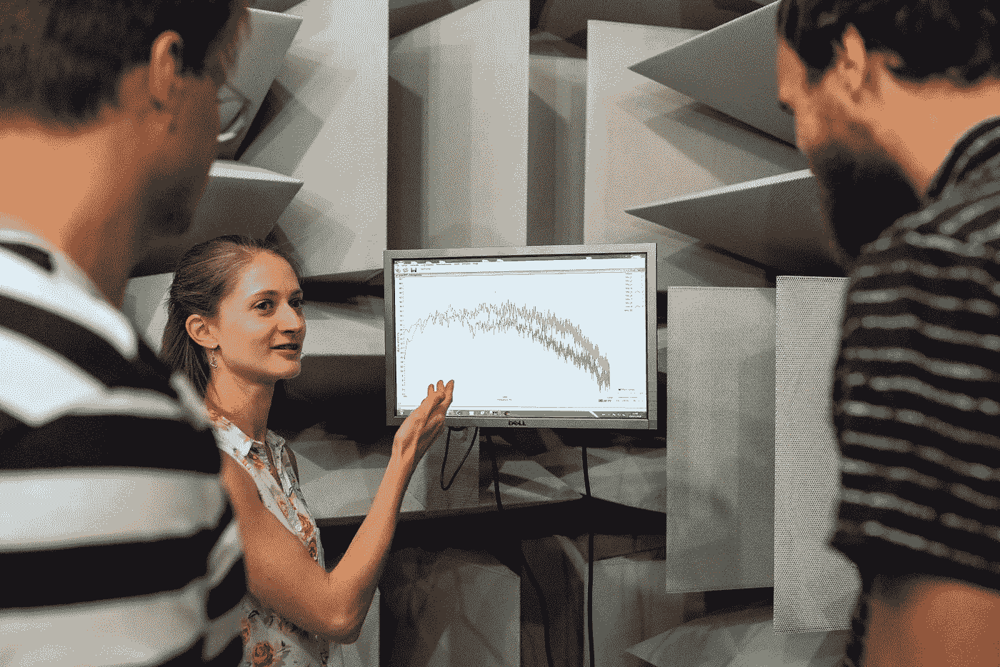

# 拥有数据驱动的思维模式意味着什么？

> 原文：<https://towardsdatascience.com/what-does-it-mean-to-have-a-data-driven-mindset-a4d5da509a99?source=collection_archive---------41----------------------->

## 我把它分成三个主要步骤

在 [Unsplash](/s/photos/graphs?utm_source=unsplash&utm_medium=referral&utm_content=creditCopyText) 上拍摄的 [ThisisEngineering RAEng](https://unsplash.com/@thisisengineering?utm_source=unsplash&utm_medium=referral&utm_content=creditCopyText)

*更喜欢看这个？* [*在 YouTube 上查看我的视频。*](https://youtu.be/YCB4GUd5P1c)

今天，我和一个人聊天，讨论数据科学项目的障碍。有一次，我解释了一个人成为数据科学家需要什么技能。我提到的一件事是，我认为数据科学家应该具有数据驱动的思维模式。在我说了之后，我意识到，我不太明白我说的是什么意思。关于什么是数据驱动的心态，它如何影响公司，数据意识的水平等等，有许多解释。我指的不是那种公司的胡言乱语。我的意思更多的是在个人层面上；作为人，我们如何被数据驱动。经过思考，我总结出它包括三个关键概念:

# 习惯用数据支持你的决定

当你成为一名数据科学家，你的生活将围绕数据展开。你需要习惯于根据这些数据做出决定。这也包括你对如何分析数据所做的决定。你必须养成不做很多不必要假设的习惯。

*   需要为您的模型选择参数吗？比较一下，看看哪个效果最好。不要只使用随机值。
*   不确定如何处理你丢失的价值观？看看这些数据，看看你能做些什么来填补这些空白。不要只是移除它们。

这需要一段时间来适应，因为作为人类，我们的生存要感谢我们的大脑能够根据“表面”模式假设事情。但当你在处理数据时，最重要的是能够抛开你凭信念做出假设的本能，开始通过观察做出假设。

当我刚开始的时候，我发现记下我在一个项目中所做的假设很有帮助。然后我会再看一遍，看看我能否用我掌握的数据来支持它们。

# 阅读数据时保持客观的能力

除了根据数据做出决定之外，你还想确保你看到的正是正在显示的内容。很容易陷入这样一个陷阱:只看到让我们高兴的东西，而忽略其他的东西。我也犯过这种错误，我会忽略滑稽的外观(因为有点太糟糕了，不舒服)性能指标，希望它没有任何意义。相信我，最后，它意味着什么，它会制造麻烦。因此，你需要能够解决出现在你面前的问题，而不把它们过滤掉。

# 理解使用数据的可能性和局限性

了解您可以用数据做什么是数据科学家的主要职责之一。知道你不能做什么至少和那一样重要。这都是关于保持现实的期望，同时意识到潜力。

这就是为什么能够现实地处理问题和解决方案是拥有数据驱动思维的一部分。您可以通过问自己以下问题来衡量自己对每个项目的理解:

*   我能在脑子里把这个问题形式化吗？
*   它符合数据科学的格式吗？
*   什么是输入和输出？
*   他们是如何表现的？

数据驱动的思维模式不是一夜之间就能学会的。你必须练习，接受批评，保持警惕，发现你可能犯的任何错误。它基本上是一个框架，你应该训练你的大脑通过它来看待生活。从这个意义上说，这不仅仅是数据科学家的事。这也适用于现实生活。

尤其是最近，互联网上有很多错误的信息。我们可能会在我们的提要中看到许多未经证实和不真实的“事实”。这正是数据驱动思维可以帮助你的地方。不要相信你看到的第一件事，你可以研究它，收集信息和数据，然后做出自己的决定。通过寻找事实和证据来支持你的想法和说法，你就是数据驱动型的。

这些都是需要记住的好事情，但是最终获得数据驱动思维的方法是通过实践数据驱动技术。你可以这样做的一个方法是参加我的[动手数据科学课程](https://www.soyouwanttobeadatascientist.com/hods)，我们立即动手，通过做来学习*。去看看。我保证，当你将自己的实践技能付诸实践，亲身体验现实生活中的项目时，你会对自己进步的速度印象深刻。*

🐼*想更多地了解熊猫吗？* [*获取我的免费熊猫小抄。*](https://www.soyouwanttobeadatascientist.com/pandas-cheat-sheet)