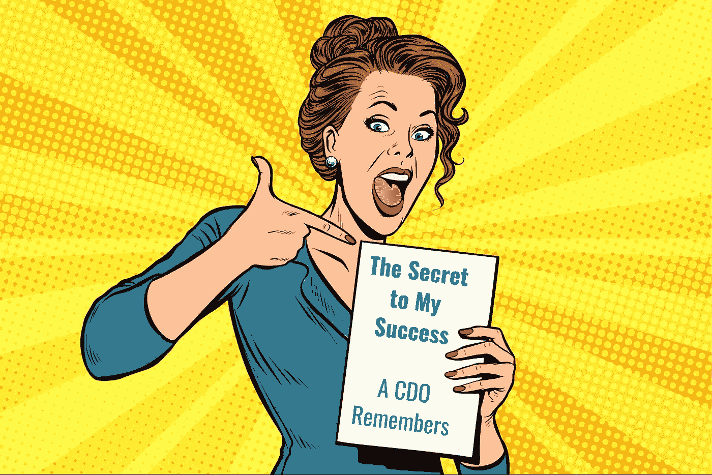

# 在新冠肺炎时代，如何才能成为成功的 CDO 人？

> 原文：<https://towardsdatascience.com/what-does-it-take-to-succeed-as-a-cdo-in-the-age-of-covid-19-f01b48710f3f?source=collection_archive---------34----------------------->

## *2020 年首席数据官研讨会的三大要点*

*图片由*[*studiostocks*](https://www.shutterstock.com/g/studiostoks)*上*[*Shutterstock*](http://shutterstock.com)*。*

*2020 年 3 月新冠肺炎袭击美国时，* [*疾病控制中心*](https://www.google.com/search?q=CDO+cdc&rlz=1C5CHFA_enUS905US905&oq=CDO+cdc&aqs=chrome..69i57j0.11687j0j7&sourceid=chrome&ie=UTF-8) *聘请的第一个角色是首席数据官。毫不奇怪，在今年的全虚拟* [***麻省理工学院首席数据官研讨会***](https://mitcdoiq.org/) *上，新冠肺炎和 GDPR，这两个在文化相关性方面很接近的堂兄弟，是所有人的首选。*

*在本文中，我分享了此次活动的三个重要收获，并提出了 CDO 在这个远程优先、数据至上的世界中保持竞争优势的后续步骤。*

这是麻省理工学院年度首席数据官研讨会的第一天，第四个小时，尽管完全是虚拟的，但对话却非常真实。

我的第一个“太真实”的时刻出现在一个小组讨论会上，从麦当劳到美国银行，一些世界上最令人印象深刻的公司的 CDO，以来自 [Milind Kamkolkar](https://www.linkedin.com/in/milind-kamkolkar-9162301) 、Cellarity 的 CDO 的智慧金块的形式出现:

> “在当今世界，成为数据驱动型企业就意味着成为一家企业。”

*是*！如果我在观众席上，我会开始鼓掌。(也许我做到了，只是一点点，在我的电脑屏幕前)。

在研讨会上，Milind 的评论和其他数据领导者的许多其他评论谈到了一个不可否认的事实，即数据以及 CDO 的作用对每个企业都变得越来越重要。

随着事件的进展，一个主要主题出现了:新冠肺炎和 GDPR(2020 年最热门的两个话题)永远改变了 CDO 的成功形象，无论哪个行业，数据团队都必须响应他们的要求，才能在各自的岗位上取得成功。

正如 NewVantage 首席执行官兰迪·比恩(Randy Bean)在题为“确保首席数据官角色的成功”的小组讨论会上所强调的那样，现代 CDO 的职责仍在萌芽和演变中。在研讨会的过程中，发言人提出了他们自己的论点，即 CDO 应该关注什么，以及他们应该如何制定自己的战略，以满足新冠肺炎、GDPR 和其他行业变革的需求。

尽管他们存在差异(就像[雪花](https://www.montecarlodata.com/how-to-migrate-to-snowflake-like-a-boss/)，没有两个 CDO 是相同的)我发现他们都同意**的三个关键事情**:数据治理的健壮和**自动化方法的重要性**，对**数据质量** **解决方案**的需求，以及数据民主化的承诺。重要的是，**数据民主化**有可能在公司范围内真正扩大前两项计划和许多其他计划的影响。

# 数据治理应该自动化

为了跟上不断发展的法规遵从性需求，团队应该优先考虑自动化数据治理任务。图片由[斯科特·格雷厄姆](https://unsplash.com/photos/5fNmWej4tAA)在 [Unsplash](http://unsplash.com) 上提供。

新冠肺炎和 GDPR 已将数据治理置于许多 CDO 的前沿和中心，但手动合规方法已不再奏效。手动编目和监控上游和下游的数据依赖关系使得团队很难跟上 PII 处理需求。

尽管所有行业都被迫适应这一新规范，但或许没有哪个行业像金融服务业或联邦政府那样受到如此大的影响。问问硅谷银行的 CDO[卡拉戴利](https://www.linkedin.com/in/cara-dailey-34b1061a)和美国空军的 CDO[艾琳维德林](https://www.linkedin.com/in/eileen-vidrine-4899339)就知道了。在两次单独的会谈中，Cara 和 Eileen 详细阐述了对更高级的数据治理方法的需求，该方法利用 ML 来解决这些问题，将数据人员从繁琐、容易出错的任务中解放出来，这些任务可以通过自动化更有效地解决。

Cara 表示，自动化数据目录是其组织数据治理战略的基础。

> 卡拉说:“CDO 这个角色不适合胆小的人。”。“对于许多没有投资基础数据基础架构、数据管理实践和数据质量的公司来说，数据治理是一项艰巨的任务。因此，CDO 通常会重新开始或修复出错的数据治理计划。”

同样，Eileen Vidrine 分享说，美国空军投资了一个自主开发的联合数据目录(称为 VAULT)来处理数据治理。

“我们的最终目标是让 VAULT 平台对每个航空人都是可用的，就像基础设施一样，”她说。“为了实现这一目标，我们将真正投资于**自助式自动化数据治理**，以便我们能够在空军的各个领域同步做出有关我们数据的决策。”

# 优先考虑数据质量

如果数据断了，没人听到，会发出声音吗？图片来自*图片来自*[*studiostocks*](https://www.shutterstock.com/g/studiostoks)*on*[*Shutterstock*](http://shutterstock.com)*。*

坏数据不会放过任何人，这是一个保守得不好的秘密。

问问[劳伦·加德纳](https://www.fastcompany.com/90525437/most-creative-people-2020-lauren-gardner)博士就知道了，他是约翰·霍普金斯大学传奇的[新冠肺炎全球仪表板](https://coronavirus.jhu.edu/map.html)的创造者之一，该仪表板追踪冠状病毒确诊病例、康复和死亡的数量。该地图被广泛认为是实时了解疫情状况的主要信息来源，为世界各地的社区提供了一种方便用户的方式来了解疾病如何影响他们的地区。

根据劳伦的说法，准确的数据是地图功效的核心，但不同国家跟踪和报告数据的差异影响了各种指标，包括病死率(换句话说，死亡率)。

她说:“这些比率因国家而异，从不到 1%到 25%不等。”“实际上不太可能有这么大的差异。更有可能的是，这是一个多因素的问题，即所报告数据的数据质量。”

在与其他数据领导者的小组讨论中，中国银行的 CDO Richard Goldberg 指出，进攻性和防御性数据战略之间的区别在于识别和解决数据质量问题的能力，以免它们成为问题。

> “重要的是实施数据战略，认识到 CDO 不仅仅是一名消防员，”他说。“最终，我们需要开始以一种有知识和健康的方式使用数据，并以高度的信心利用数据。要真正实现创新，我们需要对数据一致性负责。”

# 在公司范围内推动数据民主化

数据民主化是在公司范围内扩大数据影响的关键。图片由 [Unsplash](http://unsplash.com) 上的[安妮·斯普拉特](https://unsplash.com/photos/QckxruozjRg)提供。

从美国空军到 Capital One，分散的数据分析方法正迅速成为新的规范。由专业的实践者团队将洞见生成锁起来的日子已经一去不复返了。

[美国运通的 CDO 丹妮尔·柯普](https://www.linkedin.com/in/danielle-crop-b3565b17)指出，她的团队对数据民主化的优先考虑有助于在公司范围内扩大数据的使用(和影响)。这种民主化为 Capital One 的所有数据团队提供了释放其数据潜力的必要工具，并进而利用这些工具做出更明智的决策。

“重要的方面是尽可能集中数据管理，然后分散/联合数据的分析、ML 和 BI 方面，”Danielle 说，这与数据网格没有什么不同。

数据民主化的另一个要素是跨公司跨职能的数据最佳实践传播。

Eileen Vidrine 认为，数据是一项团队运动。

> “这不是一个办公室在数据领域的工作，”她说。“这是关于建立那些伙伴关系。为了快速行动，我需要整个部门的变革倡导者。”

尽管如此，几乎所有的数据领导者都强调，要大规模实施数据民主化，仍有许多工作要做，特别是考虑到新冠肺炎已经高度重视数据驱动决策。

ThoughtSpot 的首席数据战略官 Cindi Howson 发表了一篇关于如何发展数据驱动文化的演讲，很好地回应了这种必要性。

根据她在 ThoughtSpot 的团队委托进行的一项关于 CDO 有效利用数据的主要障碍的调查，她说，“即使在疫情期间，当释放数据的价值很重要时，82%的首席债务官也说文化是他们的主要障碍。”

> 我的意见:如果我们让负责任地使用数据变得更容易、更容易，这些工具将会被更多人采用，反过来，更有影响力的数据应用将会真正为您的公司发挥作用。

# CDO 的下一步是什么？

CDO 的作用仍在演变。最终，解决这三个支柱(数据治理、数据质量和数据民主化)是很重要的，但是最重要的是，您需要将您的数据组织的优先级映射到您的业务需求。除此之外，[没有新奇的数据目录](https://www.montecarlodata.com/what-we-got-wrong-about-data-governance/)、令人兴奋的分析工具或云仓库迁移会给你带来成功。

您的业务需求通常可以归结为影响底线的因素，无论这意味着实现收入目标、销售配额，还是新用户注册。您需要确定哪些数据将帮助您的公司实现这一目标，以及如何让您的团队成功地快速、合规且最有效地获取和利用这些数据。

就这样，我将留给你另一个来自研讨会的“太真实”的智慧金块，由万事达卡 CDO [乔安·斯通尼尔](https://www.linkedin.com/in/joann-stonier-5540b86)提供:

> “你可以在不同行业之间调整某些数据技能，但你的数据策略绝对要遵循你的业务策略。”

***欲了解更多来自数据世界的更新和热点，请务必关注蒙特卡洛的*** [***数据停机博客***](http://montecarlodata.com/blog?utm_source=blog&utm_medium=medium&utm_campaign=cdo_symposium&utm_term=august) ***。***