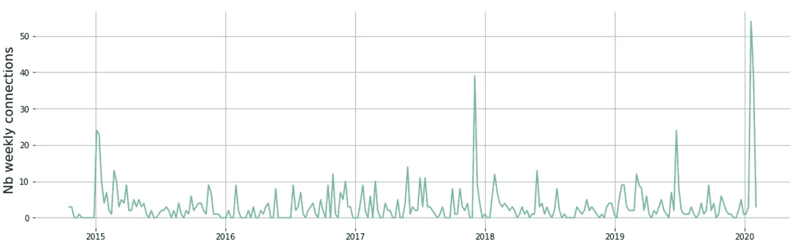
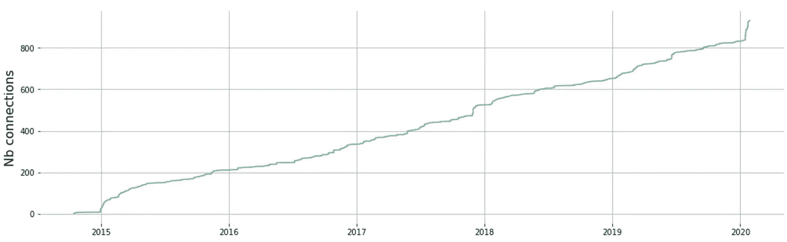
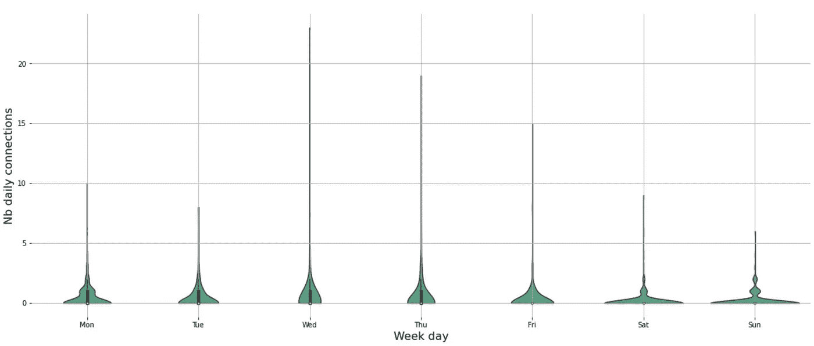
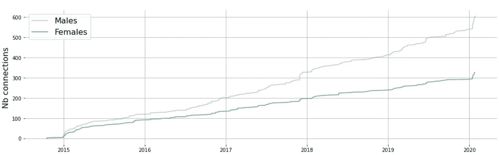
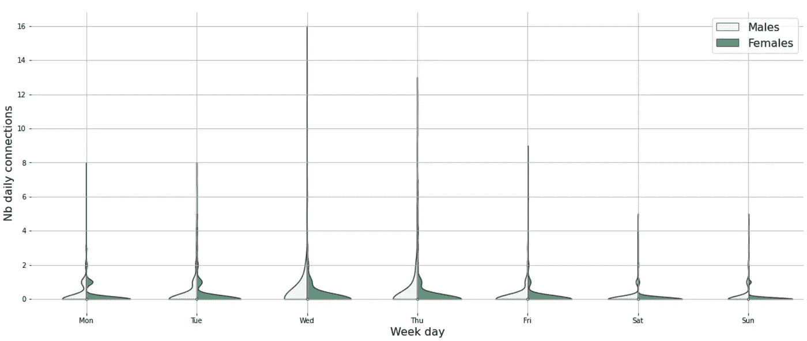
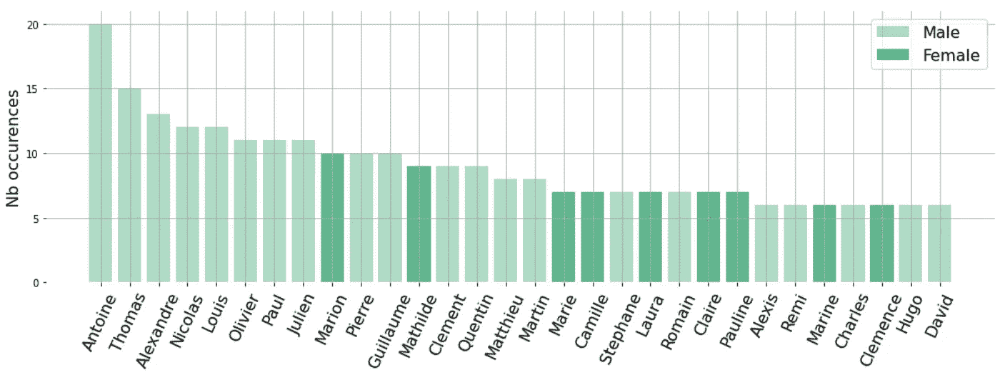
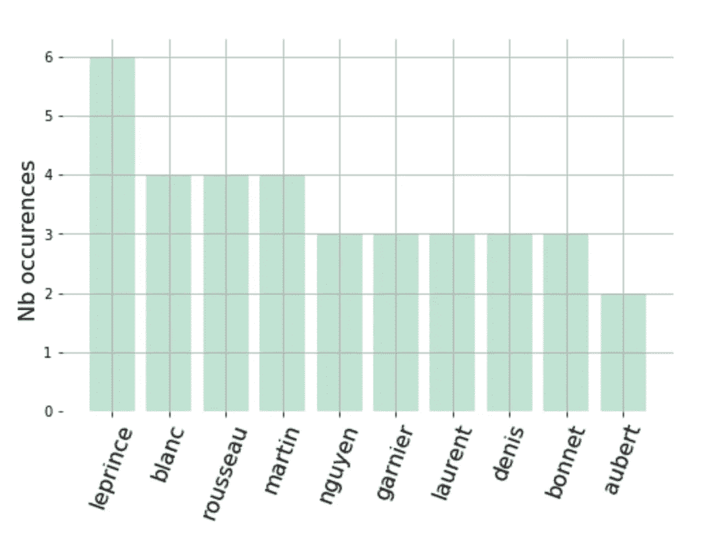

# LinkedIn 了解你什么？

> 原文：<https://towardsdatascience.com/what-does-linkedin-know-about-you-81cd65c69cb?source=collection_archive---------35----------------------->


亚历克斯·伊比在 [Unsplash](https://unsplash.com?utm_source=medium&utm_medium=referral) 上的照片

## 探索我们的 LinkedIn 个人数据

> 大哥在看着我们，我们来个眼神交流吧。

我成为 LinkedIn 会员已经 5 年了，上周我下载了我的个人数据，看看我能在里面找到什么。让我们开始吧！

为了框定背景，我会说我的 LinkedIn 使用非常被动:我几乎没有反应或发布，我主要是阅读和观看我的订阅。我不会为任何高级服务付费。平均来说，我会说我一周登录四到五次。

## 1.️️G️et 你的数据🗂️

LinkedIn 让你可以下载你的数据。为此，请转到**设置&隐私**，然后向下滚动到**获取您数据的副本**。你可以选择一些特定的数据，但我更喜欢下载一切。一旦存档准备就绪(花了大约 2 个小时)，您将会收到一封邮件通知。你可以在同一个地方返回你的 LinkedIn 个人资料，然后**获得你的数据的副本**并下载 *zip* 存档。

## 2.广告目标内容📝

我们先来关注一下文件 *Ad_targeting.csv* 。

考虑到这个文件的名字，我认为它包含了广告公司共享的数据。更多信息请点击这里:[business.linkedin.com/marketing-solutions/ad-targeting](https://business.linkedin.com/marketing-solutions/ad-targeting)。

我的广告简介相当详细和准确。我是一名 25-34 岁的法国男性，在一家拥有 11-50 名员工的计算机软件公司工作。我的性格适合我，大部分兴趣和技能都是正确的。

这是原始数据。让我们看看我的广告简介是什么样的:

```
Company Category: --
Company Connections: list of 80+ companies where my connections are involved in
Company Follower of: list of 30+ companies I'm following
Company Growth Rate: --
Company Industries: Computer Software
Company Names: list of 7 companies I've been involved in
Company Size: 11-50 employees
Degrees:
  - Secondary Education
  - Associate's Degree
  - 146
Fields of Study: list of 9 fields I've been studying
Function By Size: --
Graduation Year: --
Interface Locales: English
Job Functions: Support
Job Seniority: Entry
Job Titles: list of the 9 job titles I had in my career
Member Age:
  - 25 to 34
Member Gender:
  - Male
Member Groups: list of 7 groups I'm member of
Member Interests: list of 85+ interests keywords
Member Personae:
  - Linux
  - Android Users
  - Desktop/Laptop Users
  - Mobile Users
Member Schools:
  - Ecole Nationale Supérieure de Géologie
  - Télécom Paris
Member Skills: list of 245+ skills
Profile Locations:
  - Europe
  - France
  - European Union
  - eu.fr.*.0
  - European Economic Area
Years of Experience:
  - 4 years
degreeClass:
  - 100
  - 10
interfaceLocale:
  - en_US
```

乍一看，看到所有这些数据可能很吓人，但除了我没有人填补空白。我希望在 LinkedIn 中尽可能准确地被其他人看到。这是获得这种准确性的代价。一方面，它允许 LinkedIn 向我推送我喜欢看的内容。我不希望收到与我的个人资料无关的工作机会。另一方面，我会收到与我的兴趣相关的广告，因为我更有可能点击它们。

## 3.连接分析🤝


照片由 [Perry Grone](https://unsplash.com/@perrygrone?utm_source=medium&utm_medium=referral) 在 [Unsplash](https://unsplash.com?utm_source=medium&utm_medium=referral) 上拍摄

下载的文件中有一个名为`connections.csv`的文件。它记录了具有以下特征的所有新连接:`name`、`email`、`company`、`position`和`connection date`。

我现在有将近 1000 个连接，让我们看看我什么时候有新的连接:



LinkedIn 新关系演变

上图显示了每周的连接数。可以看出，我的网络增长有点缓慢。但是让我们考虑一下周累计曲线:



每周新连接演变(累计)

累积和图表明我的网络增长相当稳定:每周超过三个连接。开始时的趋势(曲线的左边部分)非常不同，因为我添加了我已经有的联系人。在过去的几周里，我希望扩大我的人际网络。

从相同的数据中，我们可以探究每个工作日新连接的频率:



每周日的连接分布

上图显示，大部分时间我都没有新的连接(平均每天 0.4 个连接)。这就是小提琴被拉伸到底线的原因。从小提琴的形状可以看出，我在周三、周四和周五更有可能有新的联系。

**数据丰富** 从我的连接名称中，我可以创建一个新的列性别。LinkedIn 可以通过分析每个个人资料轻松做到这一点。大多数时候应该是准确的。在我的网络中，有三分之一的女性和三分之二的男性。我用我在软件工程领域发展的事实来解释这种不平衡，这是不平衡的。

让我们再次生成之前考虑性别的图表:



按性别分列的 LinkedIn 联系演变(累计)

从上面累积的曲线，我们可以观察到，男性和女性的曲线似乎遵循相同的演变。男性曲线的斜率高于女性曲线，但两者都有持续增长:

*   每天 0.19 次母接头
*   每天 0.27 次男性连接

现在我们可以关注每个性别每周日的分布:



LinkedIn 每周每天每个性别的新连接分布

从上面的图表我们可以看到，女性半小提琴甚至更拉伸到底部。

现在我们已经考虑了连接，我们可以关注**名称:**



名字出现

从上面的柱状图中，我们可以看到我的网络中第一个名字出现的频率。男性/女性的不平衡在这里再次显现，因为最常见的名字大多是男性名字。我不得不选择没有性别区分的名字(例如 *Camille* 适合男性和女性)。从名字可以看出，我的亲戚大多是法国人。



姓氏出现

姓氏也很偏颇，因为我的人脉不具有代表性。因为我的姓是 Leprince，所以这也是我所有亲戚中最常见的姓。尽管如此，在法国还是有一些常见的姓。从我的联系人姓名中很容易猜出我的国家。

# 减去📌

*   LinkedIn 让你下载你的个人数据，它包含了很多信息。
*   我的网络的增长或多或少是线性的，自 2015 年以来，平均每天有 0.5 个新连接。
*   我的出身和职业选择严重影响了我的人际网络。
*   探索它是一件非常有趣的事情，而且还有更多的事情可以做。用你的数据试试吧！下面是源代码:

[](https://github.com/yleprince/medium-linkedin) [## yl prince/medium-LinkedIn

### 探索你的 LinkedIn 数据。请随时在 LinkedIn 上联系我！

github.com](https://github.com/yleprince/medium-linkedin)