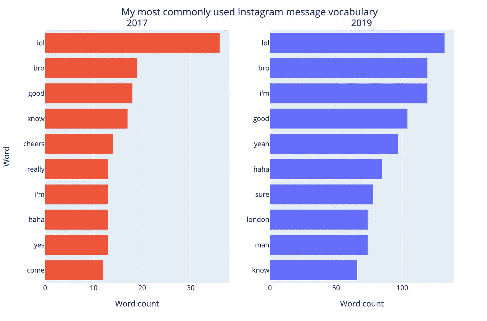

# 我的 Instagram 消息数据说明了我什么？

> 原文：<https://towardsdatascience.com/what-does-my-instagram-message-data-say-about-me-c29a8ff1b283?source=collection_archive---------55----------------------->

## 使用 Plotly 进行探索性数据分析

我承认。我使用 Matplotlib 进行数据可视化已经很久了。清晰的数据可视化对于任何数据专业人员向技术和非技术受众传达信息都至关重要。在阅读了 Chris Brownlie 的文章“Whatsapp Messages 中的 3.5 年关系”[1]后，我受到启发，使用 Python 库 Plotly 和可请求的 Instagram 数据提升了自己的数据可视化技能。

## 数据源

对于 Spotify、脸书、WhatsApp 和 Instagram 等应用，你可以轻松地请求并下载它们存储在你身上的所有个人数据。本文中进行的探索性数据分析使用了我的 Instagram 数据请求中的“messages.json”文件。在加载 JSON 文件并将其规范化之后，我得到了 12507 行消息(5755 条发送的消息和 6752 条接收的消息)。

## **为什么要用 Plotly？**

我发现使用 Plotly 比使用 Matplotlib 有两个优点。首先，Plotly 提供交互式可视化，可以使用 HTML 或链接嵌入到网站/博客中。其次，Plotly 有一个名为 Chart Studio 的云服务，可以让你将可视化保存到一个免费的在线账户(一个免费账户 100 个公共可视化)。

## 我的发现

## 1)我的 Instagram 消息使用量从 2018 年开始猛增

作者图片

2018 年以来，我的 Instagram 消息使用量猛增。凭直觉，我能想到推动这种变化的两个原因。首先，随着 2016 年下半年 Instagram stories 的发布，我慢慢开始从使用 Snapchat 作为主要的消息平台转变过来。其次，我在 2018 年夏天和 2019 年夏天在脸书实习。这可以解释夏季几个月的峰值。可能我在和他们合作的时候下意识的开始更多的使用他们的平台？还是因为我的同事是更活跃的用户？

*【这项分析是通过按月对我的信息进行分组并使用计数功能进行的。平滑后的趋势是 Savitzky-Golay 滤波器(39，5)]*

## 2)我会在 30 分钟内回复超过 80%的 Instagram 信息

作者图片

这是最让我吃惊的图表。虽然有些信息我需要几个小时甚至几天才能回复，但在大多数情况下，我会很快回复。

*【对于每一行信息数据，我创建了一个‘发送者’和发送时间的滞后变量。这让我可以过滤那些滞后发件人不是我而当前发件人是我的邮件。因此，我可以计算出从收到消息到做出响应的时间。我使用了一种试探法，将这些消息过滤为响应时间少于 24 小时的消息，以防止加入“新对话”。使用 numpy 的直方图和累积和函数计算标准累积分布函数。]*

## 3)2017 年我最常用的 10 个词，2019 年有 6 个是一样的

作者图片

虽然在过去的几年里，我的大部分常用词汇并没有改变，但一些词如“干杯”已经从我的常用词汇中消失了，而“是”已经变成了“是”。“伦敦”也是 2019 年的一个入口，因为我在夏天搬到了那里，并试图让我的朋友来看我。

为了进行这一分析，我使用 NLTK 的 tweet tokenizer 将我的消息拆分成单词。由于我的语言的非正式性和表情符号的使用，tweet tokenizer 似乎比标准单词 tokenizer 做得更好。接下来，我删除了所有表情符号和停用词(常用词，如“the”、“a”、“an”等)。然后使用集合库中的计数器函数来查找最常见的单词。]

## 4)我喜欢使用笑的表情符号

作者图片

我认为笑表情符号的使用部分是因为通过 Instagram 信息分享的新表情符号越来越多(YoungKingsTV、Chabuddyg 和 Gujumemes 似乎是最流行的)。第三个最常见的表情符号是棕色肤色，它与各种不同的表情符号一起使用，例如👌🏽或者👍🏽但似乎已经聚集在一个集体区块下。

*【这项分析是通过将我所有的信息文本连接成一个字符串，使用 list 函数将其拆分成字符，然后使用表情库提取所有的表情符号来进行的。然后使用收藏库中的计数器功能来查找最常见的表情符号。]*

## 我在晚上最活跃，尤其是晚上 9 点到 10 点之间

作者图片

我不确定这是不是一个好趋势。可以理解的是，我的 Instagram 信息在晚上的使用率要高得多，因为我通常在白天外出或做大学作业。然而，知道睡前看屏幕对睡眠卫生有害之后，我会有意识地努力尝试减少我在深夜的使用。

*【为此，我创建了一个新的‘小时’变量，将我所有的消息按‘小时’分组，然后应用计数函数。]*

## 探索您的数据！

希望这篇文章对你使用 Plotly 和探索自己的数据有所启发。如果有人感兴趣，谷歌有一些非常详细的位置数据，可以非常酷地进行一些地理可视化，Spotify 有你听歌时间的细分。如果你想使用本文中的代码，我已经把它上传到我的 Github [**这里**](https://github.com/parekhmihir98/Instagram-Message-EDA-using-Plotly) **。**

[1]克里斯·布朗利(Chris Brownlie)，3.5 年的关系，在 Whatsapp Messages (2019)，[https://medium . com/data-slice/3-5 年的关系-在 Whatsapp-Messages-4f4c 95073 c9d](https://medium.com/data-slice/3-5-years-of-a-relationship-in-whatsapp-messages-4f4c95073c9d)

[2] Lemola，Sakari 等，“智能手机时代的青少年夜间电子媒体使用、睡眠障碍和抑郁症状。"*《青少年杂志》*44.2(2015):405–418。