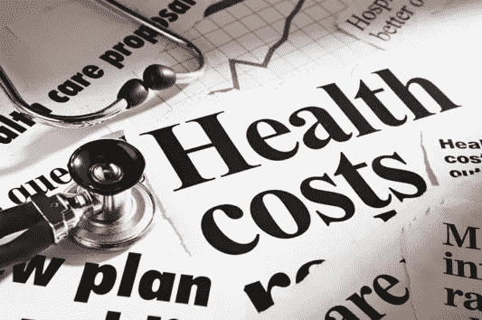
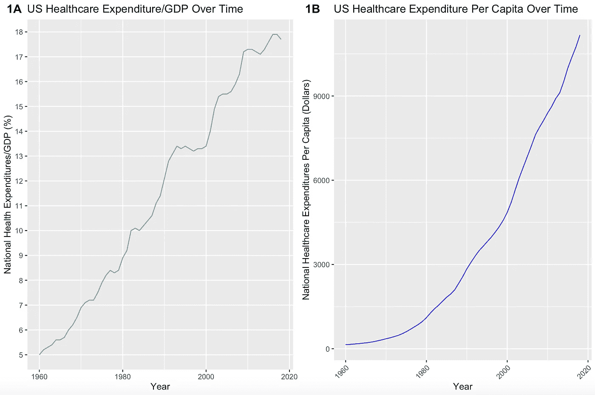
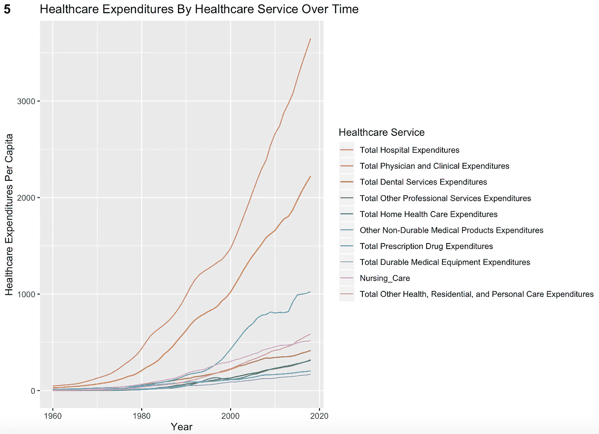
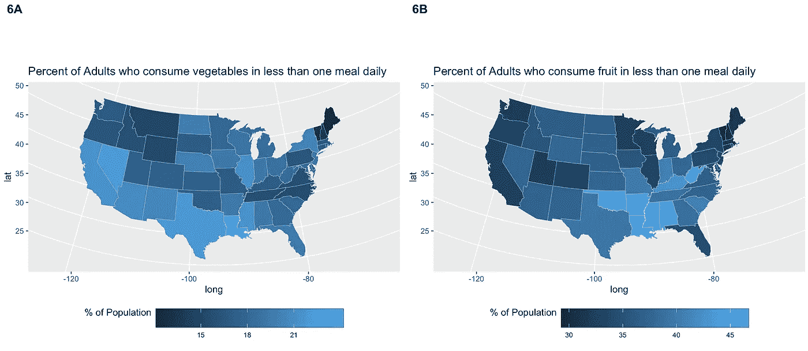
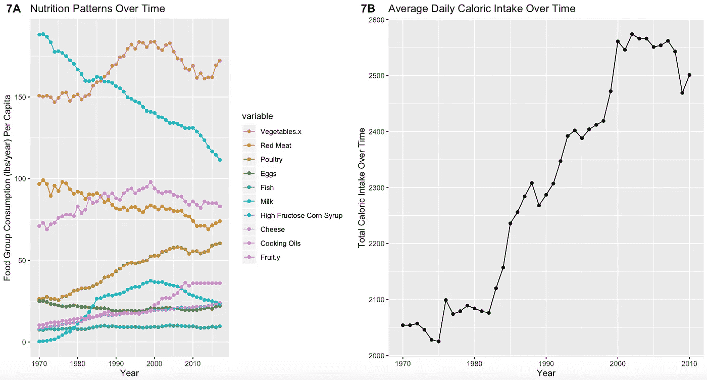
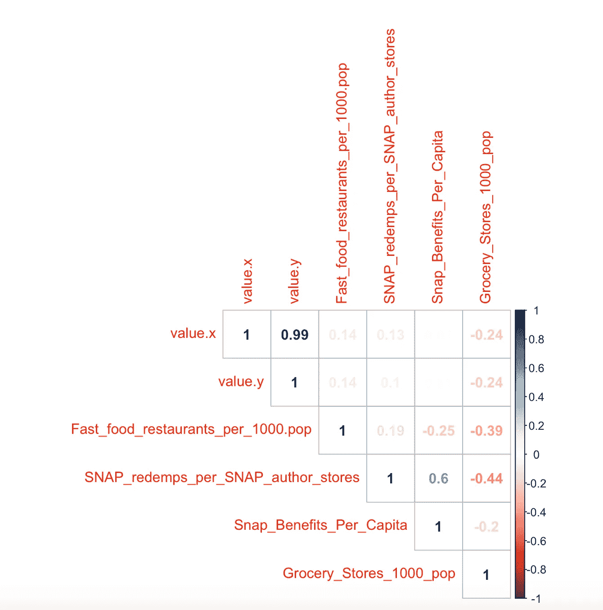
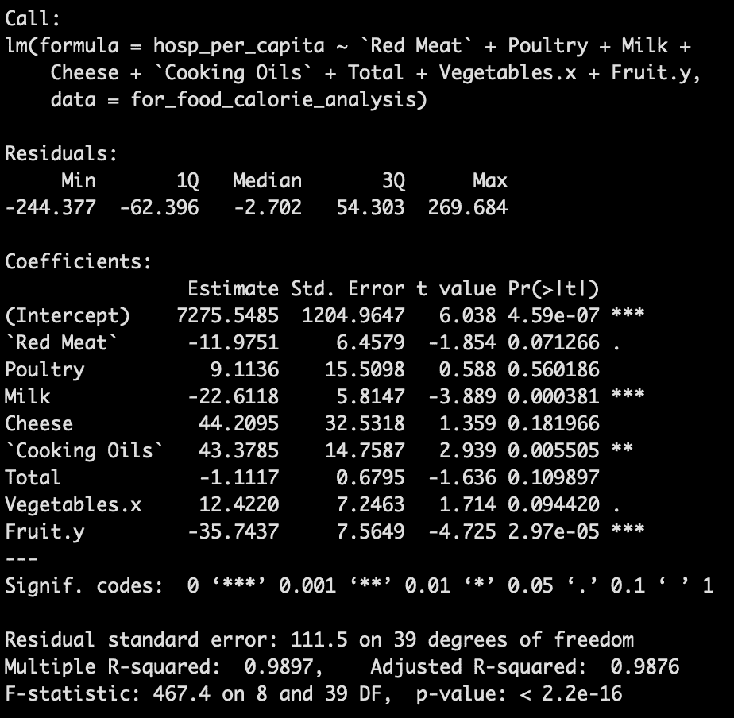
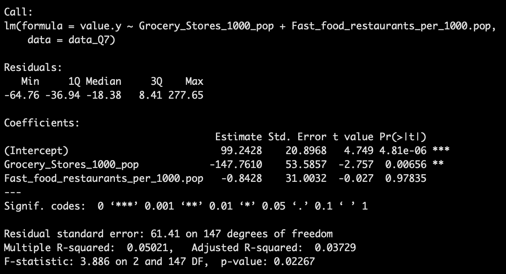

# 营养与医疗保健支出有什么关系？

> 原文：<https://towardsdatascience.com/what-does-nutrition-have-to-do-with-healthcare-expenditures-f5e59c62a1c3?source=collection_archive---------50----------------------->

## [数据新闻](https://towardsdatascience.com/data-journalism/home)

## 一项探索性数据分析项目，调查美国的医疗保健支出及其与营养模式的关系

[塔尔萨公共卫生](https://www.publicradiotulsa.org/post/oklahoma-senate-committee-keeps-alive-several-bills-address-health-care-costs)

# 介绍

医疗保健支出约占美国年度 GDP 的 18%，相当于人均超过 11，000 美元。与经济合作与发展组织(OECD)成员国的平均水平相比，美国的医疗支出占其经济的比重几乎是其两倍。尽管如此，美国的医疗保健结果仍然严重落后于经合组织中的其他高收入国家；美国的预期寿命最低，慢性病负担最高，肥胖率是经合组织平均水平的两倍。与其他国家相比，美国也是因可预防原因住院人数最多的国家之一，也是可避免死亡率最高的国家之一。美国的医疗支出是怎么回事，为什么会这么高？

根据雅培 2016 年发表的一项研究，在美国，每 3 名进入医院的患者中就有 1 名营养不良。营养不良通常是患者入院的根本原因，营养更好与住院时间更短和再入院率更低有关。营养在决定医疗保健支出中可能起什么作用？

# 美国医疗保健支出

首先，我分析了医疗保险和医疗补助服务中心在国家和州两级发布的医疗支出数据，以了解美国的医疗支出。如下图 1A 和 1B 所示，随着时间的推移，美国医疗保健支出几乎呈指数增长。比如，1960—2020 年间，美国人均医疗支出增长了 7，500%以上；仅在 2000—2018 年间，美国人均医疗支出就增长了 130%以上。

## 各州的医疗保健支出有何不同？

如下图 2A 所示，1980 年，美国国家层面的医疗保健支出在州层面似乎相对同质，因为似乎没有任何一小组州主导人均医疗保健支出。随着时间的推移，这种情况似乎会发生变化，一小部分州的医疗支出似乎比其他大多数州高得多。这种转变始于 1990 年(图 2B)，一直延续到 2014 年(图 2D)。到 2014 年，各州的人均医疗保健支出似乎有了更大的差异。例如，在 2014 年(图 2D ),美国北达科他州和东北部各州的人均医疗保健支出明显高于其他州。

## 随着时间的推移，一些州的人均医疗支出是否比其他州更高、增长更快？

在下面的图 3A 中，每个州在 1980 年似乎都有相对相似的医疗保健支出。然而，随着时间的推移，各州之间似乎出现了分歧，一些州的人均医疗支出比其他州增长得快得多。在图 3B 中，这些州中的一些被突出显示，并且包括康涅狄格州、特拉华州、马萨诸塞州、纽约州和北达科他州。因此，如图 2 所示，2014 年医疗保健支出最高的州似乎也是医疗保健支出比美国其他州增长最快的州。截至 2014 年，这些州对美国医疗支出的贡献似乎不成比例。

下文图 4 进一步强调了上述调查结果，该图显示了随着时间的推移，哪些州的人均医疗保健支出最高和最低。另一个有趣的发现是，许多 1980 年人均医疗支出最高的州也是 2014 年人均医疗支出最高的州。马萨诸塞州、阿拉斯加州、纽约州和罗德岛州在 1980 年和 2014 年都是人均医疗支出最高的 7 个州。

## 哪些医疗保健服务构成了美国的医疗保健总支出？

如下图 5 所示，美国医疗保健支出(以美元衡量)被细分为许多不同的特定服务，包括医院支出、医生和临床支出、牙科服务支出和处方药支出。虽然在 1960 年，美国在这些医疗保健服务中的医疗保健支出相对相似，但随着时间的推移，医院、医生和临床支出似乎急剧上升，其他医疗保健服务的支出也在增长，但增速较低。截至 2018 年，医院支出在美国医疗保健总支出中所占比例最大，人均年收入超过 5000 美元，远高于涵盖其他每项医疗保健服务的医疗保健支出。

为什么医院的支出相对于所有其他医疗保健服务支出而言飙升？如前所述，研究表明，美国各地的住院治疗是高度可预防的，住院治疗的大量患者营养不良。营养学能帮助解释医院支出水平吗？

# 美国的营养学

## 美国有营养问题吗？

根据人类健康服务部(HHS)的营养和健康饮食指南，在人们吃的任何一餐中，他们餐盘中的一半应该是水果和蔬菜。因此，水果和蔬菜的消费水平可能是影响美国营养质量的一个重要因素。我分析了疾病预防控制中心在 2017 年收集的营养调查数据，这些数据旨在确定美国各地的个人消费水果和蔬菜的频率。如下表所示，总体而言，美国的水果和蔬菜消费量很低。在一个特定的州，最多有 12.4%的人口每天食用蔬菜不到一餐。在最坏的情况下，这一比例上升至 23.9%。对于水果消费来说，这甚至变得更糟，因为在一个给定的州中，至多有 30%的人口报告每天消费水果少于一餐；在最坏的情况下，这是某个州 46%的人口。

从下面图 6 所示的地图来看，与美国其他地区相比，从路易斯安那州到加利福尼亚州的美国中西部南部地区每天消耗的蔬菜最少..美国中南部地区似乎每天消耗的水果最少。因此，与北方消费相比，南方消费的水果和蔬菜要少得多。总的来说，美国似乎没有消费足够多的水果和蔬菜，没有达到 HHS 制定的指导方针，因此没有消费营养健康饮食的主要组成部分。这可能有助于解释营养不良问题，这个问题以前与住院率高有关，反过来也与医院费用高有关。

为了评估美国许多其他主要食物种类的营养模式，我分析了美国农业部的人均食物可获得性数据。具体来说，我用经过浪费、变质和其他损失调整后的食物可获得性来代表一段时间内的消费。我在数据中寻找美国人每年食用的不同食物种类的数量(人均磅/年)和人均医院支出之间的相关性。分析过去 40 年的数据显示了美国饮食的一些重要模式。

我首先用这些数据来评估营养模式是如何随着时间的推移而演变的。从下面的图 7A 可以看出，随着时间的推移，消费量增长最快的食物类别包括家禽、高果糖玉米糖浆和食用油。这些变化应该被视为负面的，因为高果糖玉米糖浆和食用油已被证明会导致负面的健康后果。越来越多的研究还表明，大量食用家禽与不同癌症的高风险有关，97%的零售鸡胸肉受到危险细菌的污染。此外，唯一随时间大量减少的主要食物是牛奶；从营养学的角度来看，这应该是负面的，因为 HHS 建议适度饮用牛奶，一般来说，牛奶是许多维生素和营养物质的重要来源，这些对健康饮食很重要。最后，从图 7B 中可以看出，随着时间的推移，平均每日热量摄入从每天 2000 卡路里增加到每天 2500 卡路里。根据梅奥诊所的卡路里计算器，这超过了大多数成年人维持目前体重所需的量；例如，一个中等身高和体重的 40 岁男性，适度运动，需要 2400 卡路里，而具有相应特征的 40 岁女性需要 1850 卡路里。因此，似乎随着时间的推移，由于上述变化，总体营养质量一直在下降；看起来美国确实存在营养问题，消耗了过多的食物，属于国家营养和健康饮食指南推荐的错误食物组。这可能有助于解释所观察到的住院病人营养不良增加的情况，以及因此而增加的住院和医院开支。

## 营养与医院支出相关吗？

接下来，我想量化营养和医院支出之间的关系。具体来说，我发现了每一种主要食物的人均年消耗磅数与人均医院支出之间的相关性。从下面的相关图来看，集中在顶部的第二行，似乎营养确实在医疗保健支出中起着重要作用。几乎每一种主要的食物类别都与医院支出有中度到高度的关联。与医院支出关联度最高的食物类别包括红肉(r=-0.92)、家禽(r=0.92)、牛奶(r=-0.96)、奶酪(r=0.93)和食用油(r=0.98)。水果和蔬菜的消费与医院费用有适度的关联，有趣的是，每日总热量摄入与医院费用有很强的关联(r=0.87)。

## 为什么随着时间的推移，营养越来越差？

营养指南可能会很复杂，而且备受争议，美国长期以来的营养模式背后的原因是多方面的。为了对美国营养不良的潜在原因提供一些见解，我分析了美国农业部的食品环境地图集，该地图集从 2011 年开始记录解释美国各地营养差异的不同因素。这些包括在州一级进入杂货店、快餐店和全方位服务的餐馆。此外，美国农业部还开始记录 SNAP 计划的参与情况，该计划为杂货店和低收入地区提供资金，以使人们能够从杂货店购买新鲜农产品和营养食品。虽然我只能获得两年的数据，而且这些数据是在州一级记录的，但我分析了上述因素与同一年州一级医院支出之间的相关性。我这样做是为了深入了解旨在为低收入人群提供营养食品的食品沙漠和政府资助项目是如何影响医院支出的。我假设广泛的食物沙漠、快餐店的便利和收入不平等将构成强有力的因素，有助于解释美国的营养不良模式，进而解释医院支出模式。

如下面的相关图所示，给定州每 1000 人的杂货店数量与给定州的医院支出(用 value.y 表示)适度相关(r=-0.24)。虽然没有其他因素与医院支出显著相关，但在一个给定的州，每 1000 人的快餐店数量与每 1000 人的杂货店数量适度相关(r=-0.39)。因此，随着某个州杂货店数量的增加，该州的医院支出会减少。随着某个州快餐店数量的增加，杂货店的数量减少；这可能会间接影响医院的支出。而且，给定州每 1000 人的杂货店数量平均为 0.27 家，最低为 0.16 家，最高为 0.76 家。这表明，平均而言，只有一家杂货店为 3，000 多人服务。这似乎是一个低值，可能表明美国确实存在食物沙漠问题，这可能对营养产生负面影响，并因此导致医院支出。我相信这些发现可以推广到国家层面。

## 我们能利用上述发现来预测医院支出吗？

最后，我想看看我是否可以使用美国的营养模式预测全国的医院支出。我建立了一个多元回归模型，在上述分析中使用了与医院支出密切相关的营养模式。下面显示的结果表明，总的来说，该模型是高度显著的(p-value<2.2x10^-16)，并具有令人惊讶的高调整的 r 平方值(0.988)。牛奶、食用油和水果的消费量都是美国医院支出的重要预测指标，其系数与上述营养和健康消费的利弊模式一致。例如，根据下面的模型，每人每年多吃一磅水果，他们的医院支出就会减少大约 36 美元。这种模型的局限性包括数据中有限的观察数量和模型中 39 个自由度。更稳健的模型需要更多的数据，模型的解释和意义也需要更稳健。然而，我相信这个模型通过进一步表明营养在帮助医院支出中的重要性，有助于验证上述发现。

我也很好奇，想知道在一个特定的州，每 1000 人中杂货店和快餐店的数量是否是州一级医院支出的预测指标。如下所示，该模型具有统计显著性(p 值=0.023)，给定州每 1000 人的杂货店数量是给定州医院支出的高度统计显著性预测因子(**显著性)。该模型的调整后 r 平方为(0.0373)，表明美国营养不良的根本原因是复杂的。我认为这个模型更稳健，因为它使用了更多的数据(147 个自由度和跨越 4 年数据收集的 150 个观察值)。食物沙漠/获取新鲜产品似乎是美国医院支出的一个重要因素

# 结论

总体而言，美国的医疗保健支出似乎已经成为一个非常大且持续增长的问题。医院支出是这个问题的主要原因，随着时间的推移，美国各地的营养不良模式似乎在促成医院支出趋势方面非常重要。有趣的是，随着时间的推移，食物沙漠可能是美国营养不良的原因之一..因此，我认为，寻求降低医疗支出的决策者应该更加重视营养。让营养成为国家级讨论的重要话题可能有助于鼓励人们吃得更健康，并最终有望帮助改善营养，同时减少可预防的住院治疗，进而减少医院支出。

# 数据和来源

1.  [ERS 食物可获得性(人均)数据系统](https://www.ers.usda.gov/data-products/food-availability-per-capita-data-system/)
2.  [美国农业部食品环境图集](https://www.ers.usda.gov/data-products/food-environment-atlas/data-access-and-documentation-downloads/)
3.  [医疗保险中心&医疗补助服务](https://www.cms.gov/Research-Statistics-Data-and-Systems/Statistics-Trends-and-Reports/NationalHealthExpendData/NationalHealthAccountsHistorical)
4.  [联邦基金跨国医疗保健比较](https://www.commonwealthfund.org/publications/issue-briefs/2020/jan/us-health-care-global-perspective-2019)
5.  [雅培营养和住院研究](https://www.news-medical.net/news/20161207/Simple-nutrition-care-program-in-hospitals-could-help-reduce-patient-stays-and-readmission-rates.aspx)
6.  [HHS 健康与营养指南](https://www.hhs.gov/fitness/eat-healthy/how-to-eat-healthy/index.html)
7.  [疾控中心营养监测系统数据](https://chronicdata.cdc.gov/Nutrition-Physical-Activity-and-Obesity/Nutrition-Physical-Activity-and-Obesity-Behavioral/hn4x-zwk7)
8.  [果葡糖浆营养](https://www.healthline.com/nutrition/why-high-fructose-corn-syrup-is-bad#1)
9.  [食用油营养](https://www.healthline.com/nutrition/are-vegetable-and-seed-oils-bad#trans-fats)
10.  [牛奶营养](https://www.medicalnewstoday.com/articles/296564)
11.  [家禽营养](https://www.thetimes.co.uk/article/is-chicken-bad-for-your-health-j0zb9l06l)
12.  [梅奥诊所卡路里计数器](https://www.mayoclinic.org/healthy-lifestyle/weight-loss/in-depth/calorie-calculator/itt-20402304)