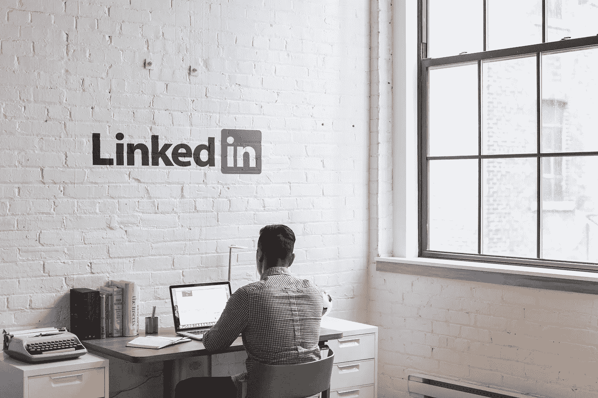
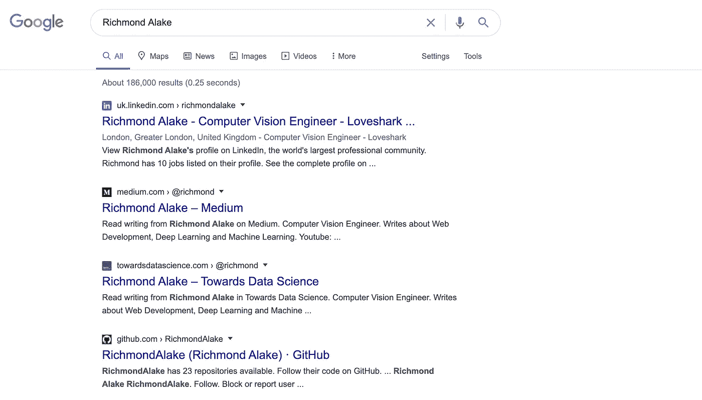

# 机器学习从业者在社交媒体上的自我推销是什么样子的？

> 原文：<https://towardsdatascience.com/what-does-self-promotion-on-social-media-look-like-for-machine-learning-practitioners-710f18524d8e?source=collection_archive---------49----------------------->

[粘土银行](https://unsplash.com/@claybanks?utm_source=unsplash&utm_medium=referral&utm_content=creditCopyText)在 [Unsplash](https://unsplash.com/s/photos/winning?utm_source=unsplash&utm_medium=referral&utm_content=creditCopyText) 拍摄的照片

## 意见

## “自我推销”和“机器学习”这两个词在一个句子里会连在一起吗？

> “当你擅长某件事时，你会告诉所有人。当你擅长某件事时，他们会告诉你。”
> 
> ―华特·培顿

让我们从自我推销的定义开始吧。我希望您在本文不同地方记住这个定义。

**自我推销**是通过**你的声音**展示和展示你的能力、成就和行动的行为。

人们倾向于回避自我推销的想法，因为自我推销的人有一些特质，例如傲慢、过度自信、寻求关注等。

但我们要记住，现在是 2020 年，世界更加嘈杂，你很容易被忽视，不管你有多努力或多有才华。

**不要怕无耻的塞自己。只要确保你是在正确的时间、正确的地点、对正确的观众做这件事。**

例如，我倾向于无耻地将我的[每周简讯](https://richmond-alake.ck.page/c8e63294ee)塞给机器学习从业者，让他们订阅和接收我的文章和我创建的其他 AI/ML 内容的朋友链接。

## 本文将介绍自我推销对机器学习从业者的重要性，并添加您可以用来通过社交媒体宣传自我的现代方法。

# 你为什么要自吹自擂呢？

照片由[Zoltan·塔斯](https://unsplash.com/@zoltantasi?utm_source=unsplash&utm_medium=referral&utm_content=creditCopyText)在 [Unsplash](https://unsplash.com/s/photos/fight?utm_source=unsplash&utm_medium=referral&utm_content=creditCopyText) 上拍摄

从什么时候开始，要求机器学习从业者具备销售和营销技能，甚至建立个人品牌？

让我陈述明显的事实。

一般的机器学习从业者擅长他们的工作，我们大多数人都对技术及其可能性充满热情。

懂软件工程原理的机器学习工程师；了解至少三种现代编程语言；拥有在线作品集；甚至知道特斯拉自动驾驶汽车系统的秘密——开玩笑在这个时代被认为是好的。

不太好，很好。

优点可以让你在人工智能和机器学习行业中走得更远。

> 没有功德的自我推销只是噪音。但是没有自我宣传的优点在大多数情况下是沉默。

由[拍摄的照片](https://unsplash.com/@mono424?utm_source=unsplash&utm_medium=referral&utm_content=creditCopyText)在 [Unsplash](https://unsplash.com/s/photos/unheard?utm_source=unsplash&utm_medium=referral&utm_content=creditCopyText)

*什么是沉默？*

沉默被忽视了，即使你可能是这份工作的最佳人选。

沉默是没有得到你应得的晋升或加薪。

沉默是你不为人知的最佳作品。

以下是一些令人信服的与职业相关的理由，说明你为什么应该自我推销

*   竞争很激烈。
*   每个人都可以做你能做的，在某些情况下，他们可以做得更好。
*   你并不像你想象的那样独一无二，还有其他几个工程师拥有和你一样的技能和技术。
*   你和下一个人一样值得被认可。

# 你可以自我推销的方法

现在你确信你至少应该做一些自我推销。这里有一些在网上推销自己的简单方法。

## 1.中等

Medium 不仅仅是一个博客平台。

嗯，确实是。

但是从现在开始，你需要把 Medium 看作一个展示你的知识和专长的平台。媒介是你的投资组合、个人品牌和通向世界其他地方的渠道。

[尖峰时刻 3](https://en.wikipedia.org/wiki/Rush_Hour_3)

**‘ME’**是单词 Medium 的前两个字母。我，就是你。

不是我，是你…

我想说的是，媒介是一个自我服务的平台，可以用来将你的技能和专业知识传达给合适的受众。

在这种情况下，合适的受众可能是顾客、招聘人员、客户或未来的雇主。

**以下是我在媒体上自我推销的方法:**

*   [我简化计算机视觉/机器学习的思想和概念](/implementing-alexnet-cnn-architecture-using-tensorflow-2-0-and-keras-2113e090ad98)。
*   我写下我的失败，并把它们变成成功。
*   我写下我的经历和旅程。
*   [我不怕写我强烈感受到的话题](/are-there-black-people-in-ai-fb6928166d73)

> 一个**动作**:选择一个 ML 主题，比如反向传播或模型实现，写并发表一篇文章，展示你在所选主题上的知识。目标是重复这个过程 5-10 次。在简历中加入你发表的文章的链接，并在 LinkedIn 上分享。

## 2.油管（国外视频网站）

来自[像素](https://www.pexels.com/photo/mokup-smartphone-technology-phone-34407/?utm_content=attributionCopyText&utm_medium=referral&utm_source=pexels)的[freestocks.org](https://www.pexels.com/@freestocks?utm_content=attributionCopyText&utm_medium=referral&utm_source=pexels)的照片

使用 YouTube 进行自我推销，比本文中包含的其他自我推销方法需要更多的工作和努力。但是如果做得正确，在 YouTube 上的自我推销可以让你与众不同。

**对于机器学习从业者来说，自我推销可以采取以下形式:**

*   [记录你在机器学习行业的职业进展](https://www.youtube.com/watch?v=a-IYqSw5ISs)
*   [教授观众机器学习技术的教程视频](https://www.youtube.com/watch?v=3ou0KYtDlOI)
*   讨论与机器相关的话题([职业](https://www.youtube.com/watch?v=zGlJ-QndG8E)、[投资组合开发](https://www.youtube.com/watch?v=_DFIPvNXvJk)、[面试](https://www.youtube.com/watch?v=tg_m_LxxRwM)等)。)
*   流行的或在技术上难以理解的研究论文的摘要和概括。
*   还有更多…

让我把你的注意力带到我最近偶然发现的一种自我推销的直观方法上。

Ken Jee 是一些机器学习从业者可能熟悉的名字；他创建了关注数据科学相关主题的 YouTube 内容。

Ken 有一个视频系列，他在其中对机器学习从业者的投资组合和简历进行了深入的评论。他的评论对作品集和简历所有者都很有用，但对那些拥有与他的视频系列中呈现的技能集或简历相似的机器学习从业者也很有用。

[回顾数据科学组合](https://www.youtube.com/watch?v=jam0xApfC-U)

[数据科学回顾简历](https://www.youtube.com/watch?v=PWmxLYTixAM)

现在，你可能还不清楚肯·吉如何把审阅你的简历或作品集视为自我推销，所以让我把它说得更清楚一点。

Ken Jee YouTube 平台目前拥有 78000 名订阅用户，数千名机器学习从业者观看他的视频。他的视频的一些观众可能是能够雇佣和招募人才的机器学习从业者。

审查你的投资组合或简历不仅能为你提供一些来自经验丰富的数据科学家的有用反馈，还能让你接触到寻找免费招聘人才方法的潜在雇主。

在 YouTube 上创建机器学习相关的内容是一种自我推销的方法，提供了大量的好处。

我相信，如果你能给他们发送一个你的 YouTube 频道的链接，在那里你可以创造性地展示你的技能和专业知识，那么面试一个角色或向客户推销会顺利得多。

> **动作**:如果你有更多的时间和资源，为什么不创建一个 YouTube 频道，用视频的形式描述一些机器学习的概念和想法。或者，如果你像我一样害怕面对镜头，为什么不把你的作品集和简历寄到 kenjee.ds@gmail.com

## 3.商务化人际关系网

照片由 [Unsplash](https://unsplash.com/s/photos/linkedin?utm_source=unsplash&utm_medium=referral&utm_content=creditCopyText) 上的 [inlytics](https://unsplash.com/@inlytics?utm_source=unsplash&utm_medium=referral&utm_content=creditCopyText) 拍摄

你可能在一英里外就看到了这个平台。

LinkedIn 是专业人士的首选社交媒体平台。这是一个可以用于多种用途的工具，LinkedIn 最常见的用途之一就是自我推销。

你可能见过学生和机器学习从业者在 LinkedIn 上发布课程完成证书；这是一种自我推销的方法。你不必担心所有与自我推销相关的负面特质，LinkedIn 是一个鼓励自我宣传的平台。

*但是，为什么机器学习从业者还要在 LinkedIn 上自我推销？*

LinkedIn 拥有超过 7 亿多用户，所以可以肯定你未来的顾客、导师、客户、学生和雇主都在 LinkedIn 上。

事情是这样的，自我提升不仅仅是成就和成功的专属。我见过有人发帖抱怨工作被拒或学业失败。

*你为什么要这么做？*

首先，机器学习是一个艰难的领域，失败并不一定意味着无能，大多数机器学习从业者都意识到了这一点。承担一个程序甚至开始一个项目的勇气是机器学习社区钦佩和称赞的属性。

也许你现在没有在找工作；尽管如此，LinkedIn 是一个有效的平台，可以推广你正在进行的、已经完成或尚未完成的项目、研究或想法。

请记住，你不仅要宣传你旅程的最终结果，还要让人们了解你的进步和其间的小收获。

> **行动**:如果你还没有 LinkedIn 账户，就创建一个。联系并追随你领域内志同道合的人或你钦佩的人。不要害怕发布在你的机器学习生涯中发生的发展。

# 结论

我在本文中提到的在所有社交平台上创建账户和内容还有一个额外的好处。

每一个提到的平台都有很高的谷歌网页排名领域权威。这意味着当人们搜索你的名字时，他们会找到你在这些平台上创建的内容。

当你遇见一个新的人时，你做的第一件事是什么？你可以在谷歌上搜索他们的名字。

员工和客户做着完全相同的事情。当他们看到你的简历或简介时，他们会在谷歌上搜索你的名字。最好的事情就是你最好的工作和项目成为他们接触到的第一件事。

文章作者的名字在谷歌上搜索。

我会在这里结束一切。

记住，当你优秀时，你会告诉别人，但当你优秀时，别人会告诉你。但是你必须付出很多努力，让人们知道你是好的。不要被忽视。

# 我希望这篇文章对你有用。

要联系我或找到更多类似本文的内容，请执行以下操作:

1.  订阅我的 [**邮件列表**](https://richmond-alake.ck.page/c8e63294ee) 获取每周简讯
2.  跟着我上 [**中**](https://medium.com/@richmond.alake)
3.  通过 [**LinkedIn**](https://www.linkedin.com/in/richmondalake/) 联系我

 [## 辅助项目在机器学习中的重要性

### 你和马克·扎克伯格有什么共同点？在这篇文章中找出，以及其他几个原因，为什么…

towardsdatascience.com](/the-importance-of-side-projects-in-machine-learning-edf9836bc93a)  [## 2020 年(及以后)机器学习从业者创收的 5 种方式

### 了解如何利用机器学习技能增加收入或创造新的收入来源

towardsdatascience.com](/5-ways-a-machine-learning-practioner-can-generate-income-in-2020-and-beyond-2f541db5f25f)