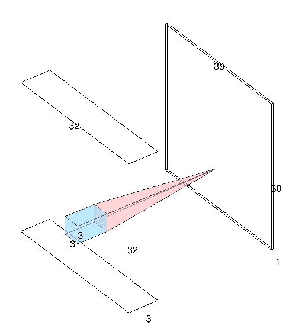
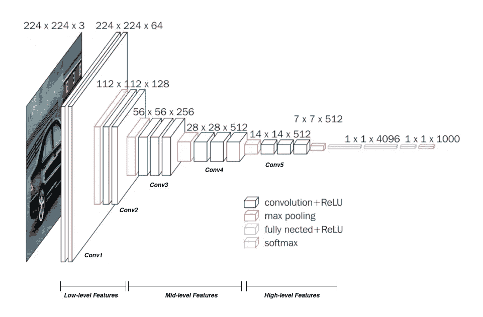

# 网络看到了什么？

> 原文：<https://towardsdatascience.com/what-does-the-network-see-4fec5aa4d2eb?source=collection_archive---------70----------------------->

## 人工智能

## 用当时最流行的网络之一探索直觉

杰里米·帕金斯在 [Unsplash](https://unsplash.com?utm_source=medium&utm_medium=referral) 上的照片

*吕底亚(小亚细亚)的国王克罗伊斯曾经问特尔斐的神谕，他是否应该对波斯开战。当时的波斯由“居鲁士大帝”统治，也称为“老居鲁士”。女祭司说——“如果克罗伊斯开战，他将摧毁一个伟大的帝国”。克罗伊斯很高兴听到这个消息，并准备他的军队，出发越过哈利斯河征服波斯。当冬天来临的时候，克罗伊斯按照当时的惯例解散了他的军队。然而，赛勒斯却没有——他出其不意地击倒了克罗伊斯！*

典型的含糊不清的神谕让克罗伊斯失望了——因为克罗伊斯对其预言没有三思。从那以后，一次又一次的事实证明，盲目地跟随一个预测会导致一个人的失败。

从那以后，我们进化成了更聪明的生物。我们不会盲目相信占星家的预测，对吗？的确，我们不再怀有迷信——但我们仍然盲目地追随它们。占星师？不要！—神经网络！

神经网络一直是人工智能研究社区的最大福音——它们帮助解决了人工智能领域完全无法解决的问题，并在很短的时间内取得了出色的成果。然而，随着这些结果，他们给人工智能带来了一个新的术语— *黑盒*

> 在[神经网络](https://en.wikipedia.org/wiki/Neural_network)或[启发式算法](https://en.wikipedia.org/wiki/Heuristic_algorithm)(通常用于描述“学习”计算机或“人工智能模拟”的计算机术语)中，黑盒用于描述程序环境中不断变化的部分，这些部分不容易被程序员测试。在可以看到程序代码的上下文中，这也被称为[白盒](https://en.wikipedia.org/wiki/White_box_(software_engineering))，但代码非常复杂，在功能上相当于黑盒。—[https://en.wikipedia.org/wiki/Black_box](https://en.wikipedia.org/wiki/Black_box)

现代复杂的人工智能技术，如深度学习和遗传算法，自然是不透明的——人们可以猜测，但永远无法知道网络内部实际发生了什么。由于它们的不透明性，在临床领域应用它们几乎是不可能的，因为人们无法信任一个无法解释的网络。

这自然产生了*可解释的人工智能*——一个由神经网络提供的解决方案由专家检查并可能解释的研究领域。然而，可解释的人工智能(XAI)仍在开发中，并且尚未取得重大进展来弥合研究人员和机器之间的差距。到目前为止，研究工作在很大程度上依赖于直觉和 XAI 积分的混合。

让我们探索一个简单的 CNN 分类器网络工作背后的直觉，这是当时最流行的网络之一。

[注意:这不是 CNN 的指南——相反，我希望读者对 CNN 及其工作有一些了解，因为这是对所用方法的基于直觉的解释。不用说，这篇文章不会涵盖一个通用 CNN 的全部基础知识]

## 卷积神经网络

重温一下基本知识，卷积神经网络是一种神经网络，在这种网络中，我们将输入与机器学习的核进行卷积，然后获得输出。换句话说，卷积核不断更新其参数，直到输出接近期望值或损失函数达到最小值。

一幅绘画作品会是—

使用 3x3 滤镜卷积的 32x32x3 图像

因此，我们可以看到 3x3 内核将 32x32 输入卷积成 30x30 输出。一个 3x3 窗口滑过输入图像(所有通道),我们获得 3x3 窗口和内核的点积——我们在输出中用单点表示。因此，单个卷积运算给出了单个通道图像。一组“n”个卷积滤波器或一个卷积“块”将给我们一个“n”个信道输出，因为来自每个滤波器的输出沿着信道宽度被级联。*但是，为什么要使用‘n’个过滤器呢？*

单个过滤器最多可以捕获单个特征或检测输入的特定特征。单个过滤器无法捕获更多数据，这使得在需要研究多个特征的情况下必须使用多个过滤器。

随着时间的推移，网络学习所有卷积中的所有滤波器的滤波器矩阵的值，从而开始识别它之前看到的输入中的模式。它现在可以执行复杂的任务，如对象检测和分割。

*由于我们正在生成滤波器值，我们可以说这既是一个分类问题，也是一个回归问题——我们回归核矩阵，最终对图像进行分类。*

现在，如果我们最终使用滤波器并获得输出，*为什么我们不能在单个卷积块中完成整个网络？*

我们不能使用单个 conv 块来完成整个工作，因为功能也是分层次的！除非从图像中提取低级特征，否则我们无法获得中级或高级特征。因此，我们必须首先在网络开始时使用的卷积的帮助下从图像中提取低级特征。提取低级特征后，我们对卷积输出执行未来操作，以分别提取中级和高级特征。实际上，我们从简单的特性开始，然后将它们聚合成复杂的特性。

[VGG-16 架构](https://neurohive.io/en/popular-networks/vgg16/)中不同级别功能的实例

现在，图像中的底层特征到底是什么？

对于低级特征，我们谈论的是像边缘和边界这样的特征——所有信息中最基本和最重要的。中级特征将表示角点和斑点等特征，最后，我们将获得高级特征，这些特征将帮助我们按照我们的要求对图像进行分类或分割。

这是我们为什么使用卷积和*为什么在一个完整的卷积网络中使用这么多层的一般直觉。所述网络还有其他方面——如用于控制正则化的丢失、用于引入非线性的激活、用于归一化每层激活的批量归一化等等。如果你想了解更多关于网络这些方面背后的直觉，请告诉我——我不会让你失望的；)*

查看我的博客以获得更快的更新，不要忘记订阅:D 优质内容

 [## 卷积博客

### 克罗伊斯，吕底亚(小亚细亚)的国王，曾经问特尔斐的神谕，他是否应该对波斯开战…

www.theconvolvedblog.vision](https://www.theconvolvedblog.vision) 

Hmrishav Bandyopadhyay 是印度 Jadavpur 大学电子与电信系的二年级学生。他的兴趣在于深度学习、计算机视觉和图像处理。可以通过以下方式联系到他:hmrishavbandyopadhyay@gmail.com | |[*https://hmrishavbandy . github . io*](https://hmrishavbandy.github.io)