# 你的 Word Cloud 对你的 Youtube 观看稍后播放列表说了什么？？？

> 原文：<https://towardsdatascience.com/what-does-your-word-cloud-say-about-your-youtube-watch-later-playlist-e75e262c4e26?source=collection_archive---------57----------------------->

## 自然语言处理，词云，降维，K-均值聚类


Youtube 遮罩应用词云，图片由作者提供

大多数经常使用 Youtube 的人都有大量的观看后播放列表，就像我们大多数人一样，过了一段时间后，我们完全忘记我们在那里放了什么，这就是我们的日常生活日程。稍后，在放松或停顿的时刻，我们意识到我们已经积累了很长的清单。

我们懒得检查它什么时候是这么长，如果我们检查它，我们滚动几次，然后离开它，等等…

今天在这篇文章中，我们将通过一种方式来创建一个词云，它将遍历这个“稍后观看播放列表”的所有视频标题，并从这个播放列表中生成一个词云，它将生成一个播放列表内容的摘要。我们看看它会怎么说你？

此外，我们将应用一些维度减少，并在二维空间中可视化它们，以更好地分析我们的选择。

# 首先，你需要的是你的 Youtube 稍后观看播放列表…我们如何得到它？？？

嗯，谷歌对所有账户都有一个很酷的功能，可以让你下载与你的账户相关的所有数据:[谷歌外卖](https://takeout.google.com/settings/takeout)

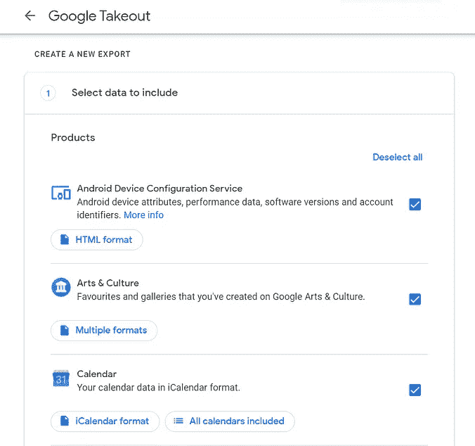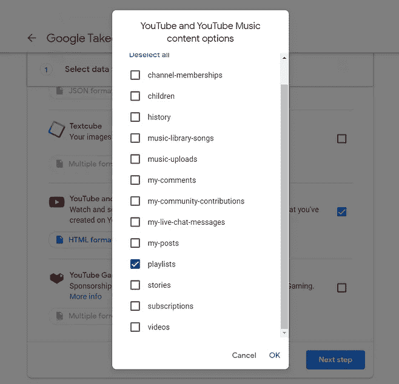

谷歌外卖截图

一旦你进入主页，让我们取消所有选择，只选择 Youtube 播放列表，这可以通过点击**取消所有选择**然后向下滚动来完成，一旦完成，点击下一步，它会问你想下载什么，勾选播放列表，然后点击下一步，在通过一些认证检查后，你就可以走了。

一旦你下载了文件，你将有一个包含多个文件的文件夹，我们感兴趣的是“watch-later.json”。它将是一个 JSON，包含所有的视频集合及其描述等等，如下图所示。

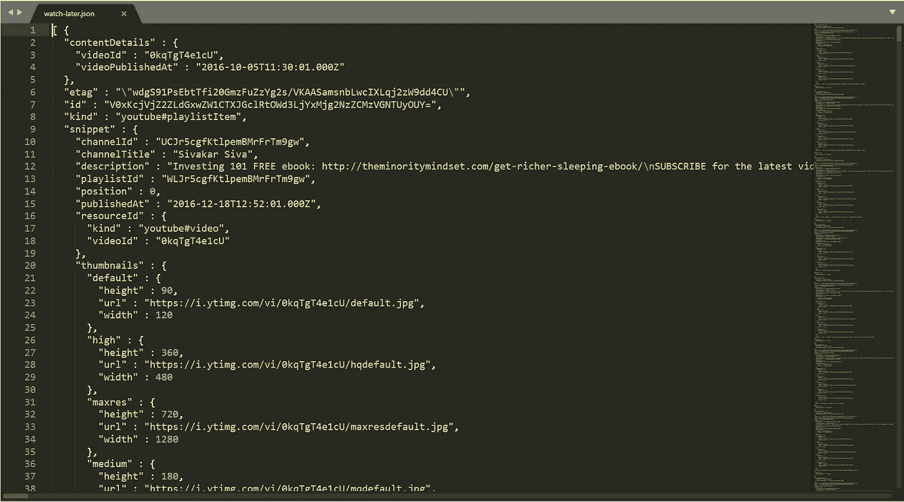

我的手表-后来的 JSON

# 让我们开始破解代码吧

```
Print(videos[1]['snippet'])
```

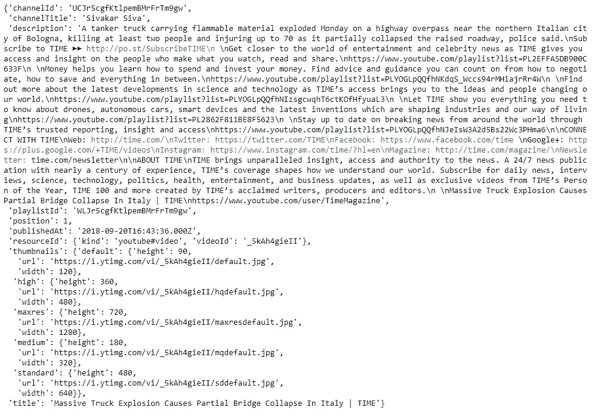

# 获取所有视频的原始标题！！！

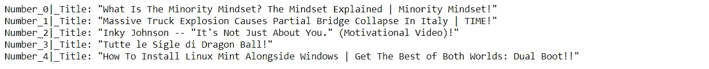

这里我们得到的是所有未经预处理的标题的总和，我没有做任何预处理，如词干化或词汇化，因为我对实际的上下文和标题名称感兴趣，所以我保持不变。

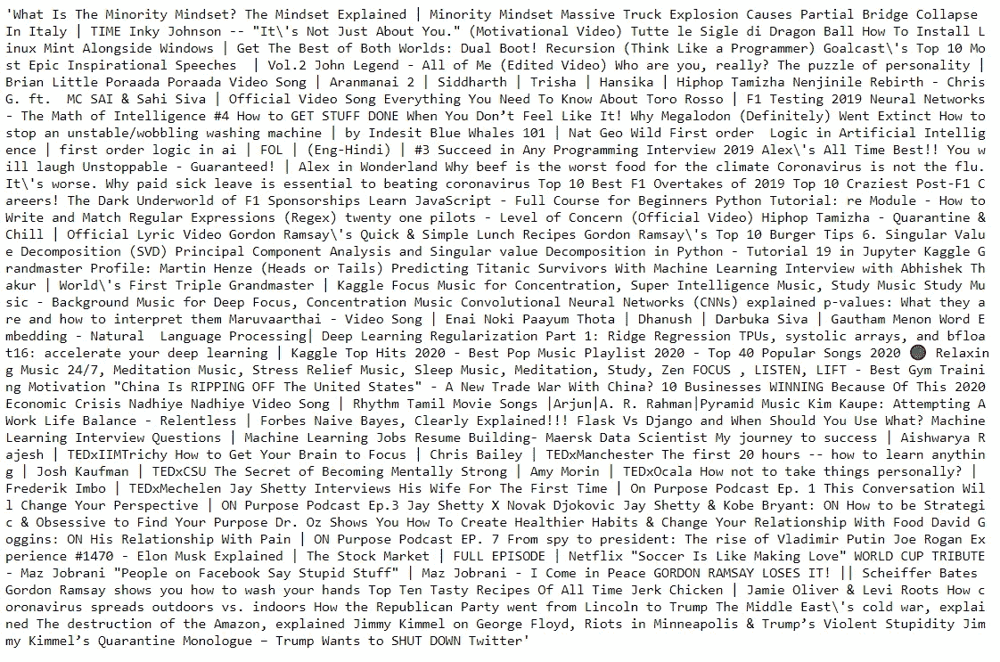

## 停止言语

当然，我们不希望最常见的互联网/youtube 使用的术语出现在我们的词云中，所以让我们将它们添加到原始的停用词列表中，这样它们就可以被过滤掉。

## **创造词云**

现在，我们为什么要创造一个简单的词——云呢？当我们可以用两行代码创建一个很酷的。我们只需要下载一张你喜欢的图片，把这个蒙版应用到单词云上。我为我的 word_cloud 选择了下面这张图:你可以用任何你喜欢的图片来尝试，我个人用的是 Youtube 的 logo。灵感来自:this:[https://www . data camp . com/community/tutorials/word cloud-python](https://www.datacamp.com/community/tutorials/wordcloud-python)


在我的播放列表上生成单词云

有趣的是，我们看到有大小不同的单词，没有一个单词被重复，每个单词的大小表明了它的频率或重要性。

# 现在让我们尝试一些别的东西，为什么我们不在 2D 空间可视化这些视频，看看它们是如何聚集的？

首先，我们需要将集合转换成 TF-IDF 特征的矩阵。

这产生了形状的稀疏矩阵(80，382)

> ***什么是稀疏矩阵？***

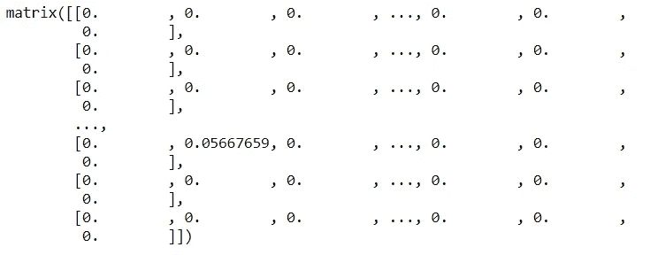

形状的 x 稀疏矩阵(80，382)

> *it* 是一个包含极少非零元素的矩阵。当稀疏矩阵用二维数组表示时，我们可能会浪费大量内存空间来表示它。[ [1](http://www.btechsmartclass.com/data_structures/sparse-matrix.html#:~:text=Sparse%20matrix%20is%20a%20matrix,only%2010%20non-zero%20elements.) ]

## 截断奇异值分解(又名 LSA)

这通过截断奇异值分解(SVD)来执行线性维数缩减。与 PCA 相反，这种估计器在计算奇异值分解之前不集中数据。这意味着它可以有效地处理稀疏矩阵。[ [3](https://scikit-learn.org/stable/modules/generated/sklearn.decomposition.TruncatedSVD.html)

## 在 2D 空间中可视化视频

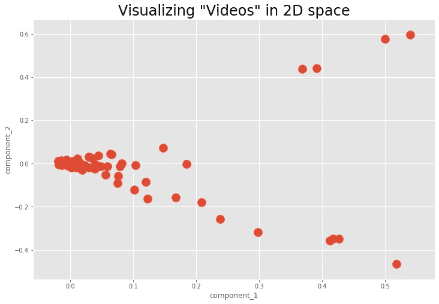

现在我们已经减少了维度，我们可以清楚地看到它们有两个/三个集群，一个集群有最多的视频，而第二个集群在顶部遥遥领先，只有四个视频。

为了更加准确，让我们使用**肘方法:**在聚类分析中，这是一种用于确定数据集中聚类数量的启发式方法。**方法**包括绘制解释的变化作为聚类数的函数，并选择曲线的**弯头**作为要使用的聚类数。[ [2](https://en.wikipedia.org/wiki/Elbow_method_(clustering)#:~:text=In%20cluster%20analysis,%20the%20elbow,number%20of%20clusters%20to%20use.)

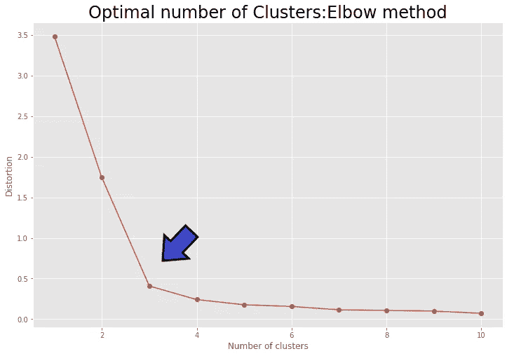

> 聚类的最佳数量是 3。

## k 均值绘图函数

## 应用 K-均值

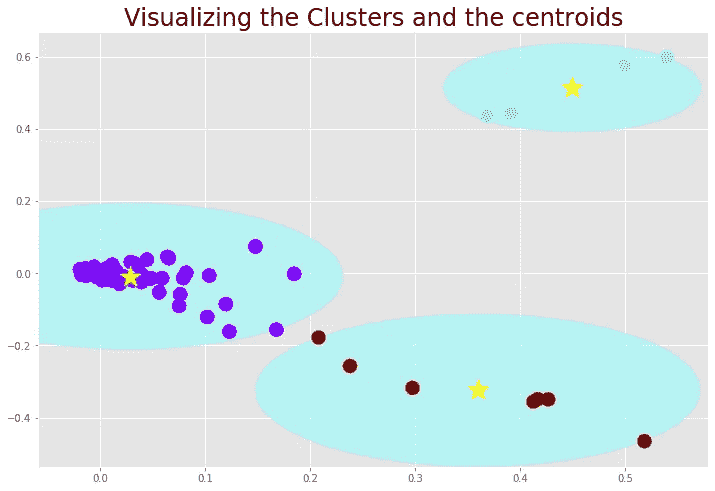

## 定义集群

## CLUSTER_1，绿色数据点是什么视频？

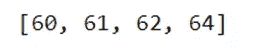

簇 1 的视频索引


群组 1 视频

## CLUSTER_2，紫色数据点是什么视频？


簇 2 的视频索引

## CLUSTER_3，红色数据点有哪些视频？

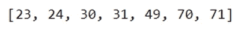

簇 3 的视频索引

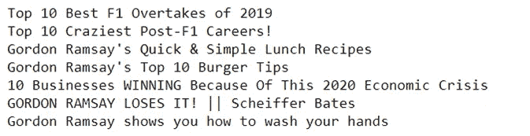

Cluster_3 视频

通过查看这两个集群，我们可以看到集群 1 包含播客，而集群 3 包含食物类型视频和 F1 的混合。这两个是一种很好的分布，其余的视频在集群 2(蓝色点)这里，我认为这可能是两个集群本身。

TF-IDF、K-means 和截断 SVD 的组合在得出 2D 分布和进一步选择这些聚类方面做得非常好，并且降维技术在没有太多信息损失的情况下工作得非常好。

# 摘要

我上面获得的单词云和 2D 空间分布偏向于我的播放列表(我的播放列表相对较小，只有 80 个视频),它设法使用三个集群来分离视频，尽管它可能会更精确一些，但分析具有更多数据点的更大的播放列表会更有趣。

非常有趣的是，其他每个人都有自己的分布，所以集群的组织方式和单词 cloud 一样不同，所以我强烈建议您尝试一下，亲自做这件事并查看我的结果非常有趣。还可以进一步应用一些东西来更好地评估这种分析并获得更好的见解，例如，代替应用 K-means，您可以尝试使用 GMM(高斯混合模型)，尝试实现一些主题建模等等。