# 行列式到底是什么？

> 原文：<https://towardsdatascience.com/what-even-is-the-determinant-1180f036cec0?source=collection_archive---------25----------------------->

## 它不仅仅是一个任意的公式…

在最近的一篇博文中，我提出了一个相对简单的问题——为什么线性代数教得这么差？

 [## 为什么线性代数教的这么差？

### 线性代数是机器学习的基石之一。这比你想象的更直观

towardsdatascience.com](/why-is-linear-algebra-taught-so-badly-5c215710ca2c) 

它引起了比我预料的更热烈的反应。许多评论分享了我的沮丧——线性代数教科书和课程的特点似乎是完全缺乏直觉，几乎是故意的不透明。为了论证这一点，我设了一个问题:下面这个矩阵的行列式是什么？

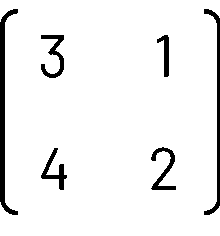

由于下面的公式，我们一致认为答案是 2:

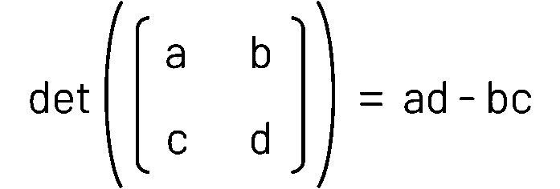

但是*为什么是*？就此而言，什么甚至是*是*的决定因素？

首先，让我们回到*线性转换*的思维模式。回想一下之前的博客，任何矩阵都可以被认为是线性变换。特别是，对于一个 2x2 矩阵，该矩阵的列告诉我们基向量[1，0]和[0，1]发生了什么，分别称为*和 *ĵ.**

*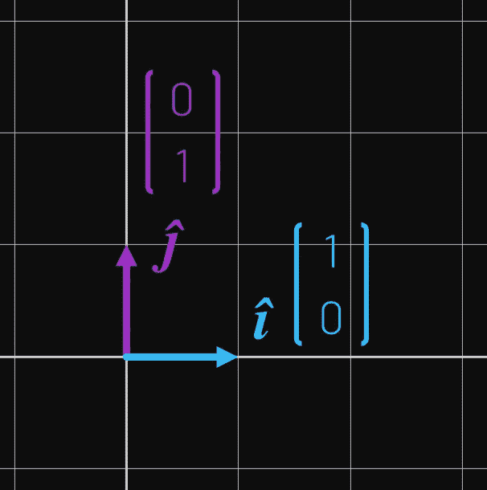*

*单位向量，*ĵ*和*

**例如，通过取矩阵 a 的列[[2，0]，[2，2]]，我们可以看到*和*和 *ĵ* 发生了什么，从中我们可以看到，它所表示的线性变换是一个水平向右的[剪切](https://en.wikipedia.org/wiki/Shear_mapping)，随后是因子 2 的缩放。**

**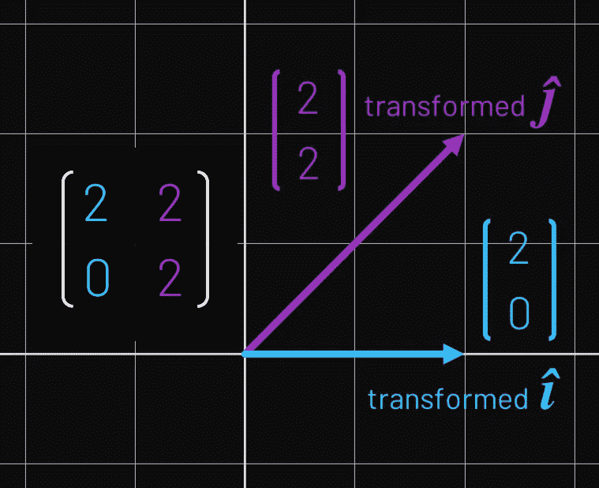**

**记住，在线性变换过程中，单位向量的变化，必然定义了整个 2D 平面上每一点的变化。如果我们将上述变换应用于任何 2D 矢量***v***=[*x*， *y* ]，则该矢量将在由 *x* 批‘已变换的*’*加上 *y* 批‘已变换的 *ĵ* 给出的新位置处结束。所以即使变换可以很好地用单位向量来定义，我们也应该考虑变换对整个空间的影响。****

***但是有没有一种方法可以在这个“空间”层次上量化一个转变的效果呢？考虑以下转换:***

*   ***顺时针旋转***
*   ***缩放比例(在这种情况下为负)***
*   ***水平剪切***

***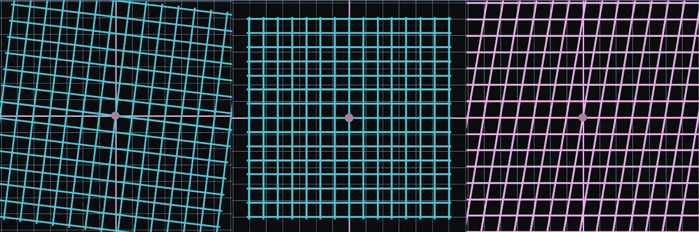***

***三种类型的线性变换——想想它们是如何影响整个 2D 平面的。***

***在这些变换下，平面的面积会发生什么变化？我们可以看到旋转不会影响区域，但是尺度和剪切呢？我们知道，2D 平面永远向前延伸，因而具有无限的面积。但我们可以从绿色和粉色网格线中清楚地看到，在这些情况下发生了一些挤压——无限空间正在“变小”(尽管，当然，它仍然无限大)。***

***这显然是一次思维旅行，所以让我们回到我们信赖的单位向量*t1】和 *ĵ* 。考虑由单位向量形成的正方形的面积，其中顶部和底部由*和*给出，边由 *ĵ.给出*****

**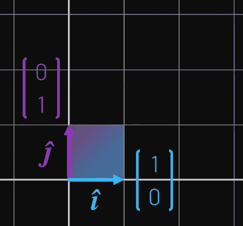**

**很明显，这个正方形的面积是 1，因为每个单位向量的长度都是 1。现在让我们考虑矩阵[[2，0]，[2，2]]所表示的变换。再一次，让我们画出*和*和 *ĵ* 发生了什么，另外，那个方块发生了什么。**

**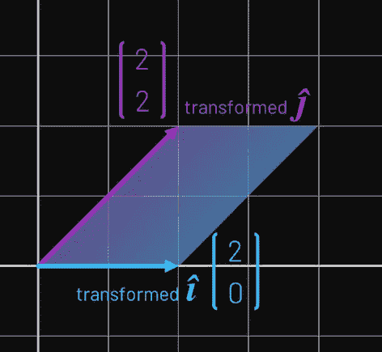**

**注意—平行四边形的顶部和底部仍由*表示，左侧和右侧仍由ĵ* 表示**

**我们可以看到正方形延伸成平行四边形(当然，正方形是平行四边形的一种特殊类型)。我们知道这个形状的[面积是由高度乘以底边长度得出的，在本例中是 2*2 = 4。](https://en.wikipedia.org/wiki/Parallelogram#Area_formula)**

**值得注意的是，由于线性变换的“规则”(平行线保持平行，平行线之间的距离保持相等，原点保持在原点)，我们可以对 2D 平面中的任何形状应用相同的变换，而不仅仅是由*和 *ĵ* 形成的正方形，其面积也将增加 4 倍。***

***我们能概括这种想法吗？假设我们有一个由以下矩阵表示的线性变换:***

***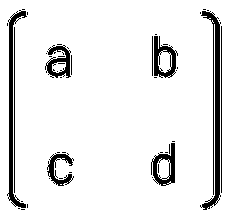***

***那么，这个变换会以什么系数增加 2D 平面上一个图形的面积呢？我们可以通过计算变换后的ĵ.和变换后的平行四边形的面积来回答这个问题***

***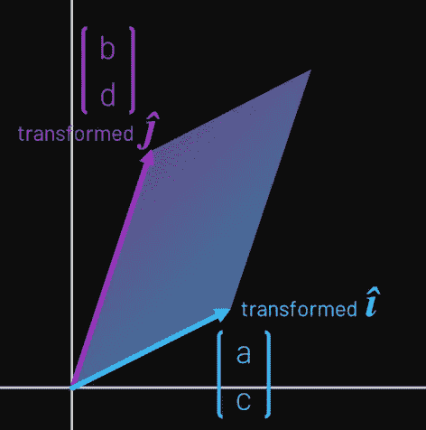***

***为此，我们可以执行一些几何欺骗，如下所示:***

***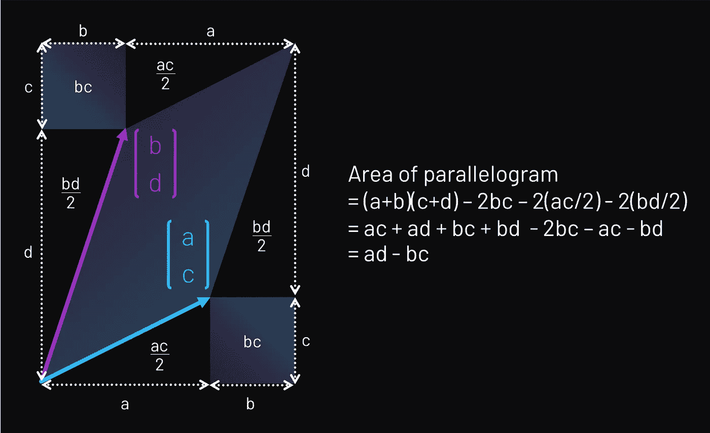***

***于是我们看到矩阵[[a，b]，[c，d]]所表示的线性变换，会使一个形状在 2D 平面上的面积增加 *ad-bc* 的倍数。如果这个公式看起来很熟悉，那是因为它应该:***

******

***事实上，一般来说，行列式就是这样的——空间被给定的线性变换扩展的因子。***

***现在，尽管这很好很简洁，但这还不是整个故事。如果你以前处理过行列式，你会知道它们可能是负值——当然没有任何公式 *ad-bc* 排除负值。但是这个空间膨胀因子为*负*意味着什么呢？你不可能有一个面积小于零的形状。***

***让我们看看能不能找出发生了什么。考虑以下成对的变换*和变换*ĵ，以及它们各自的行列式:***

***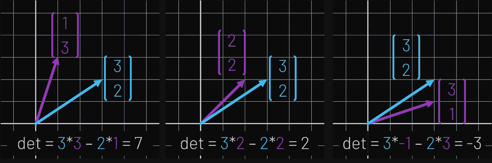***

***我们保持转换后的*(蓝色)不变。随着我们将变换后的 *ĵ* 移得更近，我们可以看到行列式变得更小，直到 *ĵ* 最终移过*和*，行列式变成负数*。*****

***事实上，这种*和*和 *ĵ* 的“翻转”正是决定一个行列式是正还是负的原因。事实上，空间是否被“翻转”,是我们可以从行列式中立即得知的另一个方面。***

***还有一个与上面相关的特例——行列式为零的情况。事实上，学习所有这些的主要动机通常是检查一个矩阵何时是“零行列式”的。但是这样一个矩阵在线性变换方面有什么作用，它的结果是什么？***

***考虑变换后的*和*和变换后的 *ĵ.形成的平行四边形我们已经展示了行列式是由这个形状的面积给出的，那么在什么情况下它会等于零呢？****

***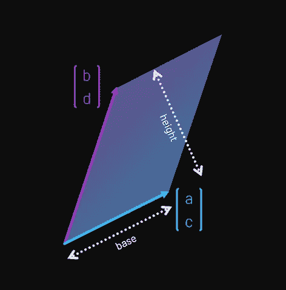***

***对于这个面积为零的形状，我们需要底或者高等于零。这种情况发生在一些小情况下(即当[a，c] = [0，0]或[b，d] = [0，0]时)，但当变换后的*和变换后的 *ĵ* 彼此平行时也会发生。这种情况可能发生在它们互相叠放在一起的时候，或者它们正好相对的时候。****

***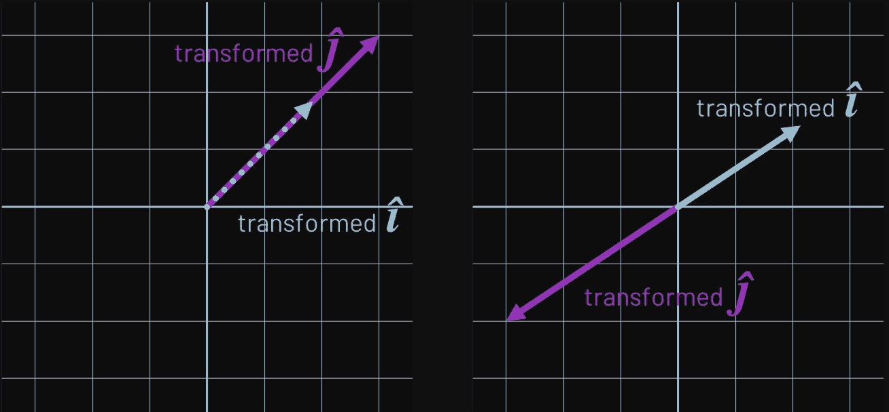***

***有一些先存线性代数知识的可以更精确；特别地，当变换后的*和变换后的*【ĵ】*(即矩阵的列) [*线性依赖*](https://en.wikipedia.org/wiki/Linear_independence) 时，我们有一个零面积平行四边形(因此有一个零行列式矩阵)。****

***如果我们从线性变换的角度考虑正在发生的事情，也就是变换“挤压”2D 平面的程度，这就有了重要的结果。如果变换后的*和变换后的 *ĵ* 是线性相关的，那么根据定义，变换后的*和变换后的 *ĵ* 的所有线性组合都被限制在一条线上。本质上，我们*失去了*一个维度；2D 空间被压缩到一条 1D 线上。*****

***对于给定的零行列式矩阵，它会自动告诉我们一些事情。通过考虑线性变换，看看你现在能否用简单的英语来论证为什么下面的东西适用于这样一个 2x2 矩阵， *M* :***

*   ****M* 无[逆](https://en.wikipedia.org/wiki/Invertible_matrix)。***
*   ****M* 的*行*是线性相关向量(以及列)。***
*   ***与 *M* 相关的线性方程组或者无解，或者有无穷多个解(即没有唯一的解)。***

***如果对行列式及其代表的意义没有直观的了解，你可能会认为这些是理所当然的(就像我刚开始学习线性代数时一样)。***

***不言而喻，在整篇文章中，我们一直关注行列式背后的直觉。这里没有什么是特别严格的，而且我敢说，我还没有真正在数学意义上“证明”任何东西。我们通过纯粹的二维思维相对简单地保存了事物(尽管同样的直觉在更高维度中有效——平行四边形的面积变成了平行六面体的体积，等等)。***

***这是故意的。正如我之前的博客一样，这种更高层次、直觉驱动的思维受到了格兰特·桑德森的视频系列“线性代数的本质”的启发(我强烈推荐给任何对数学、数据科学或机器学习感兴趣的人)。用桑德森自己的话说:***

> ****“这里的目标不是试图教你所有的东西，而是你带着强烈的直觉离开……这些直觉让你未来的学习更加富有成效……”****—格兰特·桑德森******