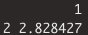
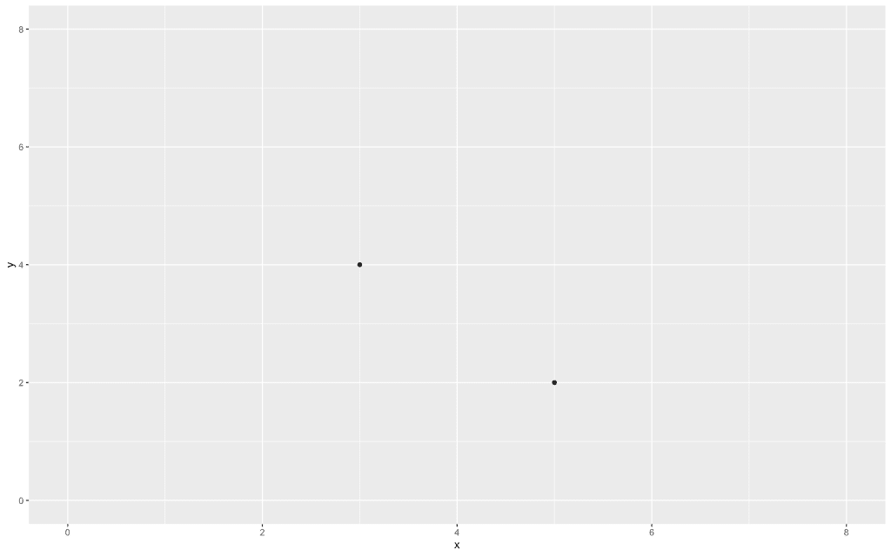
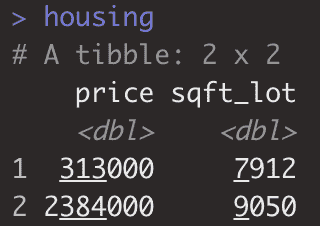
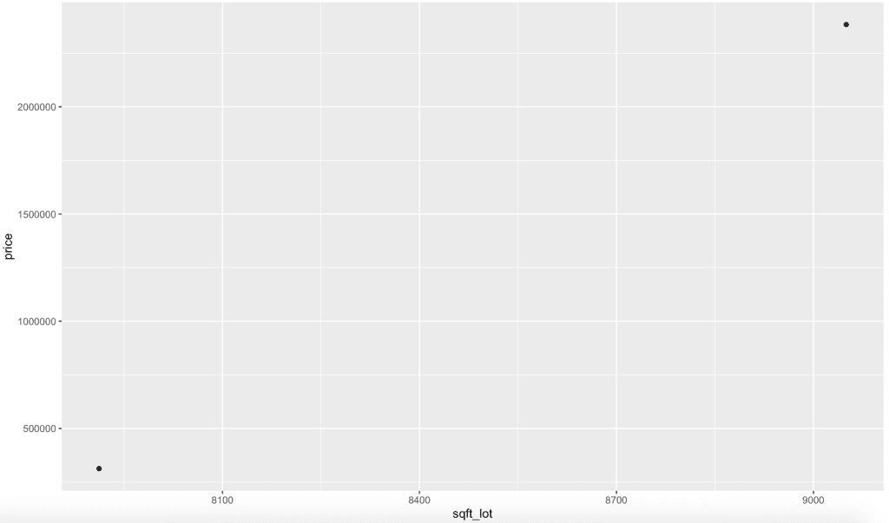
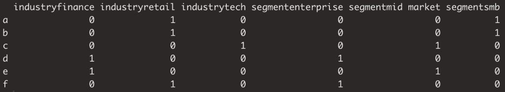
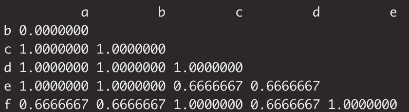

# 每个数据科学家需要了解的集群知识

> 原文：<https://towardsdatascience.com/what-every-data-scientist-needs-to-know-about-clustering-cf8f860a1883?source=collection_archive---------72----------------------->


图片来自 [Pixabay](https://pixabay.com/?utm_source=link-attribution&utm_medium=referral&utm_campaign=image&utm_content=1215079) 的 [Devanath](https://pixabay.com/users/Devanath-1785462/?utm_source=link-attribution&utm_medium=referral&utm_campaign=image&utm_content=1215079)

# 机器学习导论

机器学习是一个经常被谈论的术语，然而人们往往对它的不同领域缺乏了解。

机器学习的第一个区别是所谓的监督学习和非监督学习。

当你在机器学习和数据科学的世界中铺平道路时，对这种区别和其中任何一个的目的/应用有一个基本的理解将会非常有帮助。

# 监督和非监督学习

监督学习当然是更著名的类别。

监督学习由分类和回归组成，这实际上意味着，你确定一个响应变量和解释变量，并使用它们来建模一种关系——无论是为了解释还是预测。(你可以在这里了解更多关于这个区别的[)。](/do-you-know-the-general-modeling-framework-c422f866a2dc)

分类有效地代表了确定一个分类变量和其他变量的某种组合之间的关系。这可能是预测电子邮件属于哪个收件箱，预测某人是否会拖欠贷款，或者预测销售线索是否会转化。

回归还试图对因变量和自变量之间的关系进行建模，然而在这种情况下，我们试图对连续变量进行建模。回归可能是你听到最多的。这可能是模拟房价、收入数字、树龄、汽车最高速度、客户产品使用等。

# 无监督学习

既然我们已经解决了所有这些问题，让我们来谈谈无监督学习。

简而言之，我们不是预先决定我们希望我们的算法找到什么，而是提前给算法提供很少甚至没有指导。

换句话说，我们不是明确地告诉我们的算法我们想要预测或解释什么，而是踢回去，把接力棒交给算法来识别给定特征中的突出模式。

让我们从一个例子开始，看看如何在住房数据上使用监督和非监督学习方法。

一种受监督的方法可能是利用这些数据训练一个模型来预测房价。

无监督的方法可以是识别价格的自然分组或一些变量的组合，例如价格和房间数量。

我刚才解释的实际上是我们在这里学习的技术。让我们开始吧。

要了解更多关于这些机器学习领域之间区别的信息，你可以访问这里的[！](/machine-learning-in-a-nut-shell-df251f480f77)

# 到底什么是聚类或聚类分析？

为了更好地理解集群，首先要理解它的基本目的。

# 目的

如果你是一名数据科学家，任何分析的先决条件之一就是要在某种程度上理解你的数据。这种理解的一个方面来自于数据集记录之间相似性的概念。

为了进一步定义这个想法，**我们想要了解任何和所有记录**之间的相对相似性或不相似性。

实现这一点的一种机制是通过识别记录的自然分组。这些分组可以被定义为彼此最相似而与其他分组的记录最不相似的记录。

如果不明显，这就是集群发挥作用的地方。这是创建所述分组的算法方法。

为了进一步阐明这一点，聚类分析可以帮助您回答一个基本问题:**任意两个观察值有多相似或不相似？**

# 如何衡量？

我们试图评估两个记录的相似性，并使用这些记录之间的距离来帮助定义。

相异度度量或*距离*被定义为 1-相似度

距离越大，差异越大，反之亦然。

让我们用下面的假设数据集来说明。

```
chess <- data.frame(
                 y = c(2, 4),
                 x = c(5, 3))
row.names(chess) <- c('knight', 'king')
```

我创建了一个小数据集，详细描述了棋盘的 x 轴和 y 轴。我不知道国际象棋棋盘的每个轴是否真的有名字…我知道其中一个包含字母，但为了简单起见，跟我来。

我们将使用`dist`函数，默认为两点之间的欧几里德距离。如你所见，它将骑士和国王之间的距离定义为 3.46

```
dist_chess <- dist(chess)
```



您也可以手动计算两个片段之间的欧几里德距离。也等于 2.82。

```
knight <- chess[1,]
king <- chess[2,]piece_distance <- sqrt((knight$y - king$y)^2 + (knight$x - king$x)^2)
```

让我们在一个阴谋上放弃我们的部分！

```
ggplot(chess, aes(x = x, y = y)) + 
  geom_point() +
  lims(x = c(0,8), y = c(0, 8))
```



# 聚类的应用

在所有这些解释之后，集群到底是为了什么？你为什么要花时间去学习它？

任何时候，当你想评估相似性时，聚类分析都是非常有用的。

你可能在一家软件公司工作，在那里你想了解不同的用户是如何相似或不相似的，有可能改变产品、信息等。

这些应用也远远超出了商业范畴。从植物和动物物种的分析，用户行为，天气，以及任何我们可以测量模式的东西..

# 什么时候用最好？

可能有许多潜在的合适时间来使用聚类分析。其中最突出的是在探索性数据分析期间。如果你不熟悉探索性数据分析，你可以在这里了解更多关于探索性数据分析的基础知识[。](https://medium.com/swlh/guide-to-exploratory-data-analysis-with-jhu-covid-19-data-41101b69c855)

无需深入探究探索性数据分析(EDA)的原理，EDA 的主要目的是让自己熟悉正在处理的数据集。

在这个过程中，集群非常有用。

# 聚类准备

让我们进入一些在进行分析之前需要的预处理步骤。

# 不要忘记缩放！

让我们跳回象棋的例子。值每增加 1 个单位，代表给定方向上的一个单元。这是一个很好的例子，说明了欧几里德距离是完全有意义的。

但是，如果您使用不同规模的指标进行聚类，比如年收入和员工数量，或者脚的大小和垂直跳跃，该怎么办呢？

当我们使用的价值观不能相互比较时，挑战就来了，正如我前面的例子所示。

想想下面两个场景，

场景 1:

你有两家员工人数相同的公司，但其中一家的收入比另一家多 1000 美元。

现在让我们交换不同的变量，它们有相同的收入，但其中一个比另一个多 1000 名员工。

第一种情况是两个公司非常相似，只有 1000 美元的收入差异很小，可能意味着两个公司的价值非常相似。具有讽刺意味的是，第二个例子凸显了两家截然不同的公司。它可能在行业、细分市场或其他方面有很大差异。

虽然这两个场景中的差异是 1000，但这种差异对于两个不同场景中的不同事物来说是显著的。

变化组值的问题是它们有不同的平均值和不同的变化。这正是我们刚刚讨论过的情况。

因此，在执行聚类分析时，我们调整我们的指标以具有相同的平均值和可变性是非常重要的。

我们将使用一种称为标准化的方法，有效地将我们的指标的平均值变为 0，标准差变为 1。

从技术上讲，我们可以手动缩放给定的变量，如下所示。

```
scaled_var = (var - mean(var))/sd(var)
```

虽然熟悉计算的逻辑很好，但是只使用 r 中的 scale 函数也很方便。

# 缩放和远离住房数据

让我们对住房数据进行同样的练习。

我从 kaggle 下载了西雅图房价数据。你可以在这里找到。

让我们快速可视化数据集的前两个数据点。

以下是我们正在处理的数据点:



```
housing <- housing[1:2, c('price', 'sqft_lot')]
ggplot(housing, aes(x = sqft_lot, y = price))+
  geom_point()
```



```
housing <- housing[1:2, c('price', 'sqft_lot')]
ggplot(housing, aes(x = sqft_lot, y = price))+
  geom_point()housing_dist <- dist(housing)housing_scaled <- scale(housing)
housing_scaled_dist <- dist(housing_scaled)
```

# 分类数据的相似性得分

到目前为止，我们一直在讨论两点之间的欧几里德距离，并用它来代表不相似性。

在分类数据的情况下我们该怎么做？

幸运的是；类似于范畴的欧几里得距离，我们使用一种叫做 Jacaard 指数的东西。

让我解释一下 Jacaard 指数。

假设您有一个包含案例 a 和 b 的分类字段，Jacaard 索引为我们提供了两个案例 a 和 b 都出现的情况相对于其中一个出现的次数的比率。

你也可以把它想成 a & b 的交集与 a & b 的并集之比。

使用我们之前使用的相同的`dist`函数，但是在这种情况下，只需将`method`改为`'binary'`，您就可以测量距离了。

让我们首先创建一个数据集进行实验。下面你可以看到我为每家公司提出了两个分类变量。

```
companies <- data.frame(
  industry = c('retail', 'retail', 'tech', 'finance', 'finance', 'retail'),
  segment = c('smb', 'smb', 'mid market', 'enterprise', 'mid market', 'enterprise'))
row.names(companies) <- c('a', 'b', 'c', 'd', 'e', 'f')
companies$industry <- as.factor(companies$industry)
companies$segment <- as.factor(companies$segment)
```

确保将您的类别声明为因子！

现在我们将把我们的范畴转化为虚拟变量，你可能也听说过术语一热编码。其思想是将分类的每个值转换成一个列，并用 1 或 0 填充行值。我们将在 r 中使用`dummies`包中的`dummy.data.frame`。

```
companies_dummy <- dummy.data.frame(companies)
```



如上所述，您会注意到，对于行业的每个价值，我们会看到一个与每个价值相关联的列:金融、零售和技术。我们看到每一列都是一样的。

现在让我们运行我们的`dist`函数。

```
dist <- dist(companies_dummy, method = 'binary')
```



在这里，每家公司都在相互比较。A & B 是 0，因为它们之间没有距离。如果你记得他们都是中小企业零售。1 是如果他们没有相似性。你会注意到，对于 C & E，它们只有一个相似之处，因此距离为 0.67。

# 结论

我希望您喜欢这种分类。

我们已经讨论了机器学习的两个主要领域。

聚类的定义、目的、应用和度量。

我们已经学习了预处理以及如何计算两点之间的距离，无论是数值还是分类。

随着您在分析中继续学习和实施不同的聚类方法，这些课程都将被证明是非常基础的。

祝数据科学快乐！