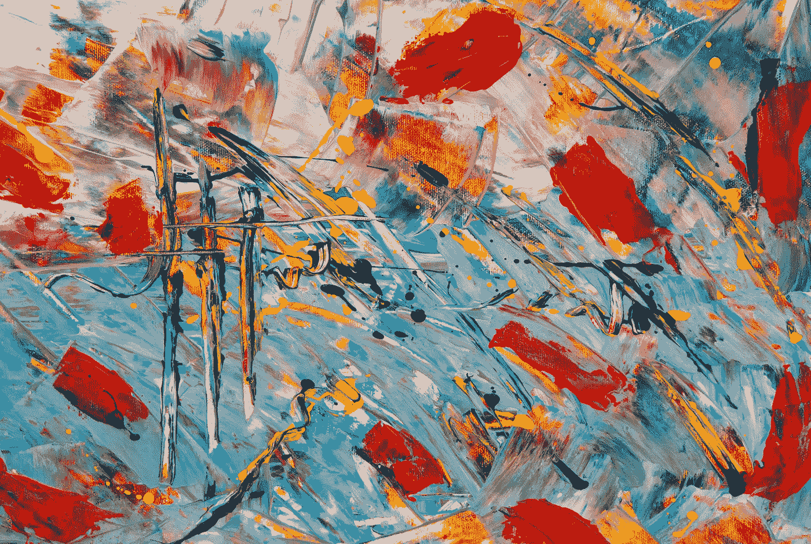
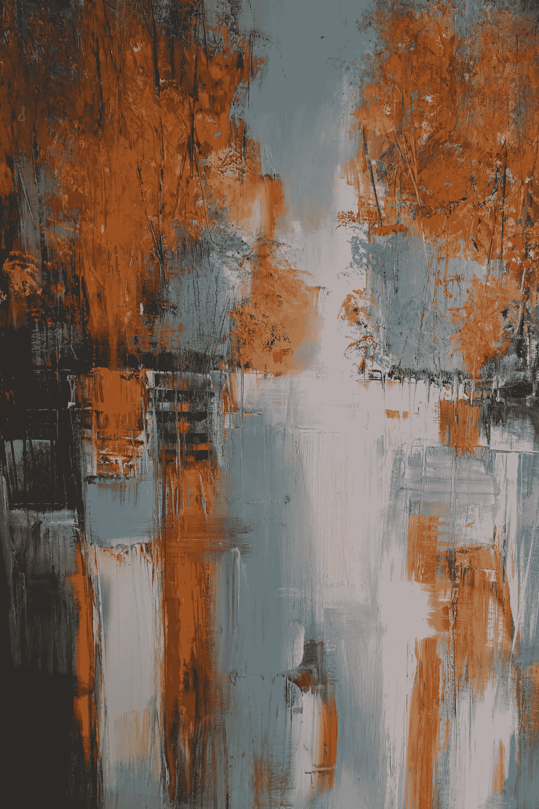

# 每个数据科学家需要从艺术中学到什么

> 原文：<https://towardsdatascience.com/what-every-data-scientist-needs-to-learn-from-art-402b8e8eb07b?source=collection_archive---------21----------------------->

## 因为你也必须和非书呆子打交道

艺术家可以教你很多东西。[斯蒂夫·约翰森](https://unsplash.com/@steve_j?utm_source=unsplash&utm_medium=referral&utm_content=creditCopyText)在 [Unsplash](https://unsplash.com/s/photos/painting?utm_source=unsplash&utm_medium=referral&utm_content=creditCopyText) 上拍照

  W 帽子是一个数据科学家最大的痛苦？根据 Quora 上的这篇帖子，最痛苦的部分是数据:因为它不完整或不可靠。

当你向下滚动时，另一个反应是很难说服企业领导人接受数据科学家的工作。

YCombinator 的黑客新闻上的回应指向了类似的方向。对于一位受访者来说，最大的痛苦是与不尊重统计和数据科学的人打交道。另一方面，当人们要求他们对复杂的问题给出简单的非黑即白的答案时，这很糟糕。

# 艺术可以解决这一切。

艺术就像止痛药。不相信我？请继续阅读。

如果你已经相信我了，你会在这篇文章的结尾找到一切。

## 1.不完整数据

所以你有缺失或不完整的数据。你现在在想什么？

你可能在考虑创建内插或外插来使这一切工作。你担心你美丽的结论会被拒绝，因为对于任何非数据科学家来说，它是建立在推测之上的。

别担心了。现在。人类并不像你认为的那样倾向于逻辑思维。至少，那些不是数据科学家的人类。

> 让您的数据变得美丽

你知道内插法和外推法不是缺陷，当然也不仅仅是推测。但是其他人不知道。所以你需要用其他方式说服他们。

让你的数据变得漂亮。更重要的是，让你的结果变美！

大多数数据科学家来自计算机科学或相关背景。他们学会了如何与机器对话，但没有学会如何说服人类。好消息是有很多工具可以提供帮助。

你会惊讶地发现，如果你在正确的地方添加一些颜色和形状，会有更多的人——甚至是非常理性的人——欣赏你的成果。

 [## 2019 年你不能错过的 9 个数据可视化工具

### 在数据科学领域，数据可视化无疑是当今的热门词汇。

towardsdatascience.com](/9-data-visualization-tools-that-you-cannot-miss-in-2019-3ff23222a927) 

## 2.不可靠的数据

许多数据科学家将不一致和不可靠的数据视为痛苦，因为这非常耗时。一旦对工作的第一波热情过去，你会觉得自己更像一个看门人，而不像一个科学家。

你失望吗？想想你以前所有的工作角色，以及它们听起来有多华而不实。然后想想那些隐藏在华而不实的头衔背后的肮脏工作。

在艺术领域，浮华的外表和冷酷的内心之间的差异无处不在。

想想你最喜欢的五位艺术家——无论是音乐、绘画、文学还是其他领域。我敢打赌，其中相当多的人面临着比你经历过的任何事情都要糟糕的逆境。

当然，这些艺术家中的大多数都已经成名了。他们在生活中有一些可怕的经历，但现在他们以艺术闻名，他们过着奢侈的生活。而你还在清理数据。

你不是艺术家，但你可以向艺术家学习。弗兰·霍根在 [Unsplash](https://unsplash.com/s/photos/painting?utm_source=unsplash&utm_medium=referral&utm_content=creditCopyText) 上的照片

现在想一想你可能认识的艺术家，他们可能还没有成名。事实是，对于每一个成名的艺术家来说，地下有 1000 个永远不会成功的艺术家。

艺术家们创造出无人能见的神奇事物。没人会听的。他的作品，无论多么辉煌，都将在时间的长河中褪色。他们的名字将成为饥饿艺术家长长的墓地名单上的又一个条目。

现在，看看你自己。你作为数据管理员的工作并不鼓舞人心。你的客户甚至不感激你的肮脏行为。但最终，这可能会帮助你建立模型，为你的客户带来洞察力。如果他们没有，至少你会得到报酬。

不像数以百万计的艺术家每天创作鼓舞人心的作品，却永远不会激励任何人。因为没人会看到。

下次你抱怨数据清理的时候，想想这一点。

 [## 数据科学家:21 世纪最肮脏的工作

### 40%是吸尘器，40%是清洁工，20%是算命师。

towardsdatascience.com](/data-scientist-the-dirtiest-job-of-the-21st-century-7f0c8215e845) 

## 3.为复杂的问题提供简单的答案

这是几乎每个数据科学家在职业生涯中都会遇到的痛苦。客户会给你一堆复杂的数据，并要求你用简单的黑白方式给出答案。

作为一名科学家，过于简单化是违背你的精神的。那么你将如何给出一个简单的答案呢？

再想想吧。客户真的想要一个简单的答案吗？不。客户想要一个他能理解的答案。

所以你的工作不是过度简化你的结果。你的工作是让他们可以理解。这就是你问艺术家的地方。

你可以在没有先前知识的情况下看一幅画或听一首歌，仍然建立联系。你不能用科学做到这一点。

科学是漫长而艰苦的研究，直到你得出结论。艺术是有趣的实验，直到你找到能引起你和他人共鸣的东西。

艺术给你一种理解的感觉，即使你还没有理解。

为了让你的客户高兴，用一些艺术技巧处理你的结果。你不需要降低复杂性。你需要做的就是把它转化成能引起客户共鸣的东西。

您的客户需要能够从您的结果中学习，而不是自己成为数据科学家。艺术是实现这一目标的工具——想想视觉化，还有更广泛的创造性方面。

这将涉及一些额外的工作。但是你的客户会爱上你的。

创意才是王道。照片由[艾伦·斯盖尔斯](https://unsplash.com/@ascales?utm_source=unsplash&utm_medium=referral&utm_content=creditCopyText)在 [Unsplash](https://unsplash.com/s/photos/painting?utm_source=unsplash&utm_medium=referral&utm_content=creditCopyText) 上拍摄

## 4.与非数据科学家打交道

你是数据科学家。您最喜欢的职业是独自拿着笔记本电脑坐在某个地方，根据数据集构建一个漂亮的模型。宇宙很简单:你。你的笔记本电脑。你的模特。

但你是人，你需要与人交往。那么你和谁出去？当然，还有其他数据科学家。

你们有很多共同的兴趣，并且你们不同的技能可以相互促进。你们互相学习。你们从彼此中成长。

但是数据科学家并不需要彼此。

你需要商业领袖。你需要为你的工作付钱的人。

问题是，他们不知道他们付钱给你是为了什么。他们有一个问题，例如，获得更多的客户。他们知道解决方案就在现有客户数据堆中的某个地方。但是他们不知道怎么做。你需要提取它。

但你是科学家。你知道研究很难，需要很长时间。你知道一旦你解决了一个问题，你就会面临另一个问题。你知道你做的事情很复杂。非常复杂。

这就是你讨厌截止日期的原因。你讨厌设定目标。你喜欢四处游荡，自由地寻找灵光乍现的时刻。

艺术家也喜欢四处漫游。他们喜欢随心所欲的自由。他们讨厌最后期限。但是他们比你有一个优势:

**创造力。**

当科学家面对商业规则时，他们会变得麻木。想想最后期限或公司目标。如果目标是本周五交报告，他们将在六个月内完成。数据科学家不想处理这种东西。

当艺术家面对规则时，他们会变得有创造力。他们可能不会违反规则，但他们会想办法绕过它。如果他们需要在周五之前交报告，他们甚至可以提前一天交。但是他们会确保他们选择了一种别致的字体，并把它印在亮粉色的纸上。不能一般！

结合双方的优点。你的存在依赖于让你的客户开心。所以你必须遵守他们的规则。不要打破最后期限。不要错过企业目标。但是稍微改变一下规则——不要太多，只要足够——加入你的个人情趣。毕竟这是你的工作。

 [## 11 月版:艺术与数据科学

### 更多关于艺术和数据科学的关系。8 篇必读文章

towardsdatascience.com](/november-edition-art-data-science-4789c30da4ea) 

## 5.说服商业领袖

你是科学家，不是推销员。你可以在工作中加入你的个人趣味——不管是圈内人的笑话、有趣的迷因还是任何能激发你灵感的东西。但是你不能也不想像商人一样思考。

你担心这会影响你的工作。你是科学家，你的正直源于像科学家一样思考。商业逻辑只会让你头脑混乱。

再想想。

我不是要求你在清理或分析数据时像一个商人一样思考。如果需要业务逻辑，你的客户会自己完成这项工作。

但问题是*你如何展示你的作品*。一个商人雇佣了你，所以你的结果的最终展示应该根据他们的需求来定制。

在得到任务和做最后陈述之间发生了什么是你的事情。但你的目标必须始终是为你的客户增加价值。

甚至在准备你的最终陈述时，你也不需要用商业逻辑来思考。但是你需要从对客户有意义的角度考虑问题。

**不要试图给商务人士留下深刻印象。给商业门面背后的人留下深刻印象。**

吸引他们的情感皮层。

不要想:“当他们看到这个结果时，他们会怎么想？”

而是想:“当他们看到这个结果时，他们会有什么感觉？”

使用字体、颜色、形状和视觉效果。让你的作品尽可能的精美。你的客户会因此而喜欢你的。

给你的工作增添一些情趣。照片由佛罗里达本地民间艺术家朗达克在 Unsplash 上拍摄

## 将数据科学与艺术相结合。提高你的产出。

你是科学家，而科学是你最擅长的。

但有时拓宽你的视野到其他学科是值得的。这会让你对工作有新的看法。了解艺术有助于你:

*   要知道，尽管很辛苦，但你的工作比其他许多工作都要好。
*   **让你的数据变漂亮。那比打扫卫生有趣多了。**
*   **增加价值。确保你的客户能从你的结果中获益。**
*   要有创意。变通规则，但不要违反规则。
*   **润色你的成果。让他们与你的客户产生共鸣。**

你不是艺术家，但你可以向他们学习。并获得两个学科的优势。