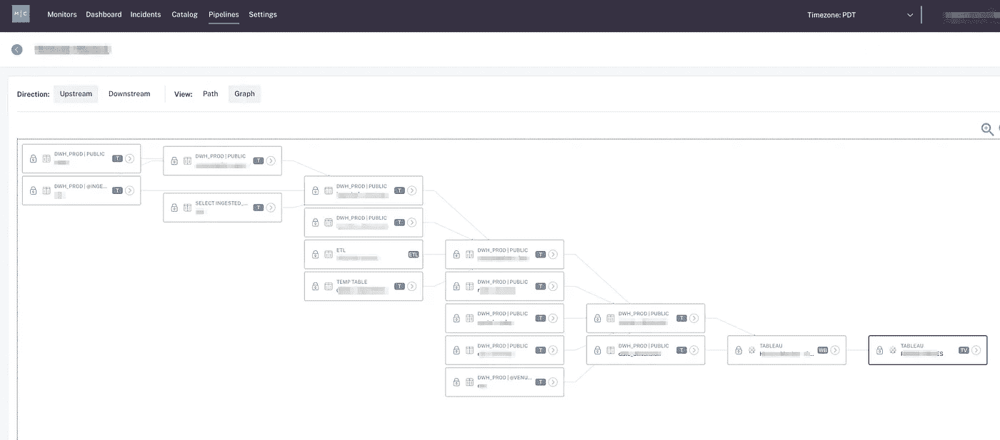

# 每个数据团队在首次公开募股前需要知道的事情

> 原文：<https://towardsdatascience.com/what-every-data-team-needs-to-know-before-you-ipo-5cb377905bb5?source=collection_archive---------45----------------------->

## 恭喜——你的创业公司要上市了！但是数据呢？

图片由 [Shutterstock 上的](http://www.shutterstock.com)Evgeniya Porechenskaya 提供。

*几十年来，当一家公司准备上市时，财务和法律团队首当其冲。随着上市前公司越来越依赖数据来推动创新和增强竞争优势，数据团队也必须帮助规划公开募股的路线。以下是方法。*

许多人最近都在想“我的数据团队可以做些什么来为我们公司的 IPO 做准备？”

虽然有大量的文献支持财务团队踏上上市之旅，但很少有人帮助面临同样挑战的数据团队——这是一个问题。

随着 **Palantir** 、 **Snowflake** 和 **Asana** 等公司在过去几周上市，以及更多公司将上市( **Airbnb** 和 **DoorDash** )，我们正在关注你！)，我汇集了我的关系网，列出了数据组织为其公司成功上市做准备所需的 5 个基本步骤。

# 了解您的数据存储在哪里以及谁在访问它

据优步数据团队的前成员称，任何数据组织在 IPO 之前的第一项工作都是审计你正在收集和存储的数据，以及谁有权访问这些数据(他们称之为“数据爆炸半径”)。

成长中的企业(也就是你的初创企业)将广泛依赖于驻留在传统数据仓库系统中的企业级事务数据；同时，您的数据团队将希望投资构建事件流和其他数据平台功能，包括您公司的运营战略。这两个需求都强调需要一个健壮的自动化数据目录来捕获企业数据的含义、位置、使用模式和所有者。

# 尽早并经常与您的隐私、安全和法律团队合作

一旦确定了谁有权访问哪些数据，您就需要与您的隐私、安全和法律部门合作，以确定如何继续管理数据访问。这不仅对你即将到来的首次公开募股很重要，对任何经常处理 PII 或在数据使用方面有严格指导的地理区域运营的公司也很重要(考虑:GDPR、CCPA 等)。).

您的法律和隐私团队可能会负责定义这些规则，但您需要构建解决方案来确保数据用户遵守这些规则。你们需要一起回答以下问题:

*   我们应该将数据存储多长时间？
*   谁应该有权访问这些数据？
*   我需要如何改变我当前的数据模型来遵守这些指导方针？

提示:在适用的情况下，存档而不是删除过时但具有法律意义的数据，以降低成本[冷藏](https://www.techrepublic.com/article/cold-storage-meets-big-data-run-low-cost-analytics-in-the-public-cloud/)。

# 借助护栏，实现数据民主化

在您为 IPO 做准备时，您的团队将需要他们能够获得的所有帮助，以满足贵公司的日常数据需求。是时候投资一些自助工具了。

数据民主化最重要的步骤之一是投资于数据探索和元数据管理，不仅针对结构化数据，也针对非结构化数据。大多数处于指数增长的早期创业公司都有大量关于数据的内部知识，因此在一个单一来源的中心捕获和管理它(我们重复一遍:数据目录！可探索的是你成功的关键。

# 优先考虑财政问责制

上市公司必须按照规定的数据要求和严格的 SEC 会计和披露准则，按季度和年度向 SEC 提交财务报表。

你的公司可能会在 IPO 流程开始前几年就开始大量招聘会计师和财务分析师，以期待这一重大日子的到来；尽早与他们的组织合作，并获得他们的认可；沿着这条路合作会更容易。

# 投资于数据的可观察性；提供数据可靠性

*端到端数据可观察性解决方案可以突出字段级血统，通过 Looker 和 Tableau 分析仪表板提供对下游依赖项的可观察性。图片由蒙特卡洛提供。*

无论你制定了什么样的数据准则，或者使用了什么样的分析解决方案(有人看起来像吗？)，只有当您的数据资产值得信赖和可靠时，您的数据分析才会有价值。

> 据 [PriceWaterhouseCooper](https://www.pwc.com/hu/hu/szolgaltatasok/konyvvizsgalat/szamviteli-tanacsadas/kiadvanyok/roadmap_for_an_ipo.pdf) 称，公司“必须准备好满足新的外部利益相关者的需求和要求，包括对**透明度和数据可靠性的更高期望，**对预算和预测的更严格审查，以及加速申报的要求。”

数据团队可以通过提供从接收到分析的端到端数据可观察性的解决方案来确保数据的可靠性。这种方法可以跟踪您的数据存储在哪里，谁在访问这些数据，并对数据中的异常情况进行监控和警告。数据可靠性解决方案提供了以下优势，从而实现了两全其美，包括:

*   高数据质量，确保符合数据治理标准
*   高度的数据完整性，带来更丰富、更准确的见解，推动您的业务发展
*   节省的资金和时间用于实际产生收入或推动业务创新的数据项目
*   SEC 和其他管理机构对您公司的信任，更不用说您的客户了

以下是为公司上市做准备的数据团队的一些额外资源:

*   [准备 IPO 的 5 个基本步骤](https://www.entrepreneur.com/article/236147)
*   [IPO 路线图](https://www.pwc.com/hu/hu/szolgaltatasok/konyvvizsgalat/szamviteli-tanacsadas/kiadvanyok/roadmap_for_an_ipo.pdf)
*   [依赖数据的初创公司什么时候需要首席数据官？](https://jhoward.us/2019/01/29/the-role-of-a-cdo-in-a-startup/)

你的公司正在考虑 IPO 吗？联系 [***巴尔摩西***](https://www.linkedin.com/in/barrmoses/) ***和其余的*** [***蒙特卡洛***](https://www.montecarlodata.com/) ***团队，帮助您的数据组织准备一次成功的公开募股。***