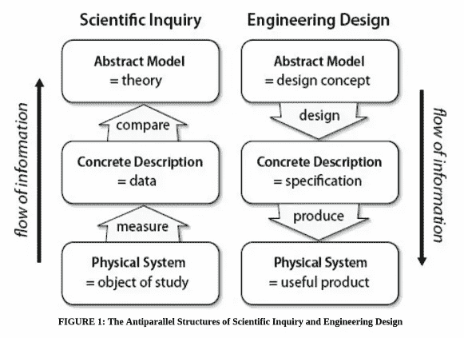

# 关于管理数据科学和人工智能项目，每个项目经理都应该知道什么

> 原文：<https://towardsdatascience.com/what-every-project-manager-should-know-about-managing-data-science-and-ai-projects-d13f3f8f62a?source=collection_archive---------37----------------------->

## 剧透:如果你是从需求开始，请三思

布鲁斯·马斯在 [Unsplash](https://unsplash.com/?utm_source=unsplash&utm_medium=referral&utm_content=creditCopyText) 上的照片

如果你是一个项目经理，被分配到一个数据科学或人工智能项目可能是一种冲突的经历。

到 2021 年，仅人工智能一项就将创造高达 2.9 万亿美元的商业价值[(是的，有一个“t”)，尽管冠状病毒的整体阻尼器，](https://www.gartner.com/en/newsroom/press-releases/2019-08-05-gartner-says-ai-augmentation-will-create-2point9-trillion-of-business-value-in-2021)[仍然处于推动复苏的技术前沿](https://www.cnbc.com/2020/06/16/the-coronavirus-fueled-tech-trends-that-will-continue-to-dominate.html)。但与此同时，项目交付成功的几率对你不利。对该领域项目失败的估计开始于 [80%](https://blogs.gartner.com/andrew_white/2019/01/03/our-top-data-and-analytics-predicts-for-2019/) 并走下坡路，2019 年 7 月 [VentureBeat AI](https://venturebeat.com/2019/07/19/why-do-87-of-data-science-projects-never-make-it-into-production/) 的一份报告估计，87%的数据科学项目从未投入生产。

这并不是因为缺乏尝试。关于管理数据科学和人工智能项目的话题，我们有[著名的大学课程](https://www.coursera.org/lecture/data-science-course/the-structure-of-a-data-science-project-AQ7T2)、[发表的研究](http://128.171.57.22/bitstream/10125/41273/1/paper0124.pdf)、[专业工具](/what-project-management-tools-to-use-for-data-science-projects-49c17c719cfe)和[成熟的专业认证](https://www.iss.nus.edu.sg/stackable-certificate-programmes/business-analytics/graduate-certificate-in-analytics-project-management)。但是，尽管做出了这些努力，我们似乎并没有离成功更近一步，除了了解到部署更多的人员和资金可能——令人惊讶的是——不是答案。

这是因为资源就像计算。在一个问题上投入更多的资源并不能得到正确的答案，只会更快地得到错误的答案。

> 在一个问题上投入更多的资源并不能得到正确的答案，只会更快地得到错误的答案。

从现代计算的早期开始，我们就一直在分析数据来支持决策。我们已经实施系统来帮助这些决定[几乎同样长的时间](https://en.wikipedia.org/wiki/Decision_support_system#History)。那么，为什么是把他们聚集在一起，*如此。可恶。努力？*

项目经理拥有非常好的技能。最根本的是，他们通过处理风险、问题、请求和提议来管理不确定性——通常在一个项目中处理几十个(甚至几百个)。此外，他们具有直觉和利益相关者管理技能，这些技能随着经验的增加而增加，使他们能够适应项目执行过程，并使他们成为从**需求到解决方案**的大师。

具有讽刺意味的是，正是这种从需求到解决方案的“端到端”规划的精通导致了许多数据科学和人工智能项目的失败。因为除非你已经考虑了数据的不确定性，否则从需求开始就是一个陷阱。

> 除非你已经考虑了数据的不确定性，否则从需求开始就是一个陷阱。

## 数据科学和人工智能项目的独特风险

数据科学项目的独特风险是数据的不确定性。这是一个问题:

> *“数据中是否有足够的信息来开发足够有用的模型？”*

如果不回答这个问题，那么开发和扩展一个不能交付商业价值的解决方案将会面临真正的危险，因为模型性能还没有达到值得使用的阈值。如果这听起来很抽象，例子可能包括:

*   预测性维护:在制造环境中，事故和偏差通常会引发稳健的缓解策略，确保故障模式很少重复，因此很难通过传统的监督学习方法进行预测。
*   情感分析:根据模型开发的方式和所用数据的性质，性能会有很大的不同。如果一个正负情绪分析工具只有 60%的准确率，考虑到一个随机的猜测可以让你达到 50%，它可能几乎没有用处。

在每种情况下，由于手头数据的限制，项目最终都是不可行的。当一个项目的可行性还没有确定的时候，围绕架构、自动化管道和运营的对话就毫无意义。如果一个项目注定会因为数据而失败，那么让一个数据科学家工作两周来发现这个问题，不是比六个月后由十个人组成的团队来发现更好吗？

换一种方式表达，一个数据科学或人工智能项目只有在你有高*预测信号*或数据中有用信息的情况下才有价值。如果不存在，无论用例的业务价值和可用数据的质量如何，项目都是失败的。

那么我们应该如何构建数据科学项目呢？

## 问题的根源其实是茎

混乱是其核心，这种纠结来自于对 STEM(科学、技术、工程和数学)学科的捷径思考。这个首字母缩写很容易脱口而出，以至于人们很容易把 STEM 专业人士视为一个同质群体。但他们绝不是这样。

[*来源:埃里克·德雷克斯勒的《激进的富足》，来自法纳姆街博客*](https://fs.blog/2013/07/the-difference-between-science-and-engineering/)

参考埃里克·德雷克斯勒对科学和工程的解释，不仅两者“不太一样”，而且通过信息流的镜头来看，它们是完全相反的*。科学从现实出发，收集数据，然后——通过探究的视角来看待问题——以一个新的有用模型结束。工程始于相反的终点。它从一个模型开始，通过规范增加细节，然后——通过设计的透镜看问题——以一个新的有用的现实结束。*

*这是相关的，因为数据科学和人工智能项目正是在这两个阶段得到有效管理，大致对应于**科学**和**工程**的镜头:*

*   *“科学”是数据科学项目的初始部分的特征，其中可行性是有疑问的。从一个广泛的问题范围或假设出发，这一阶段的主要目标是解决数据不确定性问题，并在项目扩大规模并“投入生产”之前*确定项目是否可行。在这里，空间需要迭代和实验。这是一个明确的努力和不确定的结果的世界，为了赢得长期的比赛，管理层必须允许快速连续地尝试和失败。在这一点上——作为一名 IT 专业人员，我这样说——需求和它的大部分是无关紧要的。事实上，项目管理意义上的需求是这个阶段的*输出*，而不是它的起点。**
*   *当需求变得清晰时，工作就转变为“工程”。这是项目经理熟悉的领域:一个定义了结果、人员、过程和技术的世界。在这里，解决方案架构选择的广阔领域侵入您的世界。性能、安全性、自动化和可扩展性变得至关重要。严格的规范和时间表的管理是没有商量余地的，范围蔓延是一个需要被压制的敌人。*

**

*数据科学的两个“兄弟姐妹”——不同但友好。[眼睛为乌木](https://unsplash.com/@eyeforebony?utm_source=unsplash&utm_medium=referral&utm_content=creditCopyText)在 [Unsplash](https://unsplash.com/s/photos/siblings?utm_source=unsplash&utm_medium=referral&utm_content=creditCopyText) 上拍照*

*数据科学项目失败的一个主要原因是科学和工程的混搭，在项目被认为可行和有价值之前，就讨论了长期的架构和操作考虑。这种功能障碍也延伸到团队，其中“成熟”数据科学团队的想法等同于使其“更加工程化”，反之亦然。*

*两者都是需要的，但是每一个都与数据科学项目的不同部分相关。每一种都需要截然不同的管理模式和技能组合才能茁壮成长。当有可用的工程解决方案时，进行核心研究是不必要的，而更严格的工程控制不会使科学实验室更具创造性。*

*要让数据科学奇迹发生，科学和工程都必须做得正确。*

*从这个角度来看，有几个问题值得注意:*

*   *支持一个*单个*决策的技能与开发支持多次决策的系统所需的技能大相径庭。这是数据科学角色混乱的根本原因。作为数据科学家探索建模方法的一部分，进行数据清理与作为数据工程师建立一个自动化系统来执行相同的任务有很大的不同。*
*   *培训课程经常引起混淆，因为它们隐含地在迭代科学部分或 IT 密集型工程部分的背景下教学。*
*   *许多数据科学家兼任数据工程师、模型操作和系统测试人员，但数据科学家的明确职责是处理数据不确定性和检查预测信号的强度。没有其他团队成员可以胜任这个角色。*
*   *如果项目没有投入生产是可行性研究早期失败的结果，并防止企业在以后遭受昂贵的失败，那么它们绝对是好的。*

*综上所述，我们应该分两个阶段来思考数据科学或 AI 项目。第一个明确关注处理数据不确定性，方法是派遣一个专注于数据科学的小型团队利用手头的数据进行建模，以查看是否有足够的预测信号使用例可行。如果我们在这里失败了，我们失败得很好。*

*当且仅当数据不确定性已经得到处理，并且可扩展的 IT 解决方案现在是明确的议事日程时，项目管理的领导地位才开始发挥作用。这是团队成长的地方，全方位的 IT 能力变得至关重要。*

*数据科学和 AI 魔法就发生在这里。*

*或者至少假设我们对数据科学和人工智能的应用是负责任和道德的。但那是另一个故事了。而且很长。*

*上面显示的所有图像仅用于非商业说明目的。本文是以个人身份撰写的，不代表我所工作或隶属的组织的观点。*