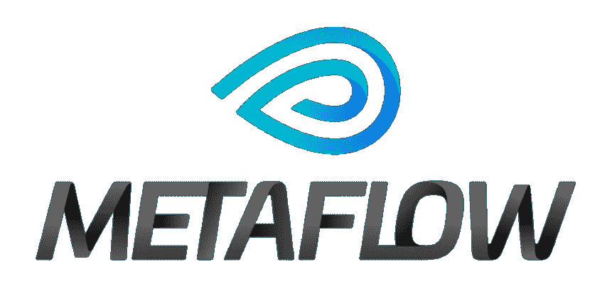
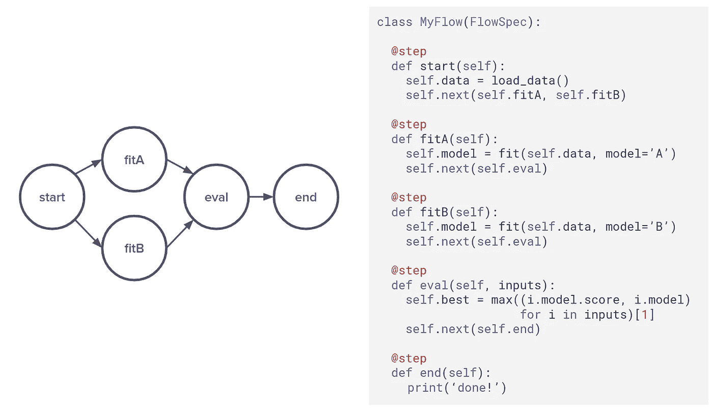

# 元流到底是什么？

> 原文：<https://towardsdatascience.com/what-exactly-is-metaflow-c007e5b75b5?source=collection_archive---------24----------------------->

## 网飞用于数据科学的 Python 框架的高级视图



## ***TL；* 【T4 博士】**

*Metaflow* 是网飞开发的用于数据科学的 Python 框架；于 2019 年 12 月作为开源项目发布[。它解决了数据科学家在可伸缩性和版本控制方面面临的一些挑战。处理流水线被构建为图中的一系列步骤。Metaflow 使得从在本地机器上运行管道转移到在云资源上运行(目前仅 AWS)变得容易。每一步都可以在一个单独的节点上运行，具有唯一的依赖关系，元流将处理相互通信。下面，我将我认为的关键特征进行了分解。](https://medium.com/netflix-techblog/open-sourcing-metaflow-a-human-centric-framework-for-data-science-fa72e04a5d9?)

我总是在寻找让生活变得更简单的方法，尤其是在从事数据驱动的项目时。 *Metaflow* 声称“它可以快速、轻松地构建和管理现实生活中的数据科学项目”，所以我洗耳恭听。我的第一个问题是:“*它实际上是做什么的？我不得不做一些调查来找出答案。在阅读了文档和教程之后，我在这里总结了我的发现。*

> Metaflow 使得从运行在本地机器上转移到运行在云资源上变得很容易。

主要的好处(在我看来)是*元流*在计算资源之上提供了一个抽象层。这意味着您可以专注于代码，而 *Metaflow* 将负责如何在一台或多台机器上运行它。用文档的话来说，它提供了“基础设施栈的统一 API”。

## 有向无环图

*元流*使用一个[有向无环图](https://en.wikipedia.org/wiki/Directed_acyclic_graph)(DAG)——包含要运行的操作的流——来提供这种抽象。管道中的每一个操作都是一个`step`，并且被定义为一个 Python 类中的一个方法，带有一个装饰器:



元流图是使用一个子类化 FlowSpec(网飞技术博客)的类定义的

在并行定义步骤的情况下(例如上图中的两个模型拟合步骤)，如果资源可用， *Metaflow* 可以并行运行它们。当在单个机器上运行时，这是并行处理的一个途径，类似于 Python 中的`multiprocessing`包。然而，当您想要在云资源上运行时，主要优势就来了。一旦[配置了集群](https://docs.metaflow.org/metaflow-on-aws/deploy-to-aws)，一个附加的命令行参数将告诉*Metaflow*在云中运行代码:`--with batch`。虽然目前只支持 Amazon Web Services，但我想这在将来会有所改变。

在每一步的末尾都有一个检查点，并且可以在稍后的阶段恢复每一步的执行，以帮助[调试](https://docs.metaflow.org/metaflow/debugging)。但是你不能一行一行的检查你的代码。

## 版本控制

机器学习模型的版本控制有点挑战，所以 *Metaflow* 也解决了这个问题。代码和数据都被散列。图形的每次执行都会被记录下来，结果会与关键超参数一起存储:

这些可以作为命令行参数轻松操作:

```
python metaflow_parameter.py run --alpha 0.001
```

元数据以 JSON 格式存储在文件系统中，您可以访问每个步骤中存储的变量数据。回读上一次运行也很容易:

```
run = Flow(flow_name).latest_successful_run
```

## 依赖性管理

*元流*也提供了一种管理依赖关系的机制，可以使用装饰器在`flow`级别或`step`级别[指定它们。这些可以指定特定的 Python 版本或特定的包:](https://docs.metaflow.org/metaflow/dependencies#managing-dependencies-with-conda-decorator)

从命令行运行时指定了`conda`环境标志:

```
python metaflow_conda.py --environment=conda run
```

## 后续步骤

如果您想试用`metaflow`，从命令行安装很简单，文档中有一组很好的教程:

```
pip install metaflow
```

[](https://docs.metaflow.org/getting-started/tutorials) [## 教程

### 元流—入门:docs.metaflow.org](https://docs.metaflow.org/getting-started/tutorials) 

## 结论

Metaflow 的目标是“无缝的可伸缩性”，看起来它做得很好。有一点手动设置让它与 AWS 一起工作，但它的[相当好地记录了](https://docs.metaflow.org/metaflow-on-aws/deploy-to-aws)。如果你可能需要将你的分析项目扩展到云，并且关心部署，你可能应该看看 *Metaflow* 。我还没有想出如何从版本控制和细粒度依赖管理中获得最大价值，但它们看起来像是强大的功能。

你试过 Metaflow 吗？欢迎在下面的评论区留下任何体验和反馈。

> [*Rupert Thomas*](https://twitter.com/rupertthomas)*是一名技术顾问，专门研究机器学习、机器视觉和数据驱动产品。* [*鲁伯特·托马斯*](https://medium.com/u/6ea46cd46fb3?source=post_page-----a530eb55ced9----------------------)

## 参考

[https://docs.metaflow.org/getting-started/tutorials](https://docs.metaflow.org/getting-started/tutorials)

[开源元流，一个以人为中心的数据科学框架](https://medium.com/netflix-techblog/open-sourcing-metaflow-a-human-centric-framework-for-data-science-fa72e04a5d9)

[10 分钟学会元流](/learn-metaflow-in-10-mins-netflixs-python-r-framework-for-data-scientists-2ef124c716e4)