# 可解释的人工智能无法解释什么(以及我们如何解决这个问题)

> 原文：<https://towardsdatascience.com/what-explainable-ai-fails-to-explain-and-how-we-fix-that-1e35e37bee07?source=collection_archive---------16----------------------->

## 神经网络是精确的，但不可解释。决策树是可以解释的，但是在计算机视觉中是不准确的。我们有解决办法。


由 author⁰设计

别拿走它。让我们来看看的关存泰，他承认“[许多机器决策仍然知之甚少](https://arxiv.org/pdf/1907.07374.pdf)”。大多数论文甚至建议在准确性和可解释性之间进行严格的二分法。

可解释的人工智能(XAI)试图弥合这一分歧，但正如我们下面解释的那样， *XAI 在不直接解释模型的情况下证明了决策的合理性*。这意味着金融和医学等应用领域的从业者被迫陷入两难境地:选择一个不可解释的准确模型，还是一个不准确的可解释模型。

# 什么是“可解读”？

为计算机视觉定义可解释性或可解释性具有挑战性:解释像图像这样的高维输入的分类，甚至*意味着什么？正如我们下面讨论的，两个流行的定义涉及*显著图*和*决策树*，但是这两种方法都有它们的弱点。*

# 可解释的人工智能无法解释的

## 显著图

许多 XAI 方法产生被称为**显著图**的热图，其突出显示影响预测的重要输入像素。然而，显著图关注于输入，而忽略了解释*模型如何*做出决策。

关于显著性图的更多信息，请参见[这些](https://medium.com/datadriveninvestor/visualizing-neural-networks-using-saliency-maps-in-pytorch-289d8e244ab4) [显著性](https://medium.com/@thelastalias/saliency-maps-for-deep-learning-part-1-vanilla-gradient-1d0665de3284) [教程](/saliency-based-image-segmentation-473b4cb31774)和 [Github](https://github.com/utkuozbulak/pytorch-cnn-visualizations) [资源库](https://github.com/PAIR-code/saliency)。

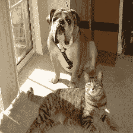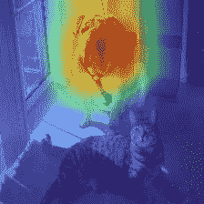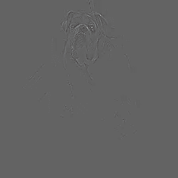

描绘原始图像(左)，使用 Grad-CAM 方法的显著图(中)，以及另一个使用引导反向传播的显著图(右)。上图是“阶级歧视”的典型例子。以上显著图取自[https://github.com/kazuto1011/grad-cam-pytorch](https://github.com/kazuto1011/grad-cam-pytorch)。

## 显著性图未能解释什么

为了说明为什么**显著性图没有完全解释模型如何预测**，这里有一个例子:下面，显著性图是相同的，但是预测不同。为什么？即使两个显著图都突出了正确的对象，一个预测是不正确的。怎么会？回答这个问题可以帮助我们改进模型，但是如下所示，显著图无法解释模型的决策过程。

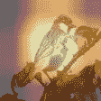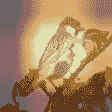

(左)模型预测 Eared Grebe。(右)模型预测角鱼 Grebe。这些是在加州理工学院-加州大学圣迭戈分校 Birds-200–2011 或简称 CUB 2011 上训练的 ResNet18 模型的 Grad-CAM 结果。尽管显著图看起来极其相似，但模型预测却不同。因此，显著性图不能解释模型是如何达到最终预测的。

## 决策树

另一种方法是**用可解释的模型代替神经网络**。在深度学习之前，决策树是准确性和可解释性的黄金标准。下面，我们说明决策树的可解释性，它通过将每个预测分解成一系列决策来工作。

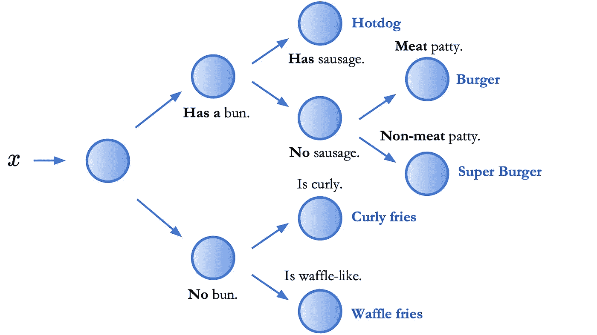

上面的决策树不是只预测“超级汉堡”或“华夫饼干”，而是会输出一系列决策，这些决策会导致最终的预测。然后，这些中间决定可以被单独验证或质疑。因此，经典机器学习将这种模型称为“可解释的”。

然而，就准确性而言，**决策树在图像分类数据集上落后于神经网络高达 40%的准确性**。神经网络和决策树的混合也表现不佳，甚至在数据集 CIFAR10 上也无法与神经网络相匹配，该数据集具有如下图所示的微小 32x32 图像。

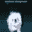

展示 32x32 有多小的例子。这是来自 CIFAR10 数据集的示例。

正如我们在[论文](https://arxiv.org/abs/2004.00221)(第 5.2 节)中所示，这种精度差距损害了可解释性:*需要高精度、可解释的模型来解释高精度神经网络。*

# 进入神经支持的决策树

我们通过建立既可解释又准确的模型来挑战这种错误的二分法。我们的关键见解是将神经网络与决策树结合起来，在将神经网络用于低级决策的同时保留高级别可解释性，如下所示。我们将这些模型称为 [**神经支持的决策树**](http://nbdt.alvinwan.com) (NBDTs)，并表明它们可以**匹配神经网络的准确性，同时保留决策树的可解释性。**

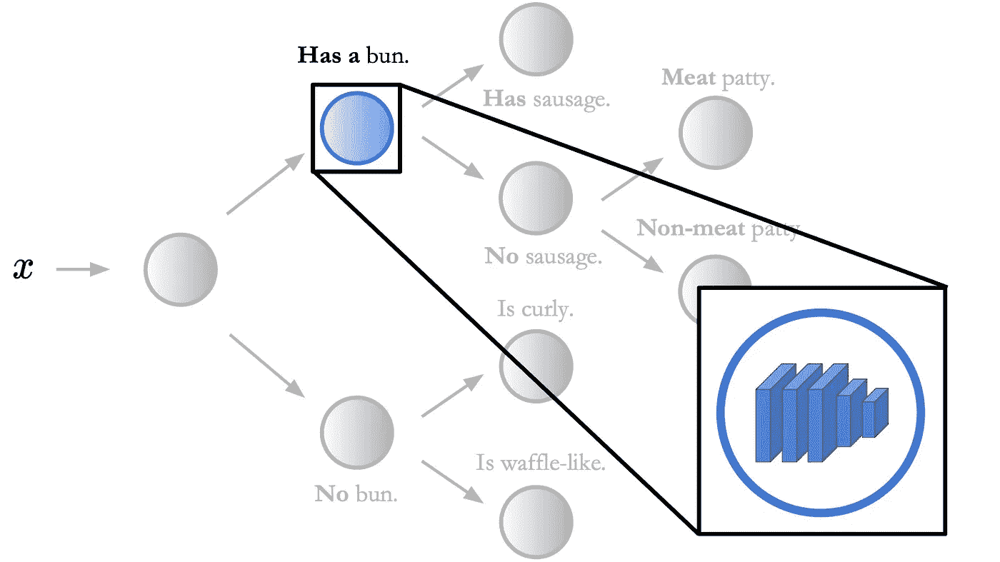

在该图中，每个节点包含一个神经网络。该图仅突出了一个这样的节点和内部的神经网络。在神经支持的决策树中，预测是通过决策树进行的，保留了高级别的可解释性。然而，决策树中的每个节点都是一个做出低级决策的神经网络。上面神经网络做出的“低级”决策是“有香肠”还是“没有香肠”。

NBDTs 和决策树一样可以解释。与当今的神经网络不同，NBDTs 可以输出预测的中间决策。例如，给定一幅图像，神经网络可以输出*狗*。但是，一只 NBDT 可以同时输出*狗*和*动物*、*脊索动物*、*食肉动物*(下图)。

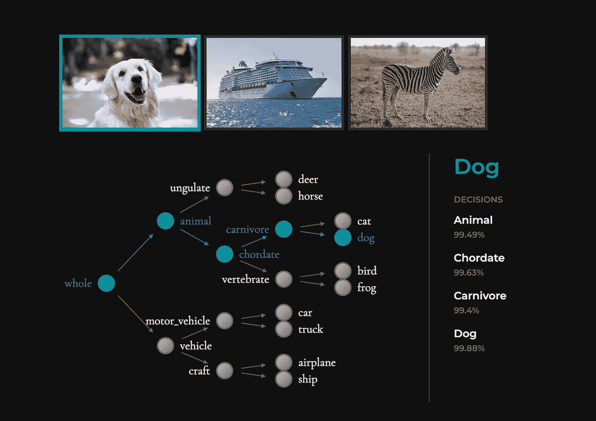

在该图中，每个节点包含一个神经网络。该图仅突出了一个这样的节点和内部的神经网络。在神经支持的决策树中，预测是通过决策树进行的，保留了高级别的可解释性。然而，决策树中的每个节点都是一个做出低级决策的神经网络。上面神经网络做出的“低级”决策是“有香肠”还是“没有香肠”。上面的照片是在 Pexels 的许可下从 pexels.com 拍摄的。

**NBDTs 实现神经网络精度。**与任何其他基于决策树的方法不同，NBDTs 在 3 个图像分类数据集上匹配神经网络精度(< 1%差异)。在 ImageNet 上，NBDTs 的精度也达到了神经网络的 2%以内，ImageNet 是最大的图像分类数据集之一，拥有 120 万张 224x224 图像。

此外，NBDTs 为可解释模型设定了新的最先进的精确度。NBDT 的 ImageNet 准确率为 75.30%，比基于决策树的最佳竞争方法高出约 14%。为了将这种准确性的提高联系起来:对于不可解释的神经网络来说，类似的 14%的提高花费了 research⁴. 3 年的时间

# 神经支持的决策树如何解释

## 个体预测的合理性

最有见地的理由是模型从未见过的对象。例如，考虑一只 NBDT(如下)，在一只*斑马*上运行推理。虽然这个模型从来没有见过*斑马*，但是下面显示的中间决定是正确的——*斑马*既是*动物*又是*有蹄动物*(有蹄动物)。对于看不见的物体来说，看到个体预测的合理性的能力是至关重要的。

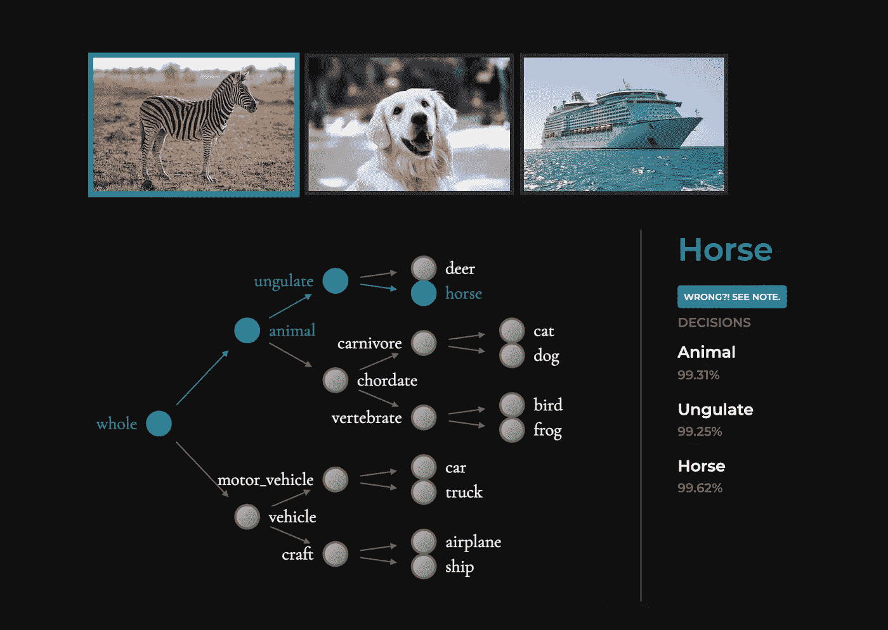

NBDTs 甚至可以对看不见的物体做出准确的中间决策。在这里，模型是在 CIFAR10 上训练的，以前从未见过斑马。尽管如此，NBDT 正确地将斑马识别为动物和有蹄动物。上面的照片是在 Pexels 的许可下从 pexels.com 拍摄的。

## 模型行为的正当性

此外，我们发现使用 NBDTs，可解释性会随着准确性的提高而提高。这与导言中的二分法相反:NBDTs 不仅具有准确性和可解释性；他们还将准确性和可解释性作为同一目标。

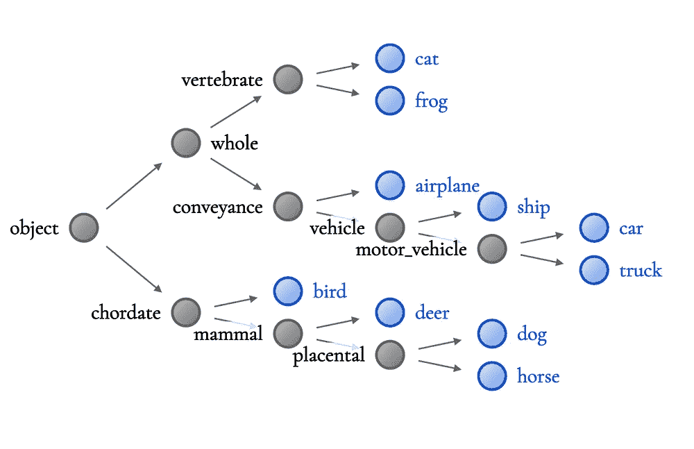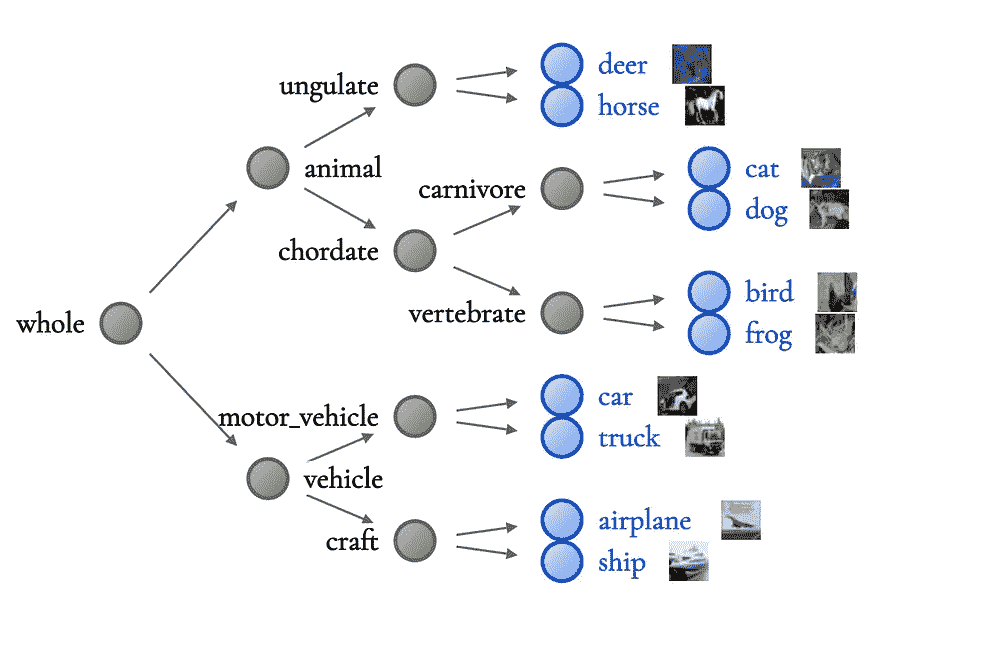

ResNet10 层次结构(左)不如 WideResNet 层次结构(右)有意义。在这个层次中，猫、青蛙和飞机被放在同一个子树下。相比之下，WideResNet 层次在层次的每一侧都清晰地划分了动物和车辆。上面的图片直接取自 CIFAR10 数据集。

例如，精度较低的 ResNet⁶层级(左)就没什么意义了，将*青蛙*、*猫*和*飞机*组合在一起。这是“不太明智的”，因为很难找到所有三个类共有的明显的视觉特征。相比之下，更高精度的 WideResNet 层次结构(右)更有意义，它清晰地将*动物*与*车辆*区分开来——因此，精度越高，NBDT 就越容易解释。

# 理解决策规则

对于低维的表格数据，决策树中的决策规则很容易解释，例如，如果菜里有一个小圆面包，则选择正确的子元素，如下所示。然而，对于像高维图像这样的输入，决策规则并不直接。

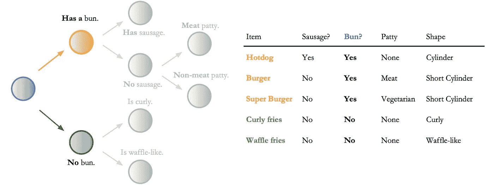

这个例子演示了如何用低维的表格数据来解释决策规则。右边是几个项目的示例表格数据。左边是我们根据这些数据训练的决策树。在这种情况下，决策规则(蓝色)是“是否有 bun？”所有带有圆面包(橙色)的项目被发送到顶部的子项目，所有没有圆面包(绿色)的项目被发送到底部的子项目。

正如我们在[论文](https://arxiv.org/abs/2004.00221)(第 5.3 节)中*定性*发现的那样，模型的决策规则不仅基于对象类型，还基于上下文、形状和颜色。

为了定量地解释决策规则*，我们利用了一个名为 WordNet⁷的现有名词层级；有了这个层次，我们就可以找到类之间最具体的共享意义。例如，给定类别*猫*和*狗*，WordNet 将提供*哺乳动物*。在我们的[论文](https://arxiv.org/pdf/2004.00221.pdf)(第 5.2 节)和下图中，我们定量地验证了这些 WordNet 假设。*

*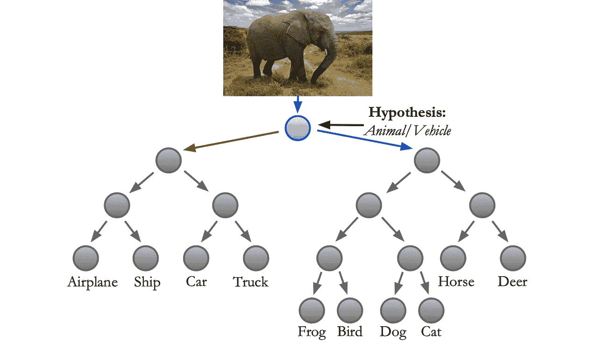**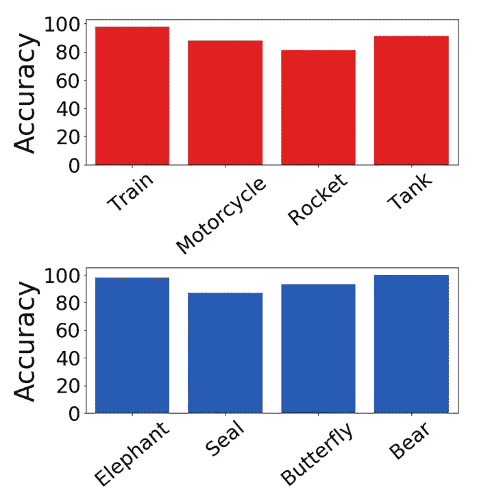*

*左边子树(红色箭头)的 WordNet 假设是 Vehicle。右边(蓝色箭头)的 WordNet 假设是动物。为了定性地验证这些意义，我们针对看不见的物体类别测试了 NBDT:1 .寻找训练中没有看到的图像。2.给定假设，确定每个图像属于哪个子图像。例如，我们知道大象是一种动物，所以应该去右边的子树。3.我们现在可以通过检查有多少图像被传递给正确的孩子来评估这个假设。例如，检查有多少大象图像被发送到动物子树。这些每类的精度显示在右侧，看不见的动物(蓝色)和看不见的车辆(红色)都显示高精度。*

*注意，在具有 10 个类的小数据集即 CIFAR10 中，我们可以找到所有节点的 WordNet 假设。然而，在具有 1000 个类的大型数据集(即 ImageNet)中，我们只能找到节点子集的 WordNet 假设。*

# *一分钟内尝试 NBDTs*

*有兴趣尝试 NBDT 吗，*现在*？不需要安装任何东西，你就可以[在线查看更多示例输出](http://nbdt.alvinwan.com)，甚至[尝试我们的网络演示](http://nbdt.alvinwan.com/demo/)。或者，使用我们的命令行实用程序来运行推理(使用 pip install nbdt 安装)。下面，我们对一只猫的图片进行推理。*

```
*nbdt https://images.pexels.com/photos/126407/pexels-photo-126407.jpeg?auto=compress&cs=tinysrgb&dpr=2&w=32  # this can also be a path to local image*
```

*这将输出类别预测和所有中间决策。*

```
*Prediction: cat // Decisions: animal (99.47%), chordate (99.20%), carnivore (99.42%), cat (99.86%)*
```

*您也可以用几行 Python 代码加载一个预训练的 NBDT。使用以下内容开始。我们支持几个神经网络和数据集。*

```
*from nbdt.model import HardNBDTfrom nbdt.models import wrn28_10_cifar10model = wrn28_10_cifar10()model = HardNBDT( pretrained=True, dataset='CIFAR10', arch='wrn28_10_cifar10', model=model)*
```

*作为参考，请参见我们上面运行的命令行工具的[脚本；只有大约 20 行直接参与转换输入和运行推理。有关入门和示例的更多说明，请参见我们的](https://github.com/alvinwan/neural-backed-decision-trees/blob/master/nbdt/bin/nbdt) [Github 库](https://github.com/alvinwan/neural-backed-decision-trees)。*

# *它是如何工作的*

*神经支持决策树的训练和推理过程可以分为四个步骤。*

*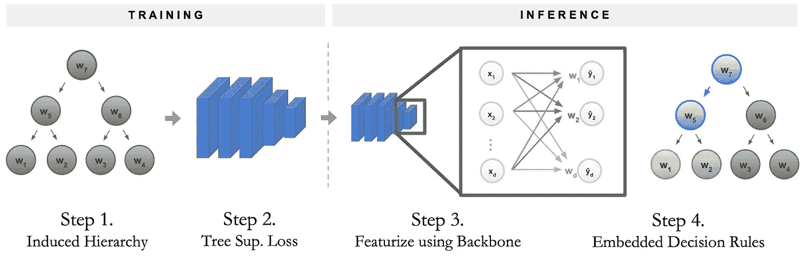*

*训练 NBDT 分两个阶段进行:首先，构建决策树的层次结构。第二，用特殊的损失项训练神经网络。若要运行推理，请将样本通过神经网络主干。最后，将最后一个全连接层作为决策规则序列运行。*

1.  *构建决策树的层次结构。该层次结构决定了 NBDT 必须在哪些类别集之间做出决定。我们将这种层次称为**诱导层次**。*
2.  *这个层次结构产生了一个特定的损失函数，我们称之为**树监督损失** ⁵.训练原始的神经网络，*没有任何修改*，使用这个新的损失。*
3.  *通过将样本传递到神经网络主干来开始推断。主干是最终全连接层之前的所有神经网络层。*
4.  *通过运行最终的全连接层作为决策规则序列来完成推理，我们称之为**嵌入式决策规则**。这些决定最终形成了最终的预测。*

*更多细节，请参见我们的[论文](https://arxiv.org/abs/2004.00221)(第 3 节)。*

# *结论*

*可解释的人工智能没有完全解释神经网络如何实现预测:现有的方法解释了图像对模型预测的影响，但没有解释决策过程。决策树解决了这个问题，但不幸的是，images⁷是决策树准确性的克星。*

*因此，我们结合了神经网络和决策树。与实现相同混合设计的前辈不同，我们的神经支持决策树(NBDTs)同时解决了(1)神经网络提供调整和(2)决策树获得高精度的失败。这为医药和金融等领域的应用开创了一个新的精确、可解释的 NBDTs 类别。要开始，请参见[项目页面](http://nbdt.alvinwan.com)。*

**由* [*万*](http://alvinwan.com/) *，* [*邓丽君*](https://github.com/lisadunlap) *，* [*何*](https://github.com/daniel-ho) *，* [*【尹*](https://www.linkedin.com/in/jihanyin/) *，* [*李*](https://www.linkedin.com/in/scottjlee98/) *，* [*亨利金*](https://www.linkedin.com/in/henryjin99/)*

**其中*表示同等贡献**

*[0]由作者 Alvin Wan 设计。脚注的存在是为了澄清我们有权使用这个图形。*

*[1]有两种类型的显著图:一种是白盒，其中该方法可以访问模型及其参数。Grad-CAM 是一种流行的白盒方法，它使用梯度和类别激活图来可视化注意力。可以从论文《Grad-CAM:通过基于梯度的定位来自深度网络的可视化解释》[http://open access . the CVF . com/content _ ICCV _ 2017/papers/selva raju _ Grad-CAM _ Visual _ expansions _ ICCV _ 2017 _ paper . pdf](http://openaccess.thecvf.com/content_ICCV_2017/papers/Selvaraju_Grad-CAM_Visual_Explanations_ICCV_2017_paper.pdf)。另一种类型的显著图是黑盒，其中模型不能访问模型参数。上升就是这样一种突出方法。RISE 会遮罩输入图像的随机部分，并将此图像传递给模型-对准确性损害最大的遮罩是最“重要”的部分。你可以从论文《崛起:解释黑箱模型的随机输入抽样》，[http://bmvc2018.org/contents/papers/1064.pdf](http://bmvc2018.org/contents/papers/1064.pdf)中了解更多。*

*[2]在 TinyImageNet200 上显示了决策树和神经网络之间 40%的差距。*

*[3]这三个数据集特别是 CIFAR10、CIFAR100 和 TinyImageNet200。*

*[4]ImageNet 准确性的提高是显著的:对于*不可解释的*神经网络，ImageNet [上类似的 14%的提高花费了 3 年](https://paperswithcode.com/sota/image-classification-on-imagenet)的研究。为了进行这种比较，我们考察了一个类似的准确性增益，它花了 3 年时间，从 2013 年的 Alex net(63.3%)到 Inception V3 (78.8%)。从 NofE (61.29%)到我们的 nbdt(75.30%)，NBDT 在大约相同的范围内比以前的最先进结果提高了约 14%。然而，还有其他因素在起作用:一个明显的因素是，计算和深度学习库在 2013 年并不容易获得。一个更公平的比较可能是使用 ImageNet 最新的 14%的收益。最近 14%的增长用了 5 年时间，从 2015 年的 VGG-19(74.5%)开始，到 2020 年的 fix efficient net-L2(88.5%)。然而，这在技术上也是不可比的，因为在更高的精度下更难获得大的增益。尽管缺乏完全可比的基准进度，我们只是取了两个时间范围中的最小值，试图说明 14%的差距有多大。*

*[6]在 CIFAR10 上，ResNet10 的精度比 WideResNet28x10 低 4%。*

*[7] WordNet 是各种单词的词汇层次结构。大多数单词是名词，但也包括其他词类。更多信息见[官网](https://wordnet.princeton.edu/)。*

*[8]要理解树监督损失的基本思想: *Horse* 只是一个类。不过它也是*有蹄类*和*动物*。(参见“个人预测的理由”中的图表。)在根节点处，因此需要将*马*样本传递给子节点*动物*。此外，节点*动物*需要将样本传递给*有蹄动物*。最后，节点*有蹄动物*必须将样本传递给*马*。训练每个节点以预测正确的子节点。我们称这种损失为树木监管损失。*

*[9]一般来说，决策树在处理低维数据时表现最佳。图像是这种最佳情况的对立面，非常高维。*