# Airbnb 上的挂牌价格是由哪些功能决定的？

> 原文：<https://towardsdatascience.com/what-features-contribute-to-the-listing-price-on-airbnb-21af2703b269?source=collection_archive---------43----------------------->

## 通过 Tableau & Seaborn 可视化西雅图 Airbnb 数据

[作者:言承旭](https://www.linkedin.com/in/jerry-ziyuan-yan-7671488a/)

从 2000 年中期开始，Airbnb 已经成为我们日常旅行中必不可少的一部分。如今，在线旅行社业务需求巨大。但是你有没有停下来想一想到底是什么因素促成了挂牌价？

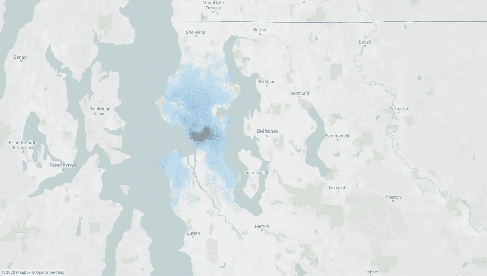

作者图片

上图显示了 Airbnb 上平均挂牌价格的密度图。整个城市的价格相差很大。

# 简介:

今天，我想通过 4 个步骤来探讨这些话题:

1.  ***哪些小区均价差不多？给定一个具体的预算，你去哪里找 Airbnb？***
2.  ***挂牌均价排名前 10 的邻里团有哪些？***
3.  ***哪个评审得分与挂牌价的相关性最高？***
4.  ***挂牌价有哪些预测因素，我们如何在 Airbnb 上给房子定价？***

## 第一部分:相似邻域(K-均值聚类)

如果我有 X 美元的预算，我应该去哪里找 Airbnb？

使用 tableau，我们可以很容易地根据标价对邻居进行聚类。

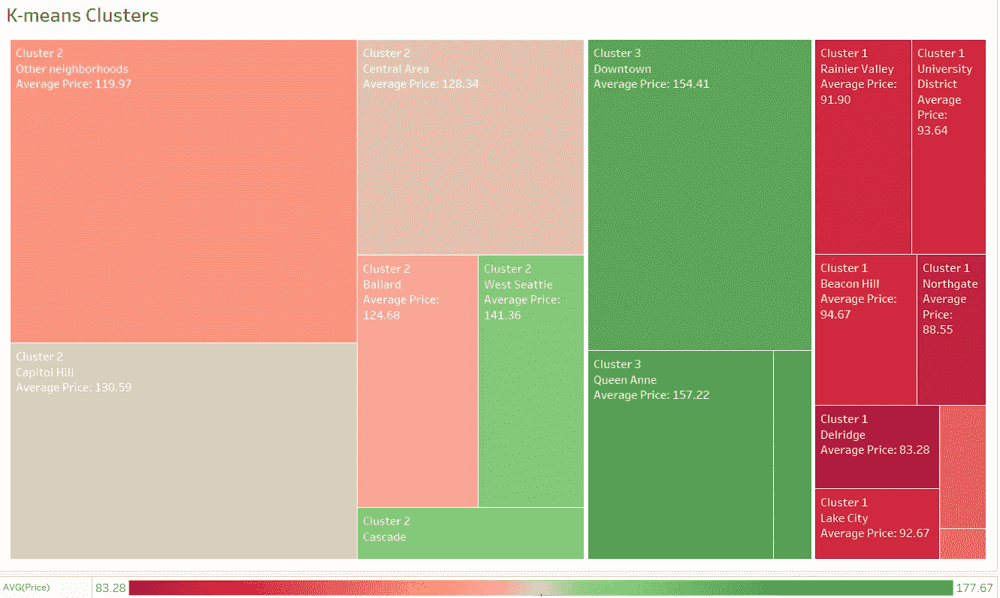

作者图片

上图显示了三个聚类在平均价格和列表数量方面的关系。颜色梯度显示价格差异。方框的大小表示 Airbnb 上的房源数量。

聚类一(深红色)表示具有很少列表和较低价格(低于 100 美元)的邻居组。集群 3 具有第二高的列表数量和最高的平均价格。而集群 2 具有最高数量的列表。

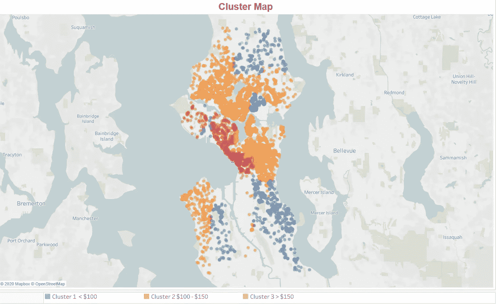

作者图片

简言之，

1.  如果您的预算低于 100 美元，请选择 1 区的酒店。
2.  *如果你的预算在****【100 美元到 150 美元*** *左右，就选集群 2 吧。*
3.  最后，如果你有更多的钱可以花，你可以在集群 3 中找到更贵的选择。

## 第二部分:平均价格排名前 10 的社区

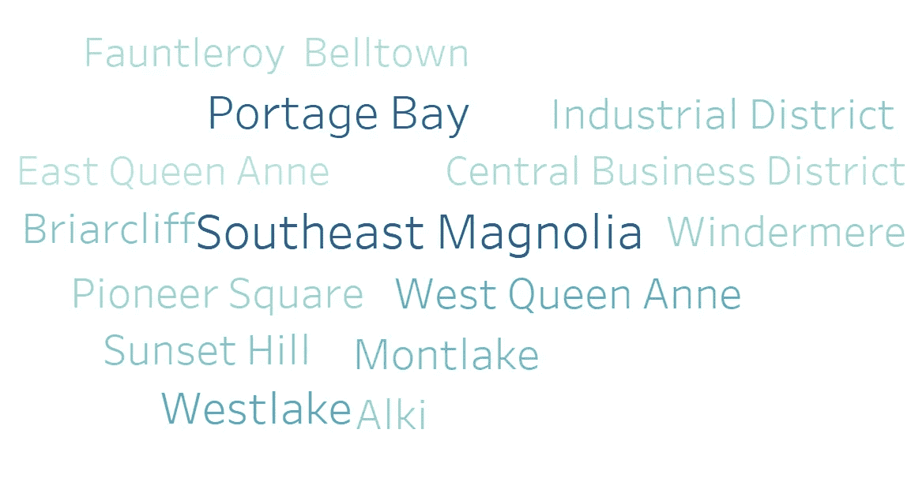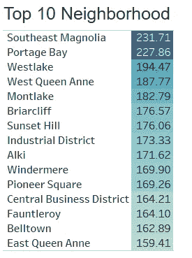

价格最高的 10 个街区——作者图片

正如上面的单词 cloud 所示，不难看出，Magnolia 东南部房价最高的社区和第二高的社区是 portage Bay，这两个社区每晚的平均房价都超过了 200 美元。

## 第三部分:哪些评审分数与挂牌价相关性最高？

在 Airbnb 上，有几个审核评分来帮助区分每一个房源。评审分数也是一种反复的方法，用来巩固优秀和改正缺点。点评分数和挂牌价有关联吗？让我们仔细看看。

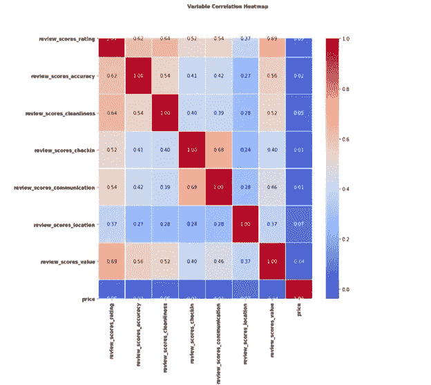

可变热图-作者图片

令我惊讶的是，**没有一个**的点评分数与上市价格有显著相关性。(皮尔逊相关系数小于 0.1)既然我们知道点评分数不是上市价格的关键指标。下一个问题是:决定挂牌价格的关键因素是什么，我们如何给房子定价？

## 第四部分:挂牌价的预测因素是什么？

*决策树和回归分析*

我想你是 Airbnb 的房主，你会知道你的定价策略是否合理。一个快速评估的方法是取你所在地区标价的平均值。然而，不同的房子之间有很大的差异，即使是在同一个邮政编码或社区。我们需要通过机器学习和可视化来了解哪些因素影响了价格。

让我们仔细看看与挂牌价相关的其他属性。

1.  数量特征

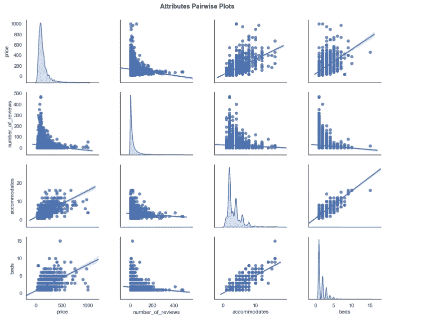

成对情节—作者提供的图像

从上面的图中可以看出，可容纳床位和**的**数量与价格**正相关，而评论数量显示出很小的负相关性。**

2.定性特征:

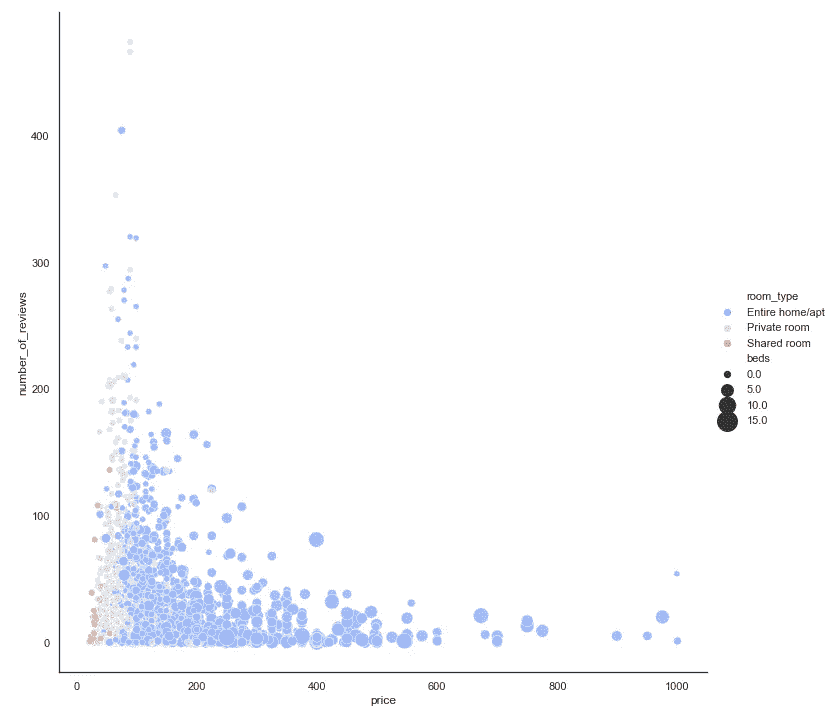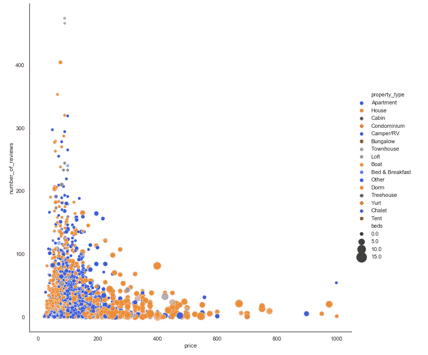

作者图片

如上面右图所示，我们看到一个明显的趋势，从共享房间转移到整个房间，最后是专属财产。此外，更多的床位通常意味着更高的价格。然而，在 1000 美元的价格标签周围有一些异常值

此外，在左图中，我们可以看到大多数高价房源都是房子，只有少数公寓例外。

## 决策树建模:

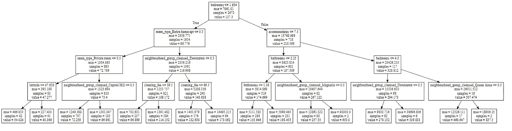

作者图片

最后，让我们仔细看看决策树模型的结果。根据上面显示的预测值，该模型可以解释 50%的挂牌价格变化。(r = 0.5)

从顶部开始，模型对**卧室数量≤ 1.65** 进行分割，表明卧室数量是区分挂牌价格的关键指标。沿着这个分支，我们必须确定**房间类型**是否是公寓，因为人们倾向于花更少的钱买公寓，花更多的钱买房子。我们还根据可用床位的数量和房间的大小分类，在适应度不超过 7.5 的情况下进行了划分。树的第三层具有作为分割点的**浴室**和**市中心街区。**

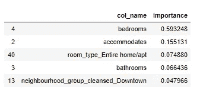

前 5 名的重要分数-作者图片

上面的列表显示了根据决策树模型的重要性影响价格的前 5 个特征。

## 第五部分:结论

在本文中，我们研究了影响西雅图 Airbnbs 挂牌价格的因素。

1.  我们根据标价将社区分成三个不同的群，并创建了一个基于预算的策略来寻找合适的位置。
2.  然后我们看了价格方面最热门的社区。
3.  然后，我们调查了与标价相关的特性。我们发现评论分数与标价不相关。
4.  最后，我们查看影响上市价格的定量和定性特征，我们可以使用这些特征构建决策树模型。前 5 个关键属性是**、卧室数量、房间数量、整个公寓空间、浴室数量以及位于市中心**。

## 附录:

1.  链接到 Kaggle 数据源:[这里](https://www.kaggle.com/airbnb/seattle)
2.  更多详细分析可以在我的 Github 知识库中找到:[这里](https://github.com/jerryanziyuan/Seattle_Airbnb_EDA)