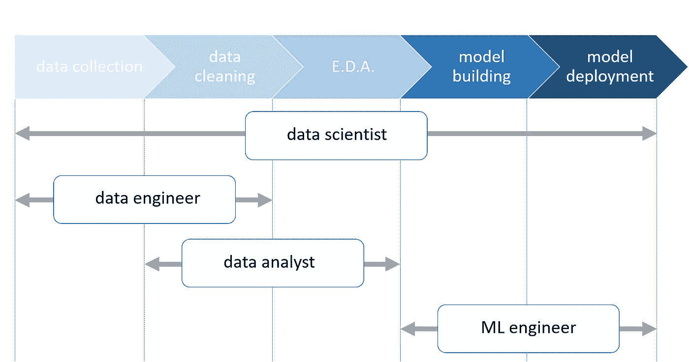

# 作为一名数据科学家，什么适合你？

> 原文：<https://towardsdatascience.com/what-fits-you-as-a-data-scientist-ef149bc774df?source=collection_archive---------57----------------------->

## 数据科学

## 发现你的位置，找到正确的方向

蒙蒂·艾伦在 [Unsplash](/s/photos/compass?utm_source=unsplash&utm_medium=referral&utm_content=creditCopyText) 上的照片

数据科学致力于理解自然界，而自然界本来就非常复杂。但是怎么做呢？分析数据，大量的数据(所谓的*大数据*，试图理解它们并挤压*知识*和*经验*，从而做出决策和解决问题。为了更好地了解什么是数据科学和机器学习领域的体验，请查看我关于机器学习和人工智能的介绍性文章(下面的链接)。

 [## 人工智能和机器学习。它们是一回事吗？

### 答案是否定的。我来告诉你为什么。

medium.com](https://medium.com/swlh/artificial-intelligence-and-machine-learning-are-they-the-same-thing-a9f6c8019a89) 

作为一名数据科学家，首先要知道的是由步骤组成的*数据生命周期*。

# 数据收集

如今，数据收集是一件容易的事情。数据收集是从各种来源收集数据的行为:网页、新闻、社交媒体、报告、图表、表格等。都是数字原始数据的来源，随时可供感兴趣的人使用。

数据流—来自 [Giphy](https://gph.is/2chrDDz)

在这个领域，一个优秀的数据科学家会对这个世界产生一种与生俱来的好奇心；他是数据驱动型的，所以他花费大量时间收集数据来回答感兴趣的问题。所需技能包括:

*   想想解决你所涉及的问题需要哪些数据
*   知道如何从各种来源收集数据，以及如何以结构化的方式组合它们
*   了解一些收集数据和 ETL(提取、转换和加载)的工具或应用

# 数据清理

一旦收集，大多数时候，原始数据是“凌乱”的。

一个非常凌乱的办公室，有一堆文件和原始数据要整理——图片由 [Wonderlane](https://unsplash.com/@wonderlane?utm_source=unsplash&utm_medium=referral&utm_content=creditCopyText) 在 [Unsplash](/s/photos/messy?utm_source=unsplash&utm_medium=referral&utm_content=creditCopyText) 上拍摄

*数据清理*是一项复杂的任务，包括:

*   检测和纠正由于部分或缺失数据收集而导致的损坏或不准确的数据
*   基于相关现象信息的数据验证和缺失值估计依赖于问题。
*   通过数据的协调和标准化来增强数据
*   转换数据以获得数据集中值的一致性和可比性

# 探索性数据分析

探索性数据分析(EDA)是一组技术的集合，用于观察数据能告诉我们什么。在 EDA 中，我们使用数学模型和常识来处理数据的重要性。

数据的图示——照片由 [Stephen Dawson](https://unsplash.com/@srd844?utm_source=unsplash&utm_medium=referral&utm_content=creditCopyText) 在 [Unsplash](/s/photos/statistics?utm_source=unsplash&utm_medium=referral&utm_content=creditCopyText) 上拍摄

作为数据科学家，我们必须知道从我们收集的数据中可以期待什么，必须制定一个假设，并“填补”我们所拥有的信息中的空白。

有许多工具可以帮助我们:

*   描述性统计:用表格、图表、汇总值等来表示数据。
*   推理统计学:利用我们收集的数据(这是对现实的不完全描述)来推断、假设现象的基本特征。
*   对环境的深刻理解，也就是说，对我们试图用数据科学技术解决的问题的背景的深刻理解。

值得回忆的是，在经典的*机器学习* (ML)中，数据生命周期的这一阶段取决于我们这些数据科学家。当在*深度学习* (DL)甚至在*强化学习* (RL)中时，这取决于模型，机器，来应对这种情况。在 DL 中，在训练阶段，算法学习所提供数据的特征并适应它们。在 RL 中，环境甚至是学习过程中的一个活跃部分。

# 模型结构

模型构建是 ML 过程的基本部分。当我们创建一个模型时，我们可以训练机器学习我们数据(训练集)的模式，以预测未知或未来的数据。

要有创意…是时候做模型了！—[Jo Szczepanska](https://unsplash.com/@joszczepanska?utm_source=unsplash&utm_medium=referral&utm_content=creditCopyText)在 [Unsplash](/s/photos/design?utm_source=unsplash&utm_medium=referral&utm_content=creditCopyText) 上拍摄的照片

在模型构建中，我们试图从分析中预测结果。

同样，有些技能是必不可少的:

*   将正确的学习模式应用于我们的数据，以解决特定的问题(回归、分类、关联、聚类等)
*   通过定义的*指标*测试和评估模型训练的结果，以计算*性能*
*   结合多种技术和模型，以在预测、模型的稳健性等方面获得更好的结果。(*合奏*造型)

# 模型部署

当我们的模型准备好了，并且我们从训练和测试集(训练和评估阶段)得到了好的结果，就该把它投入生产了。这是我们从数据中获得结果的最后阶段，用于商业、学习、研究，或者也可能用于娱乐！

获得结果的时间到了——照片由 [NeONBRAND](https://unsplash.com/@neonbrand?utm_source=unsplash&utm_medium=referral&utm_content=creditCopyText) 在 [Unsplash](/s/photos/solution?utm_source=unsplash&utm_medium=referral&utm_content=creditCopyText) 上拍摄

我们需要知道:

*   如何在各种现成的、先进的框架上部署我们的模型。想想，也就是在 Python 工具和库中，比如 NumPy、pandas、scikit-learn (ML)、TensorFlow Keras、PyTorch (DL)、openai tools for RL 等。
*   如何将结果应用到生产环境中，用于优化、异常检测、自动化、预测等。
*   如何向利益相关者总结结果

# 那么，下一步是什么？

到目前为止，我们已经讨论了这个过程。但是，每一步都需要谁呢？我们先明确一下概念，涉及到哪些角色。

首先，我们用一张图总结一下所有的过程

角色和数据管道—作者

## 数据科学家

正如你所看到的，一个*数据科学家*被期望做从数据收集到模型部署的所有事情；他必须意识到真正的问题，并且他必须知道关于过程的每个阶段的许多技术。因此，所需的技能是:

*   掌握如何使用 SQL 和其他方法查询数据集
*   对代数、统计和集合论有深入的理解，有助于数据建模技术
*   了解 Python、R、Java、C++或其他用于数据清理、数据操作、EDA 和可视化的语言。
*   能够根据数据和预期结果选择或组合适合解决问题的建模技术
*   了解如何将生产环境中的数据管道与结果的可视化和呈现方法相结合，如 web 应用程序、报告、机器命令等。

## 数据工程师

A *数据工程师*更专注于数据收集和数据清理。在这个职位上，除了能够从各种来源提取、转换和加载数据之外，我们还必须非常精通数据库和数据查询技术。然后，我们必须知道如何清理数据，处理空值或不一致的值，以及更多的技术，为下面的 ML 模型建立一个坚实的来源基础。

## 数据分析师

一个*数据分析师*在数据清理和 EDA 上努力。他精通统计学，无论是描述性的还是推理性的，并且总是试图从数据中挤出每一点信息。他的角色对于数据建模和构建能够实际捕捉环境行为的可靠模型至关重要。在通往知识的数据科学道路上，在我看来，这可以是第一步，然后我们可以探索该过程的其他阶段。

## 机器学习工程师

一个*机器学习工程师*知道如何充分利用数据，基于各种技术和 ML 算法；他精通 ML 模型、超参数优化、评估和度量，并处于该领域最新研究的前沿。除此之外，他还知道如何将模型扩展和部署到生产系统中。

如您所见，有许多通往数据科学的途径。在我看来，每个兴奋地参与这一领域的人都必须意识到，为了更好地理解数据和机器学习技术，从一个新的角度看待现实，他可能会对进步和未来的道路做出什么贡献。

我希望你喜欢这篇文章，并随时留下评论，关注我未来在 Medium 上的帖子。感谢大家，很快再见。