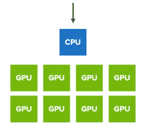
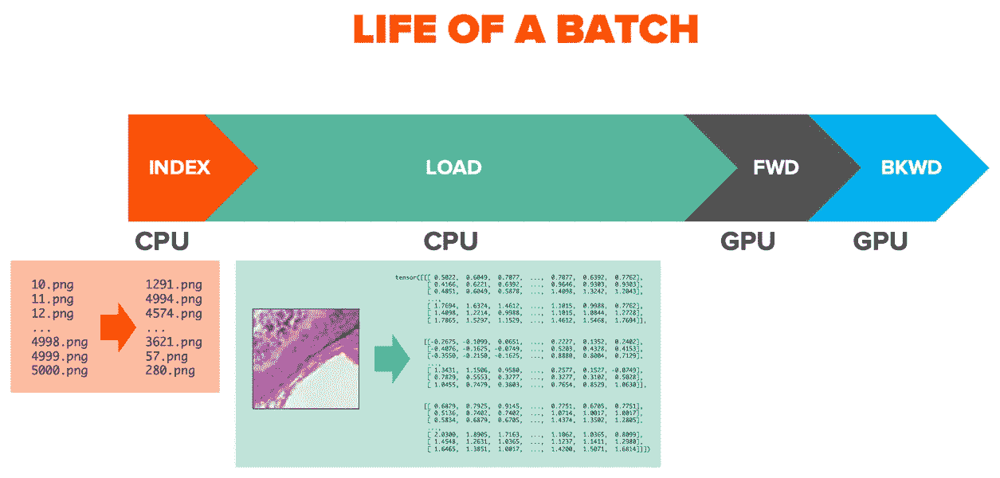
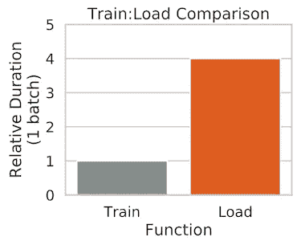
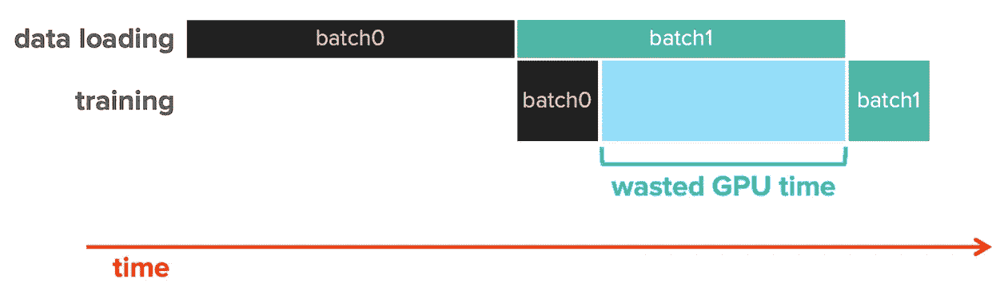
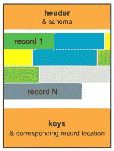
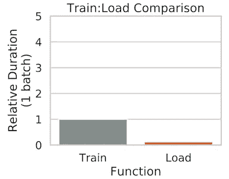

# 对于 DL 训练，我应该以什么格式存储我的 ECG 数据？

> 原文：<https://towardsdatascience.com/what-format-should-i-store-my-ecg-data-in-for-dl-training-bc808eb64981?source=collection_archive---------35----------------------->

## *优化心电图数据布局提升深度学习训练性能的案例研究。*

[国立癌症研究所](https://unsplash.com/@nci?utm_source=medium&utm_medium=referral)在 [Unsplash](https://unsplash.com?utm_source=medium&utm_medium=referral) 上拍摄的照片

从历史上看，我们保存数据是为了*我们*可以读取它。现在，随着数据科学的快速发展，机器正在读取我们的数据。我们正在从人类访问小数据转变为深度学习脚本重复访问大量数据。

这是将患者的 x 射线加载到监视器上进行视觉评估与通过神经网络运行 x 射线 1000 次之间的区别，神经网络将原始图像转换为向量，裁剪它，旋转它，模糊它，然后尝试识别气胸。

这就是为什么我们看到 GPU 越来越多地用于深度学习——我们需要对我们的数据执行越来越多的数学运算。GPU 中的计算元素专为大规模数据并行数学运算而设计，这些运算是现代图形管道的基础。事实证明，深度学习工作流程背后的数学。

# 但是没有[数据→ GPU]那么简单

虽然 GPU 执行深度学习的复杂数学，但每个训练工作都是一个管道，在 GPU 工作之前有一些步骤。

在训练中，在数据进入神经网络之前，它在一系列操作中得到预处理**。预处理通常包括一系列任务:索引(列出)训练数据集中的项目，对它们进行洗牌，从存储中实际加载它们，然后执行变形。预处理通常发生在 CPU 上(通常发生在 GPU 服务器中的 CPU 上)。**

因此，数据必须通过 CPU 从存储位置转移到 GPU 进行计算。

**数据负载本身通常是训练管道最大吞吐量瓶颈的原因。**

如果你正在加载一个病人的 x 光片给*看*，你可能会发现 0.04 秒的数据加载时间是可以接受的。您几乎不会注意到延迟，因为您的“回顾”时间可能有几分钟长。

另一方面，一个只需要 0.001 秒来“检查”图像的 GPU 服务器会因为 0.04 秒的数据加载时间而变慢。和延迟化合物。对于包含不是一个项目而是数千个或数百万个项目的大规模训练数据集和迭代计算(例如，单个作业中的 20 个历元)，数据加载延迟会发生*很多次*。

**不管你的 GPU 有多快，你的训练工作只能和你的数据加载时间一样快。**

因此，确保数据加载高效会带来巨大的性能优势。

这篇文章描述了我们与 Geisinger 的成像科学和创新部门的项目，以优化心电图结果数据集的训练吞吐量。我们为优化测试生成了一个数据大小和类型匹配的模拟数据集。

# 首先，确定性能基线

开始 DL 性能调查的一个好地方是检查数据加载工作持续时间和培训工作持续时间之间的比率。

在我们运行这个基本任务分解之后，我们发现数据加载时间明显大于训练时间。这是非常低效的，因为在列车:负载比为 1:4 的情况下，**我们的 GPU 在作业持续时间**内处于空闲状态。

在我们等待下一批加载时，每一批都有 75%的 GPU 时间处于空闲状态。

**我们需要更快地加载数据。**

# 为什么文件加载很慢？

我们的合成训练数据代表来自 15 导联 ECG 测试的日志:15x 5GB HDF5 文件，每个文件包含 1，000，000 条记录(患者)。每个文件代表一个 ECG 通道，其中“patient_id”是关键字，该通道的结果是其记录。

我们将 HDF5 视为键值存储，但该文件格式实际上是为了支持更复杂的数据结构而设计的。HDF ( [分层数据格式](https://en.wikipedia.org/wiki/Hierarchical_Data_Format))非常适合存储包含大量元数据的大型数值数据集。它支持文件内的分组，有效地使 HDF 文件成为可移植的文件系统。HDF 主要用于 HPC 用例中的科学数据集。

然而，该功能的一个缺点是，每次读取 HDF5 文件都会产生大量开销。

我们可以使用 [strace](https://strace.io/) 来窥探在我们发出单个 read(通过 [h5py](https://www.h5py.org/) python 库发出)时发生的系统调用。

“lseek”用于将文件指针移动到文件中的特定位置，然后“read”用于实际读取数据。最后一行是一个 4992 字节的读取，以检索组成我们的 HDF5 文件的键值对中的一个值。前 5 次读取是对文件内的元数据(指针)的读取，这些元数据是定位所需数据所必需的。

为什么会有这么多元数据读取？因为 [HDF 使用](https://support.hdfgroup.org/HDF5/doc/H5.format.html#Btrees) a [B 树](https://www.geeksforgeeks.org/introduction-of-b-tree-2/)结构来帮助提高其类似文件系统的元数据查询的性能。就像在文件系统上一样，知道在哪里寻找数据可能比将数据移动到 CPU 中更困难。

在看到 HDF 读取需要多少冗余系统调用后，我们确信有一种更具读取性能的方法来保存我们过于简单的数据集。我们并没有真正使用赋予 HDF 名字的层级功能。

# 最优会是什么样子？

作为一个思想实验，我们从一个问题开始，“文件中键值数据的最佳布局是什么，以获得最大的读取吞吐量？”

我们在解决什么？

**1。我们不需要保存复杂的元数据**

我们用于记录的唯一描述性信息是密钥。

让我们远离 HDF 中我们没有使用的功能。

**2。快速读取单个记录和收集密钥列表**

正如在培训工作中常见的那样，我们的脚本从打乱数据集开始。必须先枚举数据集的内容，然后才能洗牌。由于这个枚举步骤发生在每个作业的开始，我们不想通过缓慢的键收集(我们在 HDF5 中见过)来建立前端延迟。

**3。IO 越大越好**

我们更喜欢从远程存储上保存的数据集进行训练。为什么？首先，数据管理更简单，我们不必提前花费时间将数据集复制到本地设备。第二，我们的数据集太大，无法完全放入本地内存，所以如果我们从本地存储位置进行训练，我们必须管理一些数据分片过程。

因此，由于我们将发出必须通过网络到达存储的读取，我们也可以通过增大读取大小来优化网络往返成本。

我们首先将所有 15 个心电图导联的数据合并成一个记录。这一变化既简化了我们的数据集，又有助于增加 IO 大小；现在，读取单个患者的心电图结果可以通过网络在 1 次旅行中收集，而不是 15 次。

每个记录包含来自所有 15 个 ECG 导联的数据阵列:

[[第一频道]，…，[第十五频道] ]

我们可以简单地通过其在数组中的位置将单个结果与其来自的 ECG 导联编号相关联。

键块包含每个记录的[key_id，value_location]。现在我们可以直接跳到文件中特定记录的数据。

我们在文件末尾存储了一个包含所有密钥的数组。打开文件后，我们会读取一个文件头，其中包含文件配置信息，如模式规范，最重要的是文件中关键块的位置。密钥加载效率极高，因为我们可以直接跳到密钥块的起始位置，然后一次性读取所有密钥。

在 HDF5 文件中，密钥随机分布在整个文件中。在我们的新文件格式中拥有连续的键允许对键块进行大量的顺序读取，从而最小化网络开销。

# 30 倍的解决方案

由此产生的文件格式，我们将其命名为“Fleet”并在 GitHub 上提供，**为我们的工作负载提供了比 HDF5** 高 30 倍的读取吞吐量。更好的是，我们的火车:负载比现在超过了 1:1(对于远程存储和本地存储)。我们可以在 NFS 利用我们的心电图数据进行有效的训练。

我们认为这样一种轻量级的文件格式最适合用于深度学习训练的大型数值数据集。如果需要分组，可以创建附加的车队文件来代表每个组。

Fleet 是一种开源文件格式。你可以在[舰队 GitHub 页面](https://github.com/PureStorage-OpenConnect/fleet-format/)上找到代码和几个助手脚本。

# 我们学到了什么

虽然使用 JPEG 图像或张量记录的训练脚本已经在人工智能生态系统中进行了广泛的测试和调整，但其他文件格式的训练可能需要一些性能分析，以优化整体作业吞吐量。

有时，训练数据集的格式可能会引入读取模式或计算需求，从而降低整体训练工作的速度。在这种情况下，我们通过切换到轻量级、读取优化的文件格式来优化训练性能。

随着我们继续将深度学习方法应用于更广泛的用例和数据集，我们应该继续问自己，“如果我们解决了最佳训练吞吐量，我们的数据会是什么样的？”

这项研究是我的同事 Brian Gold 在 Pure Storage 和 Geisinger 的成像科学和创新部门共同开展的项目。特别感谢 David Vanmaanen、Sush Raghunath 和 Alvaro Ulloa Cerna。