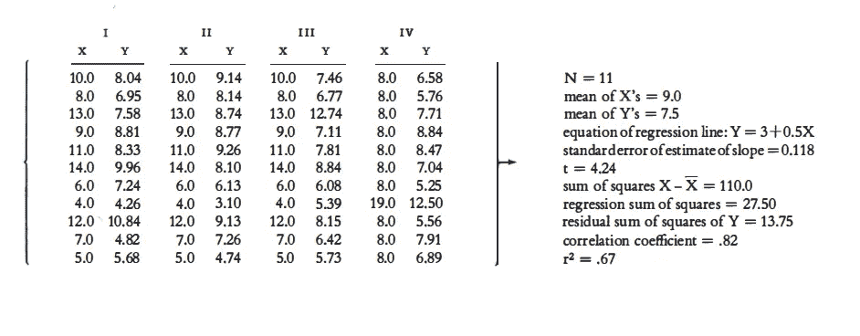
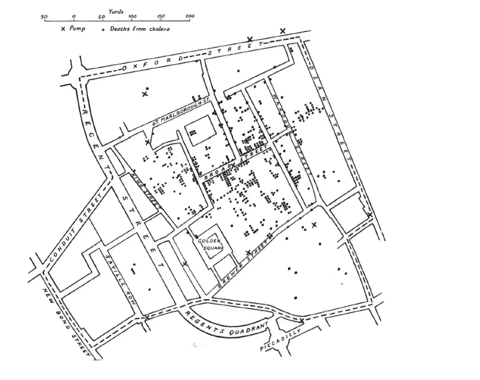
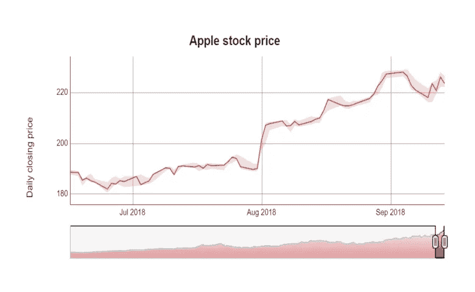
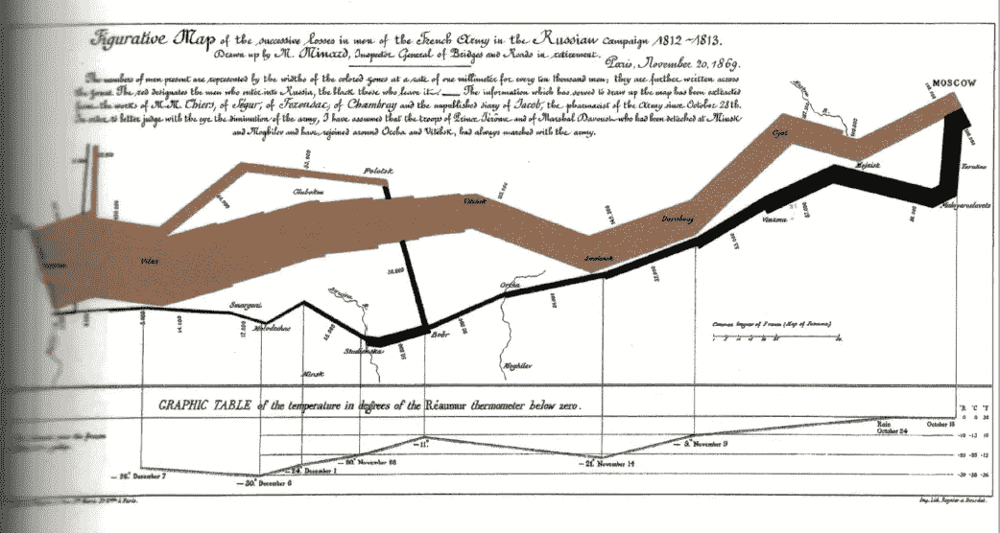

# 什么是卓越的图形以及如何创造它

> 原文：<https://towardsdatascience.com/what-graphical-excellence-is-and-how-to-create-it-db02043e0b37?source=collection_archive---------27----------------------->

## 作为一名数据科学家，了解如何制作重要的图表至关重要

# 动机

假设您从 4 个不同的来源收集了 4 个数据集。你想看看他们彼此之间有多大的不同。

F.J. Anscombe，“统计分析中的图表”，《美国统计学家》，第 27 期(1973 年 2 月)，第 17-21 页。

你发现它们是由**完全相同的线性模型描述的。**在数据数量、X 的平均值、Y 的平均值、回归线方程、标准误差、相关系数等方面没有差异。如果你要得出这些数据集是相同的结论，那么在做出任何结论之前，推迟诱惑，用 5 分钟来绘制这些数据点。

F.J. Anscombe，“统计分析中的图表”，《美国统计学家》，第 27 期(1973 年 2 月)，第 17-21 页。

他们的**图形显示明显不同！**这就是绘图如此重要的确切原因。当我们听到数据时，我们通常会想到用数字来表示。但是**的数字和计算不足以显示数据的洞察力**。为了不做出错误的结论，我们不需要仅仅被统计数据所蒙蔽。

但是任何一种图形都有意义吗？答案是否定的。这就引出了图形优秀的定义。

# 卓越的图形

卓越的图形应该:

*   引导观众思考**物质**而不是方法论、图形设计或技术
*   在**最短的时间**最小的空间**给观众**最多的想法****
*   告诉数据的**真相**

如果你仍然不相信这些标准对于一个优秀的图表是重要的，我们将通过例子来说明这些标准应用于数据科学中最常用的两个图表:地图和时间序列

照片由[艾萨克·史密斯](https://unsplash.com/@isaacmsmith?utm_source=medium&utm_medium=referral)在 [Unsplash](https://unsplash.com?utm_source=medium&utm_medium=referral) 上拍摄

# 地图

现在有很多工具可以让我们用地图来可视化数据。但是真正有用的地图不需要花里胡哨、色彩斑斓，而是要在最短的时间内展示最多的想法。

早期最有价值的地图是著名的约翰博士的点状地图，显示了 1854 年 9 月伦敦市中心死于霍乱的地点。

E.吉尔伯特，“英格兰健康和疾病的先驱地图”，《地理杂志》，124 (1958)，172–183。

死亡人数用圆点标出，11 个水泵的位置用十字标出。通过检查地图表面的散布，斯诺观察到霍乱几乎完全发生在那些住在水泵附近的人中间。因此，他把被污染的水泵的把手拿掉了。

看地图时的一个小小的观察结束了这场夺走了 500 多条生命的流行病，并拯救了**成千上万条生命！当然，泵和疾病之间的联系可以通过任何计算很容易地揭示出来。但是这张地图是一个强有力的例子，证明有时图形分析可以比任何计算更有效地证明数据**。****

# 时间序列

时间序列图是数据科学最常用的形式之一。一维以秒、分、小时、天、周、月、年、世纪的节奏行进。这种时间顺序的安排给了这张图表解释的力度和效率，这是其他图表所没有的。

当听到时序图时，我们通常会想到这种图:

从[显示器](https://www.displayr.com/how-to-create-a-time-series-graph-in-displayr/)中检索

事实上，上图是最常用的一种时序图。但是你知道时序图也可以是这样的吗:

查尔斯·约瑟夫·米纳德,《米纳德 1845-1869 年的绘画和卡特尔形象》

当**将空间维度添加到图形**的设计中时，时间序列显示的解释力得到增强。上图是查尔斯·约瑟夫·密纳德的经典之作，展现了拿破仑军队在俄罗斯的可怕命运。上图中有几点需要注意:

*   从左边开始，粗的褐色流线显示了入侵开始时大军的规模(422，000 人)。
*   这条带子的宽度显示了地图上每个地方军队的规模。随着军队到达莫斯科，规模变得越来越小。
*   拿破仑从莫斯科撤退的路线是较暗、较低的带，它与温度等级和日期有关。

数据地图和时间序列的结合有效地描绘了拿破仑的俄罗斯战役中遭受的一系列毁灭性损失。那是一个严寒的冬天，许多人在离开俄罗斯的途中冻死了。如果我们被告知军队的规模最初是 422，000 人，最终是 10，000 人，我们可能不会真正意识到损失的巨大数字。但是通过观察图表，我们可以生动地想象出这个人是怎么熬过来的，以及感冒有多严重。

# 那么我们应该如何绘制图表呢？

这篇文章并没有详尽地展示一个优秀图的每一个标准。但是我希望这篇文章给你一个重要的信息:一个优秀的图形不是用先进的图形技术展示美丽设计的图形。一个优秀的图表是由清晰、精确和高效的复杂想法组成的。一个优秀的图表，在最短的时间最小的空间里，给浏览者最大数量的想法。一个优秀的图表揭示了数据的真相。

因此，在制图时，首先要明确你的目的和你想通过图表传达的想法，然后找到表达你想法的方法。

我喜欢写一些基本的数据科学概念，并尝试不同的算法和数据科学工具。你可以通过 [LinkedIn](https://www.linkedin.com/in/khuyen-tran-1401/) 和 [Twitter](https://twitter.com/KhuyenTran16) 与我联系。

如果你想查看我写的所有文章的代码，请点击这里。在 Medium 上关注我，了解我的最新数据科学文章，例如:

 [## 高效 Python 代码的计时

### 如何比较列表、集合和其他方法的性能

towardsdatascience.com](/timing-the-performance-to-choose-the-right-python-object-for-your-data-science-project-670db6f11b8e)  [## 使用 Python 最大化您的生产力

### 你创建了一个待办事项清单来提高效率，但最终却把时间浪费在了不重要的任务上。如果你能创造…

towardsdatascience.com](/maximize-your-productivity-with-python-6110004b45f7)  [## 用 Python 选择要投资的股票

### 您计划在未来 3 年投资几只股票，每只股票的每一美元都有不同的预期回报…

towardsdatascience.com](/choose-stocks-to-invest-with-python-584892e3ad22) 

# 参考

爱德华·塔夫特。"定量信息的可视化显示."*图形出版社有限责任公司*。2007 年 8 月