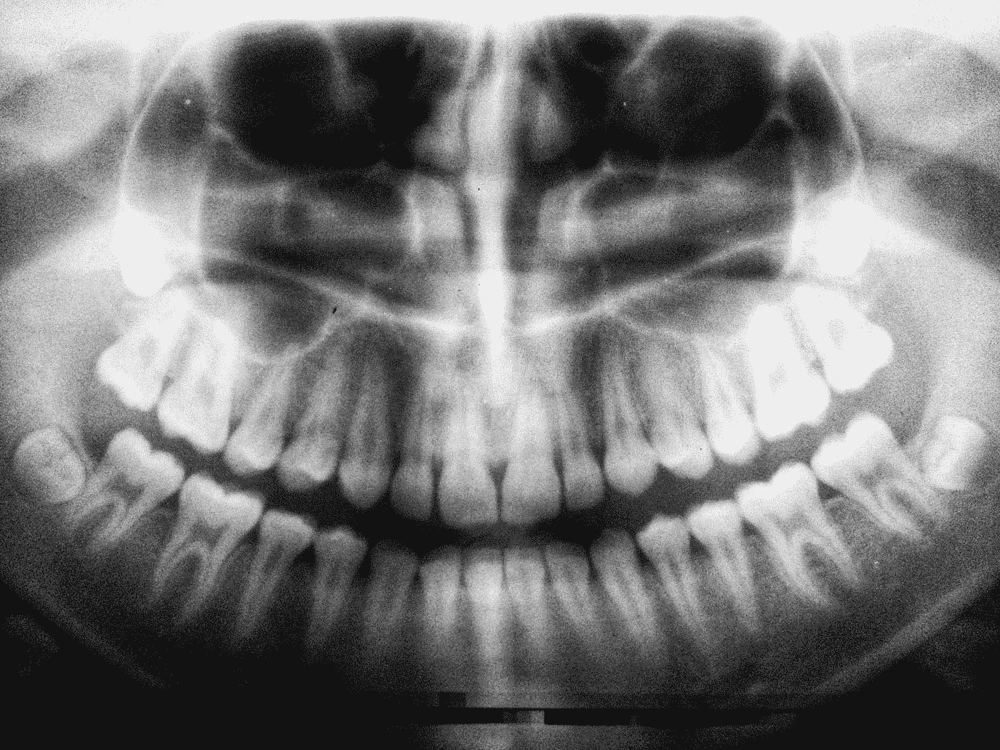

# 面部识别是怎么回事？

> 原文：<https://towardsdatascience.com/what-happened-with-facial-recognition-4799d236ab62?source=collection_archive---------93----------------------->

## 我们知道这有点偏颇，为什么公司现在才踩刹车？

[乌曼诺德](https://unsplash.com/@umanoide?utm_source=medium&utm_medium=referral)在 [Unsplash](https://unsplash.com?utm_source=medium&utm_medium=referral) 上拍摄的照片

上周， [IBM 宣布](https://www.theverge.com/2020/6/8/21284683/ibm-no-longer-general-purpose-facial-recognition-analysis-software)他们将不再销售或研究面部识别技术。不久之后，[亚马逊宣布](https://www.theverge.com/2020/6/10/21287101/amazon-rekognition-facial-recognition-police-ban-one-year-ai-racial-bias)他们将停止销售面部识别技术一年，[微软也宣布](https://www.washingtonpost.com/technology/2020/06/11/microsoft-facial-recognition/)他们将停止向执法部门销售这项技术。这是巨大的。有一段时间，面部识别技术变得更加广泛，许多人甚至使用 face id 来解锁他们的手机。对于一项广泛传播、快速发展的技术来说，突然停止发展是件大事。

发生这种情况的原因是因为这项技术存在难以置信的偏见，既不利于女性，也不利于肤色较黑的人。然而，这并不能解释为什么现在会发生这种情况。正如你可能看到的，我链接的那些文章都是一年前的了。面部识别有偏差已经不是什么秘密了。然而，改变的是公众的情绪和理解。

作为一个在社交媒体上花了很多时间的人，我有很多社会正义的朋友，我看到了很多关于在抗议中该做什么和不该做什么的帖子。我见过流传的一件大事是不要露出你的脸(这更容易做到，因为我们都戴着口罩)，并且要极其小心你在社交媒体上发布的内容。这一切都源于这样一种认识，即当局会在抗议活动中使用任何图像，试图在事后很久识别某些抗议者。随着面部识别的使用越来越多，公众越来越了解它能做什么和能做什么。越来越多的人开始质疑它的使用以及它的道德性。当我展示我的关于 STEM 中#MeToo 运动的项目时，我提到了有偏见的技术(这是为什么我们需要在技术背后有一个更加多元化的团队的原因)。我可以说，根据我自己的经验，大多数人只是模糊地意识到这种偏见已经融入了技术本身。现在，我想几乎每个人都知道面部识别技术是有偏见的，并且，在错误的人手中，是危险的。

很明显，公众监督的增加导致了这些改革，另一个原因是这些有偏见的技术改革并不普遍。

6 月 11 日， [OpenAI 宣布](https://twitter.com/OpenAI/status/1271096720881901569)他们将发布一个 API，人们可以在那里访问他们开发的人工智能模型。这很好，除了 T2 已经有研究表明他们的自然语言世代是性别歧视和种族主义的。当然，你还能从 reddit 数据上训练出来的[身上期待什么？](https://twitter.com/AnimaAnandkumar/status/1271137176529416193)

那么，为什么加速器被放在一个有偏见的技术的进步上，而刹车被踩在另一个上呢？很简单，现在大家都知道面部识别了。有了这个更广泛、更博学的社区，一项技术因其偏见受到了更多的审视，公司也相应地做出了回应。没有多少人知道自然语言生成会有怎样的偏差，或者这些偏差会是什么样子。因此，没有人认为 OpenAI 发布供公众使用的模型有什么错。

如果你要提交一篇重要的论文，你不能只是自己看一遍然后再提交。很有可能，你至少会有一个人检查它并给出一些反馈。我们这样做的原因是，我们需要新的和不同的观点，以确保我们的想法站得住脚，或者我们在有效地传达我们的想法。NLG 和面部识别之间的区别很简单，有更多的反馈摆在桌面上，如果这不是让数据科学和人工智能更容易获得的有力证据，我不知道还有什么。