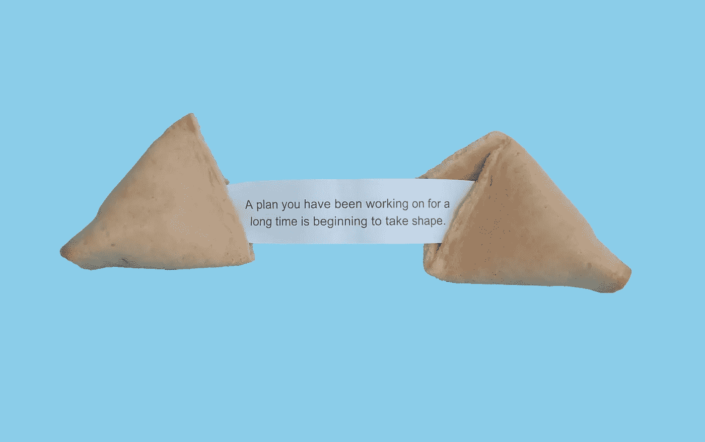

# 在你能接触到有趣的分析之前会发生什么

> 原文：<https://towardsdatascience.com/what-happens-before-you-can-put-your-hands-on-the-juicy-analysis-80c95ebc14e5?source=collection_archive---------43----------------------->

## 想从事数据分析师的职业？除了有趣的统计分析，你可能还需要考虑其他一些事情。

伊莲娜·科伊切娃在 [Unsplash](https://unsplash.com/s/photos/fortune-cookie?utm_source=unsplash&utm_medium=referral&utm_content=creditCopyText) 上的照片

对于那些有志成为数据科学家或数据分析师的人来说，你有没有想过自己在接受工作后，会花大部分时间做统计分析和机器学习？嗯，是的，或者至少那是我上学时的想象。

但是现实和我想的很不一样！你仍然会花很多时间做分析，但是只有 60%左右。剩下的 40%，你将花在准备和总结分析上。你可能认为是清理数据还是报告？

毕业后，我已经做了两年左右的数据分析师，做了从小到大的不同项目，与不同的技术、半技术和非技术利益相关者团队合作(我说的“技术”是指精通数据分析。)到目前为止，我的经历真的让我大开眼界，这个职业远比我的预期更有趣，因为除了有趣的统计分析之外，还有一些东西。在这篇文章中，我想和你分享在准备分析的过程中你可以期待什么。

如果你想从事数据分析师的职业，但又不清楚自己将从事什么工作，请继续读下去！因为这篇文章真的可以帮你证明这个职业是否真的适合你*。*

# *1.接受数据请求*

*接收来自内部或外部不同利益相关者的数据请求，以支持决策过程，这是数据分析师生活的一部分。*

*但是你的时间是有限的，所以一旦你收到这些请求，有一定的步骤来优先安排你的时间做最重要的工作。*

## *首先，为什么？*

*第一步是理解请求的**上下文**和**值**。问问你自己和你的利益相关者:*

*   *他们为什么想要这条信息？它是否符合公司战略或公司的首要任务清单？*
*   *这些信息有多大价值——它会改变他们的思维过程或行为吗？如果信息只是一个美好的拥有，行为改变的机会为零，那么为什么要麻烦呢？*

## *第二，我们可以利用哪些现有信息？*

*一个很棒的优先排序技巧是遵循 80/20 规则——在任何项目中，20%的活动产生 80%的结果。具体来说，在这种情况下，你能做些什么事而不费力就能回答问题的大部分？*

*对数据请求的上下文有了清晰的理解后，您现在对数据请求是否真的有助于解决问题，以及是否有任何现有的报告或您可以向风险承担者指出的问题有了更好的认识。*

*如果没有，并且问题被认为是需要解决的，那么你继续下一步。*

# *2.头脑风暴解决方案*

*有时候，利益相关者已经确切地知道他们需要什么样的信息，你的工作就是和他们一起集思广益，看看那条信息是否真的有意义，或者他们是否需要从一个不同的角度出发。*

*其他时候，他们不知道，你的工作是提出想法，并通过识别相关信息来引导他们。*

*无论哪种方式，这一步都是不可避免的，因为这是确保所有人意见一致的重要一步，也是**管理你和你的利益相关者之间的期望**的重要一步。*

*一旦你就解决方案达成一致，把它记在每个人都能看到的地方( [JIRA](https://www.atlassian.com/software/jira?&aceid=&adposition=&adgroup=89541920342&campaign=9124878366&creative=415596748931&device=c&keyword=jira&matchtype=e&network=g&placement=&ds_kids=p51241989307&ds_e=GOOGLE&ds_eid=700000001558501&ds_e1=GOOGLE&gclid=Cj0KCQjwyur0BRDcARIsAEt86ICvmmPVtj8XegCxbiuenDpuxCZKSPeU-vNovhvcN24Dpfgpq-ni9xEaAiCHEALw_wcB&gclsrc=aw.ds) 票，谷歌文档，[汇合](https://www.atlassian.com/software/confluence?&aceid=&adposition=&adgroup=98645564346&campaign=9616887754&creative=425944358575&device=c&keyword=confluence&matchtype=e&network=g&placement=&ds_kids=p52349493654&ds_e=GOOGLE&ds_eid=700000001542923&ds_e1=GOOGLE&gclid=Cj0KCQjwyur0BRDcARIsAEt86IBArkEcDFe7tRlbzFOcTXn753cJASFqIoLW3KLbk8X_EyP4kHGgrU8aAoboEALw_wcB&gclsrc=aw.ds)页，等等)。).*

# *3.触摸数据*

**但还不是最精彩的分析，只是还没有！还有一些其他的事情要处理。**

## *我在哪里可以得到我需要的数据？*

*既然您已经清楚了解决方案，现在是时候考虑一些后勤问题了:*

*   *需要哪些数据？*
*   *你能从哪里得到数据？*
*   *可以通过您的数据仓库访问它吗？还是可以通过其他途径获得？*
*   *你需要其他团队的帮助来获得这些数据吗？(软件工程师、营销等。)*
*   *而如果没有这些数据，可以用代理吗？*

## *我信任这些数据吗？如果有，应该怎么用？*

*一旦你确定了数据，抓紧自己，你还没有做真正的分析。正如一句老话所说:“垃圾进来，垃圾出去”——你不会想用垃圾数据来提供垃圾见解。因此，数据验证部分来了。*

*由于数据验证没有对错之分，所以我不会过多地讨论这个问题。根据问题和您正在处理的数据的性质，步骤会有所不同。也有一些非常详细的文章来了解数据验证，比如这个 [one](/a-deep-dive-into-data-quality-c1d1ee576046) (我觉得非常有用)。*

*相反，我想记下真正给我**抓住机会**的某些事情。*

****首先抓住你:*****动态性质** **和** **数据结构***

*是否有任何有损信息？*

*例如，发票状态可以是今天未结，明天已付—当状态改变或状态将被覆盖时，会有另一行数据吗？如果被覆盖，数据就会丢失。*

*有损数据的问题在于，分析结果会随着状态的改变而改变，这导致风险承担者如果想要查看一段时间内的趋势，他们的见解会不一致。但是如果他们想看目前的状态，这个数据是可以的。*

****第二个问题:*****真相的来源***

*“条条大路通罗马”，但具体在哪里呢——是去罗马圆形大剧场、圣彼得大教堂，还是梵蒂冈博物馆？关键是，可以有许多不同的方法来获得最终答案，但每种方法都会产生略有不同的答案。连接多个表的方式只要稍有改变，就会导致非常不同的结果。*

*请注意，当前的数据请求可能不是您的利益相关者为支持其决策而查看的唯一信息来源。他们也可以查看其他数据报告。他们比较所有这些信息，并在发现任何不匹配或不合逻辑的部分时提出问题，这是完全自然的。令我们失望的是，没有简单的方法来确保这种情况永远不会发生。*

*这在很大程度上可以归结为一个好的[数据治理](https://profisee.com/data-governance-what-why-how-who/)策略，它确保了一个干净、精简和可信的数据流。如果做得好，您可以减少验证数据的时间。如果这开始吓到你，不要紧张！因为除非你是公司里唯一的一个人，否则一个好的数据治理策略及其执行是整个公司的努力。*

*无论如何，我不会在这里深究，因为这不是主要部分，我也不是数据治理方面的专家。如果你发现自己没有这样的策略，两个简单的步骤是:*

*   *在您的数据团队中就如何根据业务定义获取某些信息达成一致*
*   *记下您在用于分析的每个数据集中看到的注意事项，并向您的利益相关者解释它们*

# *4.最终总结*

*那上面有很多信息！这篇文章的关键信息是:*

*作为公司的数据分析师或数据科学家，您是帮助指导利益相关者(内部或外部)使用数据做出决策的专家。该指南的第一步是确保:*

*   *你优先安排你的时间去解决你的公司和利益相关者最重要、最有价值的问题*
*   *你的涉众看向正确的方向:这个分析或者这个度量与他们的根本问题相关吗，或者他们需要从不同的角度来处理它*
*   *你提供给他们的信息来源可靠。为了确保这一点，数据验证是至关重要的一部分*