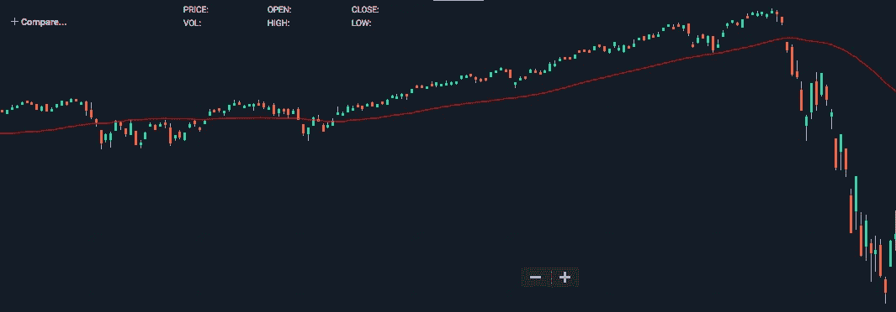
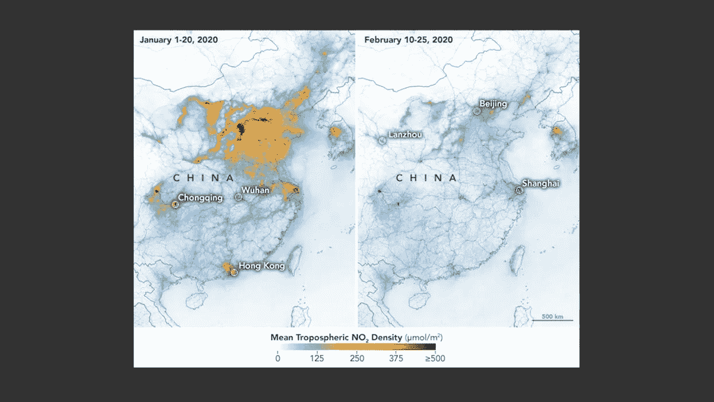
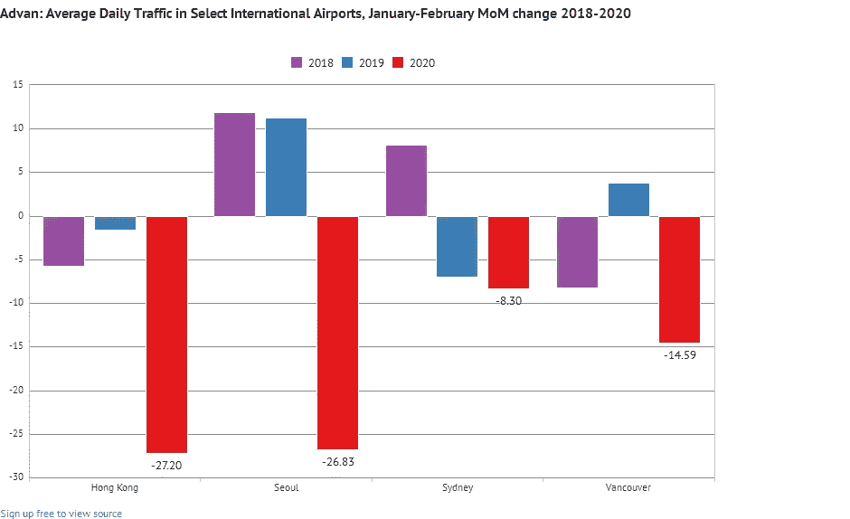
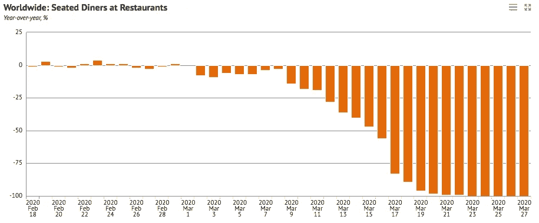
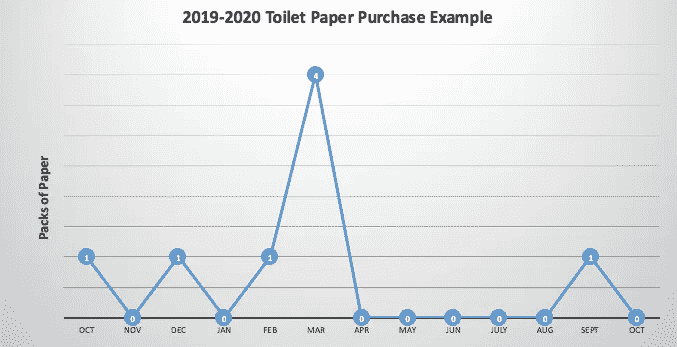

# 当世界停止的时候 AI 会怎么样(新冠肺炎)？

> 原文：<https://towardsdatascience.com/what-happens-to-ai-when-the-world-stops-covid-19-cf905a331b2f?source=collection_archive---------15----------------------->

## 新冠肺炎被证明是我们这个时代最伟大的黑天鹅事件之一。这对人工智能、机器学习和数据科学的未来意味着什么？

尤利娅·加达里娜在 [Unsplash](https://unsplash.com?utm_source=medium&utm_medium=referral) 上的照片

## 世界就这么停止了…

嗯，也许不是我们星球的实际轨道和旋转，而是我们大多数人都知道的经济和生活方式。新冠肺炎·疫情以令人眩晕的速度改变了世界各地从个人到政府的一切运作方式。似乎很难相信，在 2 月初，冠状病毒是一个新的流行词，只存在于海外对美国人口的新闻报道中。现在，很明显，这不仅仅是一个标题，而是对全世界每个人和企业的直接和间接威胁。

幸运的是，作为人类，我们有独特的能力在这种时候表现出适应力。即使我们的观点和信仰发生了微小的变化，我们仍然能够从会议室跳到变焦视频会议，而没有额外的沉思片刻。当然，这就是我们如何度过这场极端的挑战，这场挑战似乎是人类自身的直接对手。令人惊讶的是，在大规模封锁、隔离和物资短缺的情况下，世界仍然保持着普遍的文明。我认为这是因为像新冠肺炎这样的敌人让我们看到，是我们团队中的每一个人，而不是典型的国家或商业争端促使人们相互争斗。

一些可能不如我们人类公平的东西是预测和时间序列模型，这些模型在过去 10 年中成为人工智能和数据科学应用的焦点。我要大胆猜测一下，说:

*对 2020 年的每一个预测或预言模型，无论是金融、销售、异常、交通，甚至气候，在这一点上都悲惨地失败了*

我认为任何声称自己没有的人都可能是后见之明偏差或数据篡改的罪魁祸首。马后炮这次是字面上的 2020 年…

标准普尔 500(8 月 19 日—3 月 20 日)在衰退之前，没有任何模型能够预测到这一点。(鸣谢:市场数据归作者所有)

数据科学界的任何人都可以理解为什么模型不能预测这种动态变化。主要是因为现代统计建模技术是基于对过去趋势的推断进行预测的。与此同时，大多数模型仍然被关在一个偏远的小屋里，只知道当前特定领域的数据。这意味着与我们不同，大多数模型没有得到 12 月下旬肺炎爆发的消息，这是一种新病毒，将悄悄地爆发成全球疫情。像新冠肺炎这样前所未有的现象可能会被证明是旨在预测现实世界的现代人工智能方法的克星。

因为以前成功的模型依赖于几个月或几年的粒度数据，所以需要相当长的时间来适应新的世界动态，以便再次变得有用。由于这个原因，许多行业将把人类拉回到被模型夺走的预测椅子上。在此期间，重要的是要寻找在不可预见的事件中允许模型继续运行的方法，同时为下一次训练修复每个数据集中的大规模异常。

# 一些例子

金融是一个很容易看到这些模型失败的地方。正如上图所示，每只股票都曾接近历史高点，但在最聪明的公司预测下一步走势之前，突然被击垮。如上所述，几乎所有的收益和目标价格预测都被不久前被算法取代或辅助的人类所接管。现在，新的预测通常以“COVID 调整…”开头

除了金融，还有更多前所未见的异常现象。下面我们来看几个。

中国的氮氧化物空气污染(来源: [NASA](https://www.google.com/url?sa=i&url=https%3A%2F%2Fearthobservatory.nasa.gov%2Fimages%2F146362%2Fairborne-nitrogen-dioxide-plummets-over-china&psig=AOvVaw2LEJxYiY-mEsWyIoY-dDmr&ust=1585670055244000&source=images&cd=vfe&ved=0CAMQjB1qFwoTCNjJxOXHwugCFQAAAAAdAAAAABAD)

COVID 引起的异常现象的一个主要例子是空气质量的变化。从中国开始，全球工厂、商务旅行和通勤的关闭不可避免地导致了氮氧化物、二氧化碳和颗粒物排放的大幅减少。在不知道事情将保持关闭多长时间的情况下，这将被证明是任何时间序列数据集的一次大幅度下降。

选择国际空中交通比较(来源: [knoema 免费信息图](https://knoema.com/infographics/lwylzr/coronavirus-impact-on-us-and-international-airport-traffic-by-advan-research)

受打击最大的行业之一是旅游业。由于限制病毒全球传播的努力，大部分旅行已经停止。考虑到航空公司和邮轮公司目前面临的濒临破产，这对于这些行业来说显然是一个异常现象。这些财务故障中的大多数是由于没有算法或人能够预测到他们的现金流操作的完全关闭。

餐厅食客 YOY 零钱(来源: [OpenTable 公开数据](https://www.opentable.com/state-of-industry)

与旅游类似，大多数政府已经强制关闭餐馆或至少只经营外卖业务。这再次引起了从餐馆到预订和评论应用到送货服务的所有事情的震惊。

谷歌搜索“卫生纸”的数据

从一个轻松的角度来看，感兴趣的项目和集体思维购买就像卫生纸一样，是滑稽有趣的变化，在大规模变化的时代，这些变化会向相反的方向发展。你认为 Charmin 的市场分析师在 2020 年的模型中考虑到这一点了吗？

除了天气之外，几乎每个收集数据的行业都有这些异常现象。很快，我们可能会看到互联网活动发生前所未有的变化，向虚拟工作场所的转变，以及电网活动的巨大转变。问题是，这些关键的基础设施是否已经为此制定了计划，因为我们知道这些又是一系列失败的预测。不过，我们很快就会度过这段艰难时期，许多行业将会回归正常。下一个任务将是找到使用新的基于时间的数据集，每个数据集都有自己的大规模下降或峰值，时间长度我们仍然不知道。

# 使用这些新数据

一天早上，每一位数据科学家、分析师和商业领袖都会去他们的工作地点，不戴口罩，也不渴望接触任何东西后有洗手液。战胜疫情是从过去的大流行中推断出来的，我知道这是正确的。

随着业务恢复正常，总有一天，模型可以按照它们已经习惯的算法方式重新构建。现在唯一的问题是，将会有一个巨大的异常，可能会构成这个集合的一部分，大到不能简单地认为是一个异常值。人工智能、人工智能和数据模型未来面临的最大问题是:“在世界恢复正常之前，我们应该如何应对这段时间的变化？”

理论上的 TP 购买趋势(由 [MindBuilder AI](https://www.mindbuilderai.com) Research 提供)

我想到了两个简单的选择，但却充满了矛盾。第一个也是最容易的方法是，如果可行的话，把这部分数据切掉。这显然只适用于跟踪趋势的数据集，而不适用于底层数据的影响。对于气候数据，这可能行得通(中国几乎完全反弹)，但对于销售数据等模型，这就行不通了。失败的原因是，将被削减的时间对消费者和企业都有一整个时期的影响，这对下一步是有意义的。这是真的，即使它发生了巨大的变化。例如，在卫生纸购买中可以看到，任何囤积的消费者都会有比正常情况更长时间的供应，从而导致下一个时间段的销售额比正常情况下有所下降。这是从囤积或虚拟化中获益的企业的普遍趋势。

另一个技巧是使用类似于金融业的调整方法。由于到目前为止的混乱，这些计算一直严重依赖于人类的直觉来猜测如果世界没有改变，数字可能会保持在什么位置。可以使用更深入的统计工作，例如基于推理的特征工程。该方法可以将每个 COVID 真实 tilmestep 的预 COVID 投影与异常期间的统计投影平均值进行比较。这可以被认为是以自己的方式平滑。当然，这也有它自己的缺点。在气候的例子中，它会引入一段或多或少带有人为数据的时间。剩下的时间里，每个模型将被训练来模拟一个数据集，该数据集包含的点只不过是有根据的猜测。对此建模可能会在模型假设的冷漠中加入太多的人类偏见。

要更深入地分析处理缺失数据的数学方法，请查看本文。

# 明天的人工智能

在这最后一节之前，我想说，大多数基于非时间序列的“人工智能”应用程序应该会毫无问题地继续向前发展。这将包括计算机视觉、NLP 和许多其他封闭系统。另一方面，企业在财务上已经依赖的实时系列模型为机器学习和数据科学社区提供了一个警钟。虽然我们作为人类相对较快地适应了我们的新动态，但这些应用程序在这一点上或多或少是无用的。我运行了几个实验性的股票预测模型，它们仍然继续预测第二天股价会大幅反弹至正常水平。

对于这种近乎滑稽的不一致，我并不责怪这些模型或它们的创造者。这些模型只知道世界的常态，而创造者(也就是我)永远也不会猜到世界会像现在这样停止。在这个时候，我们能为统计建模世界做的最好的事情是更加努力地思考如何建立像我们自己一样有弹性的模型。

也许我们对上面讨论的数据所能做的最好的事情是将异常期抽出来，为停工创建一个独特的模型，就像 COVID 已经创建的那样。这可能会创造出一些乱世的首批高科技数据科学模型。同时，我们可以为我们的正常模型提供系统，以我们的方式消化全球信息，随时准备切换到危机模型模式。这听起来说起来容易做起来难，但对于一个计划越来越依赖算法的社会来说，有必要通过后见之明来了解我们现在拥有的数据的价值。

我喜欢在任何斗争中寻找积极的金块。我认为，新冠肺炎带来的冲击将引导人们、技术和企业更好地规划未来。不幸的是，进步似乎总是伴随着战争、基础设施故障和流行病等混乱，但事实是，它们推动了人类生活的许多方面变得更好。随着人工智能、机器学习和数据科学成为我们这个时代最有前途的技术，看到这场冲击给我们带来的推动是很重要的。它让我们看到了人类的韧性，我们应该努力将其植入我们的系统，让它们继续帮助我们在危机结束时更快地走向光明。

要了解更多关于人工智能的现状和发展方向，请阅读这篇文章:

 [## 2020 年人工智能的状态

### 通过了解人工智能的起源来了解我们的未来走向。这篇文章概述了过去…

towardsdatascience.com](/the-state-of-ai-in-2020-1f95df336eb0) 

*继续和我在* [*LinkedIn*](https://www.linkedin.com/in/ian-rowan/) *上的对话！*

*看看我目前在*[*https://www.mindbuilderai.com*](https://www.mindbuilderai.com)做什么

**参考文献**

[1][https://earth observatory . NASA . gov/images/146362/airborne-nitrogen-dioxide-slumps-over-China](https://earthobservatory.nasa.gov/images/146362/airborne-nitrogen-dioxide-plummets-over-china)

[2][https://knoema . com/infographics/lwylzr/coronavirus-impact-on-us-and-international-airport-traffic-by-advan-research](https://knoema.com/infographics/lwylzr/coronavirus-impact-on-us-and-international-airport-traffic-by-advan-research)

[3][https://www.opentable.com/state-of-industry](https://www.opentable.com/state-of-industry)

https://trends.google.com/trends/explore?q=toilet%20paper[&geo = US](https://trends.google.com/trends/explore?q=toilet%20paper&geo=US)