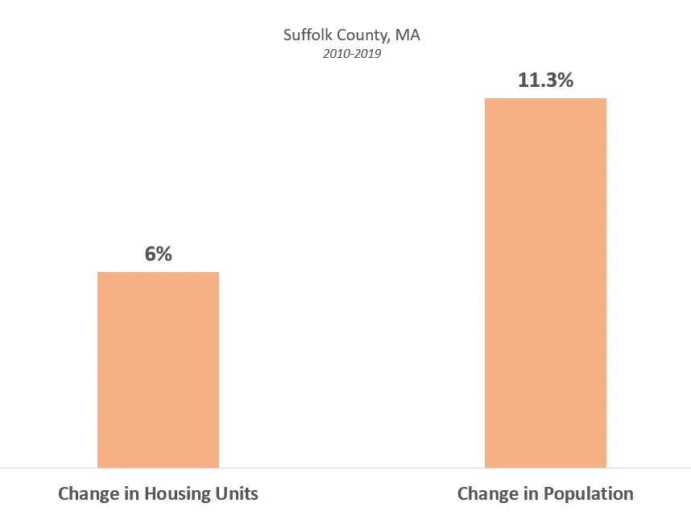
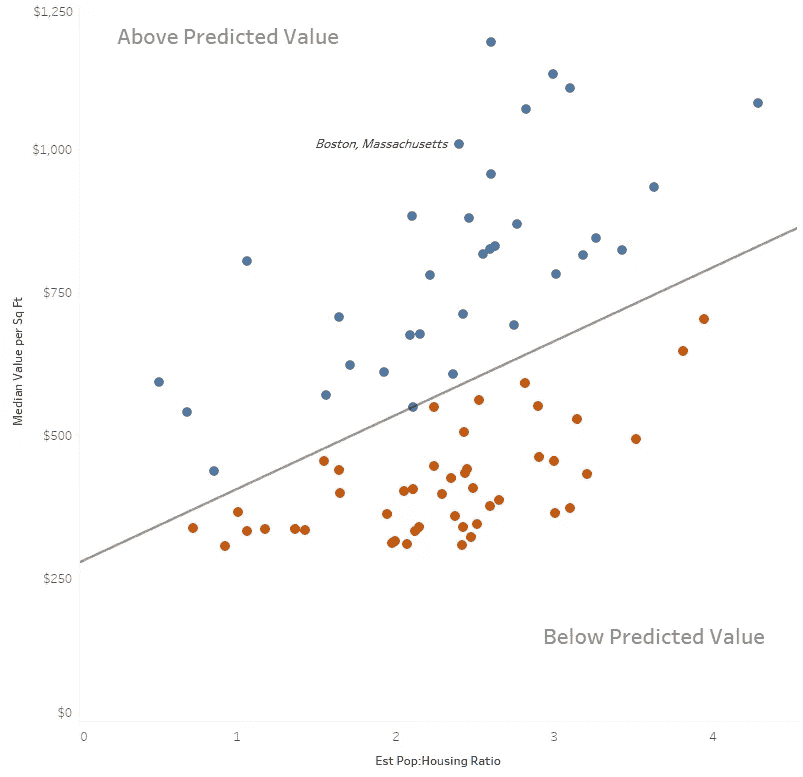
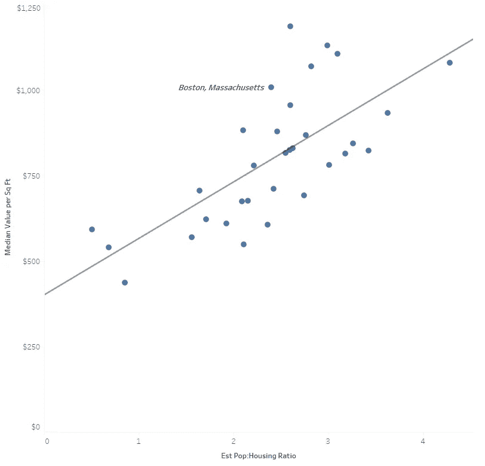
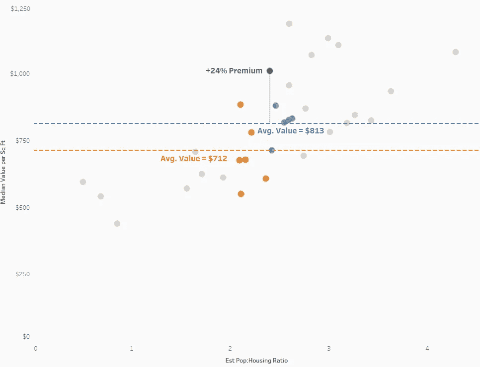

# 如果人离开一个城市，房价会怎么样？

> 原文：<https://towardsdatascience.com/what-happens-to-housing-prices-if-people-leave-a-city-f15f51d01497?source=collection_archive---------68----------------------->

## 分析新冠肺炎对主要城市房价的影响

波士顿的南端街区

四年前，我搬到波士顿，开始了我的第一份工作，带着新面孔，准备体验这座城市。我很快沿着千禧一代的轨迹，在市中心为一套太小的公寓付出太多。我牺牲了空间和便利来换取进入。

我可以步行 10 分钟去上班，15 分钟去芬威公园，20 分钟去波士顿公园。我被能量包围着。纵观美国，城市的发展是因为人们、娱乐和工作在这些领域结合起来创造了这种能量。

然后，COVID 发生了。许多让我和其他人觉得城市生活很特别的东西，一夜之间就消失了。剩下的是价格和(缺乏)空间，没有城市能提供的许多好处。让一座城市充满活力的一切现在也让它变得不安全。

这让我思考——如果人们离开城市，住房会发生什么变化？根据哈里斯民意调查，如果考虑搬到郊区的 40%的城市居民真的离开了，会发生什么？如果他们中的一小部分做了会怎么样？

考虑房价的一个简单方法是供给和需求。如果有更多的人住更少的房子，价格应该更高，反之亦然。

来源:美国人口普查局

此外，人们搬到城市的速度比他们居住的地方建造的速度要快得多；这是波士顿一直在经历的现象。

2010 年至 2019 年间，萨福克县(主要是波士顿及其近郊)的人口变化率几乎是住房增长的两倍。因此，2017 年，波士顿的租赁空置率约为 3.4%，而全国范围内的空置率约为 7.3%。

> 2010 年至 2019 年间，波士顿人口数量的增长速度是住房数量的两倍。

我们可以通过分析一个城市的人口与住房比率(每套住房单位的人口数量；供求不平衡的代表)和待售房屋每平方英尺的价格。直觉上，随着人口:住房比率的增加，价值应该增加(理解许多其他因素影响房价)。

例如，在下面的散点图顶部附近标记为波士顿的点。波士顿市的人口约为 692，000，估计有 288，716 套住房，每平方英尺的挂牌价格中位数为 1，009 美元；人口与住房单元的比率(人口/住房单元)约为 2.399。

下面散点图上的每个点是 x 轴上的人口:住房(p:h)比率和 y 轴上的美国居民超过 150，000 的城市每平方英尺的中值标价。

供需标绘在 x 轴，价格标绘在 y 轴。

正如所料，有一个适度的积极关系，但有很大的可变性。为了进一步完善和研究这种关系，我们将超出预测值的值用蓝色表示，低于预测值的值用红色表示。

这种上下分割只是相似值的聚类；我们假设，除了推动价格上涨的人口:住房比率之外，落在这条线以上的城市都有独特之处。例如，一些沿海城镇，如迈阿密或圣地亚哥，人们重视海滩通道。其他城市如西雅图或纽约，因为是大都市而吸引更高的价格。

相比之下，这条线以下的地方“城市般”的环境缩小了(罗得岛州的普罗维登斯和俄勒冈州的波特兰)，或者人口数量可能由于居民一年中的部分时间在其他地方度过而膨胀了(亚利桑那州的菲尼克斯和佛罗里达州的坦帕)。

仅考虑那些高于这条线的，我们看到 p:h 比率和每平方英尺价格之间更紧密的分布和关系。线性回归线预测，p:h 比率每变化 1 个单位(例如，从每套住房 2 人到 3 人)，每平方英尺的中值价格增加约 165 美元。

这表明，在这些昂贵城市的子集中，p:h 比率和每平方英尺价值之间似乎存在适度的强相关关系。

那么，这对像波士顿这样的地方意味着什么呢？假设住房单元数量稳定，人口减少，波士顿的 p:h 比率将会下降。我们可以通过将波士顿的房价与其今天最接近的替代品和未来潜在的同类群体进行比较，来衡量市盈率下降对波士顿房价的影响。

如果我们以蓝色来看波士顿目前的“同行群体”(示例城市:纽约州纽约市、加利福尼亚州亨廷顿海滩)，每平方英尺的平均价格(ppsf)为 813 美元；波士顿现在的股价约为 1，009 美元，比现在的股价有 24%的溢价。如果波士顿下降到橙色的下一个“对等组”(例如新泽西州泽西城、德克萨斯州奥斯汀、弗吉尼亚州阿灵顿)，平均 ppsf 为 712 美元。

波士顿目前(蓝色)和潜在(橙色)的同龄人群体以及他们的平均。ppsf。

如果我们假设波士顿也有 24%的溢价，那就相当于每平方英尺的价格为 883 美元，下降了 14.4%。要达到这个水平，需要人口减少 11%。换句话说，**物价下降的速度会比人口减少的速度快。**

要回答本文开头提出的问题，有一种看似合理的情况，即高消费城市的人口下降重置了供需平衡，将更多权力放在租房者/购房者手中。

相反，城市价格的恶化与郊区价格的上涨同时发生。随着交通状况恶化，城市变得更加安全，郊区生活失去了一些吸引力。现在，我们已经看到了这种趋势的逆转，密度被蔑视，分离被重视。

价格下跌的影响在银行、投资者和近期购房者的风险中最为突出。租赁投资者和抵押贷款经营者正在根据房屋价值和租金的增长进行计算；这在短期内可能不太可能。

城市的短期前景可能是过剩单元冲击市场，因为人们对世界的不确定性做出反应，这将暂时使价格停滞不前。随着第一波不确定性的过去，人们对自己的新住所感到舒适，接下来可能会是一段住房流动性降低和单位易手的时期。最终，一个新的长期均衡将会达成，但我们离它太远了，无法有把握地预测它会是什么样子。

你认为价格会发生什么变化？主要城市的人口？长期影响会是什么？请随时在 jordan@jordanbean.com 通过电子邮件与我联系，或者通过 [*LinkedIn*](http://www.linkedin.com/in/jordanbean) *与我联系。*

**资料来源和数据注释:**

*   每平方英尺的房价数据来自市一级的 Zillow。
*   住房单元数据是使用通过 get_acs R 包获得的 2018 年美国社区调查(ACS)数据估算的。数据是在邮政编码级别获取的(有一定的误差)，并根据邮政编码到城市的查找表汇总到城市级别。城市命名约定有时不同于 Zillow 命名约定。对于人口充足的城市，已尽最大努力尽可能匹配两个来源的数据。
*   人口数据来自美国人口普查局。