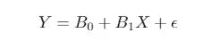
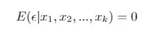
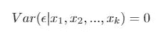
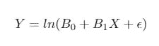
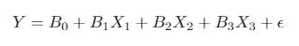
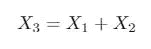

# 当你打破线性回归的假设时会发生什么？

> 原文：<https://towardsdatascience.com/what-happens-when-you-break-the-assumptions-of-linear-regression-f78f2fe90f3a?source=collection_archive---------6----------------------->

## 以及当你打破它们时该怎么做。


安德烈·利亚科夫在 [Unsplash](https://unsplash.com/s/photos/wrong?utm_source=unsplash&utm_medium=referral&utm_content=creditCopyText) 上拍摄的照片

# **简介**

线性回归是有抱负的数据科学家学习使用的第一批机器学习工具之一。

它很容易实现，其结果很容易解释，背后的数学也很容易理解。

此外，线性回归在数据科学项目中很常见，要么作为基线模型，要么作为探索性数据分析(EDA)的一部分。

难怪每周都会有一篇关于线性回归的新文章发表。

然而，虽然这些文章讨论了线性回归背后的数学和假设，但很少讨论当你打破这些假设时会发生什么。

这篇文章有三个目标:

1.解释线性回归的六个假设

2.解释当六个假设都不成立时会发生什么

3.解释当六个假设中的任何一个被打破时，你能做什么

我假设对线性回归及其假设有一个大致的了解。因此，本文的主要重点将是第二个目标和第三个目标。

# **线性回归的六个假设**

## 1)总体模型(或*真*模型)的参数是线性的。

下面是一个简单的回归模型，其中 *Y* 是目标变量， *X* 是自变量，ε是误差项(模型没有捕捉到的随机性)。



我们所说的“参数线性”是指人口模型可能在目标变量或自变量上有数学变换(平方根、对数、二次),但在参数上没有。

因此，我们的自变量的变化将具有相同的边际效应，不管它们的价值。

## 2)我们有 n 个观察值的随机样本。

这个假设使我们确信我们的样本是总体的代表。更具体地说，它向我们保证取样方法不会影响我们样品的特性。

## 3)没有完美的共线性。

独立变量之间没有完美的线性关系。它们可以以某种方式相关联——事实上，如果变量完全*不相关*，我们就不会将它们包含在我们的回归模型中——然而，我们不应该将一个变量写成另一个变量的线性组合。

## 4)零条件均值

以独立变量为条件的误差项ε平均等于零。



也就是说，误差项与我们的自变量无关。

## 5)同伦方差

在统计学术语中，当随机变量的方差为常数时，称为同态方差。

线性回归假设以独立变量为条件的误差项是同方差的。也就是说，



## 6)常态

误差项正态分布，均值为零，方差恒定。

# 当我们打破这些假设时会发生什么？(对此我们能做些什么呢？)

## 1)真实模型是非线性的

具体来说，假设真实模型的形式为



但是我们估计了一个线性模型。

我们的参数估计会有偏差，我们的模型会做出糟糕的预测。

有两种方法可以确定是使用线性函数还是非线性函数来对总体中的关系进行建模。

你可以在两个变量之间创建一个散点图，看看它们之间的关系是线性的还是非线性的。然后，您可以比较线性回归和非线性回归的性能，并选择性能最佳的函数。

第二种方法是用线性回归拟合数据，然后绘制残差图。如果残差图中没有明显的模式，那么线性回归可能是正确的模型。然而，如果残差看起来是非随机的，那么非线性回归可能是更好的选择。

## 2)我们的样本是非随机的

假设您想测试锁定是否影响了消费者的支出决策。您碰巧在疫情之前进行了一项在线购物者调查，并且您决定在疫情三个月后进行第二次在线购物者调查。

这是非代表性抽样的一个例子。不是每个人都喜欢在网上购物，在网上购物的人可能有拒绝网上购物的人所没有的特质。作为一名研究人员，你不可能知道是这些未被观察到的特征，还是锁定，改变了消费者的消费决策。

一个更好的研究人员会在封锁前随机选择一组 *n* 人，然后在封锁几个月后随机选择另一组 *n* 人。如果选择过程是完全随机的，那么这两组人会或多或少地相同。因此，你可以肯定疫情导致了他们支出的变化。

当然，完美的随机抽样是不可能的。因此，在构建回归模型之前做一些 EDA 来确认这两个组没有很大的不同是一个好的实践。(也有不同类型的回归技术可以用来模拟随机性——我可能会在另一篇文章中讨论这些技术)。

(注:政府擅长创建随机数据集。例如，劳动经济学家广泛使用的加拿大劳动力调查(LFS)选择了一个随机的人群。如果你正在寻找一个随机样本，那么就从政府机构中寻找数据集。

## 3)我们有完美的共线性

假如



而且



在这种情况下，我们的第三个变量是前两个变量的线性组合。

回想一下，多元线性回归通过保持所有其他变量不变来估计一个变量的影响。然而，这种*所有其他都等于*的假设在上述回归模型中是不可能的。如果我们改变一个变量，比如说第一个变量，那么第三个变量也会改变。类似地，如果我们改变第三个变量，那么第一个变量或第二个变量(或两者)也会改变。

完美共线性的解决方案是删除其中一个变量(在上面的示例中，我们将删除第三个变量)。

## 4)我们的误差项与我们的一个独立变量相关

如果我们的回归模型与真实模型不同，就会出现这种情况。例如，我们可能认为真正的模型是


事实上，真正的模型是，


第二个和第三个自变量的排除导致**遗漏变量偏差**。平均而言，我们的斜率估计值 *B1* 将大于或小于真实值 *B1* 。

有两种解决方案。首先，如果您知道真实模型中应该包含的变量，那么您可以将这些变量添加到您正在构建的模型中。这是最好的解决方案；然而，这也是不现实的，因为我们永远无法真正知道真实模型中有哪些变量。

第二个解决方案是进行随机对照试验(RCT)。在 RCT 中，研究人员将参与者随机分配到治疗组或对照组。因为处理是随机给出的，所以误差项和自变量之间的关系等于零。

当然，除非你是一名博士生，否则你很可能没有资金来进行 aRCT。幸运的是，有一些方法可以模拟 RCT——回归不连续性、差异中的差异等。我可能会在另一篇文章中讨论这个问题。

## 5)我们的误差项的方差取决于独立变量的值

这导致我们的参数方差有偏差。因此，OLS 标准误差也是有偏差的(因为它们是我们方差的平方根)。因为我们的置信区间和假设检验是基于 OLS 标准误差的，如果标准误差有偏差，那么我们的置信区间和假设检验就是不准确的。

解决方案是使用稳健的标准误差。

不涉及背后的数学，稳健的标准误差导致 OLS 的标准误差是同方差的。

在 statsmodels 中，可以将稳健的标准误差指定为 fit 方法中的参数。

```
OLS(...).fit(cov_type='HC1')
```

## 6)我们的错误是非正常的

类似于假设五被违反会发生什么，如果假设六被违反，那么我们的假设检验和置信区间的结果将是不准确的。

一个解决办法是转换你的目标变量，使它成为正常的。这也可以使错误正常化。对数变换和平方根变换是最常见的。如果你想变得有趣，那么你也可以使用 Box-Cox 变换，我在这里讨论。

# **奖金**

只有当我们使用横截面数据时，上述假设才成立。如果我们有面板数据或时间序列数据，线性回归需要不同的假设。

# 结论

现在你知道了线性回归的六个假设，违反这些假设的后果，以及如果这些假设*被*违反了该怎么办。

现在你可以建立更精确的线性回归模型，你可以用你的新知识打动招聘人员。